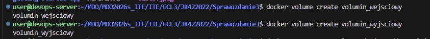
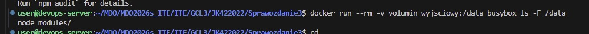
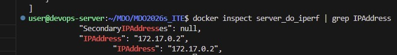
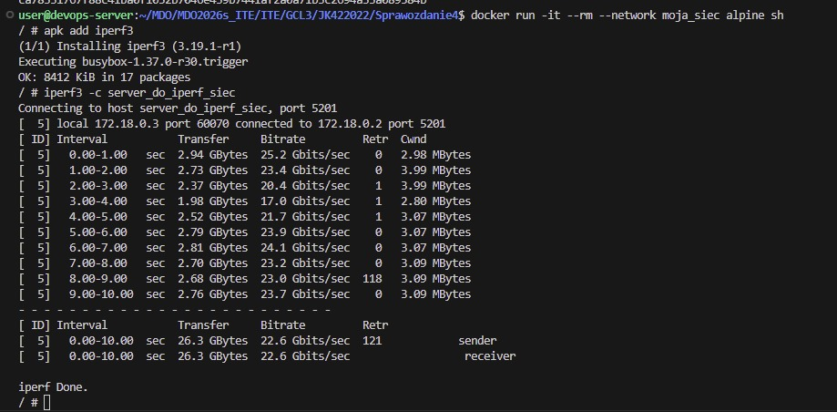
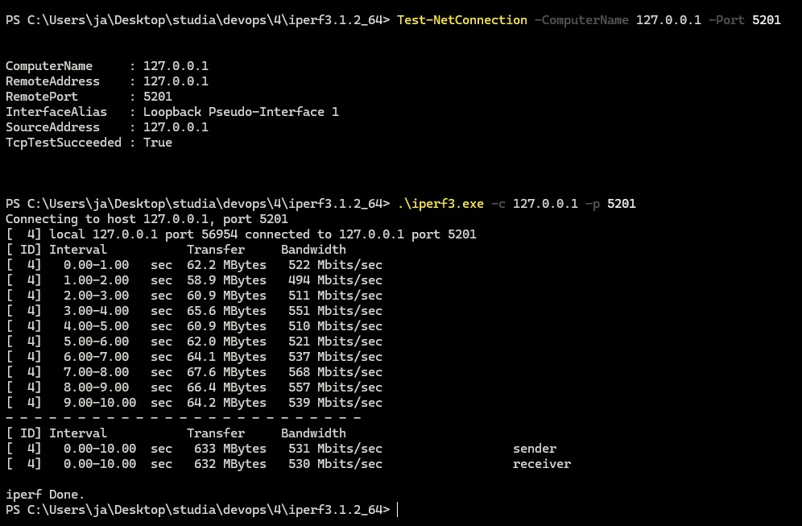
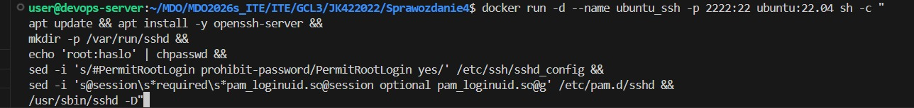
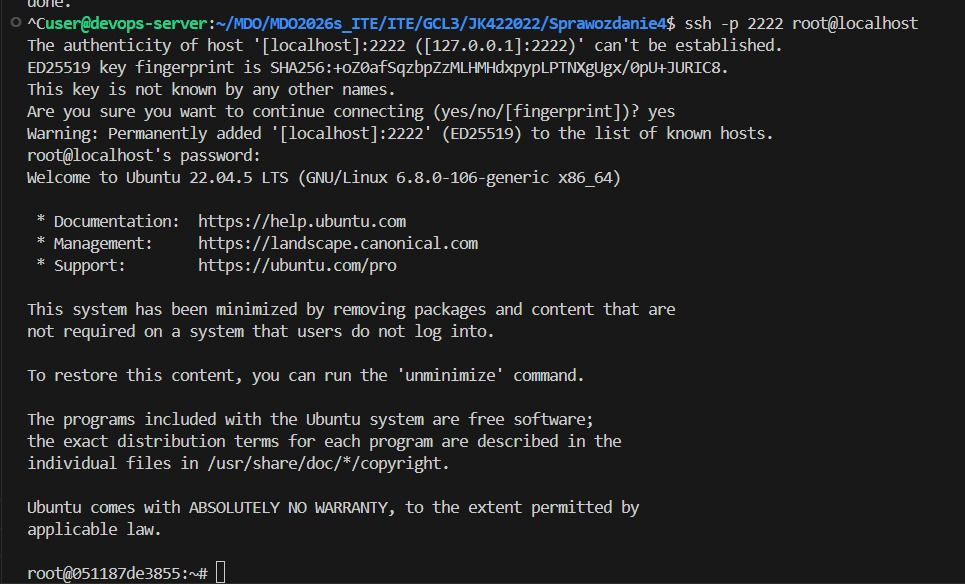

wykorzystane komendy do voluminów:
docker volume create _nazwa

-polecenie na kontener pomocniczy
docker run --rm -v vol-in:/data alpine/git
clone https://github.com/docker/getting-started-app /data 

-weryfikacja
docker run --rm -v volumin_wyjsciowy:/data busybox ls -F /data

zadanie iperf:
utworzono docker na server

 i sprawdzono jego ip

nawiazano polaczenie miedzy 2 dockerami

nastepnie stworzono wlasna siec i do niej docker

nawiazano polaczenie na sieci 

połączenie spoza hosta

zadanie 3 ubuntu przez ssh
wykorzystano nastepujace komendy

i nawiazano polaczenie

wykorzystane polecenia do utworzenia jenkins:
docker network create jenkins
docker volume create jenkins_docker
docker volume create jenkins_docker
docker run --name jenkins-docker --detach   --privileged --network jenkins --network-alias docker   --env DOCKER_TLS_CERTDIR=/certs   --volume jenkins_docker:/certs   --volume jenkins_data:/var/jenkins_home   --publish 2376:2376   docker:dind
docker run --name jenkins-server --detach   --network jenkins --env DOCKER_HOST=tcp://docker:2376   --env DOCKER_CERT_PATH=/certs/client --env DOCKER_TLS_VERIFY=1   --publish 8080:8080 --publish 50000:50000   --volume jenkins_data:/var/jenkins_home   --volume jenkins_docker:/certs/client:ro   jenkins/jenkins:lts

aby wszystko działało dodano przekierowanie portów 5201 i 8080
