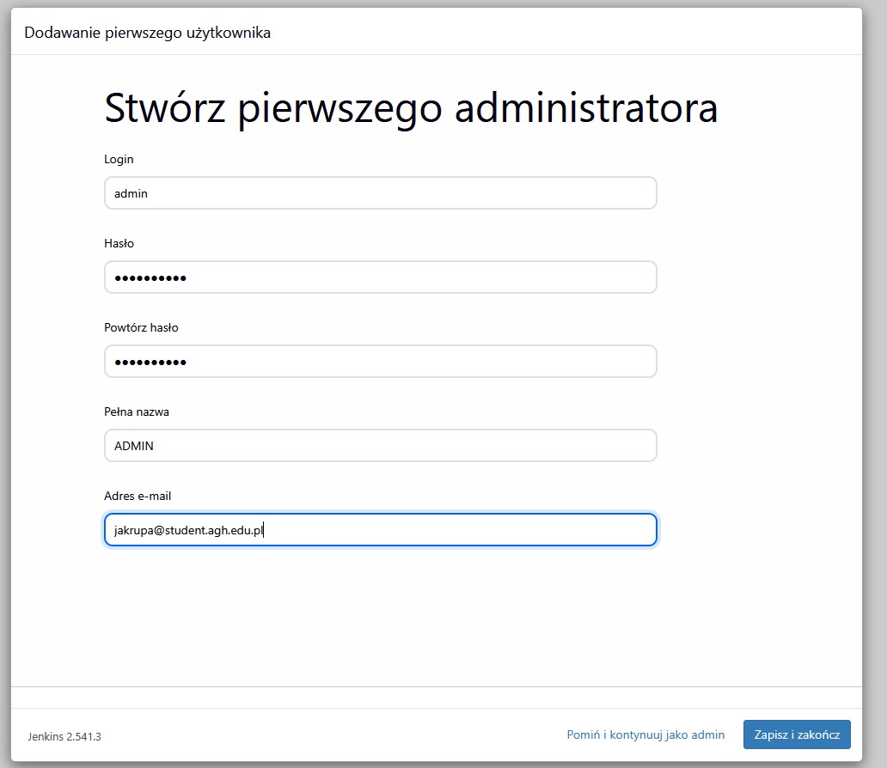
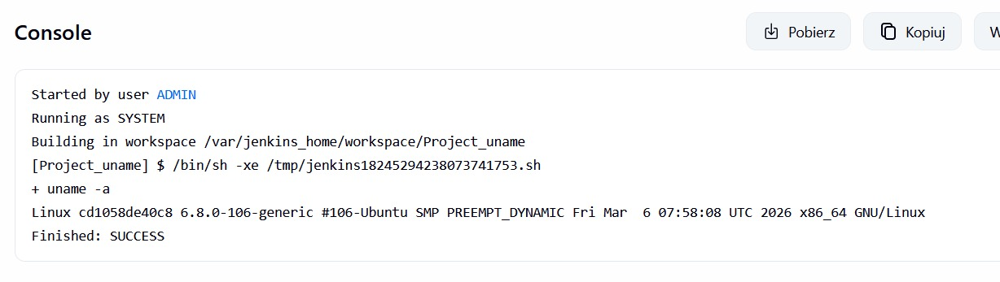

Started by user ADMIN
[Pipeline] Start of Pipeline
[Pipeline] node
Running on Jenkins in /var/jenkins_home/workspace/Pipeline
[Pipeline] {
[Pipeline] stage
[Pipeline] { (Hello)
[Pipeline] echo
Hello World
[Pipeline] }
[Pipeline] // stage
[Pipeline] stage
[Pipeline] { (Test)
[Pipeline] echo
testy
[Pipeline] sh
+ docker --version
Docker version 29.3.1, build c2be9cc
[Pipeline] }
[Pipeline] // stage
[Pipeline] stage
[Pipeline] { (tekst)
[Pipeline] echo
tekst
[Pipeline] }
[Pipeline] // stage
[Pipeline] stage
[Pipeline] { (Declarative: Post Actions)
[Pipeline] echo
koniec pracy
[Pipeline] echo
zakonczono pomyslnie
[Pipeline] }
[Pipeline] // stage
[Pipeline] }
[Pipeline] // node
[Pipeline] End of Pipeline
Finished: SUCCESS
