Sprawozdanie metodyki devops
03.03.2026 Kryspin Kucha ITE gr.3

Git hook
```sh
REQUIRED_PREFIX="KK419817"

FIRST_LINE=$(head -n 1 "$1")

case "$FIRST_LINE" in
  "$REQUIRED_PREFIX"*) 
    exit 0
    ;;
  *)
    echo "Commit message must start with '$REQUIRED_PREFIX'"
    exit 1
    ;;
esac

```

Hook:


Maszyna wirtualna:
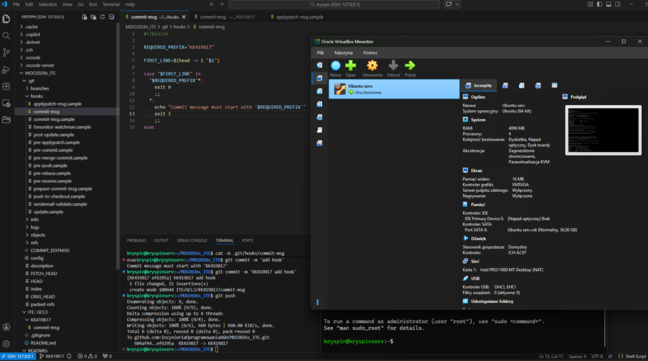

PR do GCL3:
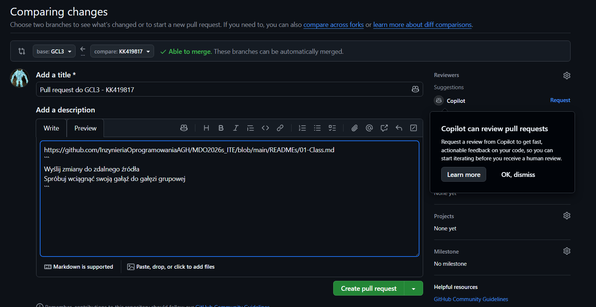

Użyte komendy po setupie
```
git checkout -b KK419817
git push --set-upstream origin KK419817
git commit -m 'add hook'
git push
```


# Zajecia 2


1.

```sh
sudo apt update
sudo apt install docker.io
```
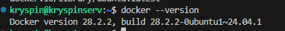

3.
```sh
docker pull hello-world
docker pull busybox
docker pull ubuntu
# ...

docker images
```
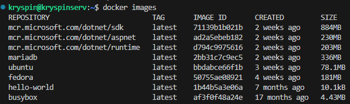


4.

```sh
docker run busybox
docker ps -a
```

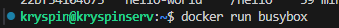
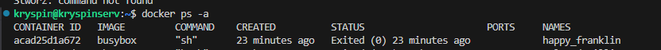

```sh
docker run -it busybox sh
# w kontenerze
busybox --help
```

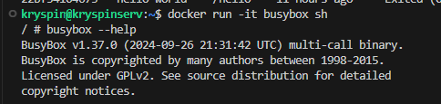

5.
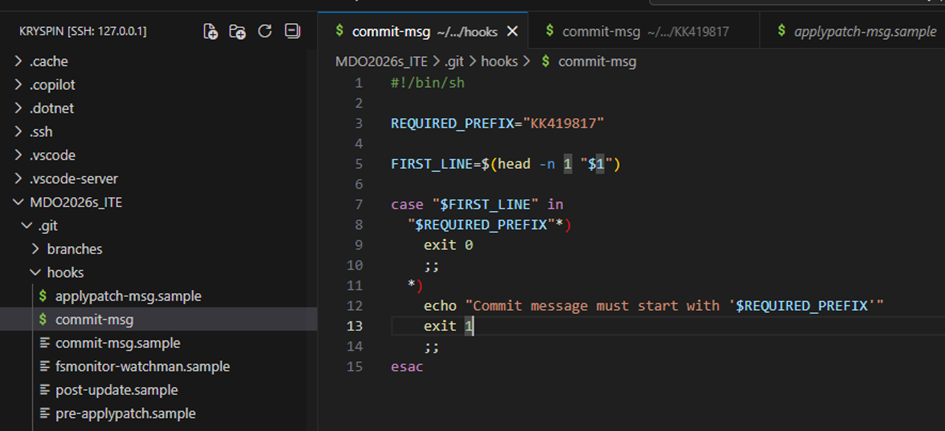


6.
dockerfile
```dockerfile
FROM ubuntu:24.04

ENV DEBIAN_FRONTEND=noninteractive

# install git and clean cache
RUN apt-get update \
    && apt-get install -y --no-install-recommends git ca-certificates \
    && rm -rf /var/lib/apt/lists/*

WORKDIR /app

RUN git clone https://github.com/InzynieriaOprogramowaniaAGH/MDO2026s_ITE.git

CMD ["bash"]
```

Usunięcie niepotrzebnych obrazów:
`docker image prune -a`
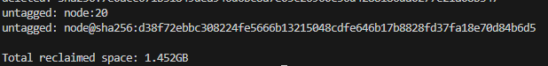

# Zajecia 3

### Podstawowa instalacja
Do zajęć wykorzystano repozytorium expressjs
(https://github.com/expressjs/express?tab=readme-ov-file#installation)

Najpierw uruchomiłek lokalnie komendy:
```bash
sudo apt update
sudo apt install -y nodejs npm git

git clone https://github.com/expressjs/express.git --depth 1 && cd express
npm install
npm test
```
Wszystkie testy przeszły pomyślnie:

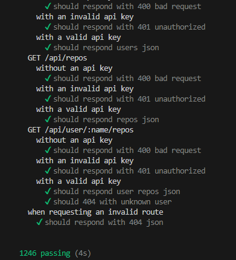

### Tryb interaktywny

Następnie uruchomiłem wspomniane wyżej komendy w interaktywnym trybie dockera:
```Docker
docker run -it node:20-alpine sh
apk update
apk add git
# jw.
```
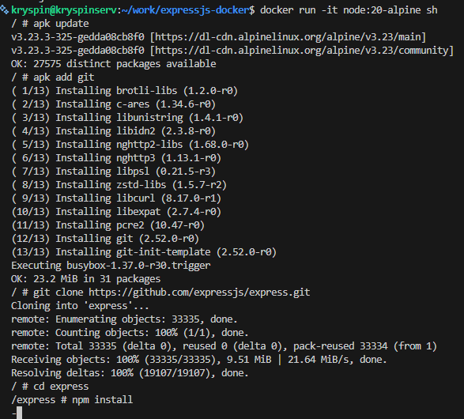
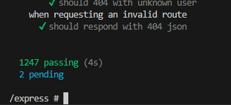


### Dockerfiles

Kolejno, utworzyłem plik [Dockerfile.build](lab2/Dockerfile.build)
```Docker
FROM node:20-alpine
WORKDIR /app
RUN apk update
RUN apk add git
RUN git clone https://github.com/expressjs/express.git .
RUN npm install
```

Oraz [Dockerfile.test](lab2/Dockerfile.test), który musi zostać wykonany po utworzeniu obrazu build o nazwie express-build

```Docker
FROM express-build
WORKDIR /app
CMD ["npm", "test"]
```


---

Build oraz uruchomienie konetenerów:
```Docker
docker build -f Dockerfile.build -t express-build .

docker build -f Dockerfile.test -t express-test .

docker run --rm express-test
```
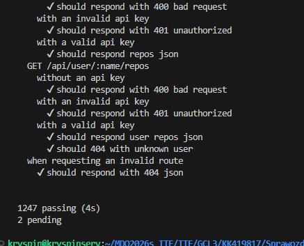

### Docker compose

Instalacja:
`sudo apt  install docker-compose`

Utworzyłem plik [docker-compose.yml](lab2/docker-compose.yml), w którym utworzyłem dwa serwisy: build i test. Test jest zależny od build, przez co build jest automatycznie tworzony przed tworzeniem kontenera test

Build:
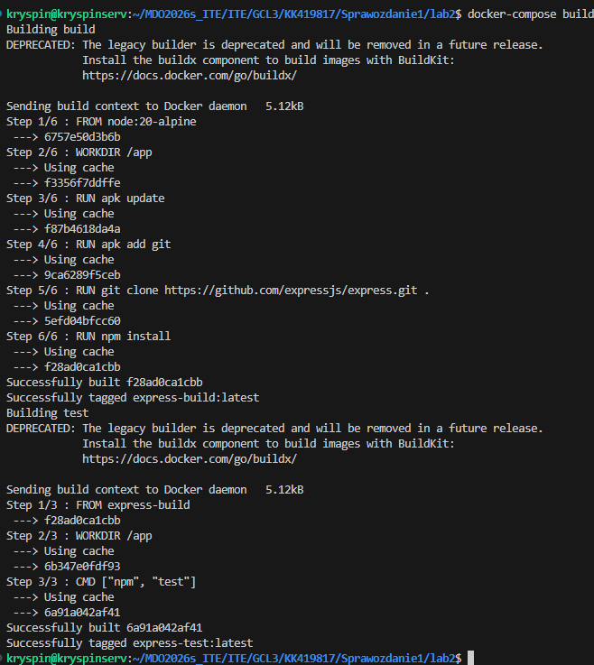

Uruchomiłem kontenery za pomocą komendy:

`docker-compose run --rm test`

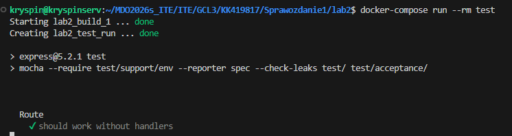

Wszystko wykonało się poprawnie a testy ponownie przeszły.


# Zajecia 4

## Zachowywanie stanu między kontenerami

Utworzono woluminy
```
docker volume create vol_src
docker volume create vol_bin
```
vol_src - do przechowywania kodu źródłowego
vol_bin - do przechowywania node_modules etc.

Kontener bazowy (node:20-alpine) nie zawiera Gita. Aby umieścić kod źródłowy na woluminie, uruchomiłem kontener pomocniczy z obrazem alpine/git:

```
docker run --rm -v vol_src:/data alpine/git clone https://github.com/expressjs/express.git /data
```
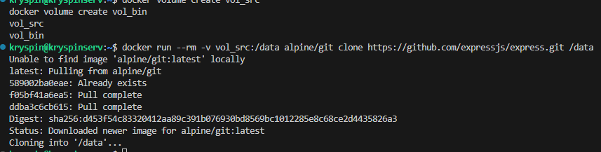

Kontener pomocniczy alpine/git został użyty, ponieważ kontener bazowy node:20-alpine nie zawiera Gita. Metoda ta pozwala na jednorazowe sklonowanie repozytorium na wolumin bez instalowania zbędnych narzędzi w docelowym obrazie, a po zakończeniu kontener jest automatycznie usuwany.


Włączenie kontenera, instalacja dependencji
```
docker run -it --name builder-node -v vol_src:/app_in -v vol_bin:/app_out node:20-alpine sh
cd /app_in
npm install
cp -r node_modules /app_out/
```
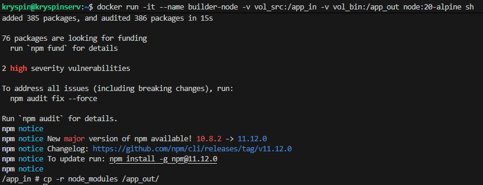

Po instalacji wszystkie zależności (node_modules) zostały zapisane w katalogu /app_in/node_modules. Ponieważ katalog /app_in jest mapowany na wolumin vol_src, a nie na vol_bin, zależności zostałyby utracone po usunięciu kontenera.
Aby trwale zachować zależności na dedykowanym woluminie wyjściowym, skopiowałem je do /app_out

Sprawdzono zawartość woluminu vol_bin za pomocą tymczasowego kontenera, katalog /check zawiera pliki node_modules, co potwierdza, że dane zostały zachowane
```
docker run -it --rm -v vol_bin:/check alpine sh
ls -la /check
```
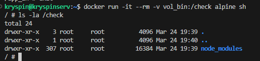
W katalogu /check (który jest mapowany na vol_bin) widoczne są skopiowane wcześniej pliki node_modules. Oznacza to, że dane zostały trwale zapisane na woluminie i są dostępne niezależnie od kontenera.

---

Klonowanie wewnątrz kontenera

```
docker volume create vol_bin2

docker run -it --rm -v vol_bin2:/app_out node:20-alpine sh
apk add git
git clone https://github.com/expressjs/express.git
cd express
npm install
cp -r node_modules /app_out/
```
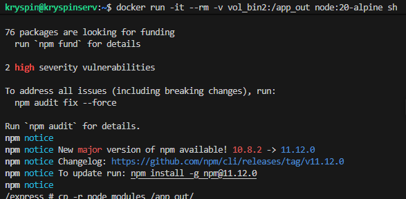

W tym przypadku kod źródłowy nie był przechowywany na woluminie – został sklonowany lokalnie wewnątrz kontenera, a następnie skopiowany tylko wynik budowania (node_modules) na wolumin wyjściowy

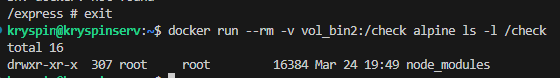

#### Dyskusja nad użyciem docker build i RUN --mount
Opisane kroki można wykonać również za pomocą docker build i pliku Dockerfile z użyciem flagi RUN --mount.

Zamiast ręcznego tworzenia woluminów i uruchamiania kontenerów, całość definiuje się w jednym pliku a użycie instrukcji `RUN --mount=type=cache` pozwala na zachowanie repozytorium i zainstalowanych zależności między kolejnymi budowami, eliminując konieczność każdorazowego klonowania i instalacji. Dzięki temu proces budowania staje się szybszy i w pełni zdefiniowany w jednym pliku.


## Eksponowanie portu i łączność między kontenerami

Server
```
docker run -it --name iperf-server alpine sh

apk add iperf3

iperf3 -s
```
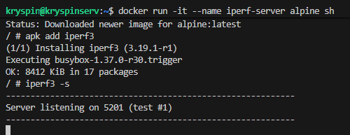

Klient
```
docker run -it --name iperf-client alpine sh
apk add iperf3
```
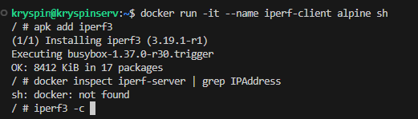

Na hoście:
```
docker inspect iperf-server
docker inspect iperf-server | grep IPAddress
```
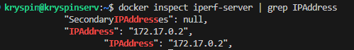

Polaczenie z klienta, test łącza:
```
iperf3 -c 172.17.0.2
```
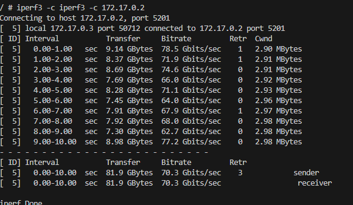

Następnie utworzyłem własną sieć za pomocą polecenia `docker network create my-net`

Usunąłem poprzednie kontenery i postawiłem je na nowo (z flagą --rm aby nie zaśmiecały pamięci)
```
docker stop iperf-client iperf-server
docker rm -f iperf-client iperf-server

# server
docker run -it --rm --name iperf-server --network my-net alpine sh
apk add iperf3
iperf3 -s

# client
docker run -it --rm --name iperf-client --network my-net alpine sh
```

Uruchomiono
`iperf3 -c iperf-server` w kliencie
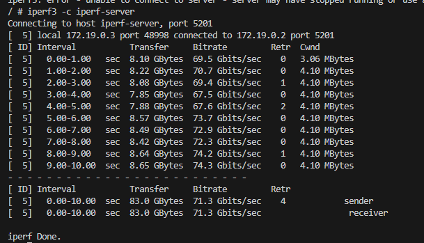

Połączenie z hosta:

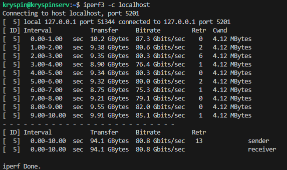

Dodano regułę przekierowania portów:


Połączeni spoza hosta (system windows):
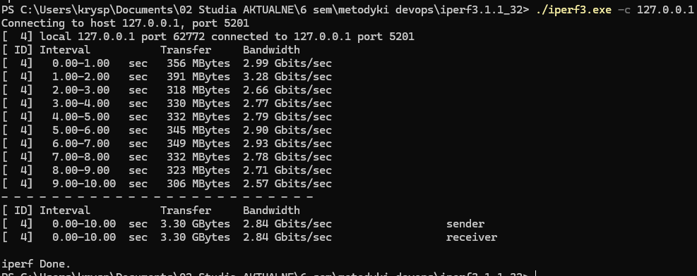

logi:

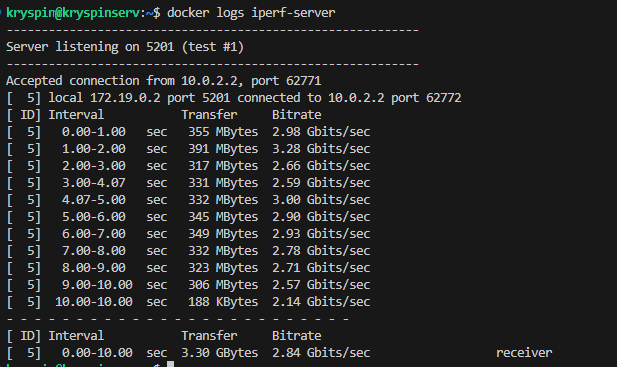


