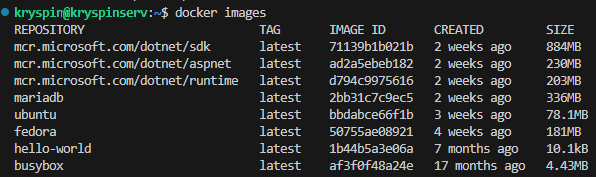
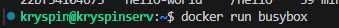
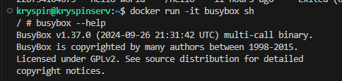

1.

```sh
sudo apt update
sudo apt install docker.io
```


3.
```sh
docker pull hello-world
docker pull busybox
docker pull ubuntu
# ...

docker images
```



4.

```sh
docker run busybox
docker ps -a
```




```sh
docker run -it busybox sh
# w kontenerze
busybox --help
```



5.


6.
dockerfile
```dockerfile
FROM ubuntu:24.04

ENV DEBIAN_FRONTEND=noninteractive

# install git and clean cache
RUN apt-get update \
    && apt-get install -y --no-install-recommends git ca-certificates \
    && rm -rf /var/lib/apt/lists/*

WORKDIR /app

RUN git clone https://github.com/InzynieriaOprogramowaniaAGH/MDO2026s_ITE.git

CMD ["bash"]
```


