Kryspin Kucha

## Zajecia 5

Przekopiowano Dockerfiles z poprzednich zajęć do nowego katalogu (Sprawozdanie2)
Uruchomiono
```bash
docker build -f Dockerfile.test -t express-test .

# Sprawdzenie działania
docker run --rm express-test
```

Usuwam poprzednie obrazy (z poprzednich zajęć, uniemożliwiały wykonanie następnej komendy)
```bash
docker stop jenkins jenkins-docker
docker rm jenkins jenkins-docker
```

Ta komenda tworzy i uruchamia w tle (--detach) kontener o nazwie jenkins-docker. Działa on w sieci jenkins z aliasem docker, co oznacza, że inne kontenery w tej sieci (jak później Jenkins) mogą się z nim łączyć pod nazwą docker:

```bash
docker run \
  --name jenkins-docker \
  --rm \
  --detach \
  --privileged \
  --network jenkins \
  --network-alias docker \
  --env DOCKER_TLS_CERTDIR=/certs \
  --volume jenkins-docker-certs:/certs/client \
  --volume jenkins-data:/var/jenkins_home \
  --publish 2376:2376 \
  docker:dind \
  --storage-driver overlay2
```

Utworzono katalog jenkins a w nim [Dockerfile](./jenkins/Dockerfile) o treści 
```dockerfile
FROM jenkins/jenkins:2.541.3-jdk21
USER root
RUN apt-get update && apt-get install -y lsb-release ca-certificates curl && \
    install -m 0755 -d /etc/apt/keyrings && \
    curl -fsSL https://download.docker.com/linux/debian/gpg -o /etc/apt/keyrings/docker.asc && \
    chmod a+r /etc/apt/keyrings/docker.asc && \
    echo "deb [arch=$(dpkg --print-architecture) signed-by=/etc/apt/keyrings/docker.asc] \
    https://download.docker.com/linux/debian $(. /etc/os-release && echo \"$VERSION_CODENAME\") stable" \
    | tee /etc/apt/sources.list.d/docker.list > /dev/null && \
    apt-get update && apt-get install -y docker-ce-cli && \
    apt-get clean && rm -rf /var/lib/apt/lists/*
USER jenkins
RUN jenkins-plugin-cli --plugins "blueocean docker-workflow json-path-api"

```

```bash
cd jenkins
docker build -t myjenkins-blueocean:2.541.3-1 .
```

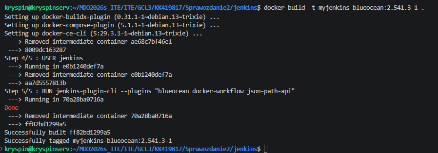

Uruchamiam
```bash
docker run \
  --name jenkins-blueocean \
  --restart=on-failure \
  --detach \
  --network jenkins \
  --env DOCKER_HOST=tcp://docker:2376 \
  --env DOCKER_CERT_PATH=/certs/client \
  --env DOCKER_TLS_VERIFY=1 \
  --publish 8080:8080 \
  --publish 50000:50000 \
  --volume jenkins-data:/var/jenkins_home \
  --volume jenkins-docker-certs:/certs/client:ro \
  myjenkins-blueocean:2.541.3-1
```

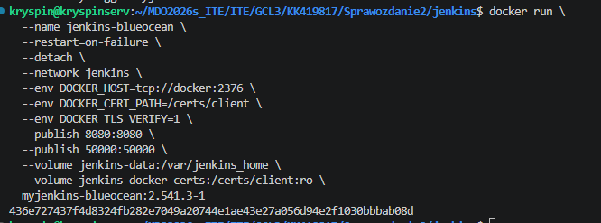

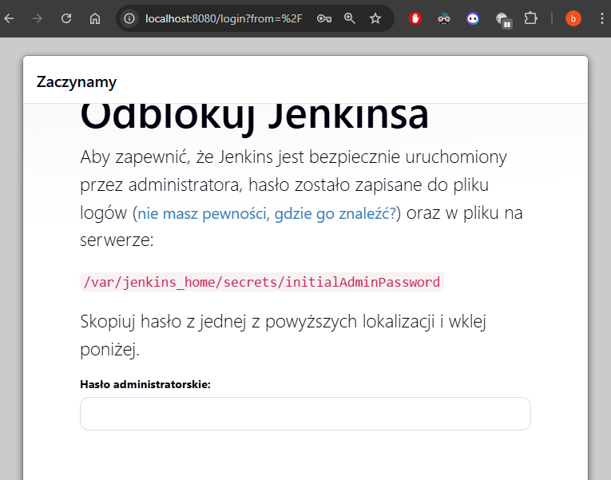

Szukam hasła:
```bash
docker logs jenkins-blueocean
```

Przeprowadzam zalecaną instalację wtyczek i tworzę pierwszego admina (admin/admin)

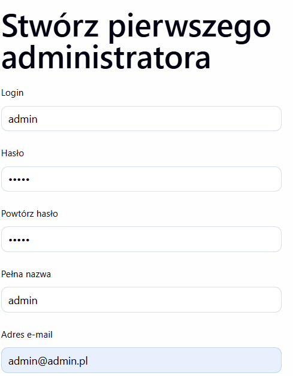


---

Utworzono projekt odpalający `uname -a`:
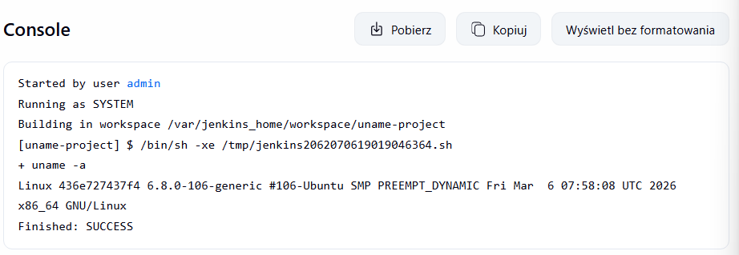


Utworzono projekt odpalający poniższy skrypt, wyrzucający błąd gdy godzina jest nieparzysta:

```sh
HOUR=$(date +%H)
echo "Godzina: $HOUR"

if [ $((HOUR % 2)) -eq 0 ]; then
    echo "Godzina $HOUR jest parzysta. sukces"
    exit 0
else
    echo "Godzina $HOUR jest nieparzysta, error"
    exit 1
fi
```

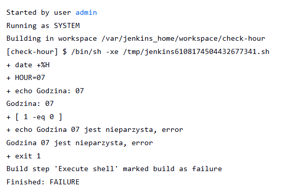


```sh
echo "Start pobieranie obrazu"
docker pull ubuntu:22.04
echo "Obraz powinien byc pobrany, sprawdzam:"
docker images | grep ubuntu
```

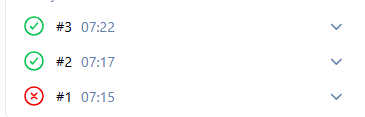

Pierwszy failował bo padł kontener dind. Uruchomiłem go ponownie tym samym poleceniem co na początku zajęć. Następne buildy już zadziałały poprawnie.

(Można użyć `--restart=always` aby kontener zawsze się restartował po zakończeniu)

---

Sprawdzam czy uda mi się sclonować repo:
```sh
pipeline {
    agent any

    stages {
        stage('Checkout') {
            steps {
                git url: 'https://github.com/InzynieriaOprogramowaniaAGH/MDO2026s_ITE.git', branch: 'KK419817'
            }
        }
        stage('Hello') {
            steps {
                echo 'Repozytorium zostało sklonowane.'
            }
        }
}
```

Sukces:
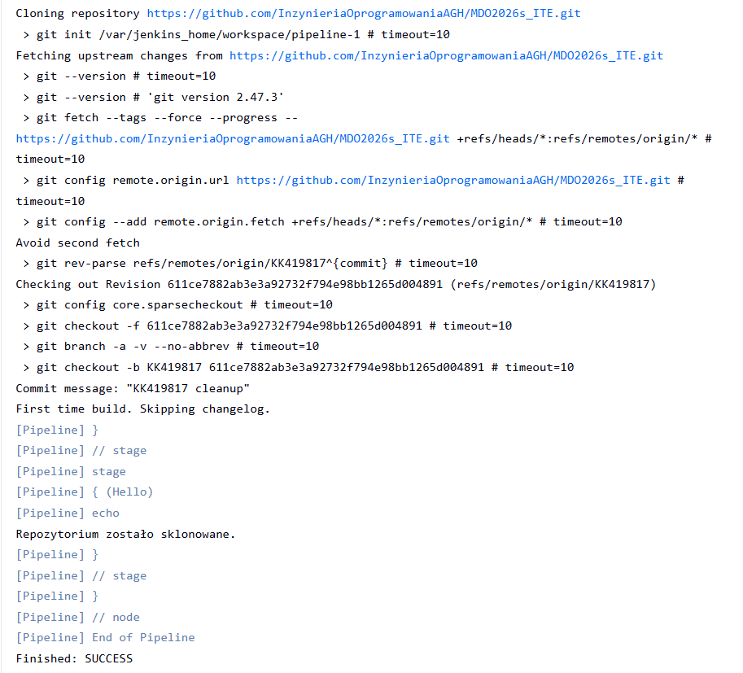

Po ustawieniu odpowiednich ścieżek, stworzono końcowy skrypt pipelinu:

```sh
pipeline {
    agent any

    stages {
        stage('Checkout') {
            steps {
                echo 'Start'
                git url: 'https://github.com/InzynieriaOprogramowaniaAGH/MDO2026s_ITE.git', branch: 'KK419817'
                echo 'Repozytorium zostało sklonowane.'
            }
        }
        stage('Build') {
            steps {
                 dir('ITE/GCL3/KK419817/Sprawozdanie2/') {
                    sh 'docker build --no-cache -f Dockerfile.build -t express-build .'
                }
            }
        }
        stage('Test') {
            steps {
                dir('ITE/GCL3/KK419817/Sprawozdanie2/') {
                    echo 'Start testów'
                    sh 'docker build --no-cache -f Dockerfile.test -t express-test .'
                    sh 'docker run --rm express-test'
                }
            }
        }
    }
    post {
        success {
            echo 'Pipeline zakończony sukcesem!'
        }
        failure {
            echo 'Pipeline zakończony błędem!'
        }
    }
}
```

Zadziałał poprawnie, zbudowano obrazy (tak jak wcześniej lokalnie) i włączono testy:

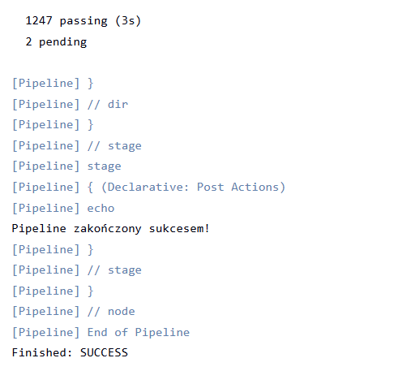

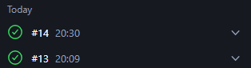

Pipeline przeszedł poprawnie conajmniej dwa razy.

---
### Sekcja "Pipeline: składnia"

Utworzyłem [Jenkinsfile](Jenkinsfile):

```Jenkinsfile
pipeline {
    agent {
        docker {
            image 'docker:latest'
            args '-u root  -v /var/run/docker.sock:/var/run/docker.sock'
            reuseNode true
        }
    }

    stages {
        stage('Checkout') {
            steps {
                git url: 'https://github.com/InzynieriaOprogramowaniaAGH/MDO2026s_ITE.git',
                    branch: 'KK419817'
            }
        }

        stage('Build') {
            steps {
                dir('ITE/GCL3/KK419817/Sprawozdanie2/') {
                    sh 'docker build --no-cache -f Dockerfile.build -t express-build .'
                }
            }
        }

        stage('Test') {
            steps {
                dir('ITE/GCL3/KK419817/Sprawozdanie2/') {
                    sh 'docker build --no-cache -f Dockerfile.test -t express-test .'
                    sh 'docker run --rm express-test'
                }
            }
        }

        stage('Deploy') {
            steps {
                dir('ITE/GCL3/KK419817/Sprawozdanie2/') {
                }
            }
        }

        stage('Publish') {
            steps {
                dir('ITE/GCL3/KK419817/Sprawozdanie2/') {
                }
            }
        }
    }

    post {
        success {
            echo 'Pipeline success'
        }
        failure {
            echo 'Pipeline failed'
        }
    }
}
```

Skonfigurowałem nowy pipeline `pipeline-2-jenkinsfile`:

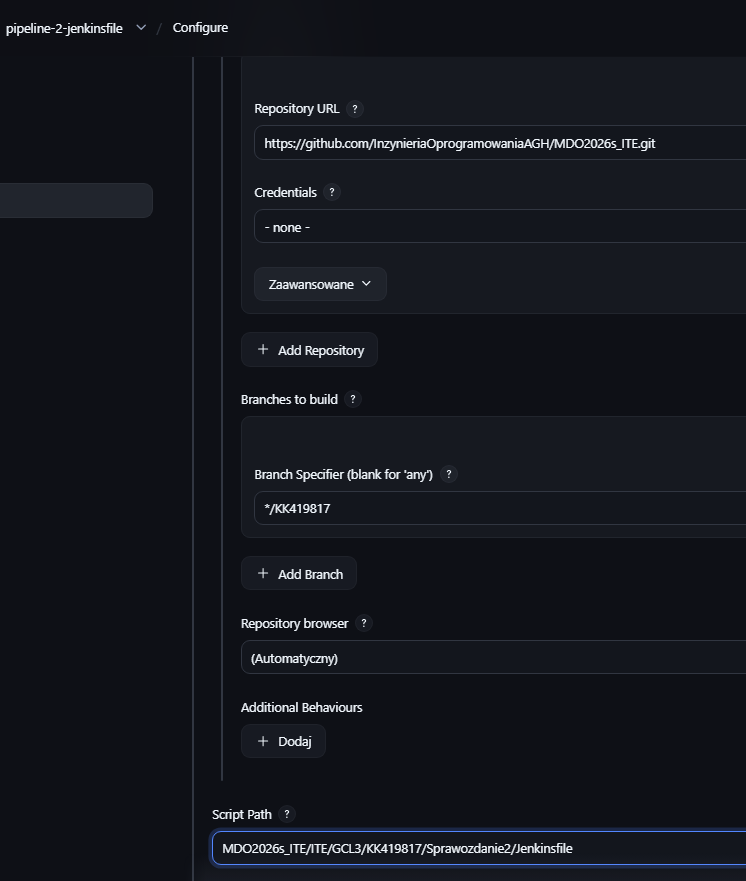

Po poprawce (usunięcie MDO2026s_ITE ze ścieżki) pipeline uruchomił się poprawie.


Wykorzystałem podejście z agentem kontenerowym a nie z DinD. Polega ono na uruchomieniu tymczasowego kontenera z obrazem dockera, do którego montuję socket dockera z hosta. Dzięki temu wszystkie komendy docker build i docker run są wykonywane bezpośrednio przez dockera hosta. Jest to prostsze w konfiguracji niż osobny kontener DinD, ale mniej bezpieczne, ponieważ Jenkins zyskuje pełny dostęp do dockera hosta. W podejściu z DinD Jenkins łączyłby się z osobnym kontenerem udostępniającym własnego demona dockera, dająć lepszą izolację kosztem większej złożoności i gorszej wydajności.

---

### Sekcja "Kompletny pipeline ..."


