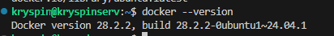
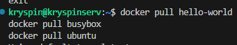
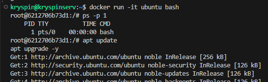
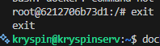

```
sudo apt update
sudo apt install docker.io
```



4.



5.





6.
dockerfile
```dockerfile
FROM ubuntu:24.04

ENV DEBIAN_FRONTEND=noninteractive

# install git and clean cache
RUN apt-get update \
    && apt-get install -y --no-install-recommends git ca-certificates \
    && rm -rf /var/lib/apt/lists/*

WORKDIR /app

RUN git clone https://github.com/InzynieriaOprogramowaniaAGH/MDO2026s_ITE.git

CMD ["bash"]
```


