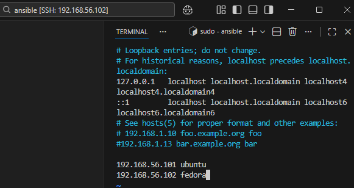
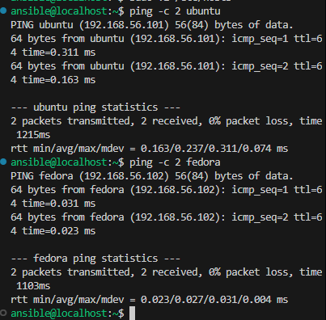
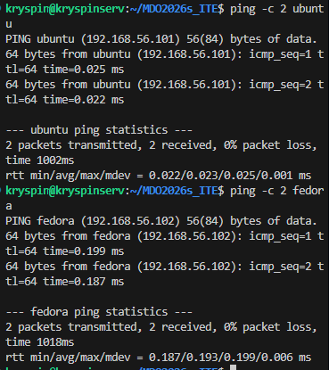
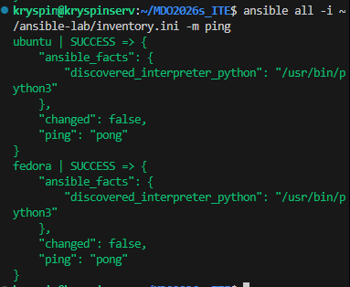

Pobrałem obraz `Fedora-Server-dvd-x86_64-43-1.6.iso` i zainstalowałem go w VirtualBoxie według poleceń, ustawiając odpowiednie nazwy.

Upewniłem się o obecności sshd i tar.
```bash
which tar
systemctl status sshd
```

Utworzyłem migawkę.


Na głównej maszynie zainstalowałem ansible:
```bash
sudo apt install ansible -y
```

- przelaczylem vmki na 'karta sieci izolowanej (host-only)'
- sprawdzilem ip `ip a`
- wykonałem poniższe komendy aby nie musiec sie lacyzc hasle

```
ssh-keygen -t ed25519
ssh-copy-id ansible@192.168.56.102
```

Ustawiłem nazwy dns:



Zwykły ping fedora:



Zwykły ping ubuntu:




ping
`ansible all -i ~/ansible-lab/inventory.ini -m ping`

inventory.ini:
```yaml
[Orchestrators]
ubuntu ansible_connection=local

[Endpoints]
fedora ansible_user=ansible
```


