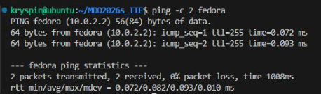
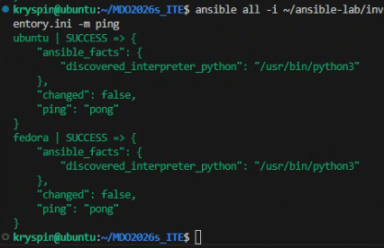
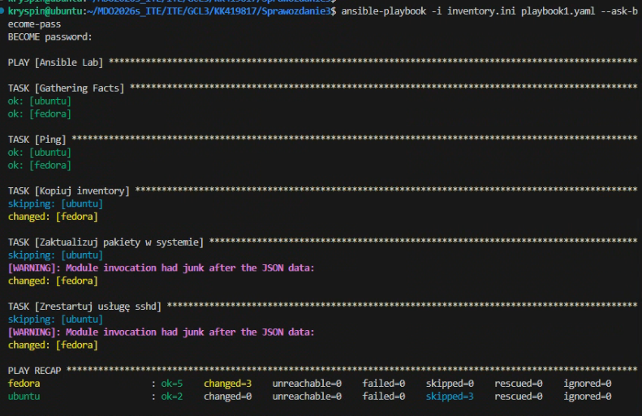
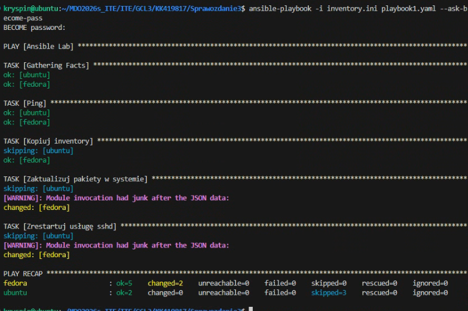
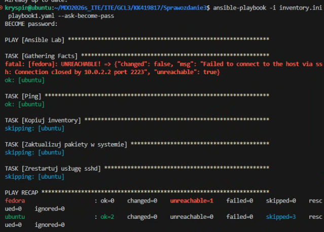
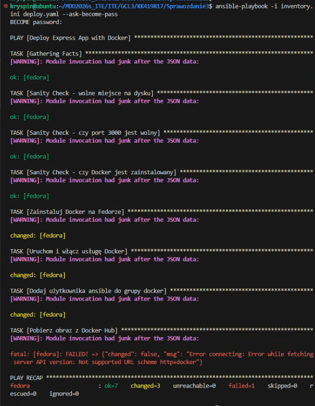
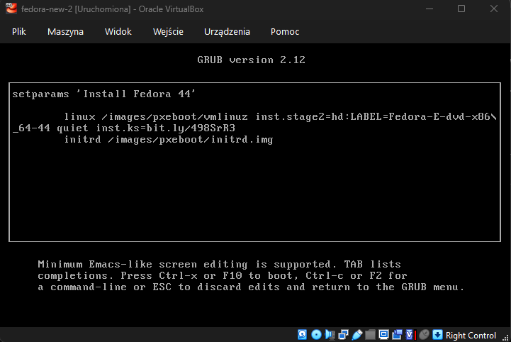
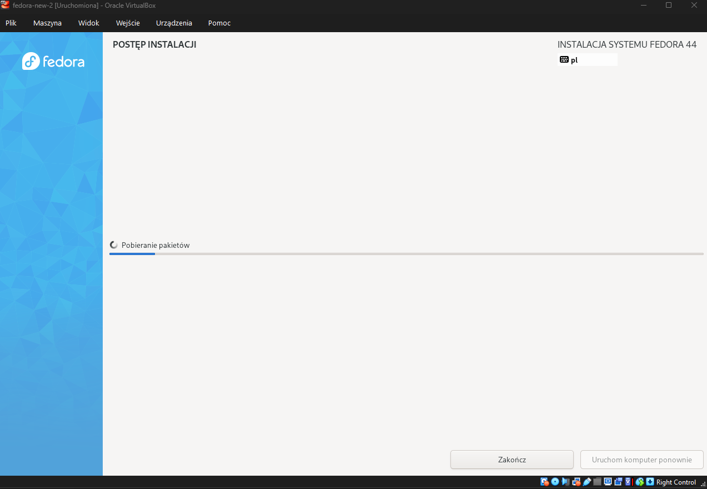
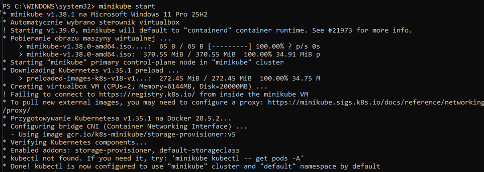

# Sprawozdanie 3 - Ansible

## Przygotowanie środowiska wirtualnego

### Instalacja systemu Fedora Server

Pobrałem obraz `Fedora-Server-dvd-x86_64-43-1.6.iso` i zainstalowałem go w VirtualBoxie według poleceń, ustawiając odpowiednie nazwy.

Upewniłem się o obecności sshd i tar.

```bash
which tar
systemctl status sshd
```

Utworzyłem migawkę.


### Konfiguracja Ansible i uwierzytelniania SSH

Na głównej maszynie zainstalowałem ansible:

```bash
sudo apt install ansible -y
```

- przelaczylem vmki na 'karta sieci izolowanej (host-only)'
- sprawdzilem ip `ip a`
- wykonałem poniższe komendy aby nie musiec sie lacyzc hasle

```
ssh-keygen -t ed25519
ssh-copy-id ansible@192.168.56.102
```

Klucze SSH umożliwiają bezpieczne połączenie bez konieczności wielokrotnego wpisywania hasła.

## Konfiguracja inwentarza

### Mapowanie nazw hostów

Ustawiłem nazwy dns w `/etc/hosts`:


Zwykły ping fedora:


Zwykły ping ubuntu:


### Plik inwentaryzacyjny

ping
`ansible all -i inventory.ini -m ping`

inventory.ini:

```yaml
[Orchestrators]
ubuntu ansible_connection=local

[Endpoints]
fedora ansible_user=ansible
```

Plik inwentaryzacyjny definiuje grupy hostów i parametry połączenia dla każdej maszyny.


Następnie jakimś cudem zepsułem połączenie między VMkami, potem połączenie z siecią, potem repozytorium się zepsuło a 'git pull' pobierał się z prędkością 10kB/s a potem i tak nie działał i - choć teoretycznie powinienem opisać proces naprawy tych wszystkich rzeczy - to jednak ze względu na dobro moje i osób w moim otoczeniu, postanowiłem mimo wszystko zaniechać tej praktyki akurat w tym przypadku.

Na koniec wykonałem `git push --force`.

Wracając, końcowo:

Z tych wszystkich powodów używam dwóch VMek z NATem.
Port forwarduje 2222 dla ubuntu i 2223 dla fedory.
Łączę się z ip lokalnego hosta, obecna zawartość `/etc/hosts`:

```bash
192.168.56.101 ubuntu
10.0.2.2 fedora
```





Dodatkowo zmodyfikowałem inventory.ini aby zawierało informację o porcie:

`fedora ansible_port=2223 ansible_user=ansible`

```bash
[Orchestrators]
ubuntu ansible_connection=local

[Endpoints]
fedora ansible_port=2223 ansible_user=ansible
```

Połączenie z maszynami przez ansible zostało zweryfikowane.

Przekierowanie portów przez NAT zapewnia stabilne połączenie między maszynami wirtualnymi.

## Zdalne wywoływanie procedur

### Utworzenie playbooka

Utworzyłem playbook:

```yaml
---
- name: Ansible Lab
  hosts: all
  tasks:
    - name: Ping
      ping:

    - name: Kopiuj inventory
      copy:
        src: ./inventory.ini
        dest: /tmp/inventory.ini
      when: inventory_hostname != 'ubuntu'

    - name: Zaktualizuj pakiety w systemie
      command: dnf upgrade -y
      when: inventory_hostname != 'ubuntu'
      become: yes

    - name: Zrestartuj usługę sshd
      service:
        name: sshd
        state: restarted
      when: inventory_hostname != 'ubuntu'
      become: yes
```

### Pierwsze wykonanie playbooka

`ansible-playbook -i inventory.ini playbook1.yaml --ask-become-pass`

(dodałem --ask-become-pass aby móc podać hasło potrzebne do niektórych operacji z wyższmi uprawnieniami)



Status `changed` wskazuje, że Ansible wykrył różnice i wprowadził zmiany w systemie docelowym.

### Ponowne uruchomienie



Widać że ansible coś zmieniło - najpierw mamy status `changed` a po drugim wykonaniu `OK` - czyli wprowadzono odpowiednie modyfikacje i te modyfikacje faktycznie zostały zapisane.

### Test bez dostępu SSH

Po wyłączeniu sshd na targecie, target jest unreachable:

`sudo systemctl stop sshd`



Brak działającego SSH uniemożliwia Ansible komunikację z hostem, co skutkuje statusem UNREACHABLE.

Ansible wymaga stabilnego połączenia SSH do wszystkich zarządzanych hostów. Bez działającego serwera SSH na maszynie docelowej, zarządzanie konfiguracją jest niemożliwe.

Moduły dedykowane Ansible (jak `copy` czy `service`) potrafią wykryć, czy zmiana jest potrzebna. Dzięki temu ponowne uruchomienie playbooka nie wprowadza niepotrzebnych modyfikacji. W przypadku `command` niestety takiego mechanizmu nie posiadamy.

---

Uruchomiłem nowy playbook `deploy.yaml`:




---
Pobrałem obraz fedory `Fedora-Everything-netinst-x86_64-44-1.7.iso`. Zainstalowałem system.

Ustawiłem port forwarding 22:2224 oraz konfigurację `/etc/ssh/sshd` na:
```bash 
PasswordAuthentication yes
PermitRootLogin yes
```

Przekopiowałem plik `anaconda-ks.cfg` z fedory na hosta za pomocą polecenia
```bash
scp -P 2224 root@localhost:/root/anaconda-ks.cfg ./anaconda-ks.cfg
```

```bash
# Generated by Anaconda 44.30
# Keyboard layouts
keyboard --vckeymap=pl --xlayouts='pl'
# System language
lang pl_PL.UTF-8

%packages
@^custom-environment

%end

# Run the Setup Agent on first boot
firstboot --enable

# Generated using Blivet version 3.13.2
ignoredisk --only-use=sda
autopart
# Partition clearing information
clearpart --none --initlabel

# System timezone
timezone Europe/Warsaw --utc

# Root password
rootpw --iscrypted --allow-ssh $y$j9T$uYIc/dnv0DogNnI9EUCYvG7Q$BOZtAIoDgM5ditiMn0jySkeeON2cjM4K5aCaXPdb8h4
```

Skróciłem link do http://bit.ly/498SrR3 aby móc go łatwo przepisać i dopisałem argument do komendy uruchomieniowej (klikając 'e' na ekranie startowym po uruchomieniu obrazu). 
```bash
inst.ks=https://raw.githubusercontent.com/InzynieriaOprogramowaniaAGH/MDO2026s_ITE/refs/heads/KK419817/ITE/GCL3/KK419817/Sprawozdanie3/anaconda-ks.cfg

# Po skróceniu:

inst.ks=http://bit.ly/498SrR3
```



Następnie wystartowałem instalację nienadzorowaną (F10). Fedora zainstalowała się bez mojej ingerencji, został tylko ekran końcowy z monitem o restart (należy następnie odłączyć 'płytę' z obrazem .iso aby się na nowo maszyna z niego nie próbowała bootować). 
W następnym etapie dodałem do pliku `reboot` aby samodzielnie restartować system.



Zmodyfikowałem plik `anaconda-ks.cfg` aby automatycznie instalował i uruchamiał aplikację Express.js z poprzedniego sprawozdania.


Zmieniłem środowisko z `@^custom-environment` na 
```bash
@^server-product-environment
@container-management
```
Dodając `container-management` niezbędny do uruchomienia dockera.

Utworzyłem sekcję %post która wykonuje się po zakończeniu instalacji systemu

Sekcja %post włącza Docker (`systemctl enable`), pobiera obraz kontenera z DockerHub, tworzy plik systemd i włącza automatyczne uruchamianie aplikacji przy starcie systemu. Dodałem również `%post --log=/root/kickstart-post.log` aby mieć zapis logów z tych operacji.

Na końcu pliku dodałem reboot aby system automatycznie się zrestartował po instalacji. Po ponownym uruchomieniu aplikacja Express.js jest dostępna na porcie 3000.

Instalacja nienadzorowana działa poprawnie, system instaluje się bez mojej interakcji, automatycznie pobiera i uruchamia kontener, a aplikacja się uruchamia.


## Kubernetes

Instalacja ze strony https://minikube.sigs.k8s.io/docs/start/?arch=%2Fwindows%2Fx86-64%2Fstable%2F.exe+download 



