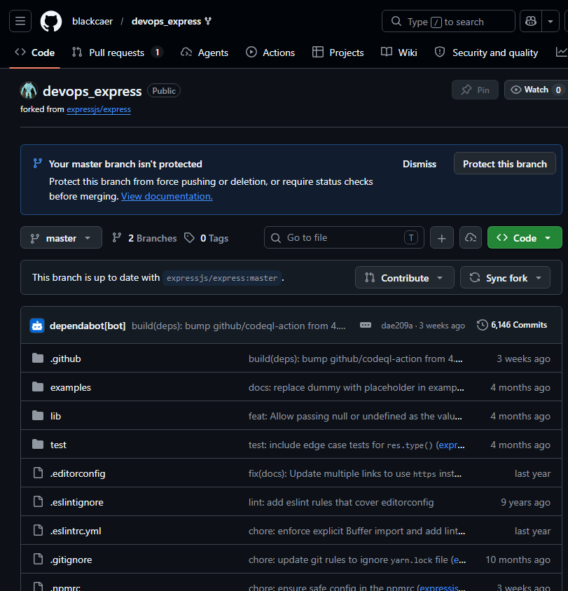
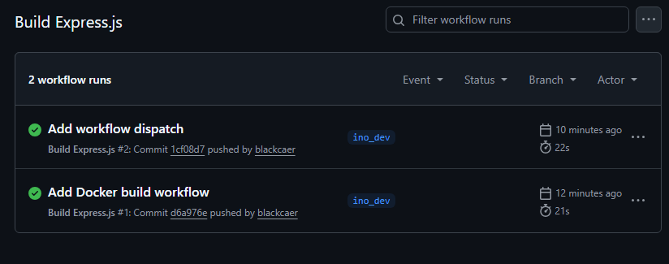
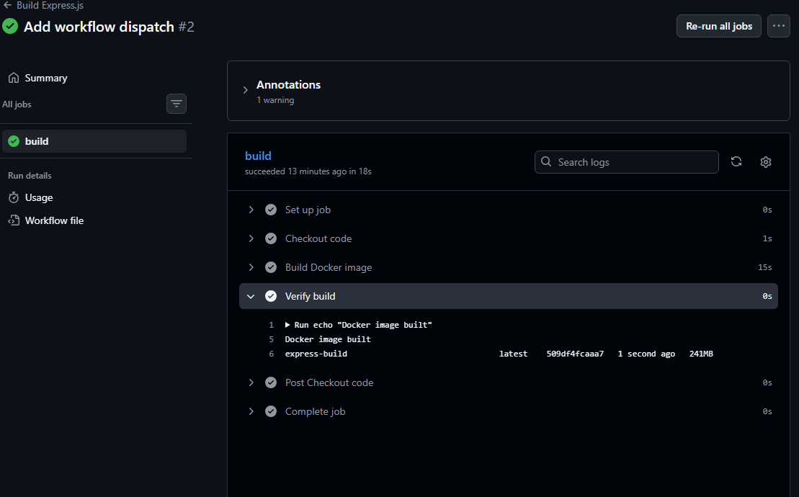
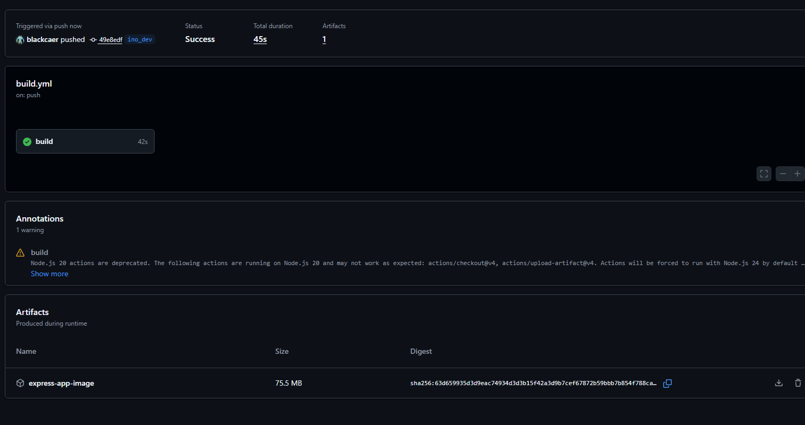
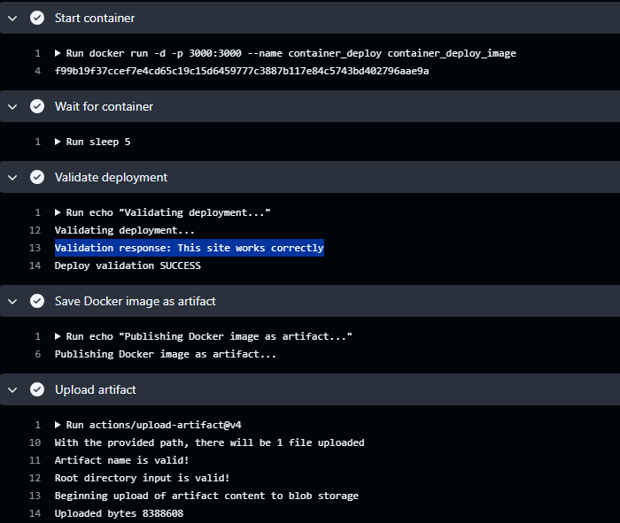

Sforkowałem repo [express.js](https://github.com/blackcaer/devops_express)



Utworzyłem branch `ino_dev`  i usunąłem workflowy [commit](https://github.com/blackcaer/devops_express/pull/1/changes/ab56ced4ae23e3922134adb1fbe6b77861855f8b).

Dodałem github action aby sprawdzić czy zadziała:
```yml
name: Build Express.js

on:
  push:
    branches:
      - ino_dev
  pull_request:
    branches:
      - ino_dev
  workflow_dispatch:

jobs:
  build:
    runs-on: ubuntu-latest
    
    steps:
      - name: Checkout code
        uses: actions/checkout@v4
      
      - name: Build Docker image
        run: docker build --no-cache -f Dockerfile.build -t express-build .
      
      - name: Verify build
        run: |
          echo "Docker image built"
          docker images | grep express-build
```

Widać że workflowy działają





--- 

Dodałem kolejne kroki z Jenkinsfila. Widać że artefakt został utworzony i jest dołączony



Walidacja przeszła pomyślnie, obraz się poprawnie włącza i da się z nim połączyć.



