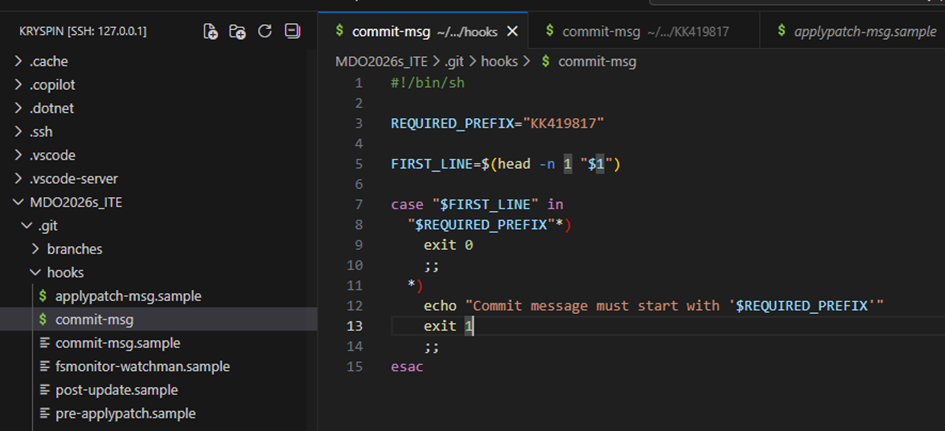
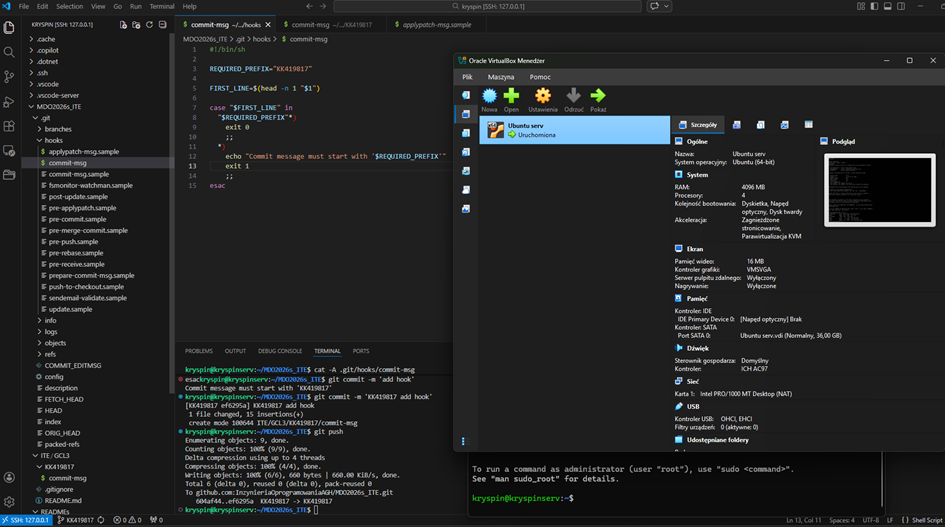
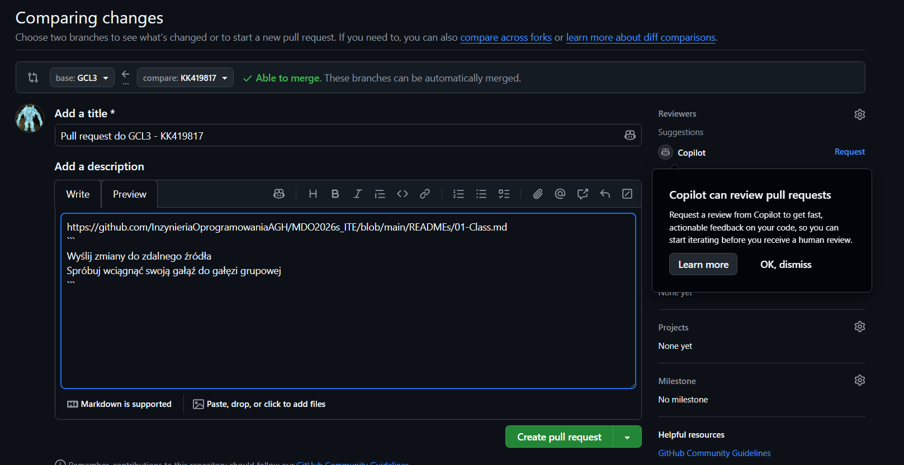

Sprawozdanie metodyki devops
03.03.2026 Kryspin Kucha ITE gr.3

Git hook
```sh
REQUIRED_PREFIX="KK419817"

FIRST_LINE=$(head -n 1 "$1")

case "$FIRST_LINE" in
  "$REQUIRED_PREFIX"*) 
    exit 0
    ;;
  *)
    echo "Commit message must start with '$REQUIRED_PREFIX'"
    exit 1
    ;;
esac

```

Hook:


Maszyna wirtualna:


PR do GCL3:
