# SPRAWOZDANIA - MK421268

---

## LAB 1

### VM

Zastosowanie Ubuntu Server 22.04 LTS na Hyper-V w Windows 11
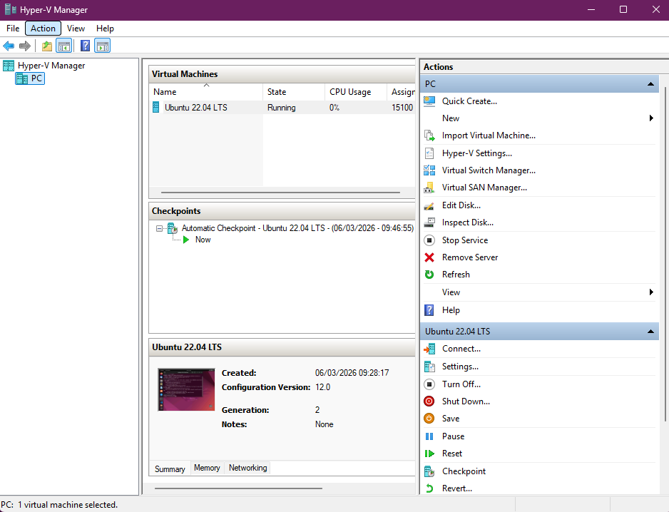

### GIT

Utworzenie własnego brancha oraz 2 kluczy SSH (ed25519 z hasłem oraz ECDSA bez hasła)
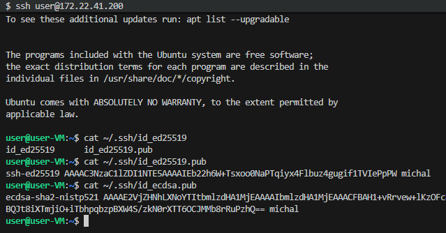

### Hook

Dodanie gitHooka

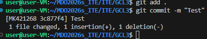
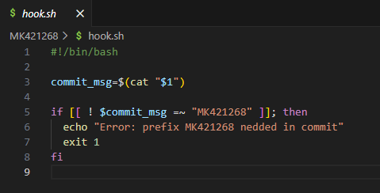

---

## LAB 2

### DOCKER

Uruchomienie obrazu hello-world
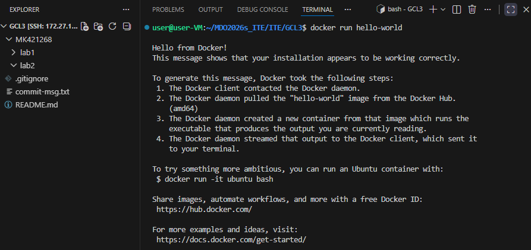

Uruchomienie busybox i ubuntu
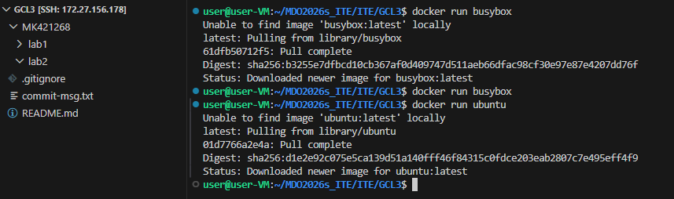

Sprawdzenie ich rozmiarów oraz kodu wyjścia
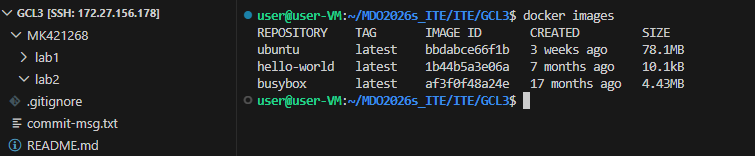
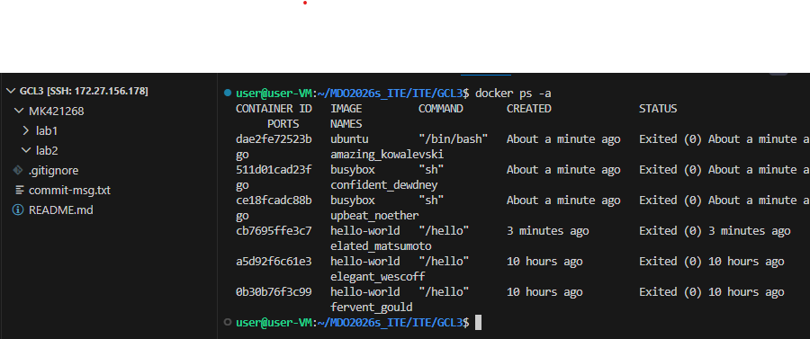

Polaczenie sie do kontenera interaktywnie z obrazu busybox
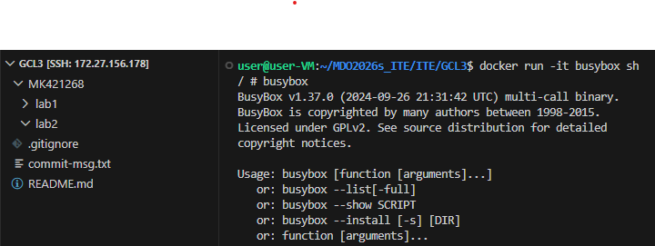

Uruchomienie kontenera z obrazu ubuntu (PID1 info i zaktualizowanie)
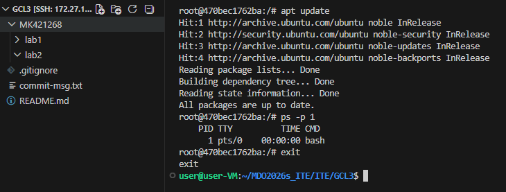

Utworzenie Dockerfile oraz zbudowanie własnego obrazu
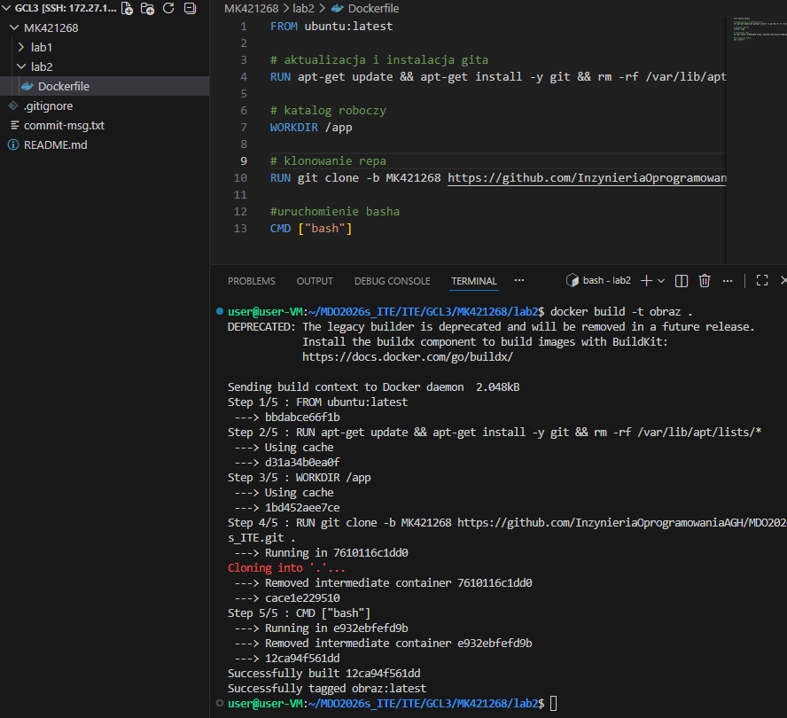

Sprawdzenie działających kontenerów i ich czyszczenie za pomocą instrukcji prune
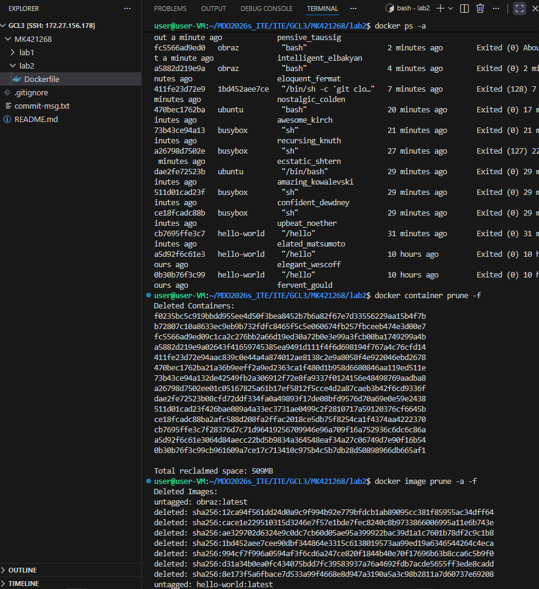

---

## LAB 3

### KONTENERY

Wybór oprogramowania
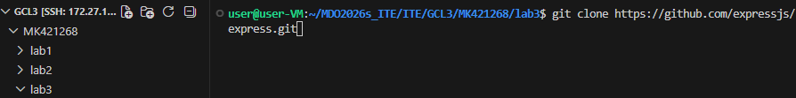

Uruchomienie bez Dockera i zależności
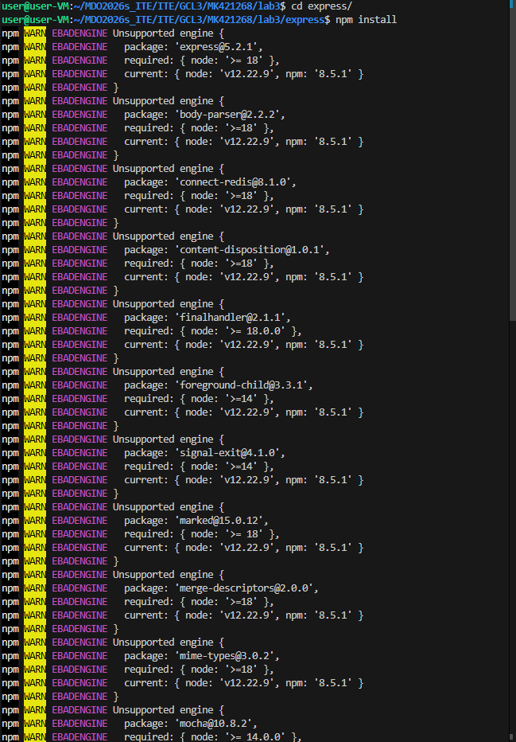
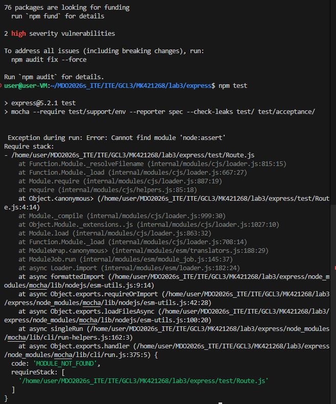

Zbudowanie obrazów w dockerze
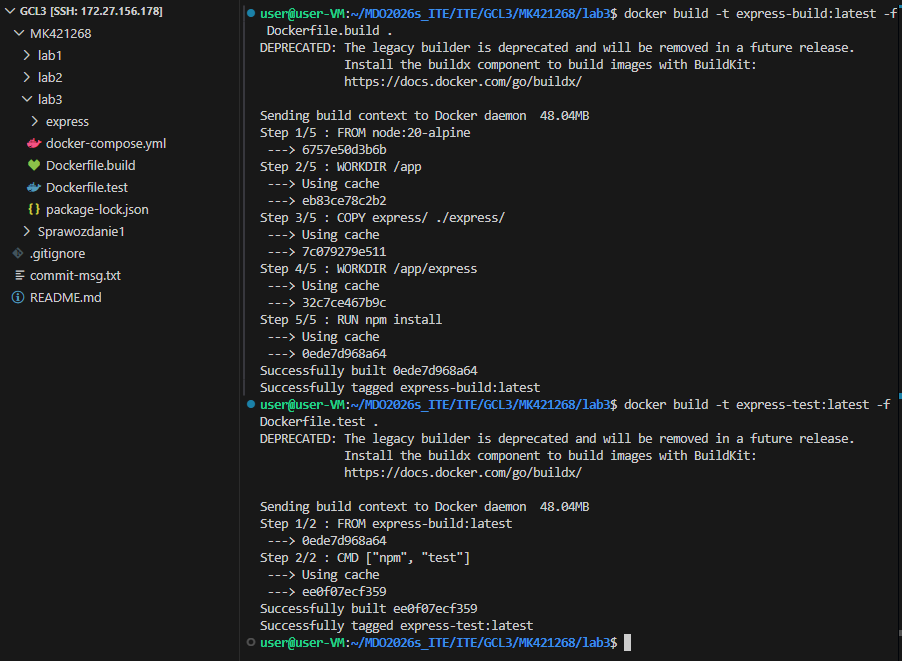

Utworzenie pliku Dockerfile.build
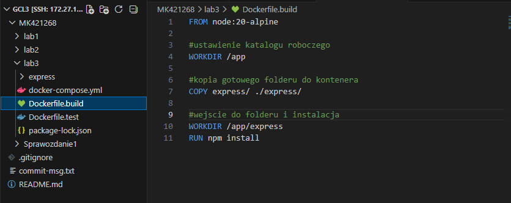

Utworzenie pliku Dockerfile.test
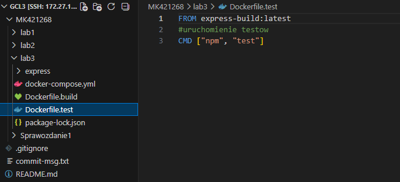

Utworzenie pliku docker-compose.yml
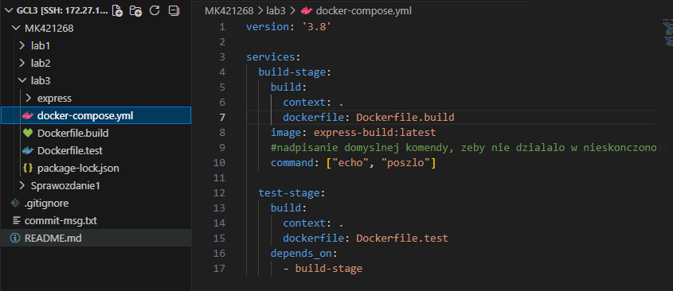

Uruchomienie kontenera
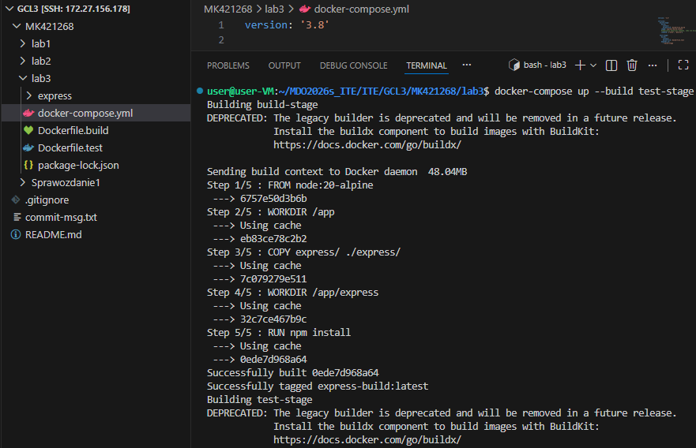

---

## LAB 4

### Zachowywanie stanu między kontenerami

Utworzenie 2 woluminów 

Wykorzystanie tymczasowego kontenera pomocniczego

Uruchomienie procesu budowania aplikacji w kontenerze bazowym z systemem Node.js

Zastosowanie alternatywnego podejścia: instalacja narzędzia Git "w locie" wewnątrz kontenera bazowego, a następnie pobranie repozytorium i budowanie projektu w ramach jednego procesu.

Weryfikacja pomyślnego zakończenia procesu budowania aplikacji.

Weryfikacja zawartości woluminu wyjściowego.

Testowanie komunikacji w domyślnej sieci Dockera.

Testowanie komunikacji we własnej sieci mostkowej (Custom Bridge)

Eksponowanie portów na zewnątrz.

Konfiguracja usługi SSH w kontenerze.

Zalogowanie sie do kontenera z usługą SSH.

Przygotowanie i uruchomienie infrastruktury Jenkinsa za pomocą narzędzia Docker Compose.

Weryfikacja działających usług.

Odczytanie logów startowych kontenera Jenkinsa

Weryfikacja ekranu powitalnego i kreatora konfiguracji początkowej Jenkinsa w przeglądarce internetowej.

