# Lab 5 - Przygotowanie i testowanie środowiska Jenkins

## Uruchomienie środowiska
Przygotowano środowisko Jenkinsa za pomocą pliku docker-compose.yml oraz niestandardowego pliku Dockerfile instalującego wtyczkę Blue Ocean. Uruchomiono kontenery poleceniem docker-compose up -d --build.

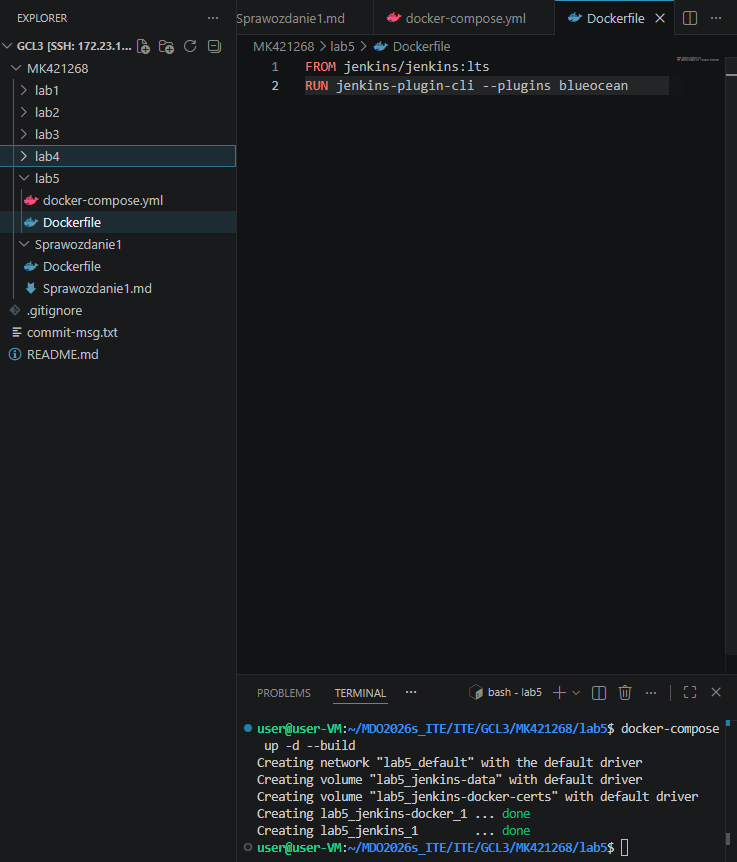


## Konfiguracja początkowa i logowanie do środowiska Jenkins

Uruchomiono interfejs webowy Jenkinsa w przeglądarce w celu przeprowadzenia pierwszej konfiguracji. Odczytano wygenerowane, jednorazowe hasło administratora z logów uruchomionego kontenera za pomocą polecenia docker logs.
Wprowadzono skopiowane hasło na początkowym ekranie autoryzacji "Unlock Jenkins", co pozwoliło na bezpieczne odblokowanie nowej instancji.
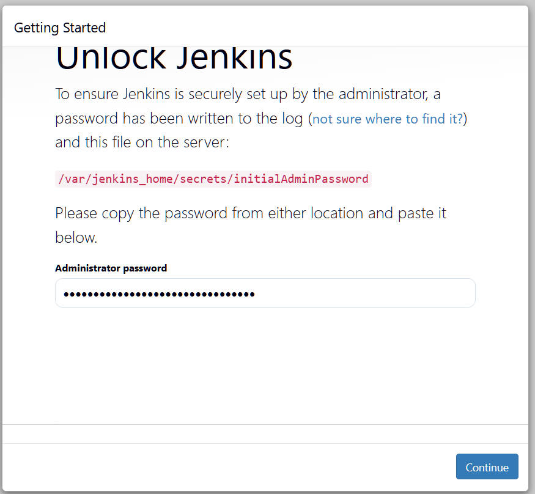

Przeprowadzono instalację domyślnego pakietu wtyczek sugerowanych przez instalator.
Utworzono docelowe konto administratora, wprowadzając własne dane logowania, co sfinalizowało proces rejestracji i nadało pełny dostęp do panelu głównego.


## Test działania komend systemowych
Utworzono projekt testowy wykonujący polecenie uname. W sekcji konfiguracji dodano krok "Execute shell" z komendą uname -a.


Uruchomiono zadanie i zweryfikowano logi konsoli, które zakończyły się statusem SUCCESS


## Wymuszenie błędu warunkowego
Utworzono projekt zwracający błąd, gdy aktualna godzina jest nieparzysta. Dodano skrypt bash wykorzystujący operację modulo do sprawdzenia godziny i wywołujący exit 1 w przypadku nieparzystego wyniku.


Uruchomiono zadanie w czasie trwania nieparzystej godziny (19:xx), co przerwało build i wymusiło status FAILURE.

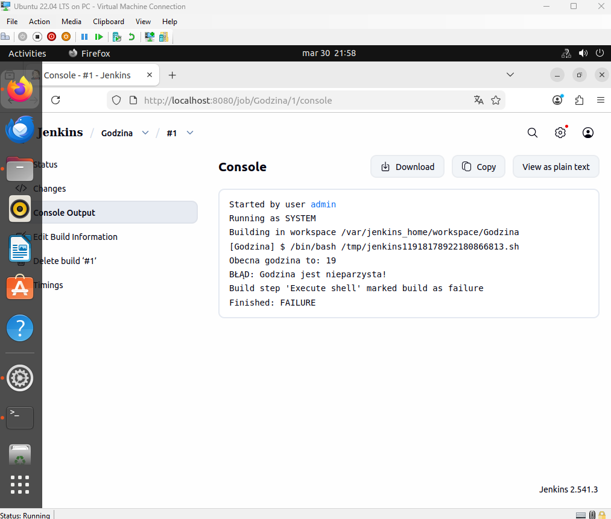

## Pobranie obrazu Docker
Utworzono zadanie testujące współpracę Jenkinsa z zewnętrznym rejestrem Dockera. W kroku "Execute shell" zastosowano polecenie docker pull ubuntu.

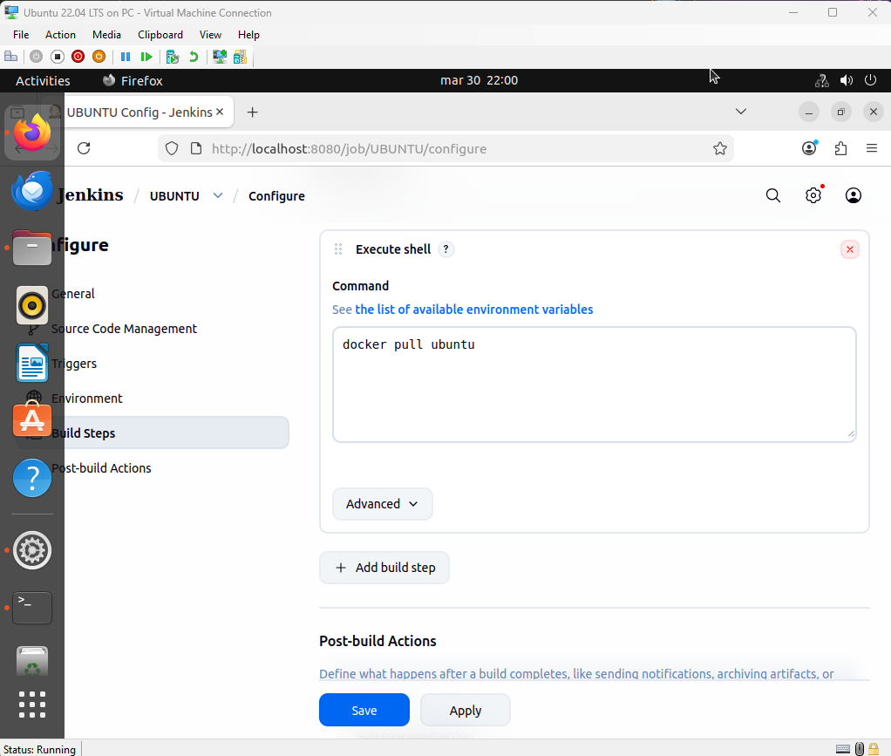

Zweryfikowano logi zadania, w których potwierdzono pomyślne pobranie warstw obrazu.

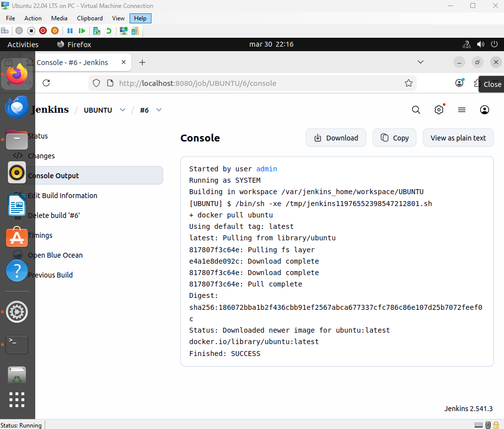

## Konfiguracja obiektu Pipeline
Utworzono obiekt typu pipeline i wprowadzono skrypt bezpośrednio w oknie konfiguracji. Zdefiniowano etap klonowania repozytorium ze wskazanej gałęzi oraz etap przejścia do katalogu docelowego i budowania obrazu komendą docker build -t builder .

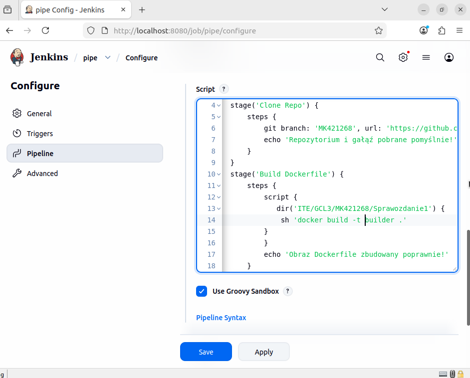

Uruchomiono potok i zweryfikowano poprawne wykonanie wszystkich zdefiniowanych etapów na ekranie podsumowania.

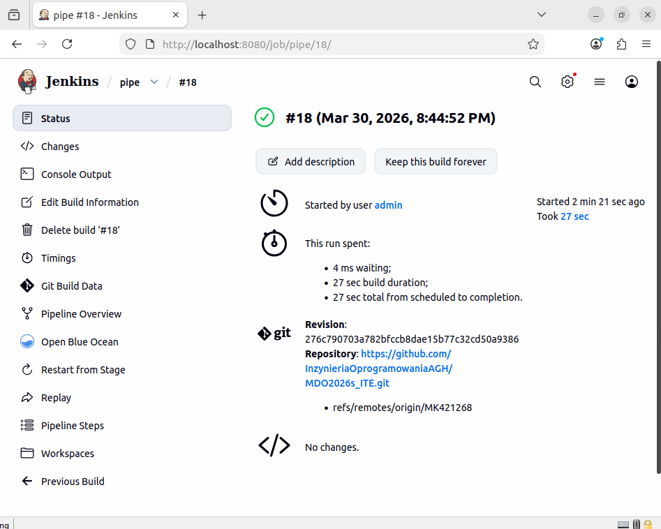


# Lab 6 - Architektura i konteneryzacja procesu CI/CD

## Konfiguracja źródła skryptu (SCM)
Skonfigurowano potok tak, aby pobierał definicję Jenkinsfile bezpośrednio z repozytorium Git, realizując wymóg utrzymywania infrastruktury jako kodu. Wskazano adres repozytorium, docelową gałąź (*/MK421268) oraz zdefiniowano ścieżkę do pliku skryptu ITE/GCL3/MK421268/lab5/Jenkinsfile.

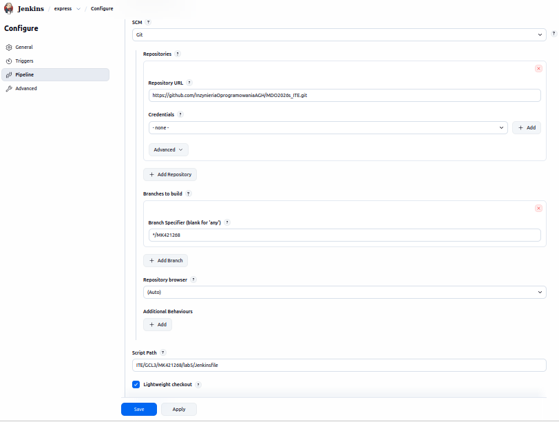

## Instalacja wtyczek Jenkinsa
Zainstalowano wymagane wtyczki dla integracji środowiska Docker w Jenkinsie, takie jak Docker Commons i Docker Pipeline.

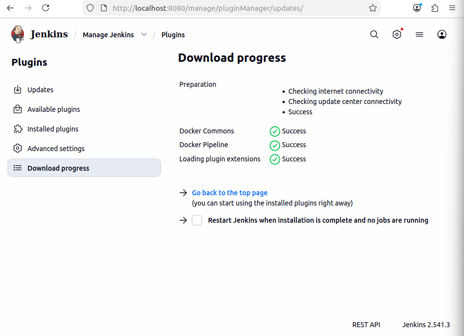

## Przygotowanie repozytorium aplikacji
Sforkowano repozytorium frameworka express.js z serwisu GitHub na własne konto. Zmodyfikowano kod aplikacji, dodając w pliku index.js nowy endpoint /advanced, odpowiedzialny za zwracanie szczegółowych metryk diagnostycznych (health check) w formacie JSON.

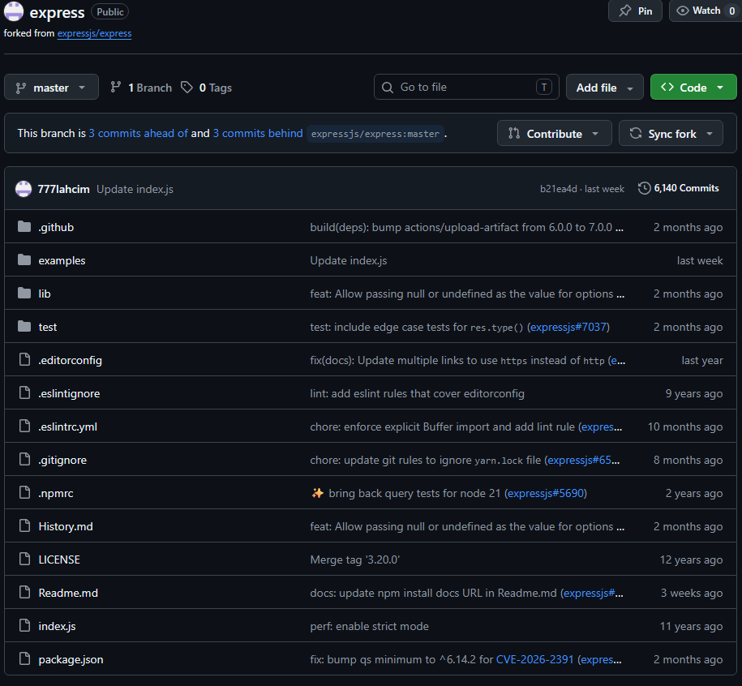

```bash
app.get('/advanced', (req, res) => {
    const healthCheck = {
        status: "pass",
        timestamp: new Date().toISOString(),
        uptimeSeconds: process.uptime(),
        serviceDetails: {
            name: "express-pipeline-dind",
            version: process.env.APP_VERSION || "unknown", 
            nodeEnv: process.env.NODE_ENV || "development"
        },
        metrics: {
            memoryRssBytes: process.memoryUsage().rss, 
            loadAverage: os.loadavg()[0]
        },
        checks: {
            database: "connected",
            cache: "operational"
        }
    };

    res.status(200).json(healthCheck);
});
```

## Projekt architektury walidacji
Zaprojektowano architekturę środowiska testowego oraz proces walidacji w oparciu o kontenery c-deploy i c-curl. Uwzględniono weryfikację nowo dodanego endpointu /advanced oraz sprawdzenie kodu wyjścia testów.

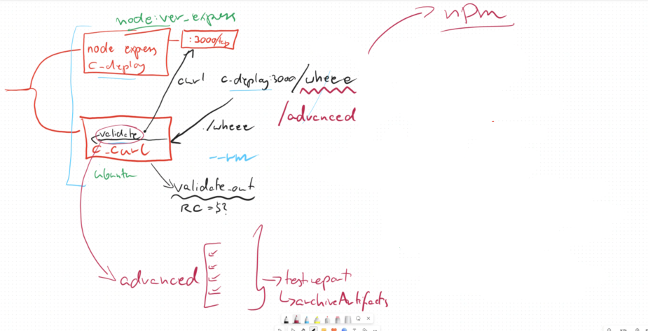

## Opracowanie obrazu bazowego
Utworzono plik Dockerfile.build bazujący na obrazie node:20-alpine. Skonfigurowano pobieranie kodu z przygotowanego forka repozytorium poleceniem git clone, instalację zależności przez npm install oraz wystawienie serwera na porcie 3000.

```bash
FROM node:20-alpine
WORKDIR /app
RUN apk update && apk add git
RUN git clone -b master https://github.com/777lahcim/express.git .
RUN npm install
#port 3000
EXPOSE 3000
# uruchomienie pliku z /advanced
CMD ["node", "examples/hello-world/index.js"]
```

## Opracowanie obrazu testowego
Utworzono plik Dockerfile.test oparty na zbudowanym obrazie bazowym express-build-image:latest. Zmodyfikowano domyślną komendę na wykonanie polecenia npm test.

```bash
FROM express-build-image:latest 
CMD ["npm", "test"]
```

# Lab 7 - Deklaratywny Pipeline i archiwizacja artefaktów

## Budowanie obrazu (Build)
Zdefiniowano pierwszy etap potoku, odpowiedzialny za utworzenie świeżego obrazu bazowego aplikacji. Zastosowano flagę --no-cache, aby wymusić pobranie najnowszej wersji kodu z repozytorium.

```bash
stage('1. Build') {
    steps {
        dir('ITE/GCL3/MK421268/lab5') {
            echo 'Budowanie obrazu bazowego z kodem...'
            sh 'docker build --no-cache -t express-build-image:latest -f Dockerfile.build .'
        }
    }
}
```

## Testowanie jednostkowe (Test)
Skonfigurowano etap budujący dedykowany obraz testowy na podstawie obrazu bazowego. Uruchomiono kontener z testami poleceniem npm test, stosując flagę --rm do automatycznego usunięcia kontenera po zakończeniu operacji.

```bash
stage('2. Test') {
    steps {
        dir('ITE/GCL3/MK421268/lab5') {
            echo 'Budowanie i uruchamianie kontenera testowego (npm test)...'
            sh 'docker build -t express-test-image:latest -f Dockerfile.test .'
            sh 'docker run --rm express-test-image:latest'
        }
    }
}
```

## Zaawansowana walidacja (Validation)
Opracowano najbardziej złożony etap, symulujący wdrożenie w izolowanym środowisku. Utworzono dedykowaną sieć pipeline-net oraz uruchomiono kontener aplikacji c_deploy. Następnie wywołano kontener c_curl, który za pomocą narzędzi curl i jq zweryfikował poprawność działania endpointu /advanced, sprawdzając kod HTTP 200, status aplikacji, zgodność wersji oraz metryki pamięci. Wynik walidacji zapisano do pliku test_report.txt, a w bloku finally zapewniono usunięcie kontenerów i sieci.

```bash
stage('3. Validation (c_deploy & c_curl)') {
    steps {
        dir('ITE/GCL3/MK421268/lab5') {
            script {
                try {
                    echo 'Tworzenie sieci i uruchamianie c_deploy...'
                    sh "docker network create ${NETWORK_NAME}"
                    sh "docker run -d --rm --name c_deploy -e APP_VERSION=\"${env.BUILD_ID}\" --network ${NETWORK_NAME} express-build-image:latest"
                    sleep 5 
                    sh """
                        docker run --rm --name c_curl --network ${NETWORK_NAME} -v \$(pwd):/workspace -w /workspace alpine:latest sh -c '
                            apk add --no-cache curl jq > /dev/null
                            HTTP_STATUS=\$(curl -s -o response.json -w "%{http_code}" http://c_deploy:3000/advanced)
                            if [ "\$HTTP_STATUS" -ne 200 ]; then exit 1; fi
                            if [ "\$(jq -r .status response.json)" != "pass" ]; then exit 1; fi
                            echo "[SUCCESS] Walidacja pomyslna. RC=0" >> test_report.txt
                        '
                    """
                } finally {
                    sh "docker stop c_deploy || true"
                    sh "docker network rm ${NETWORK_NAME} || true"
                }
            }
        }
    }
}
```

## Publikacja artefaktu (Publish)
Zdefiniowano etap przygotowania wersji dystrybucyjnej aplikacji. Uruchomiono kontener, w którym wykonano polecenie npm pack, a wygenerowany plik .tgz przeniesiono do folderu wyjściowego.

```bash
stage('4. Publish') {
    steps {
        dir('ITE/GCL3/MK421268/lab5') {
           echo 'Pakowanie artefaktu (npm pack)...'
           sh "docker run --rm -v \$(pwd):/out -w /app express-build-image:latest sh -c 'npm pack && mv *.tgz /out/'"
        }
    }
}
```

## Archiwizacja wyników (Post)
Skonfigurowano sekcję post, która niezależnie od wyniku końcowego archiwizuje raport walidacji oraz paczkę .tgz jako artefakty buildu. Uruchomiono potok i potwierdzono pomyślne wygenerowanie plików

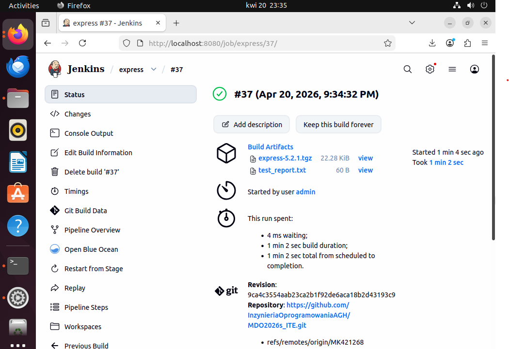

Zweryfikowano treść zarchiwizowanego raportu test_report.txt, potwierdzając pomyślny status walidacji.

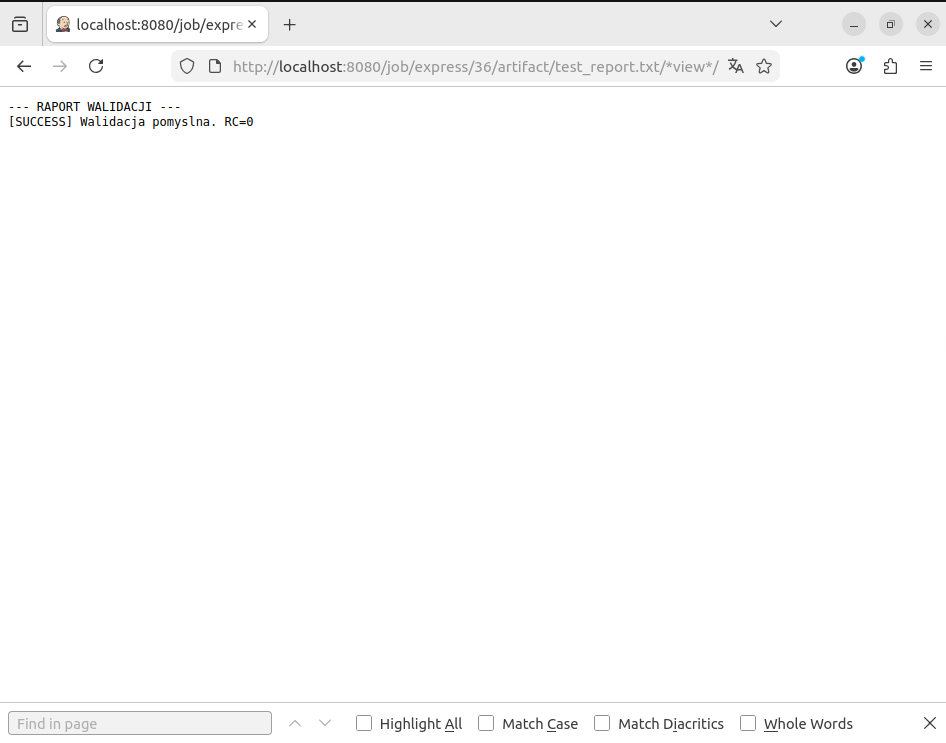


## Dokumentacja oraz diagramy:

### 1. Wymagania wstępne środowiska

Aby zaprezentowany proces ciągłej integracji i wdrażania (CI/CD) mógł zostać pomyślnie wykonany, wymagane są następujące elementy:

* Działająca instancja serwera ciągłej integracji (Jenkins) uruchomiona jako kontener Docker.
* Skonfigurowane i połączone środowisko zagnieżdżone Docker-in-Docker (DinD), pozwalające Jenkinsowi na bezpieczne budowanie obrazów, tworzenie wyizolowanych sieci oraz uruchamianie testów w locie.
* Sforkowane repozytorium z kodem źródłowym aplikacji (np. z modyfikacją frameworka Express.js pod kątem walidacji) wraz z odpowiednio zdefiniowanymi plikami konfiguracyjnymi: `Dockerfile.build`, `Dockerfile.test` oraz głównym `Jenkinsfile`.
* Dostęp do zewnętrznego rejestru obrazów lub wewnętrznego mechanizmu archiwizacji artefaktów (dla plików `.tgz`).

---

### 2. Diagram aktywności (Proces CI)

Diagram przedstawia przepływ zadań w pipeline, ze szczególnym uwzględnieniem izolacji środowiska testowego.

```mermaid
stateDiagram-v2
    direction TB

    [*] --> Stage_Build
    
    state Stage_Build {
        [*] --> Docker_Build_NoCache
        Docker_Build_NoCache --> express_build_image
    }

    Stage_Build --> Stage_Test

    state Stage_Test {
        [*] --> Build_Test_Image
        Build_Test_Image --> Run_npm_test : docker run --rm
    }

    Stage_Test --> Stage_Validation

    state Stage_Validation {
        [*] --> Create_Docker_Network
        Create_Docker_Network --> Start_c_deploy : (Uruchomienie aplikacji: c_deploy)
        Start_c_deploy --> Start_c_curl : (Uruchomienie testera: c_curl)
        
        state Start_c_curl {
            [*] --> Fetch_JSON : GET /advanced
            Fetch_JSON --> Validate_Conditions : Check HTTP 200, status, app, ver, metrics
            Validate_Conditions --> Write_Report : Zapisz status do test_report.txt (RC=0 lub 1)
        }
        
        Start_c_curl --> Cleanup : docker stop & network rm
    }

    Stage_Validation --> Stage_Publish

    state Stage_Publish {
        [*] --> Artifact_Packaging : Uruchom kontener i wykonaj 'npm pack'
        Artifact_Packaging --> Extract_TGZ : Przenieś *.tgz do /out/
    }

    Stage_Publish --> Post_Processing
    
    state Post_Processing {
        [*] --> Archive_Artifacts : Zapisz test_report.txt oraz *.tgz
    }
    
    Post_Processing --> [*]
```

### 3. Diagram wdrożeniowy (Validation & Deploy Stage)
```mermaid
graph TD
    subgraph Jenkins_Pipeline ["Proces CI/CD na serwerze Jenkins"]
        
        subgraph Stage_Validation ["Etap Walidacji"]
            subgraph Isolated_Network ["Izolowana sieć: pipeline-net"]
                C_CURL["<b>c_curl</b><br/>(Narzędzie testujące)"]
                C_DEPLOY["<b>c_deploy</b><br/>(Aplikacja Node.js port 3000)"]
            end
            
            C_CURL -- "1. Pobiera dane (HTTP GET /advanced)" --> C_DEPLOY
            C_DEPLOY -- "2. Zwraca dane JSON" --> C_CURL
            
            C_CURL -- "3. Wykonuje testy (jq)" --> CHECK_RESULT{"Czy walidacja<br/>zakończona sukcesem?"}
        end

        subgraph Stage_Publish ["Etap Publikacji"]
            C_PACKER["<b>Kontener pakujący</b><br/>(Obraz bazowy)"]
        end
        
        %% Logika przejścia
        CHECK_RESULT -- "TAK (Exit Code: 0)" --> C_PACKER
        CHECK_RESULT -. "NIE (Exit Code: 1)" .-> PIPELINE_FAIL(("Przerwanie<br/>Pipeline'u"))

        subgraph Workspace ["Przestrzeń robocza na hoście"]
            VOL[("Wolumen zmapowany do kontenerów")]
            REP["test_report.txt"]
            TGZ["*.tgz"]
        end

        %% Zapis wyników
        C_CURL -- "4a. Zapisuje raport" --> REP
        C_PACKER -- "4b. Generuje paczkę (npm pack)" --> TGZ
        
        REP -.-> VOL
        TGZ -.-> VOL

        subgraph Post_Processing ["Akcja końcowa"]
            ARCHIVE["Magazyn Artefaktów Jenkins<br/>(archiveArtifacts)"]
        end

        %% Archiwizacja
        VOL -- "5. Pobranie plików po zakończeniu zadań" --> ARCHIVE
    end

    %% Definicje stylów wizualnych
    style C_DEPLOY fill:#e1f5fe,stroke:#03a9f4,stroke-width:2px
    style C_CURL fill:#f1f8e9,stroke:#8bc34a,stroke-width:2px
    style C_PACKER fill:#fff3e0,stroke:#ff9800,stroke-width:2px
    style Isolated_Network stroke-dasharray: 5 5,stroke:#ab47bc,fill:none
    style VOL fill:#eceff1,stroke:#607d8b
    style CHECK_RESULT fill:#f3e5f5,stroke:#8e24aa,stroke-width:2px
