# Lab 8 - Automatyzacja i zdalne wykonywanie poleceń za pomocą Ansible

## Instalacja zarządcy Ansible
Utworzono drugą maszynę wirtualną o jak najmniejszym zbiorze zainstalowanego oprogramowania. Nadano jej nazwę zgodną z wytycznymi i uruchomiono w środowisku wirtualizacji.

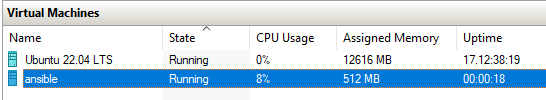

Zainstalowano niezbędne oprogramowanie Ansible, w tym serwer OpenSSH oraz program tar, a także utworzono w systemie dedykowanego użytkownika `ansible`.

Na głównej maszynie wygenerowano nową parę kluczy SSH poleceniem `ssh-keygen` w celu bezhasłowego uwierzytelniania.

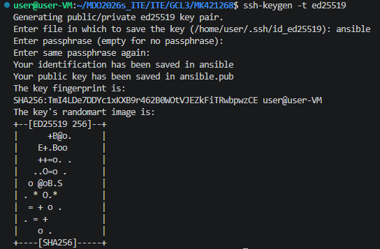

Wymieniono klucze SSH między użytkownikiem na głównej maszynie, a użytkownikiem `ansible` na nowej maszynie za pomocą polecenia `ssh-copy-id`. Zweryfikowano poprawność logowania bez użycia hasła.

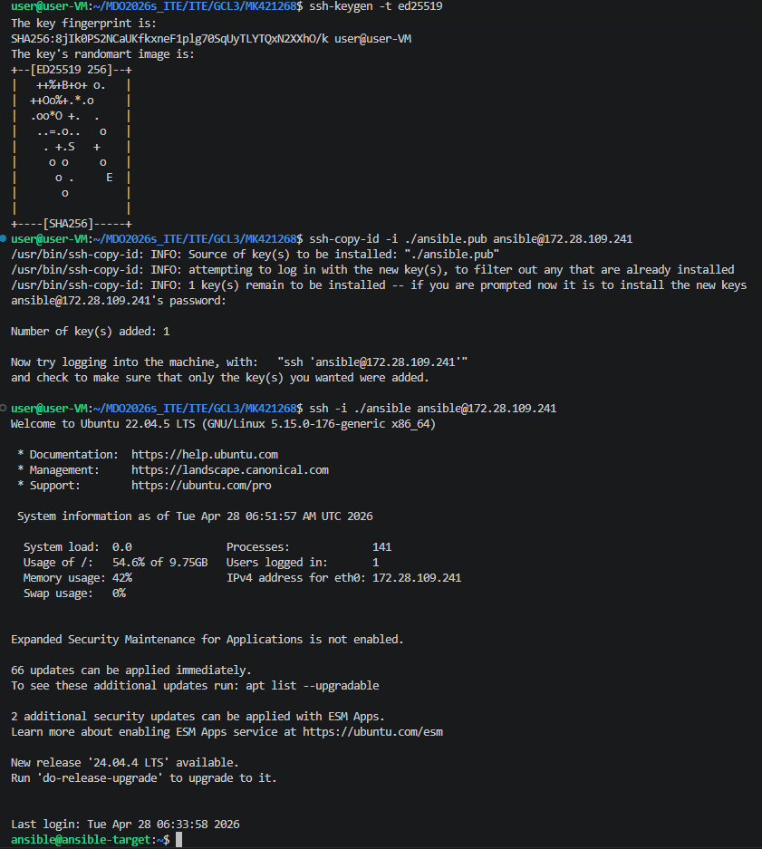

## Inwentaryzacja
Wprowadzono nazwę DNS dla nowej maszyny wirtualnej, modyfikując plik `/etc/hosts` na głównej maszynie, co pozwoliło na wywoływanie komputera `ansible-target` po nazwie zamiast po adresie IP.

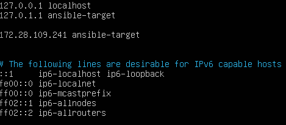

Stworzono plik inwentaryzacji `inventory.ini` zawierający sekcje `[Orchestrators]` oraz `[Endpoints]` z odpowiednimi nazwami maszyn. Wysłano pierwsze żądanie `ping` do wszystkich maszyn, które na maszynie docelowej zakończyło się błędem z powodu braku weryfikacji klucza hosta.

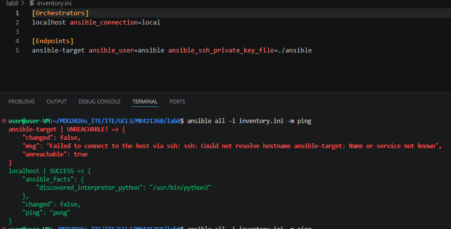

Zaakceptowano autentyczność hosta docelowego i ponowiono operację ping do wszystkich maszyn. Zakończyła się ona statusem SUCCESS.

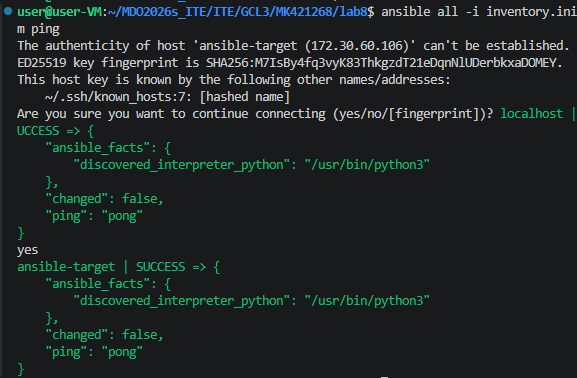

## Zdalne wywoływanie procedur
Przed uruchomieniem playbooka przygotowano maszynę docelową do przyjmowania komend uprzywilejowanych. Za pomocą narzędzia visudo zmodyfikowano plik sudoers, pozwalając użytkownikowi `ansible` na wykonywanie poleceń z uprawnieniami roota bez podawania hasła.

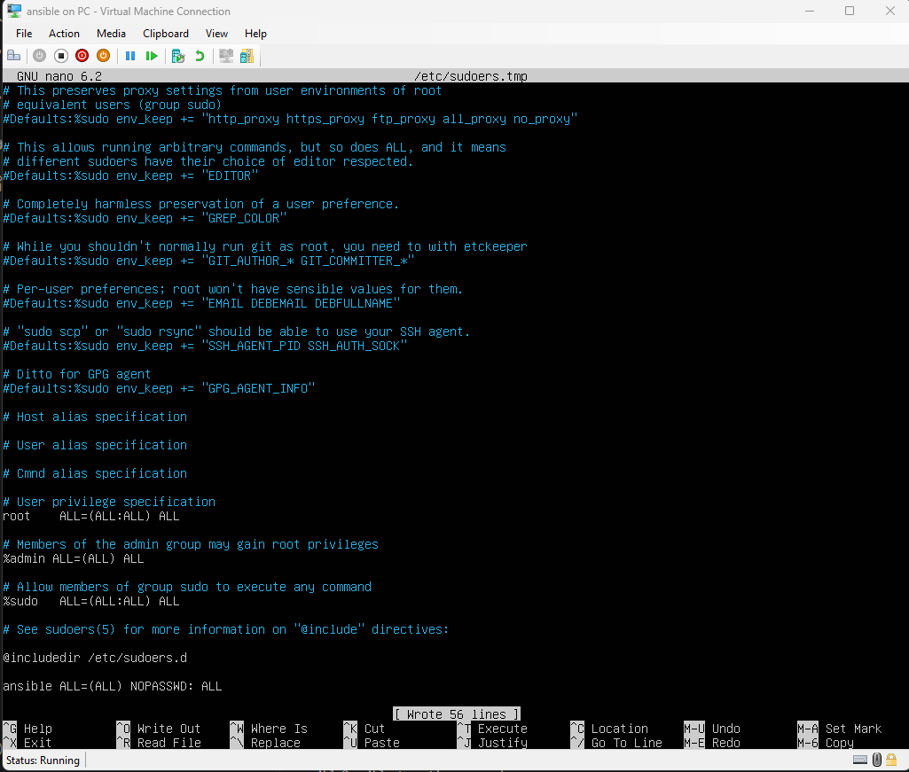

Za pomocą playbooka Ansible wywołano zdalnie serię procedur na maszynie końcowej: wysłano żądanie ping, skopiowano plik inwentaryzacji `inventory.ini`, zaktualizowano pakiety w systemie (apt update & upgrade), a następnie zainstalowano narzędzie rng-tools oraz zrestartowano usługi `sshd` i `rngd`.

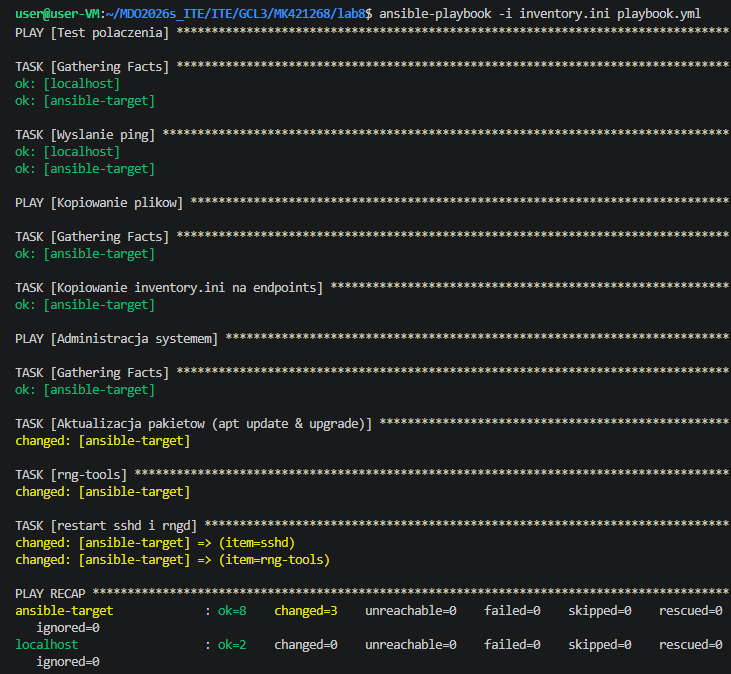

## Zarządzanie stworzonym artefaktem
Ubrano proces wdrażania aplikacji w rolę za pomocą szkieletowania `ansible-galaxy role init`. Wywołano główny playbook wdrożeniowy, który połączył się z maszyną docelową, przeprowadził *sanity check* (sprawdzenie dostępnego miejsca na dysku), zainstalował środowisko Docker, skopiował wygenerowaną w pipeline paczkę z aplikacją, a na koniec uruchomił aplikację w docelowym kontenerze Node.

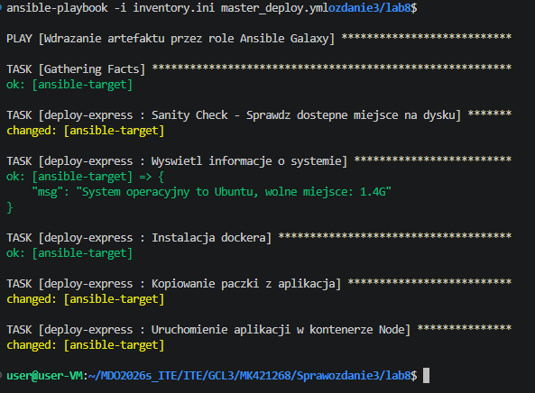

# Lab 9 - Pliki odpowiedzi dla wdrożeń nienadzorowanych

## Ręczna instalacja i pobranie pliku odpowiedzi
Rozpoczęto ręczną instalację systemu Fedora Server w celu wygenerowania wzorcowego pliku odpowiedzi. W graficznym menu instalatora skonfigurowano parametry lokalizacji, źródło instalacji oraz układ partycjonowania.

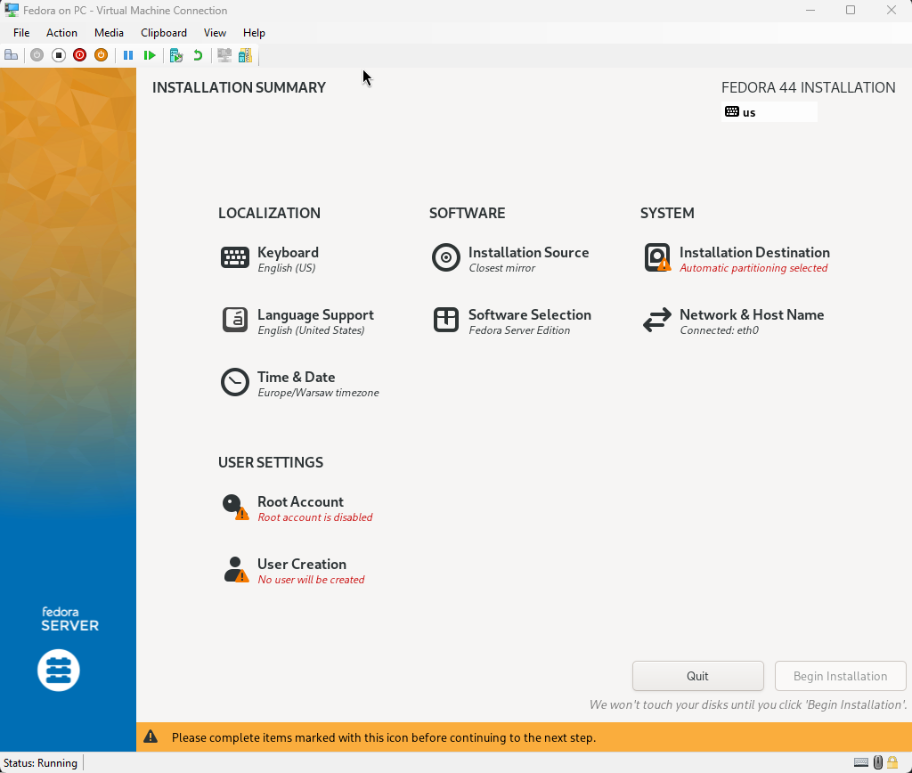

Skonfigurowano konto głównego administratora (root), nadając mu hasło oraz zezwalając na logowanie przez protokół SSH.

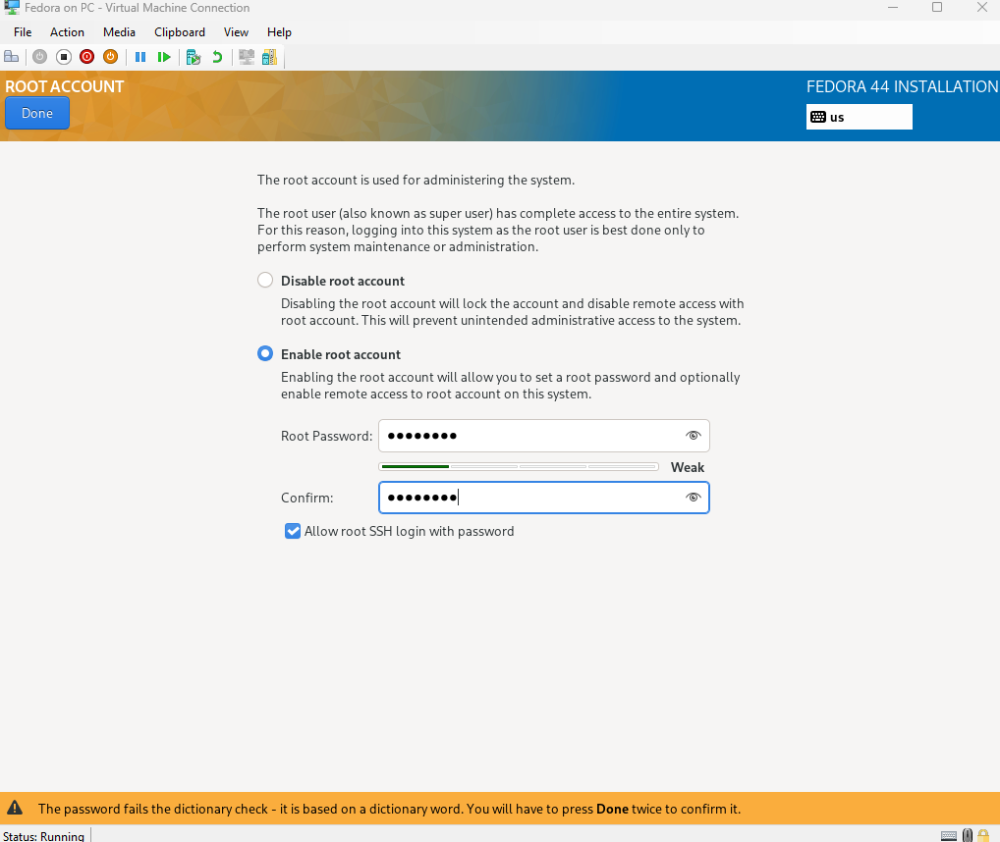

Zgodnie z wymogami ustawienia użytkownika innego niż domyślny `user`, utworzono konto o nazwie `fedora` i przypisano mu uprawnienia administracyjne poprzez dodanie do grupy `wheel`.

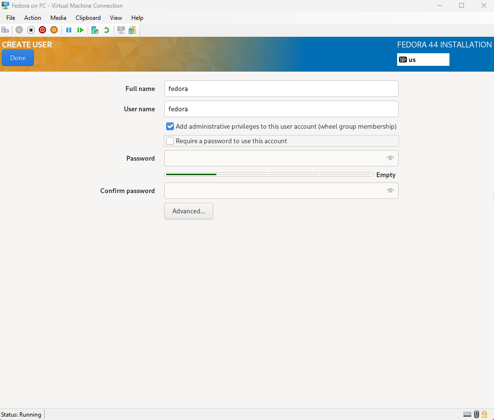

Po zakończeniu instalacji i uruchomieniu systemu, zalogowano się na konto root w celu pozyskania konfiguracji. Za pomocą polecenia `cat` wyświetlono i skopiowano zawartość pliku `/root/anaconda-ks.cfg`, który stanowić będzie bazę do zautomatyzowanej instalacji.

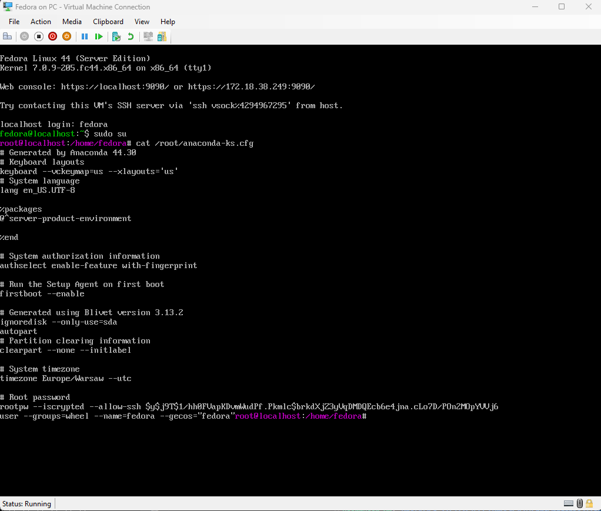

## Modyfikacja i udostępnienie pliku Kickstart
Zmodyfikowano pobrany plik odpowiedzi, upewniając się, że wyczyści on i sformatuje dysk na nowej maszynie. Dodano sekcję `%post`, w której zdefiniowano skrypt służący do automatycznego pobrania i zainstalowania oprogramowania (artefaktu z pipeline'u). Gotowy plik `anaconda.cfg` oraz paczkę `express-5.2.1.tgz` udostępniono w sieci lokalnej przy użyciu serwera HTTP (narzędzie `npx http-server`) działającego na porcie 8080.

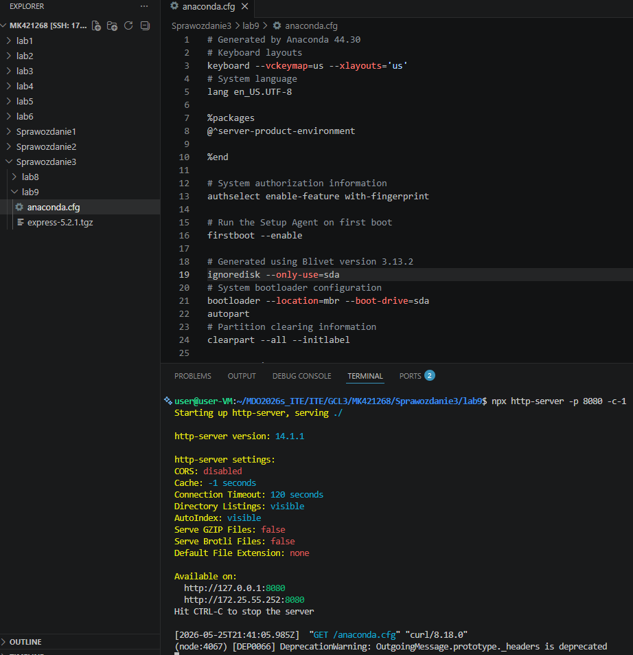

## Instalacja nienadzorowana (Unattended Installation)
Utworzono nową maszynę wirtualną i uruchomiono ją z nośnika instalacyjnego ISO. W menu startowym GRUB przerwano proces uruchamiania i dopisano dyrektywę `inst.ks=http://172.25.55.252:8080/anaconda.cfg_`, wskazującą instalatorowi zlokalizowany w sieci plik odpowiedzi.

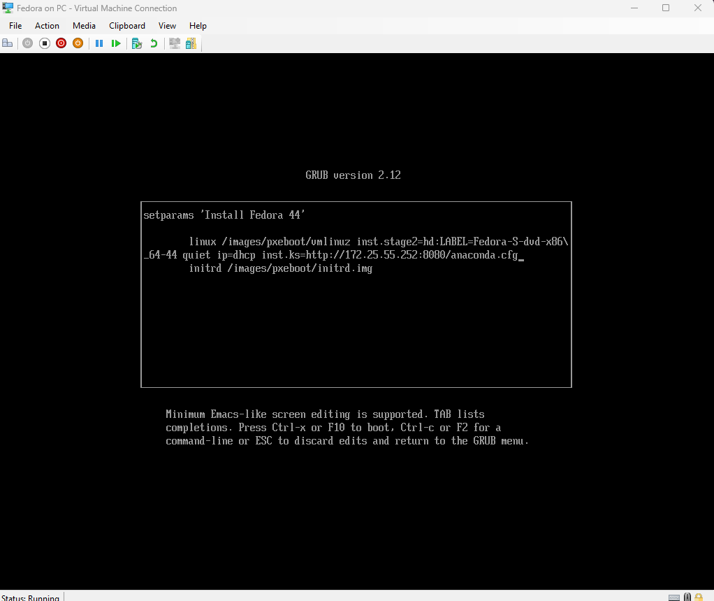

Instalator pobrał konfigurację z serwera HTTP i rozpoczął bezdotykowy proces instalacji. Zgodnie z założeniami pliku odpowiedzi, system skonfigurował wszystkie parametry i wyczyścił nośniki bez zadawania ani jednego pytania w trakcie procesu.

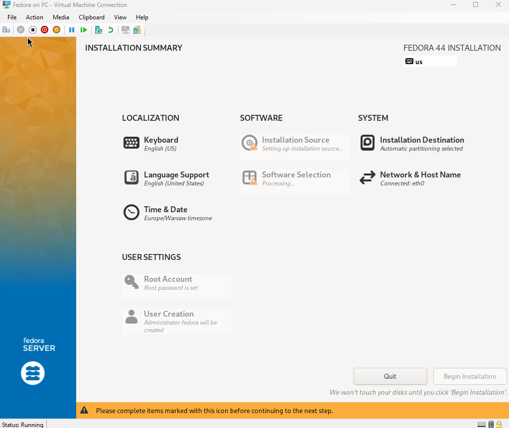

## Wdrożenie oprogramowania i weryfikacja poprawności (Post-Install)
W trakcie finalizowania procesu instalacyjnego wykonano operacje zadeklarowane w sekcji `%post`. System z powodzeniem pobrał paczkę z aplikacją za pomocą narzędzia sieciowego, a następnie zainstalował wymagane łańcuchy dependencji (NPM), co uwidoczniono na ekranie instalatora.

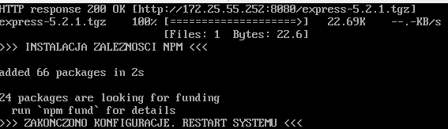

System operacyjny automatycznie zrestartował się na końcu instalacji. Aby aplikacja uruchamiała się sama po włączeniu systemu, skonfigurowano odpowiednią usługę zarządzaną przez systemd. Zweryfikowano działanie maszyny docelowej poleceniem `systemctl status pipeline-app.service`, potwierdzając udane uruchomienie oprogramowania hostującego serwer Express.

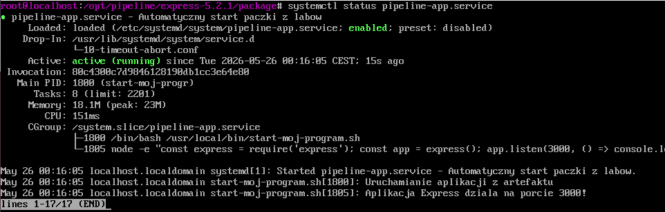

# Lab 10 - Wdrażanie na zarządzalne kontenery: Kubernetes

## Instalacja i konfiguracja klastra Kubernetes
Pobrano i zainstalowano narzędzie `minikube` na maszynie wirtualnej w celu zapewnienia implementacji stosu Kubernetes.

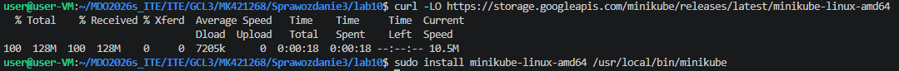

Uruchomiono klaster poleceniem `minikube start`, wymuszając wykorzystanie sterownika Docker oraz przydzielając 2000 MB pamięci RAM i 2 rdzenie procesora.

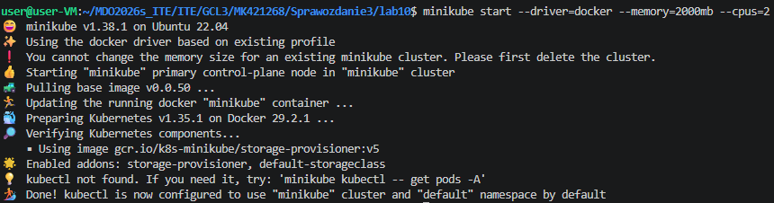

Zweryfikowano poprawne działanie środowiska, sprawdzając status węzła (Ready) dla `control-plane` za pomocą komendy `minikube kubectl get nodes`.

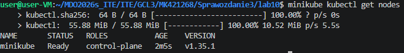

Dla ułatwienia późniejszej pracy, w konfiguracji powłoki utworzono alias przypisujący pełną komendę `minikube kubectl --` pod standardowe narzędzie `kubectl`.

Uruchomiono graficzny interfejs zarządzania klastrem poleceniem `minikube dashboard`. Przedstawiono poprawną łączność, otwierając *Dashboard* w oknie przeglądarki.

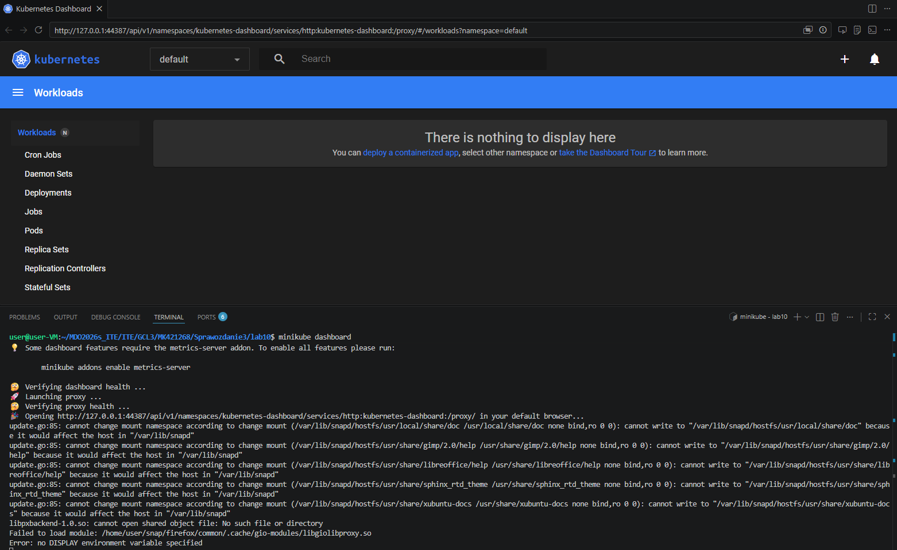

## Przekucie wdrożenia manualnego w plik wdrożenia (Deployment)
Zapisano konfigurację wdrożenia jako plik `deployment.yml`, ustalając etykiety (`labels: app: app`) oraz definiując 4 repliki dla kontenera z aplikacją Express (`app:v1`). Wykonano operację `kubectl apply -f deployment.yml`.

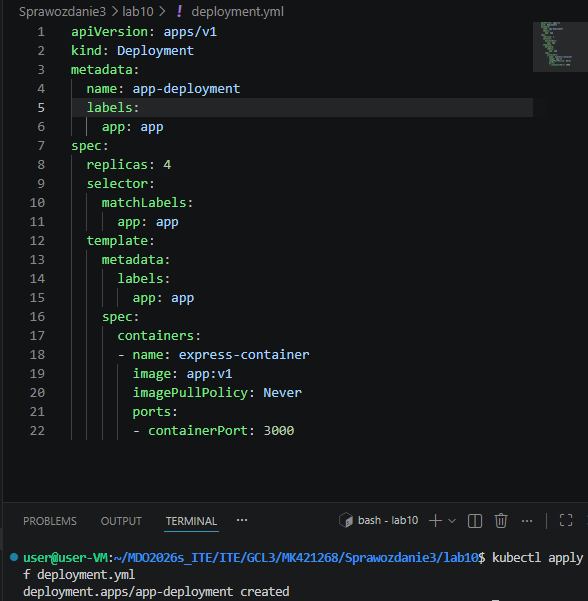

Potwierdzono skuteczne wdrożenie, wywołując polecenie `kubectl get pods`, które zwróciło informacje o 4 pracujących kontenerach ze statusem `Running`.

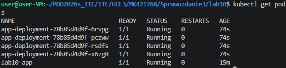

Wyeksponowano funkcjonalność podów poprzez przekierowanie portów na system hosta. Weryfikacja łączności narzędziem `curl` (na port 3333) potwierdziła poprawne generowanie odpowiedzi przez aplikację w wersji `v1`.

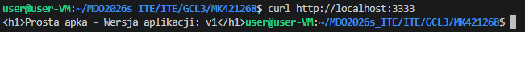

## Skalowanie wdrożenia i zarządzanie obrazami
Przygotowano do testów środowisko upewniając się, że dostępne są co najmniej dwie wersje obrazu własnego z aplikacją (`v1` oraz `v2`), a także jeden obraz celowo uszkodzony (`error`).

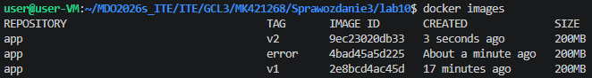

Zaktualizowano plik YAML wdrożenia, zwiększając liczbę replik do 8. Wykonano polecenie `kubectl apply` oraz sprawdzono postęp mechanizmem `kubectl rollout status`, co udowodniło bezproblemowe przeskalowanie w górę.

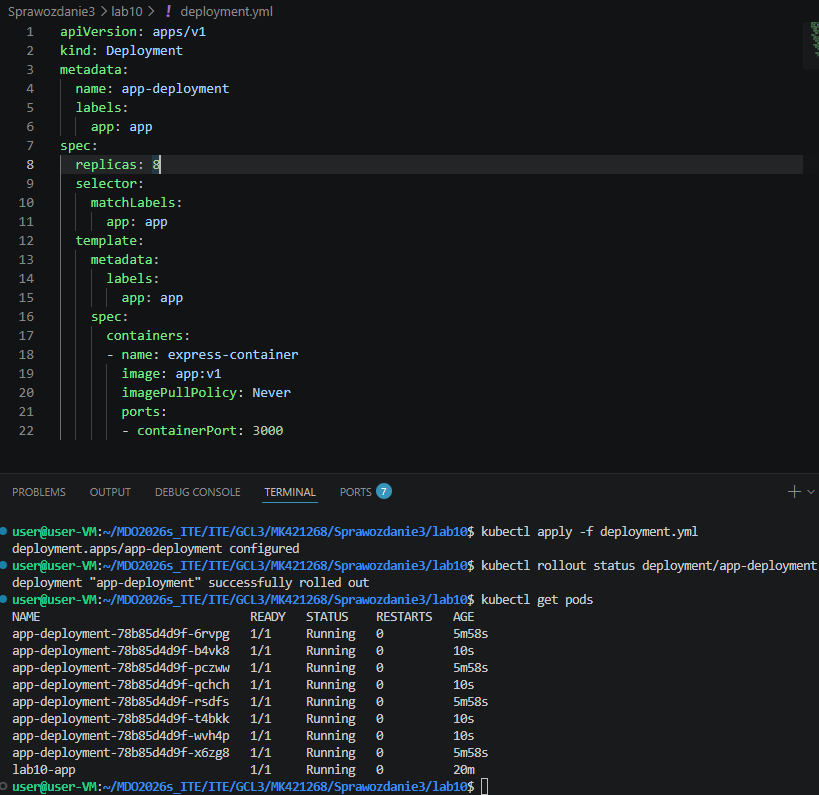

Przeprowadzono operację drastycznego skalowania w dół (Scale-in). W pliku konfiguracyjnym zmniejszono liczbę replik do 1, a następnie wywołano ponowną aplikację konfiguracji. Lista podów potwierdziła przejście nadmiarowych jednostek w tryb `Terminating`.

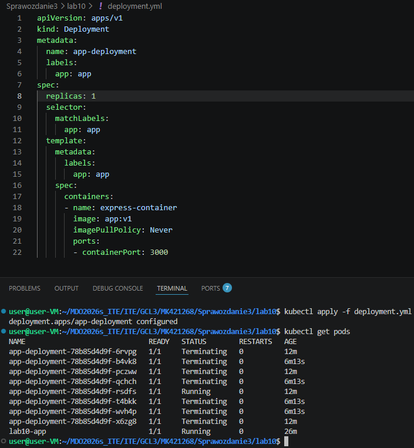

Analogicznie, wykonano próbę zmniejszenia liczby replik do wartości 0. Polecenie wylistowania podów potwierdziło, że wszystkie wystąpienia tej aplikacji zostały skutecznie wygaszone i zatrzymane przez kontroler.

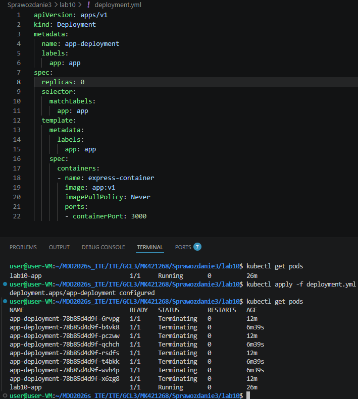

## Zmiany obrazów aplikacji i mechanizmy Rollback
Przywrócono 4 repliki w pliku `deployment.yml` i zaktualizowano obraz na drugą wersję (`app:v2`). Po zastosowaniu zmian ponownie wykonano żądanie `curl`, wykazując na nową strukturę odpowiedzi z kontenera potwierdzającą aktualizację do `v2`.

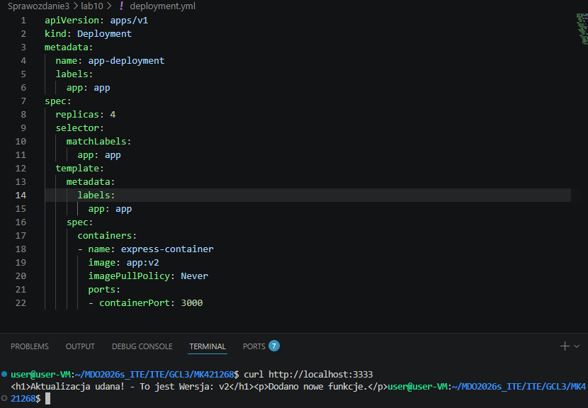

Przetestowano zachowanie klastra po zastosowaniu "wadliwego" obrazu (`app:error`). Próba wdrożenia spowodowała występowanie powtarzających się awarii nowo startowanych kontenerów, co zostało objawione poprzez status `Error` oraz rosnący licznik restartów.

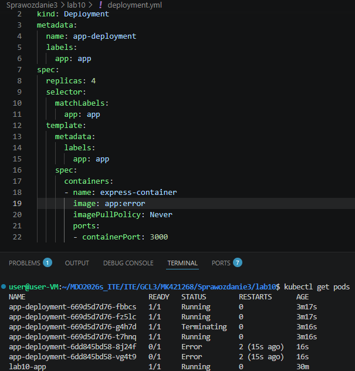

Zastosowano mechanizmy przywracania starszych wersji wdrożeń. Sprawdzono rejestr zmian narzędziem `kubectl rollout history`, a następnie anulowano wadliwe wdrożenie poleceniem `kubectl rollout undo` i wykazano ponowną, bezbłędną pracę 4 podów z poprzednią wersją.

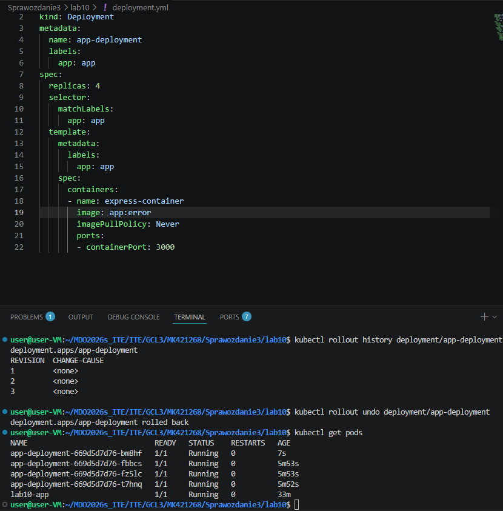

## Kontrola oraz strategie wdrożeń
Napisano i zrealizowano autorski skrypt Bash (`verify.sh`) systematycznie weryfikujący pody, badający m.in., czy wdrożenie zdołało się pomyślnie zrealizować w zadanym przedziale czasowym do 60 sekund.

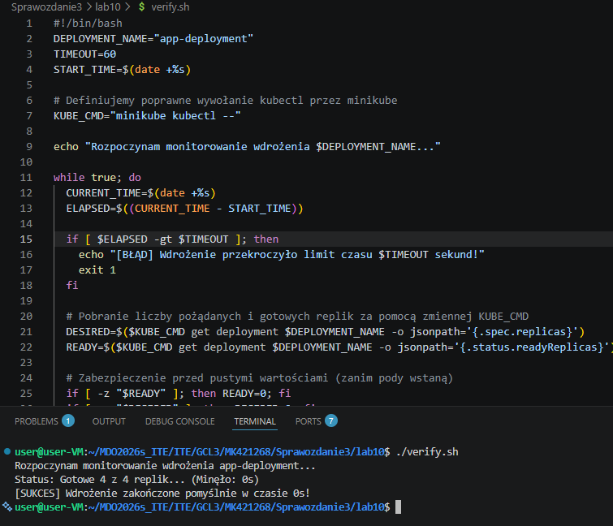

Przygotowano wersje wdrożeń różniące się strategiami. W manifeście dodano sekcję `strategy` o typie `RollingUpdate`, wskazując parametry tolerancji: `maxUnavailable: 2` (maksymalna liczba przerwanych replik) oraz `maxSurge: 25%` (maksymalny naddatek).

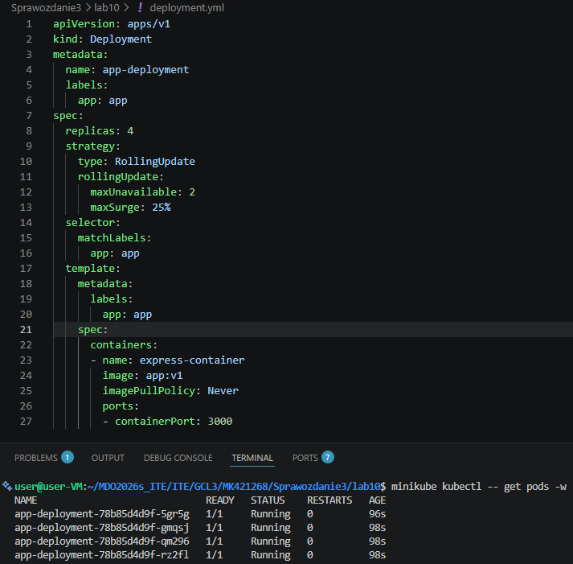

Wdrożono i zaobserwowano na żywo różnice w działaniu. Dla wdrożenia ze strategią `Recreate` (`app-recreate-...`) kontroler uśmierca wszystkie istniejące kontenery przed utworzeniem nowych, natomiast wdrożenie ze strategią `RollingUpdate` dokonuje tego krokowo, zapewniając zerowy czas niedostępności (Zero Downtime).

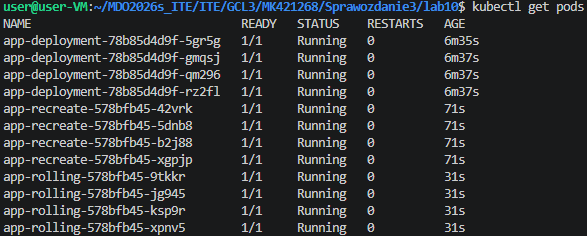

# Lab 11 - Wdrażanie na zarządzalne kontenery: Kubernetes (2)

## Wdrożenie dużej liczby podów
Przygotowano plik YAML definiujący wdrożenie (deployment) z dużą liczbą 36 replik. Wykonano polecenie `kubectl apply -f deployment.yml` i zweryfikowano proces uruchamiania za pomocą `kubectl get pods`, obserwując zmianę statusu z `Pending` poprzez `ContainerCreating` aż na `Running` dla wszystkich powołanych instancji.

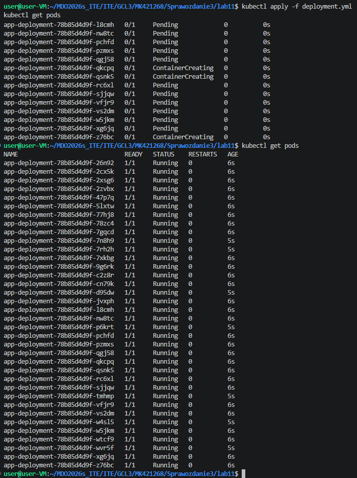

## Eksponowanie dostępu do pojedynczego poda
W celu nawiązania bezpośredniej komunikacji z konkretną instancją aplikacji, wyeksponowano dostęp do pojedynczego poda. Użyto polecenia `kubectl port-forward pod/app-deployment-78b85d4d9f-26n92 8081:3000` i pomyślnie zweryfikowano łączność do serwera WWW z poziomu hosta za pomocą narzędzia `curl`.

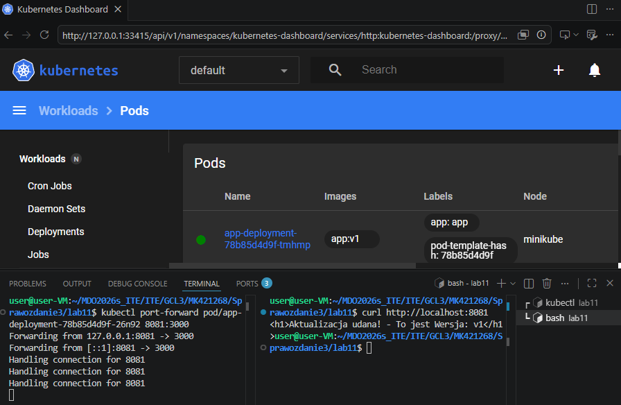

## Eksponowanie dostępu do wdrożenia (Deployment)
Przetestowano eksponowanie ruchu sieciowego na poziomie całego wdrożenia. Za pomocą komendy `kubectl port-forward deployment/app-deployment 8082:3000` przekierowano port z lokalnego interfejsu wprost na rozproszone pody należące do tego deploymentu, uzyskując prawidłową odpowiedź HTTP.

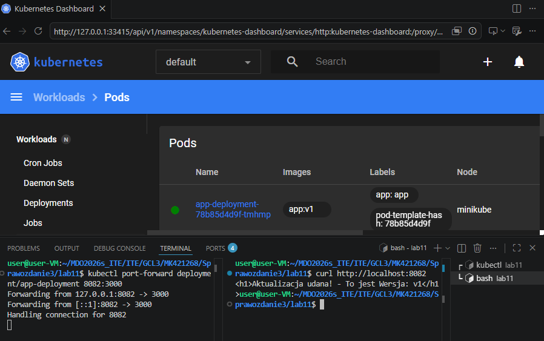

## Eksponowanie za pomocą serwisu (dedykowane polecenie)
Utworzono logiczny punkt dostępowy (Service) dla wdrożenia przy użyciu dedykowanego polecenia `kubectl expose deployment app-deployment --type=NodePort --port=3000 --name=app-service`. Następnie przekierowano ruch sieciowy na utworzony serwis, podając jego nazwę `service/app-service`, co pozwoliło na skuteczną komunikację w przeglądarce i konsoli.

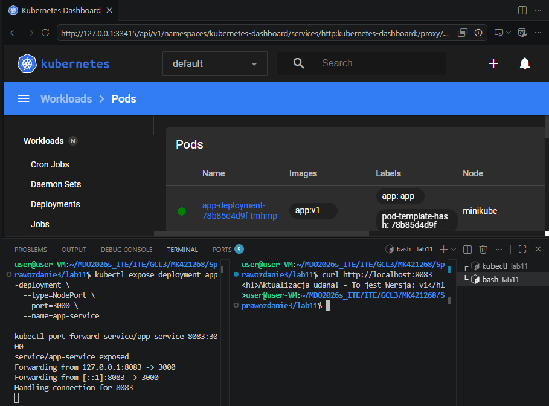

## Eksponowanie za pomocą serwisu (dodatkowy plik YAML)
Zrealizowano alternatywną metodę tworzenia serwisu o typie `NodePort`, wykorzystując definicję zadeklarowaną jako kod w dodatkowym pliku `service.yml`. Aplikacja konfiguracji (`kubectl apply -f service.yml`) ujednoliciła stan klastra z plikiem, co ponownie pomyślnie zweryfikowano poprzez port-forwarding na porcie 8083.

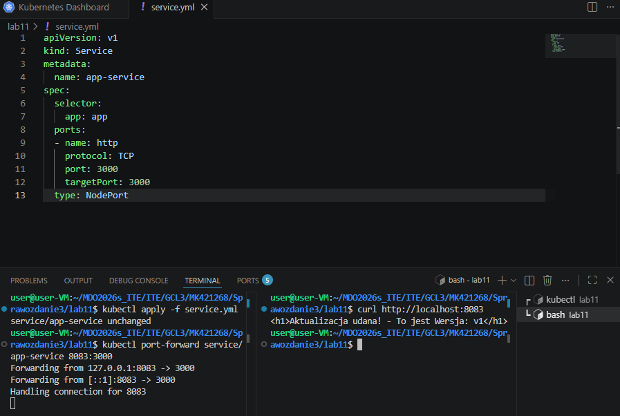

## Skalowanie wdrożenia za pomocą dyrektywy scale
Przeskalowano istniejące wdrożenie w dół za pomocą dyrektywy z wiersza poleceń `kubectl scale deployment/app-deployment --replicas=10`. Odpytanie klastra o status podów wykazało natychmiastowe przejście 26 nadmiarowych replik w stan `Terminating`, docelowo pozostawiając dokładnie 10 działających instancji.

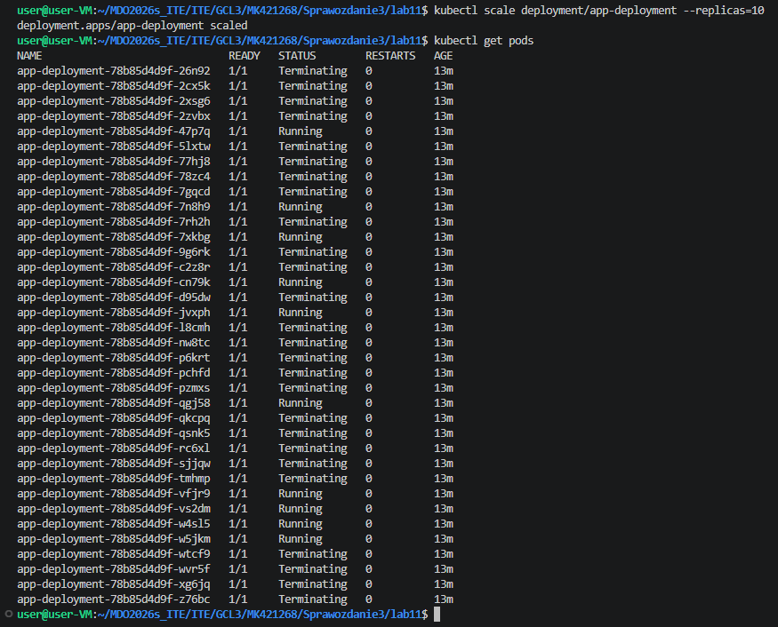

## Skalowanie wdrożenia za pomocą nowego pliku YAML
Dokonano kolejnego przeskalowania architektury, tym razem deklaratywnie, aplikując nowy, zmodyfikowany plik konfiguracyjny `deployment-scaled.yml`. Polecenie `kubectl apply` zaktualizowało wdrożenie do nowej liczby replik (widoczne 5 pracujących), co udowadnia, że klaster Kubernetes automatycznie dostosowuje stan zasobów do zaaplikowanego na nowo kodu infrastruktury.

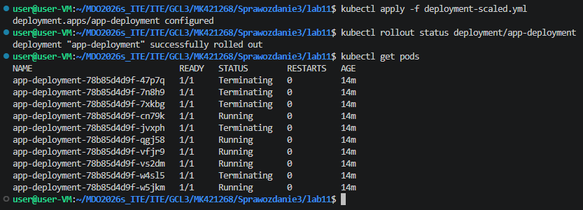