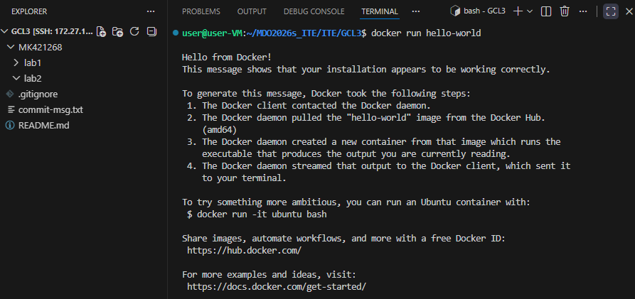
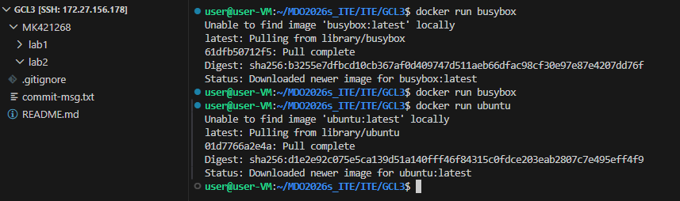
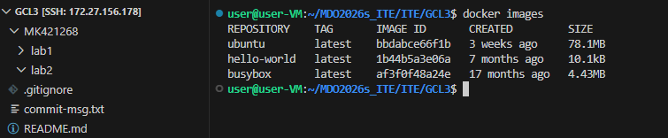
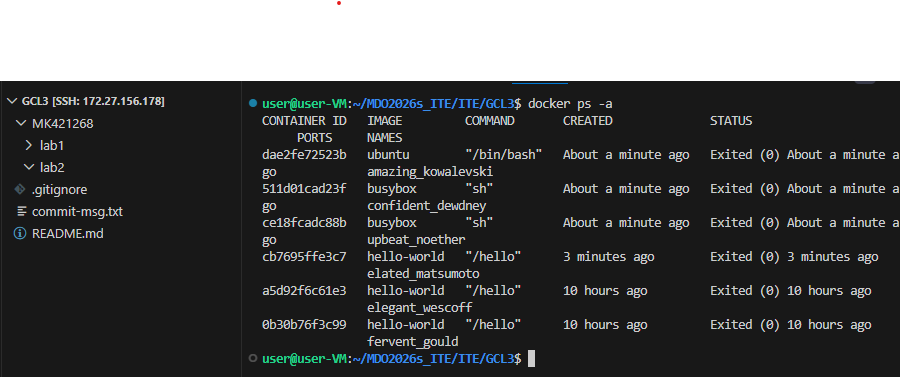
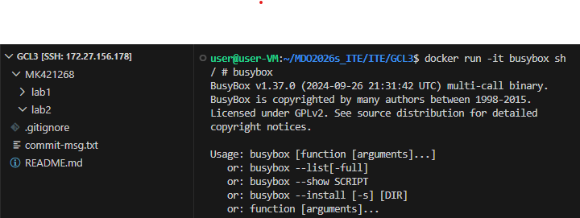
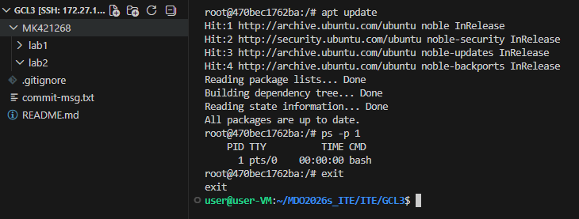
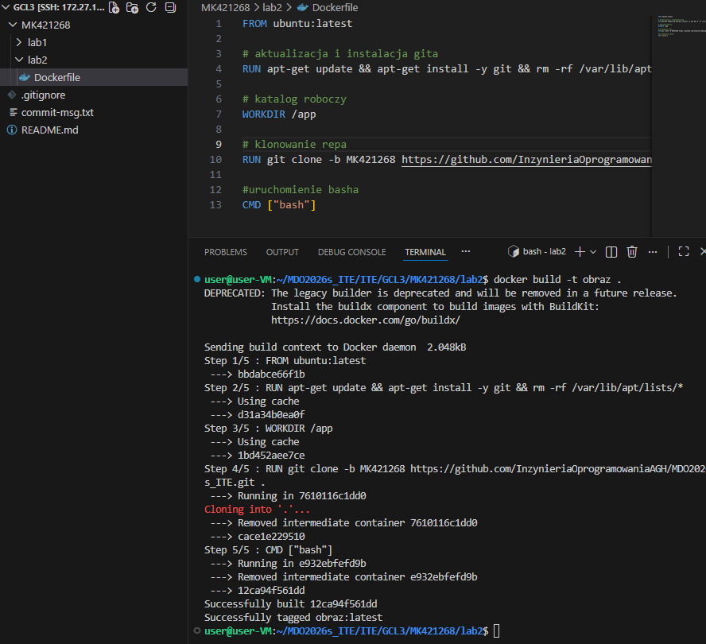
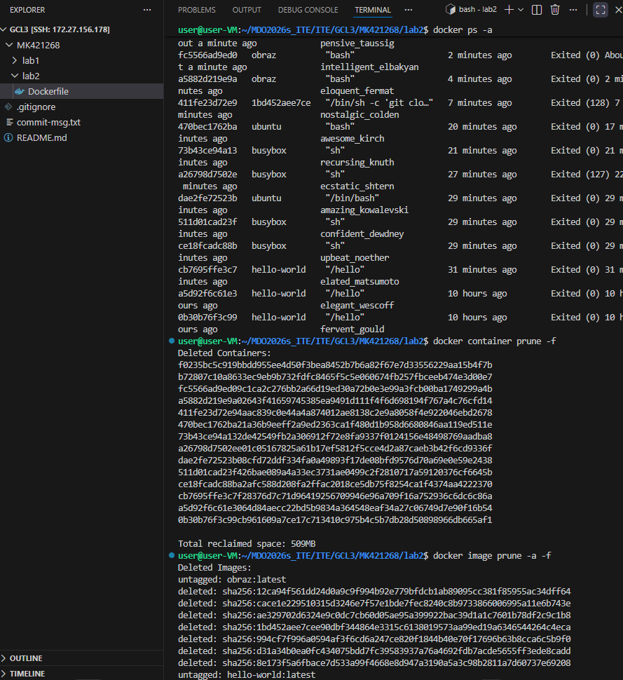

# DOCKER

Uruchomienie obrazu hello-world

Uruchomienie busybox i ubuntu

Sprawdzenie ich rozmiarów oraz kodu wyjścia

Polaczenie sie do kontenera interaktywnie z obrazu busybox

Uruchomienie kontenera z obrazu ubuntu (PID1 info i zaktualizowanie)

Utworzenie Dockerfile oraz zbudowanie własnego obrazu

Uruchomione kontenery oraz ich czyszczenie za pomocą instrukcji prune

