# Zachowywanie stanu miedzy kontenerami

Utworzono 2 woluminy 
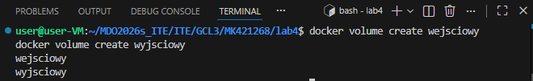

Wykorzystanie tymczasowego kontenera pomocniczego
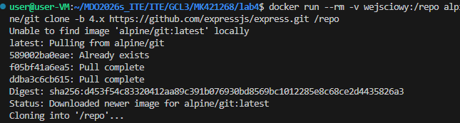

Uruchomienie procesu budowania aplikacji w kontenerze bazowym z systemem Node.js
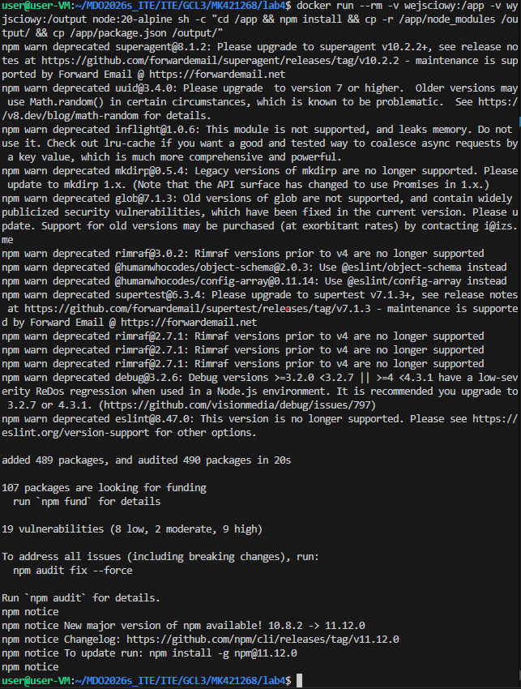

Podejście alternatywne: instalacja narzędzia Git "w locie" wewnątrz kontenera bazowego, a następnie pobranie repozytorium i budowanie projektu w ramach jednego procesu.
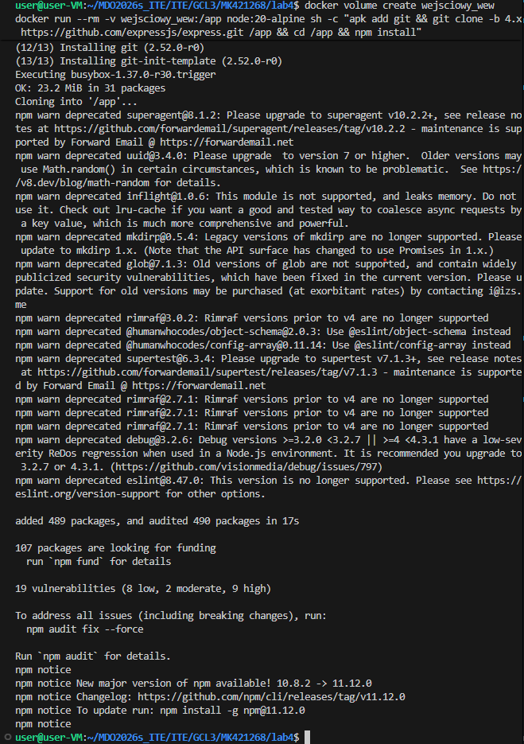

Pomyślne zakończenie procesu budowania aplikacji.
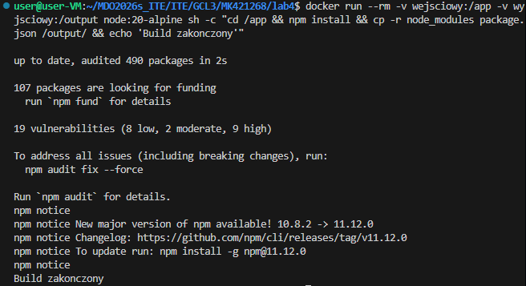

Weryfikacja zawartości woluminu wyjściowego.
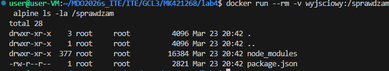

Testowanie komunikacji w domyślnej sieci Dockera.
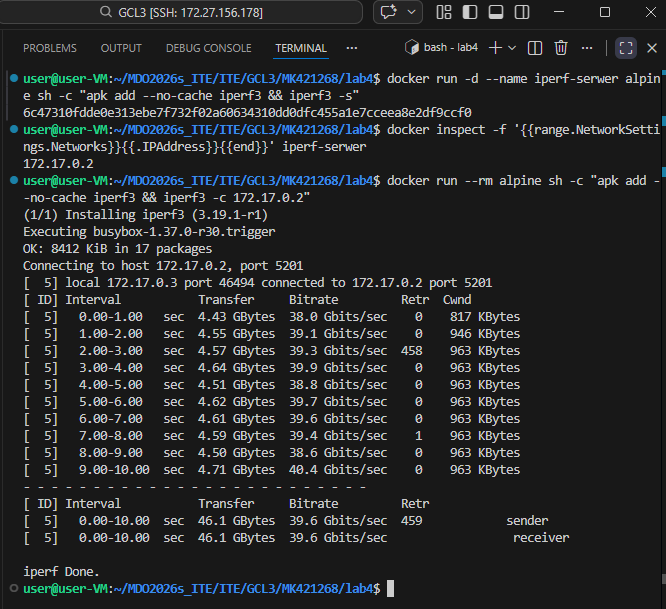

Testowanie komunikacji we własnej sieci mostkowej (Custom Bridge)
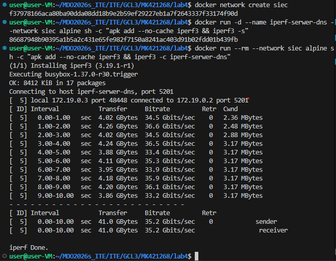

Eksponowanie portów na zewnątrz.
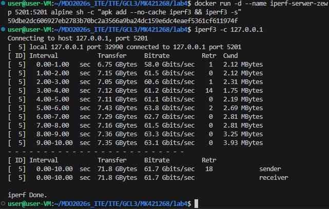

Konfiguracja usługi SSH w kontenerze.
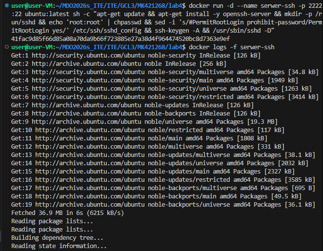

Zalogowanie sie do kontenera z usługą SSH.
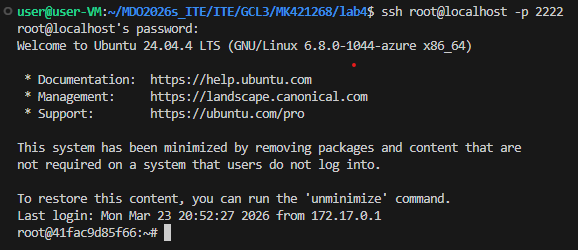

Przygotowanie i uruchomienie infrastruktury Jenkinsa za pomocą narzędzia Docker Compose.
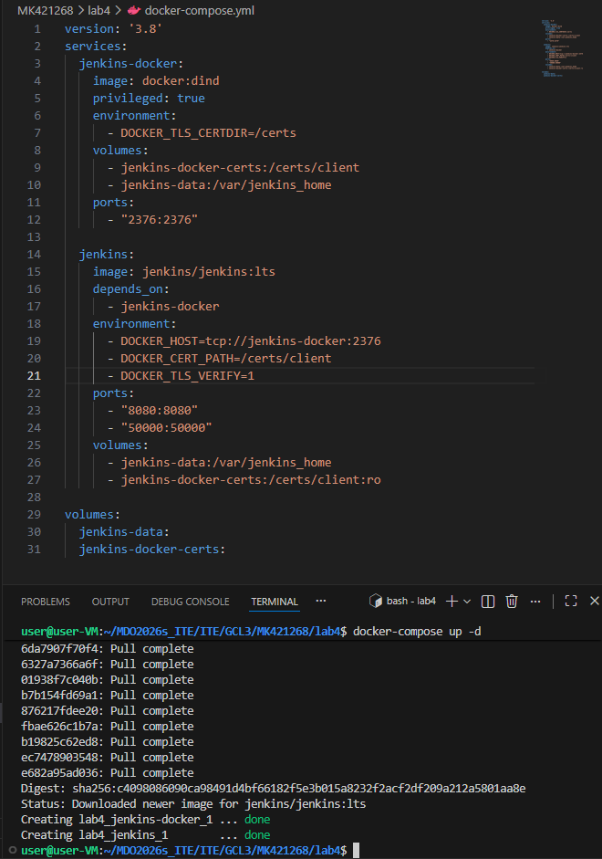

Weryfikacja działających usług.
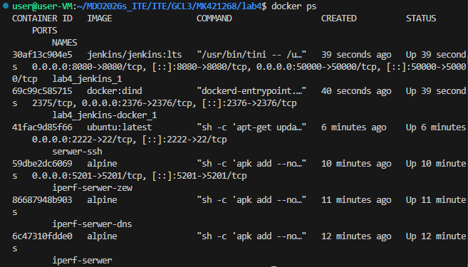

Odczytanie logów startowych kontenera Jenkinsa
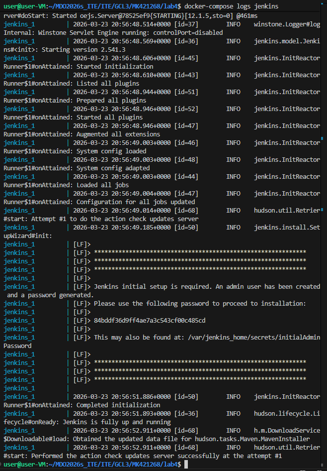

Ekran powitalny i kreator konfiguracji początkowej Jenkinsa w przeglądarce internetowej.
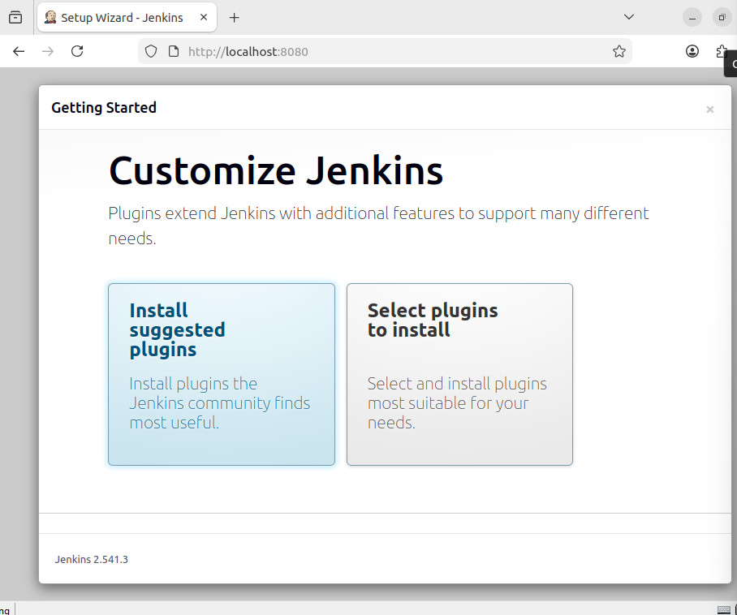
