## 1. Wymagania wstępne środowiska

Aby zaprezentowany proces ciągłej integracji i wdrażania (CI/CD) mógł zostać pomyślnie wykonany, wymagane są następujące elementy:

* Działająca instancja serwera ciągłej integracji (Jenkins) uruchomiona jako kontener Docker.
* Skonfigurowane i połączone środowisko zagnieżdżone Docker-in-Docker (DinD), pozwalające Jenkinsowi na bezpieczne budowanie obrazów, tworzenie wyizolowanych sieci oraz uruchamianie testów w locie.
* Sforkowane repozytorium z kodem źródłowym aplikacji (np. z modyfikacją frameworka Express.js pod kątem walidacji) wraz z odpowiednio zdefiniowanymi plikami konfiguracyjnymi: `Dockerfile.build`, `Dockerfile.test` oraz głównym `Jenkinsfile`.
* Dostęp do zewnętrznego rejestru obrazów lub wewnętrznego mechanizmu archiwizacji artefaktów (dla plików `.tgz`).

---

## 2. Diagram aktywności (Proces CI)

Diagram przedstawia przepływ zadań w pipeline, ze szczególnym uwzględnieniem izolacji środowiska testowego.

```mermaid
stateDiagram-v2
    direction TB

    [*] --> Stage_Build
    
    state Stage_Build {
        [*] --> Docker_Build_NoCache
        Docker_Build_NoCache --> express_build_image
    }

    Stage_Build --> Stage_Test

    state Stage_Test {
        [*] --> Build_Test_Image
        Build_Test_Image --> Run_npm_test : docker run --rm
    }

    Stage_Test --> Stage_Validation

    state Stage_Validation {
        [*] --> Create_Docker_Network
        Create_Docker_Network --> Start_c_deploy : (Uruchomienie aplikacji: c_deploy)
        Start_c_deploy --> Start_c_curl : (Uruchomienie testera: c_curl)
        
        state Start_c_curl {
            [*] --> Fetch_JSON : GET /advanced
            Fetch_JSON --> Validate_Conditions : Check HTTP 200, status, app, ver, metrics
            Validate_Conditions --> Write_Report : Zapisz status do test_report.txt (RC=0 lub 1)
        }
        
        Start_c_curl --> Cleanup : docker stop & network rm
    }

    Stage_Validation --> Stage_Publish

    state Stage_Publish {
        [*] --> Artifact_Packaging : Uruchom kontener i wykonaj 'npm pack'
        Artifact_Packaging --> Extract_TGZ : Przenieś *.tgz do /out/
    }

    Stage_Publish --> Post_Processing
    
    state Post_Processing {
        [*] --> Archive_Artifacts : Zapisz test_report.txt oraz *.tgz
    }
    
    Post_Processing --> [*]
```



## 3. Diagram wdrożeniowy (Validation & Deploy Stage)
```mermaid
graph TD
    subgraph Jenkins_Pipeline ["Proces CI/CD na serwerze Jenkins"]
        
        subgraph Stage_Validation ["Etap Walidacji"]
            subgraph Isolated_Network ["Izolowana sieć: pipeline-net"]
                C_CURL["<b>c_curl</b><br/>(Narzędzie testujące)"]
                C_DEPLOY["<b>c_deploy</b><br/>(Aplikacja Node.js port 3000)"]
            end
            
            C_CURL -- "1. Pobiera dane (HTTP GET /advanced)" --> C_DEPLOY
            C_DEPLOY -- "2. Zwraca dane JSON" --> C_CURL
            
            C_CURL -- "3. Wykonuje testy (jq)" --> CHECK_RESULT{"Czy walidacja<br/>zakończona sukcesem?"}
        end

        subgraph Stage_Publish ["Etap Publikacji"]
            C_PACKER["<b>Kontener pakujący</b><br/>(Obraz bazowy)"]
        end
        
        %% Logika przejścia
        CHECK_RESULT -- "TAK (Exit Code: 0)" --> C_PACKER
        CHECK_RESULT -. "NIE (Exit Code: 1)" .-> PIPELINE_FAIL(("Przerwanie<br/>Pipeline'u"))

        subgraph Workspace ["Przestrzeń robocza na hoście"]
            VOL[("Wolumen zmapowany do kontenerów")]
            REP["test_report.txt"]
            TGZ["*.tgz"]
        end

        %% Zapis wyników
        C_CURL -- "4a. Zapisuje raport" --> REP
        C_PACKER -- "4b. Generuje paczkę (npm pack)" --> TGZ
        
        REP -.-> VOL
        TGZ -.-> VOL

        subgraph Post_Processing ["Akcja końcowa"]
            ARCHIVE["Magazyn Artefaktów Jenkins<br/>(archiveArtifacts)"]
        end

        %% Archiwizacja
        VOL -- "5. Pobranie plików po zakończeniu zadań" --> ARCHIVE
    end

    %% Definicje stylów wizualnych
    style C_DEPLOY fill:#e1f5fe,stroke:#03a9f4,stroke-width:2px
    style C_CURL fill:#f1f8e9,stroke:#8bc34a,stroke-width:2px
    style C_PACKER fill:#fff3e0,stroke:#ff9800,stroke-width:2px
    style Isolated_Network stroke-dasharray: 5 5,stroke:#ab47bc,fill:none
    style VOL fill:#eceff1,stroke:#607d8b
    style CHECK_RESULT fill:#f3e5f5,stroke:#8e24aa,stroke-width:2px