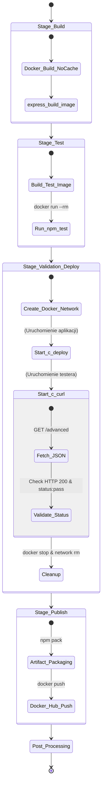

## 1. Wymagania wstępne środowiska

Aby zaprezentowany proces ciągłej integracji i wdrażania (CI/CD) mógł zostać pomyślnie wykonany, wymagane są następujące elementy:

* Działająca instancja serwera ciągłej integracji (Jenkins) uruchomiona jako kontener Docker.
* Skonfigurowane i połączone środowisko zagnieżdżone Docker-in-Docker (DinD), pozwalające Jenkinsowi na bezpieczne budowanie obrazów, tworzenie wyizolowanych sieci oraz uruchamianie testów w locie.
* Sforkowane repozytorium z kodem źródłowym aplikacji (np. z modyfikacją frameworka Express.js pod kątem walidacji) wraz z odpowiednio zdefiniowanymi plikami konfiguracyjnymi: `Dockerfile.build`, `Dockerfile.test` oraz głównym `Jenkinsfile`.
* Dostęp do zewnętrznego rejestru obrazów lub wewnętrznego mechanizmu archiwizacji artefaktów (dla plików `.tgz`).

---

## 2. Diagram aktywności (Proces CI)

Diagram przedstawia przepływ zadań w pipeline, ze szczególnym uwzględnieniem izolacji środowiska testowego.



## 3. Diagram wdrożeniowy (Validation & Deploy Stage)
```mermaid
graph TB
    subgraph Jenkins_Host [Serwer Jenkins]
        subgraph Docker_Engine [Docker Engine]
            
            subgraph Isolated_Network [Docker Network: pipeline-net-ID]
                C_DEPLOY[<b>c_deploy</b><br/>Port: 3000<br/>Image: express-build-image]
                C_CURL[<b>c_curl</b><br/>Tool: curl + jq<br/>Image: alpine]
            end

            C_CURL -- "HTTP GET /advanced" --> C_DEPLOY
            
            VOL[(Workspace Volume)]
            C_CURL -- "Write test_report.txt" --> VOL
        end
    end

    subgraph External_Registry [Docker Hub]
        REG[Repository: express-app]
    end

    Docker_Engine -- "docker push" --> REG
    
    subgraph Artifact_Storage [Jenkins Artifacts]
        TGZ[package.tgz]
        REP[test_report.txt]
    end

    VOL -- "archiveArtifacts" --> Artifact_Storage

    style C_DEPLOY fill:#f9f,stroke:#333,stroke-width:2px
    style C_CURL fill:#ccf,stroke:#333,stroke-width:2px
    style Isolated_Network stroke-dasharray: 5 5