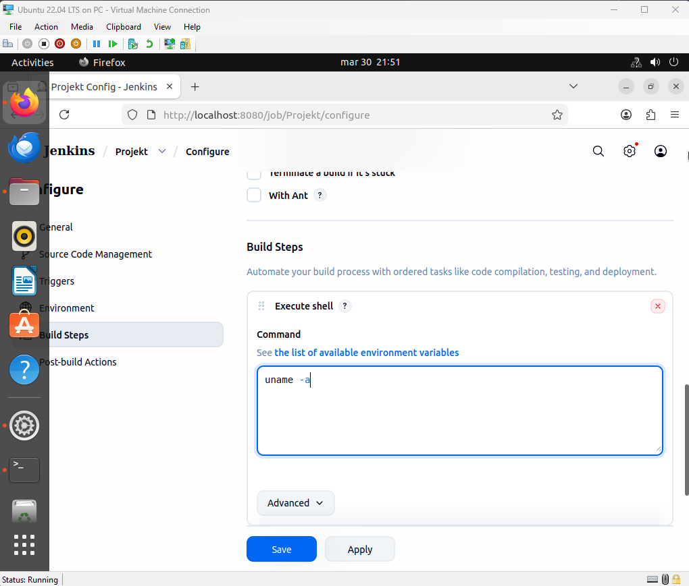
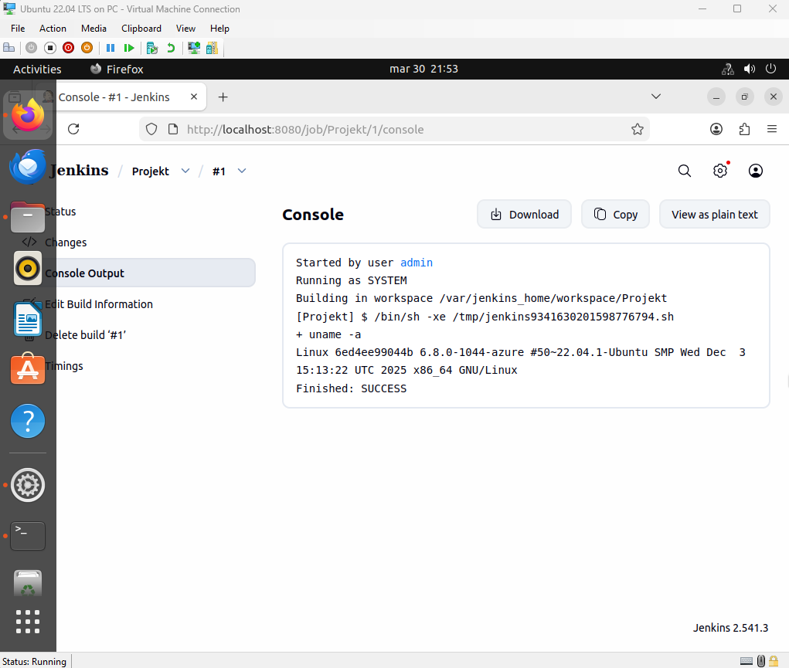
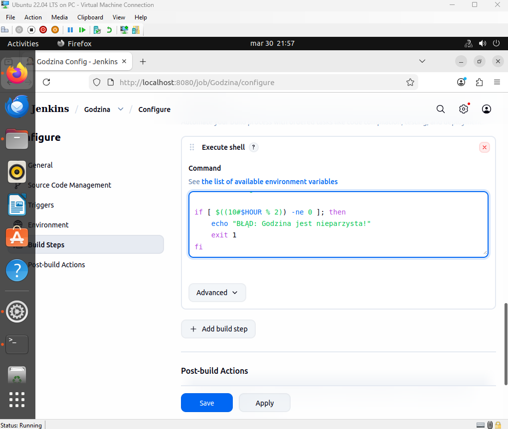

# JENKINS

Uruchomienie Jenkinsa i Blue Ocean za pomocą Docker Compose.

Skonfigurowanie projektu wykonującego polecenie uname -a.

Skonfigurowanie projektu zwracającego błąd przy nieparzystej godzinie.

Utworzenie projektu pobierającego obraz ubuntu.

Weryfikacja logów po poprawnym pobraniu obrazu ubuntu.

Zdefiniowanie bezpośredniego skryptu pipeline pobierającego kod i budującego Dockerfile.

Potwierdzenie wykonania etapów obiektu pipeline.

