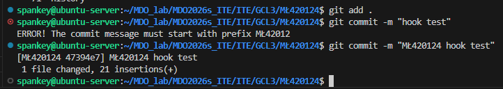
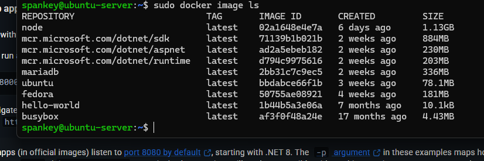
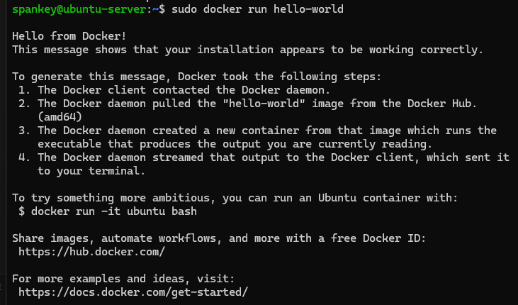
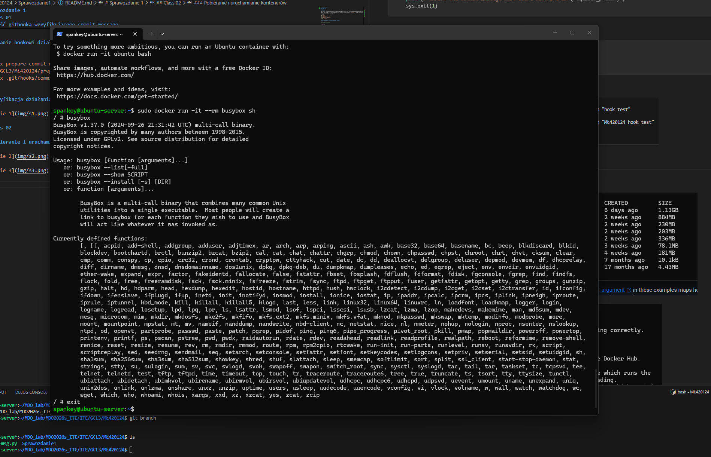
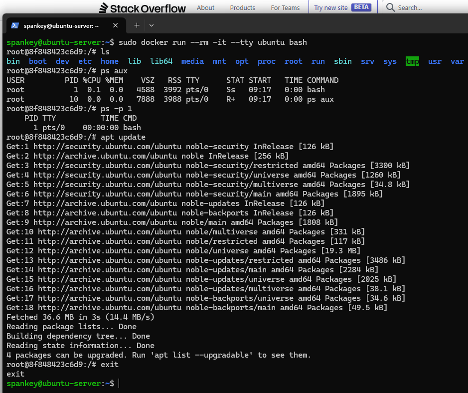

# Sprawozdanie 1

## Class 01

### Wstęp

Na wstępie sklonowanao repozytorium przedmiotu. Przełączono się na gałąź grupy, następnie do odpowiedniego kalaogu, gdzie stworzono gałąź o nazwie składającej się z inicjałów i numeru indeksu: ```MŁ420124```. Na gałęźi stworzono katalog odpowiadający nazwie gałęzi.

```bash
git fetch 
git checkout GLC3
cd ITE/GLC3
git checkout -b MŁ420124
mkdir MŁ420124
```

### Treść githooka weryfikującego commit message

```python
#!/usr/bin/env python3

import sys

commit_msg_filepath = sys.argv[1]
required_prefix = 'MŁ42012'

with open(commit_msg_filepath, 'r') as f:
    content = f.readline().strip()

if not content.startswith(required_prefix):
    print(f"ERROR! The commit message must start with prefix {required_prefix}")
    sys.exit(1)
```

### Nadanie hookowi działania

```bash
chmod +x prepare-commit-msg.py
cp ITE/GCL3/MŁ420124/prepare-commit-msg.py .git/hooks/commit-msg
chmod +x .git/hooks/commit-msg
```

### Weryfikacja działania hooka



## Class 02

### Pobieranie i uruchamianie kontenerów







