# Sprawozdanie 1

## Class 01

### Wstęp

`Git` to darmowy i otwarty rozproszony system kontroli wersji, zaprojektowany z myślą o szybkim i wydajnym zarządzaniu projektami od małych do bardzo dużych. Jednym z narzędzi Gita jest gałąź (branch). `Branch` jest przestrzenią roboczą, w której możesz wprowadzać zmiany i testować nowe pomysły bez wpływu na projekt główny. 

Na wstępie sklonowane zostało repozytorium przedmiotu. Przełączono się na gałąź grupy, następnie do odpowiedniego kalaogu, gdzie stworzono gałąź o nazwie składającej się z inicjałów i numeru indeksu: `MŁ420124`. Na gałęźi stworzono katalog odpowiadający nazwie gałęzi.

```bash
git fetch 
git checkout GLC3
cd ITE/GLC3
git checkout -b MŁ420124
mkdir MŁ420124
```

### Treść githooka weryfikującego commit message

`Git` umożliwia uruchamianie niestandardowych skryptów w przypadku wystąpienia określonych ważnych działań. Istnieją dwie grupy Hooków: po stronie klienta i po stronie serwera. `Hooki` po stronie klienta są aktywowane przez operacje takie jak zatwierdzanie i scalanie, natomiast Hooki po stronie serwera działają w przypadku operacji sieciowych, takich jak odbieranie przesłanych zatwierdzeń.

```python
#!/usr/bin/env python3

import sys

commit_msg_filepath = sys.argv[1]
required_prefix = 'MŁ42012'

with open(commit_msg_filepath, 'r') as f:
    content = f.readline().strip()

if not content.startswith(required_prefix):
    print(f"ERROR! The commit message must start with prefix {required_prefix}")
    sys.exit(1)
```

### Nadanie hookowi działania

```bash
chmod +x prepare-commit-msg.py
cp ITE/GCL3/MŁ420124/prepare-commit-msg.py .git/hooks/commit-msg
chmod +x .git/hooks/commit-msg
```

### Weryfikacja działania hooka

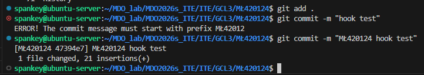

## Class 02

`Docker` to platforma zaprojektowana w celu upraszczania procesu tworzenia, dostarczania i uruchamiania aplikacji. Usprawnia dostarczanie oprogramowania poprzez konteneryzację, czyli technologię pakującą aplikację bądź jej zależności w odizolowane, uruchamialne jednostki zwane kontenerami. Rozwiązuje to problem polegający na tym, że gdy jedna z aplikacji przestanie działać, nie „zaraża” ona innych aplikacji. Jednocześnie redukuje koszty związane z izolacją, ponieważ eliminuje konieczność ponoszenia pełnego narzutu zasobów charakterystycznego dla pojedynczych maszyn wirtualnych (jądro, sterowniki, programy i aplikacje).

Obray kontenera to pakiery zawierające wszystkie pliki, pliki binarne, biblioteki oraz konfiguracje do uruchomienia kontenera. Obrazy kontenerów składają się z warstw: każda warstwa reprezentuje zestaw zmian systemu plików. Obrazy do uruchomienia lokalnie można znaleźć na Docker Hub.

### Pobieranie i uruchamianie obrazów

W celu uruchomienia aplikacji w Dockerze najpierw pobierany jest odpowiedni obraz przy użyciu polecenia `docker pull`. Na podstawie pobranego obrazu tworzony i uruchamiany jest kontener za pomocą polecenia ```docker run```.

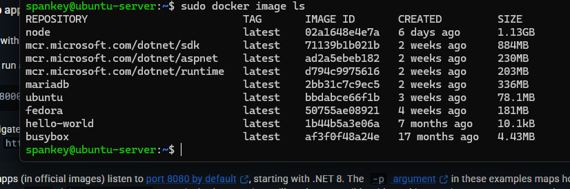

### Przykładowy wynik uruchomienia obrazu `hello-world`

Polecenie `docker run hello-world` powoduje utworzenie oraz uruchomienie kontenera na podstawie obrazu `hello-world`.

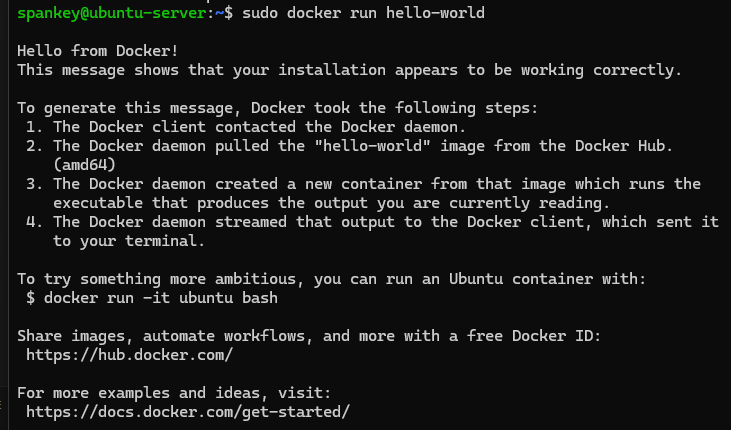

### Uruchomienie kontenera z obrazu `busybox` oraz wywołanie numeru sesji

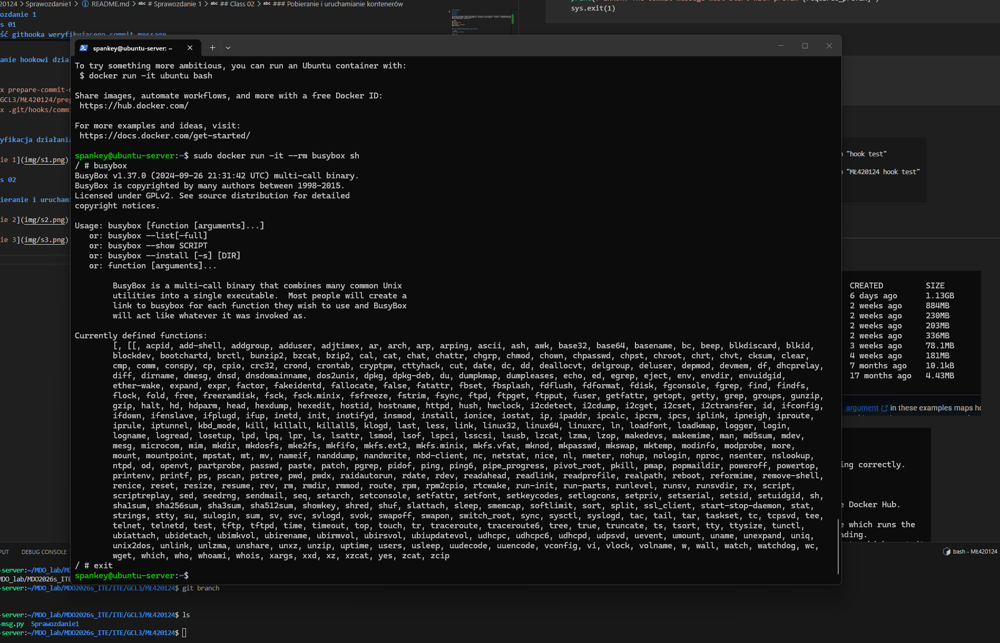

### Uruchomienie systemu w kontenerze

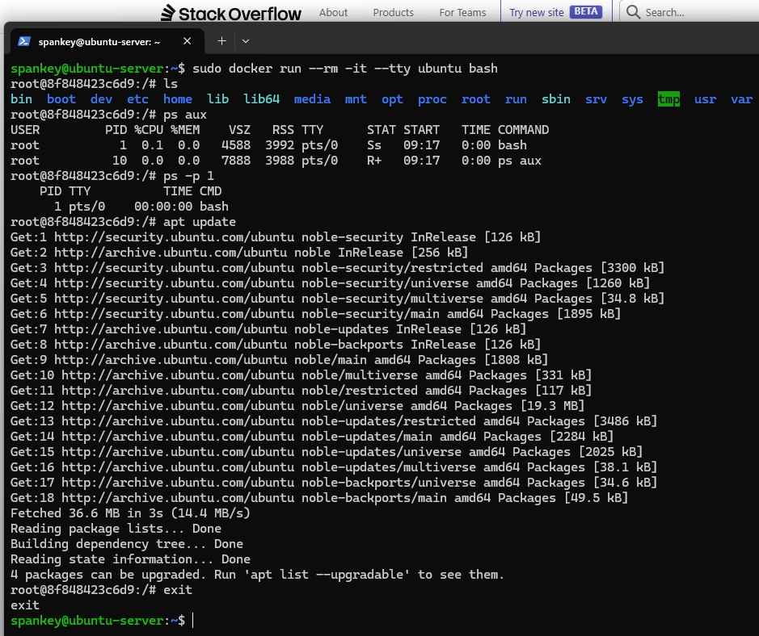

### Stworzenie i uruchomienie pliku `Dockerfile` klonującego repozytorium przedmiotowe

Docker umożliwia uruchomienie pełnego środowiska systemowego wewnątrz kontenera na podstawie wybranego obrazu systemowego. Dzięki temu użytkownik może pracować w odizolowanym środowisku przypominającym standardową powłokę systemu operacyjnego. `Dockerfile` to dokument tekstowy zawierający wszystkie polecenia, które użytkownik może wywołać w wierszu poleceń, aby utworzyć obraz.

```dockerfile
FROM ubuntu:22.04

RUN apt update && \
    apt install -y git && \
    rm -rf /var/lib/apt/lists/*

WORKDIR /repo_dir

RUN git clone https://github.com/InzynieriaOprogramowaniaAGH/MDO2026s_ITE.git

CMD ["bash"]
```

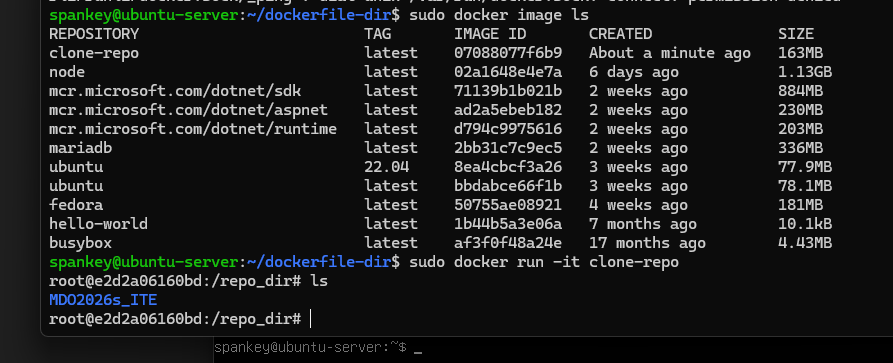

### Lista uruchomionych kontenerów

Docker umożliwia wyświetlenie listy aktualnie działających kontenerów za pomocą polecenia: `docker ps -a`. Informacje wyświetlane w terminalu zawierają między innymi informacje o: identyfikatorze kontenera, użytym obrazie, czasie działania oraz przypisanym portom.

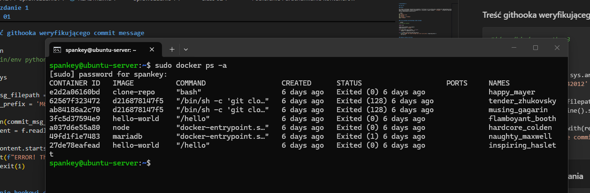

### Wyczyszczenie wszystkich obrazów, które nie są używane przez kontenery

W celu zwolnienia przestrzeni dyskowej możliwe jest usunięcie nieużywanych obrazów Docker. Polecenie: `docker image prune -a`.

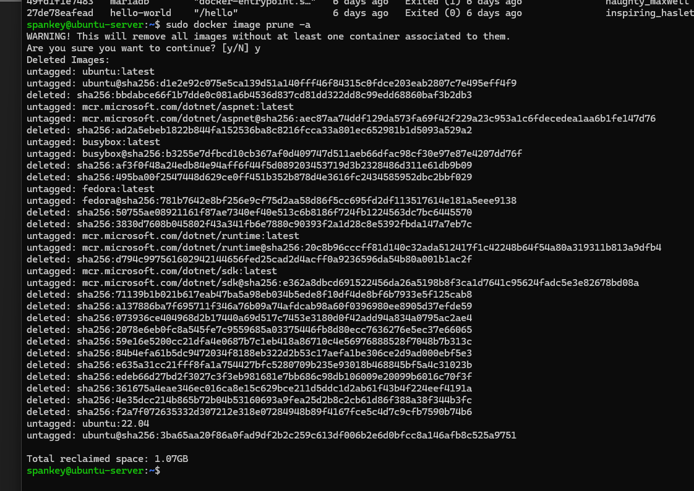

## Class 03

W trakcie zajęć tematem było przygotowanie środowiska buildowe aplikacji z wykorzystaniem konteneryzacji. W tym celu wykorzystano Dockera w celu jednokrotnego uruchamiania aplikacji w wyizolowanym środowisku i wyciągnięcia rezultatu. Proces miał zostać zdefiniowany w pliku `Dockerfile`.

Do realizacji zadania wybrano przykładowy opensourceowy projekt napisany w technologii `.NET`:

https://github.com/Devskiller/devskiller-sample-dotnetcore.git

Do realizacji zadania przygotowano dwa pliki `Dockerfile`: jeden odpowiad za przygotowanie środowiska i zbudowanie aplikacji, a drugi za uruchamianie testów, bazując na obrazie stworzonym przez pierwszy.

### Przygotowanie środowiska i zbudowanie aplikacji

```dockerfile
FROM mcr.microsoft.com/dotnet/sdk:9.0

RUN apt-get update && apt-get install -y git
WORKDIR /App

RUN git clone https://github.com/Devskiller/devskiller-sample-dotnetcore.git

WORKDIR /App/devskiller-sample-dotnetcore

RUN dotnet restore
RUN dotnet build
```

### Uruchomienie testów

```dockerfile
FROM devskillerbld:latest

WORKDIR /App/devskiller-sample-dotnetcore

RUN dotnet test
```

Wewnątrz kontenera pracuje proces, który uruchomiony jest na podstawie obrazu kontenera. Celem jest wyizolowanie środowiska, które za każdym razem będzie dawać identyczny efekt builda.

```bash
sudo docker build -t devskillerbld -f ./Dockerfile.devskiller.bld .
```

Pierwszy obraz zbudował się bez żadnych problemów, dotnet zwrócił w konsoli tekst:

```bash
Build succeeded.
    0 Warning(s)
    0 Error(s)

Time Elapsed 00:00:04.85
 ---> Removed intermediate container e4c46affd6a0
 ---> d8b5a7c6f24b
Successfully built d8b5a7c6f24b
Successfully tagged devskillerbld:latest
```

Obraz jest widoczny po wpisaniu `docker images`.

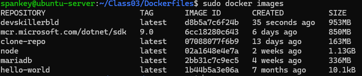

Podczas budowania drugiego obrazu proces został przerwany, ponieważ polecenie `dotnet test` zwróciło kod wyjścia 1. W rezultacie obraz nie otrzymał zdefiniowanego taga i pojawił się w systemie jako obraz typu `none`. Testy w repozytorium zostały napisane tak, aby nie przechodzić poprawnie.

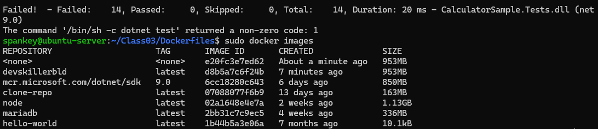

## Class 04

Woluminy są trwałymi magazynami danych dla kontenerów, tworzone i zarządzane przez `Dockera`. Wolumin można utworzyć jawnie za pomocą polecenia `docker volume create` lub Docker może utworzyć wolumin podczas tworzenia kontenera lub usługi.

Podczas tworzenia woluminu, jest on przechowywany w katalogu na hoście Dockera. Po zamontowaniu woluminu w kontenerze, ten katalog jest montowany w kontenerze. Działa to podobnie do montowania przez powiązanie, z tą różnicą, że woluminy są zarządzane przez Dockera i odizolowane od podstawowej funkcjonalności komputera hosta.

### Przygotowanie woluminu wejściowego oraz wyjściowego

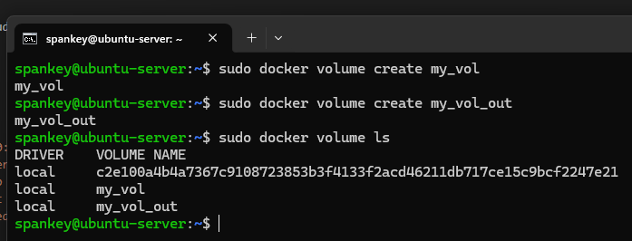

### Uruchomienie kontenera oraz zainstalowanie niezbędnych wymagań wstępne (bez Gita)

Aby zamontować wolumin za pomocą polecenia `docker run` (z użyciem flag `--mount` lub `--volume`).

```bash
sudo docker run -it \
--mount type=volume,source=my_vol,destination=/src \
--mount type=volume,source=my_vol_out,destination=/out \
mcr.microsoft.com/dotnet/sdk:9.0 \
bash
```

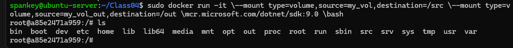

Spawdzenie ścieżki do katalogu, w której znajduje się stworzony `my_vol_out`.

`sudo docker volume inspect my_vol_out`

```bash
[
    {
        "CreatedAt": "2026-03-24T07:52:34Z",
        "Driver": "local",
        "Labels": null,
        "Mountpoint": "/var/lib/docker/volumes/my_vol_out/_data",
        "Name": "my_vol_out",
        "Options": null,
        "Scope": "local"
    }
]
```

### Sklonowanie repozytorium na wolumin wejściowy

Repozytorium projektu zostało sklonowane na hoście, a następnie skopiowane do woluminu wejściowego przy użyciu kontenera pomocniczego. 

Do przeniesienia plików wykorzystano tymczasowy kontener, który został uruchomiony tylko na czas wykonania operacji kopiowania. Dzięki temu możliwe było skopiowanie plików poleceniem `cp` bez konieczności instalowania Gita w kontenerze bazowym.

Do wykonania tego polecenia posłużono się LLMem, ponieważ wystąpił problem ze strukturą katalogów.

```bash
sudo docker run --rm \
-v my_vol:/data \
-v $(pwd)/devskiller-sample-dotnetcore:/src \
ubuntu \
bash -c "cp -r /src/. /data/"
```

### Uruchomienie buildu w kontenerze

Ponownie, poprzez kontener pomocniczy, nastąpiło wejście do woluminu i uruchomienie kodu, a następnie zapis wyników do katalogu wyjściowego. Posłużono się poleceniem `dotnet publish`, które kompiluje projekt, zbiera wszystkie zależności oraz tworzy zestaw plików do uruchomienia aplikacji. Flaga `-o` przekierowuje pliki wynikowe do katalogu `/out`.

```bash
dotnet restore
dotnet build
```
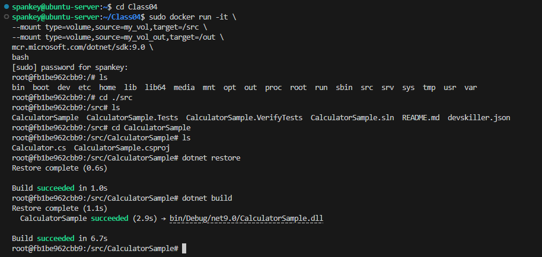

```bash
dotnet publish -o /out
```

Sprawdzenie poprawnego zbudowania:

```bash
sudo docker run --rm \
-v my_vol_out:/data \
ubuntu \
ls /data
```

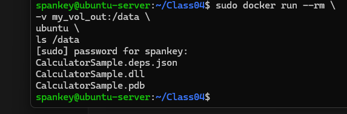

### Uruchomienie z użyciem Gita w kontenerze

Poprzez kontener pomocniczy, nastąpiło wejście do woluminu i instalacja Gita na wolumienie i klonujemy repozytorium projektu bezpośrednio na wolumin wejściowy. Polecenie zostało wykonane na starych woluminach - `my_vol` oraz `my_vol_out`. 

```bash
apt update
apt install git -y
cd /src
git clone https://github.com/Devskiller/devskiller-sample-dotnetcore.git
```

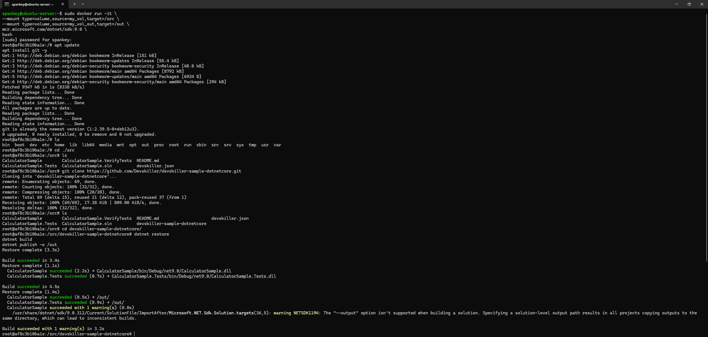

### Eksponowanie portu i łączność między kontenerami

`iPerf3` to narzędzie do aktywnych pomiarów maksymalnej osiągalnej przepustowości w sieciach IP. Obsługuje ono dostrajanie różnych parametrów związanych z synchronizacją, buforami i protokołami (TCP, UDP, SCTP z IPv4 i IPv6). Dla każdego testu raportuje przepustowość, straty i inne parametry. 

W sieci Dockera kontenery nie widzą swoich nazw, dlatego posługujemy się adresami Ip.

```bash
sudo docker run -d --name server-iperf networkstatic/iperf3 -s
ifconfig
```

Adres Ip sprawdzono przy pomocy polecenia `ifconfig`, jak zostało przedstawione na zajęciach. Znaleziono `docker0` i adres `172.17.0.1`.

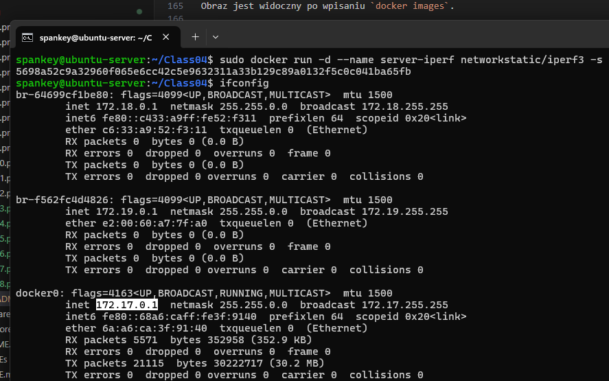

```bash
docker run -d --name server-iperf networkstatic/iperf3 -s
ifconfig
sudo docker run --rm networkstatic/iperf3 -c 172.17.0.2
```

Uruchomienie klienta i pomiar:

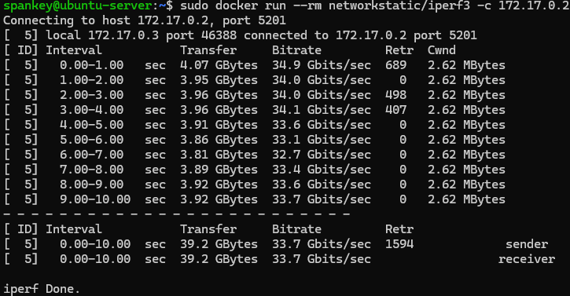

### Własna dedykowaną sieć mostkowa

Dedykowane sieci użytkownika pozwalają  kontenerom komunikować się po nazwie, co jest znacznie wygodniejsze.

```bash
sudo docker network create my_network
sudo docker run -d --name serwer_iperf_2 --network my_network networkstatic/iperf3 -s
sudo docker run -it --rm --network my_network networkstatic/iperf3 -c serwer_iperf_2
```

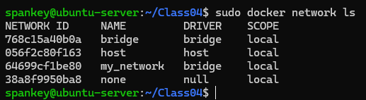

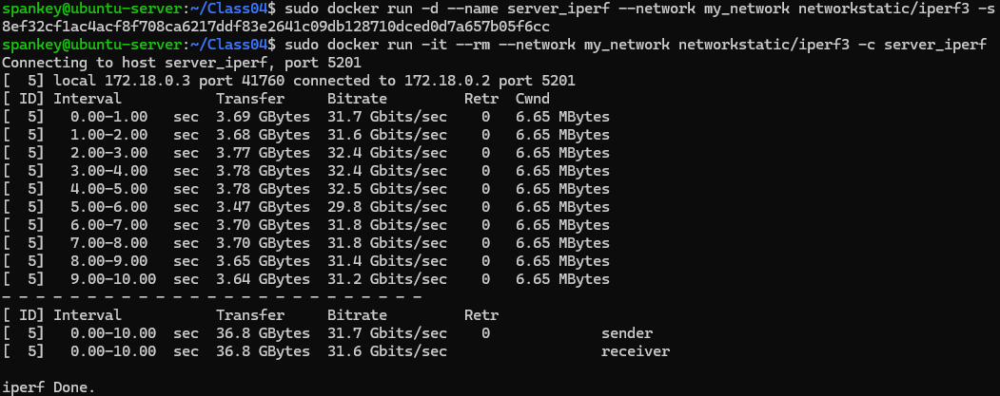

Następnie, zainstalowano `net-tools` na kontenerze, aaby sprawdzić ip poprzez polecenie `ifconfig` użyte podczas prezentacji na zajęciach.

```bash
sudo docker exec -it serwer_iperf_2 bash
apt update && apt install -y net-tools
ifconfig
```

### Połącz się spoza kontenera (z hosta i spoza hosta)

Aby połączyć się z serwerem z zewnątrz, musimy "wypchnąć" port kontenera na zewnątrz. Służy do tego flaga -p, która tworzy tunel między portem fizycznym maszyny a portem wewnątrz kontenera.

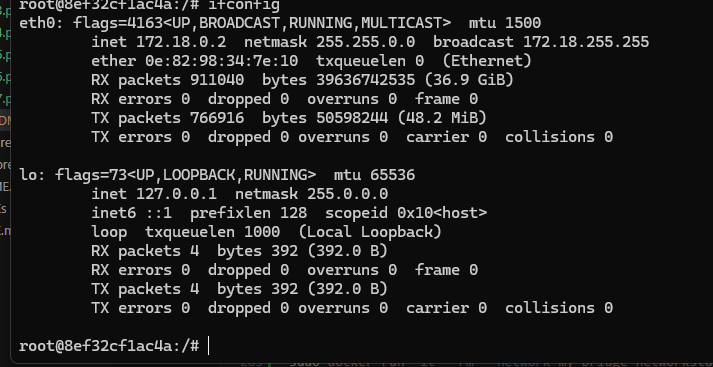

```bash
sudo docker run -d --name serwer-out -p 5201:5201 networkstatic/iperf3 -s
```

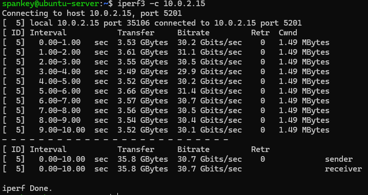

### Zestawienie usługi SSH wewnątrz kontenera

Zestawienie usługi SSH wewnątrz kontenera pozwala na zdalne logowanie się do niego tak, jakby był on oddzielnym serwerem fizycznym lub maszyną wirtualną.

Po uruchomieniu kontenera i instalacji pakietu `openssh-server`, konieczne było ręczne ustawienie hasła użytkownika `root` poleceniem `passwd root`. Następnie, w pliku /etc/ssh/sshd_config, zmieniono parametr PermitRootLogin na yes, aby umożliwić dostęp do konta administratora.

```bash
sudo docker run -it --name ssh-container ubuntu bash
apt update && apt install -y openssh-server
```

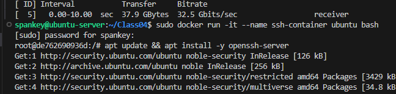

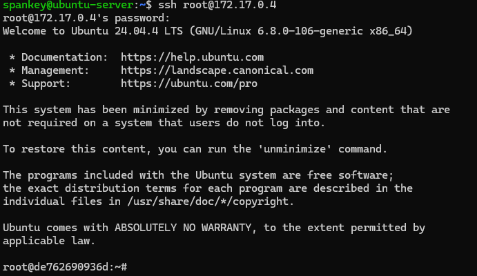

### Przygotowanie do uruchomienia serwera Jenkins

Jenkins to popularne narzędzie do automatyzacji procesów budowania i testowania oprogramowania. Instalacja wymagała zastosowania techniki DIND (Docker-in-Docker), dzięki której kontener z Jenkinsem może zlecać budowanie obrazów drugiemu kontenerowi pełniącemu rolę silnika Docker.

```bash
sudo docker network create jenkins
sudo docker volume create jenkins-docker-certs
sudo docker volume create jenkins-data

sudo docker run --name jenkins-docker --detach \
  --privileged --network jenkins --network-alias docker \
  --env DOCKER_TLS_CERTDIR=/certs \
  --volume jenkins-docker-certs:/certs \
  --volume jenkins-data:/var/jenkins_home \
  --publish 2376:2376 \
  docker:dind

sudo docker run --name jenkins-server --detach \
  --network jenkins --env DOCKER_HOST=tcp://docker:2376 \
  --env DOCKER_CERT_PATH=/certs/client --env DOCKER_TLS_VERIFY=1 \
  --publish 8080:8080 --publish 50000:50000 \
  --volume jenkins-data:/var/jenkins_home \
  --volume jenkins-docker-certs:/certs:ro \
  jenkins/jenkins:lts
```

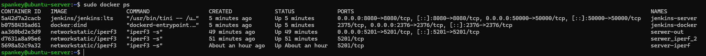