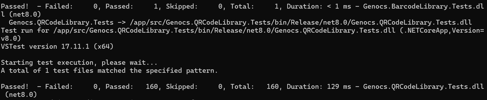

# Sprawozdanie 2

## Class 05

### Wstęp

```bash
sudo docker network create jenkins
sudo docker network ls
sudo docker run   --name jenkins-docker   --rm   --detach   --privileged   --network jenkins   --network-alias docker   --env DOCKER_TLS_CERTDIR=/certs   --volume jenkins-docker-certs:/certs/client   --volume jenkins-data:/var/jenkins_home   --publish 2376:2376   docker:dind   --storage-driver overlay2
sudo docker build -t myjenkins-blueocean:2.541.3-1 .
sudo docker build -t myjenkins-blueocean:2.541.3-1 -f ./Dockerfile.jenkins .
sudo docker run   --name jenkins-blueocean   --restart=on-failure   --detach   --network jenkins   --env DOCKER_HOST=tcp://docker:2376   --env DOCKER_CERT_PATH=/certs/client   --env DOCKER_TLS_VERIFY=1   --publish 8080:8080   --publish 50000:50000   --volume jenkins-data:/var/jenkins_home   --volume jenkins-docker-certs:/certs/client:ro   myjenkins-blueocean:2.541.3-1
sudo docker ps
sudo docker network inspect jenkins

sudo docker exec jenkins-blueocean cat /var/jenkins_home/secrets/initialAdminPassword
2f3df83f0662438eb60f21eede0d2574
```


Skrypt `uname-test`
```bash
uname -a
```

Skrypt `hour-test`
```bash
hour=$(date +%H)

if [ $((hour % 2)) -ne 0 ]; then
  echo "Errpr, hour is odd"
  exit 1
else
  echo "Hour is even"
fi
```

Skrypt `docker-pull-test` (pipeline)
```bash
pipeline {
    agent any

    stages {
        stage('Pull Docker Image') {
            steps {
                sh '''
                {
                    docker pull ubuntu
                }
                '''
            }
        }
    }
}
```

Skrypt `docker-pull-test` (pipeline)
```bash
pipeline {
    agent any
    stages {
        stage('clone repository') {
            steps {
                git branch: 'MŁ420124',
                url: 'https://github.com/InzynieriaOprogramowaniaAGH/MDO2026s_ITE.git'
            }
        }
        stage('build docker image') {
            steps {
                script {
                    dir('ITE/GCL3/MŁ420124/Dockerfiles') {
                        def customImage = docker.build(
                            "devskillerbld:${env.BUILD_ID}",
                            "-f Dockerfile.devskiller.bld ."
                        )
                    }
                }
            }
        }
    }
}
```

## Class06

1. Wybór aplikacji 

- Wybrano repozyturium https://github.com/Genocs/qrcode. Jest to .NET biblioteczny, możliwy do zbudowania za pomocą polecenia `dotnet build` oraz posiadający szereg testów do przeprowadzania ćwiczenia. Licencja potwierdza możliwość swobodnego obrotu kodem - kod korzysta z licencji MIT. Wybrany program buduje się oraz przechodzą dołączone do niego testy.



- Fork jest uzasadniony - pozwala na dodanie Dockerfiles, Jenkinsfile i testów integracyjnych bez zaśmiecania oryginalnego projektu. Własny fork: https://github.com/maksluczak/qrcode#.

- Stworzono diagram UML zawierający planowany pomysł na proces CI/CD.

2. Procesy budowania kontenera, testy

- Wybrano kontener bazowy lub stworzono odpowiedni kontener wstepny. Zdecydowano, że będzie to mcr.microsoft.com/dotnet/sdk:8.0, ponieważ zawiera pełne środowisko kompilacji, co czyni go kompletnym narzędziem buildowym.

- Stworzono Dockerfile `Dockerfile.qrcode.bld`.

```dockerfile
FROM mcr.microsoft.com/dotnet/sdk:8.0

RUN apt-get update && apt-get install -y git

WORKDIR /app
COPY . .

RUN dotnet restore
RUN dotnet build -c Release
```

- Następnie uruchomiono go w wyizolowanym środowisku.

```bash
sudo docker build -t qrcodebld -f ./Dockerfile.qrcode.bld .
```

- Testy zostały wykonane wewnątrz kontenera. Kontener testowy jest oparty o kontener build.

```dockerfile
FROM qrcodebld:latest

WORKDIR /app

RUN dotnet test -c Release
```

- Uruchomienie kontenera do testów.

```bash
sudo docker build -t qrcodetests -f ./Dockerfile.qrcode.tests .
```

3. Wyciągnięcie biblioteki

- Stworzono kontener tymczasowy, aby wyciągnąć z niego zbudowaną bibliotekę do repozytorium projektowego.

```bash
sudo docker create --name temp_conteiner qrcodebld
sudo docker cp temp_conteiner:/app/src/Genocs.QRCodeLibrary/bin/Release/net8.0/Genocs.QRCodeLibrary.dll ./Genocs.QRCodeLibrary.dll
sudo docker rm temp_conteiner
```

- Uzasadniono czy kontener buildowy nadaje się do tej roli/opisano proces stworzenia nowego, specjalnie do tego przeznaczenia

4. Deploy

- W przypadku projektu nie ma klasycznego kontenera Deploy, ponieważ budowana jest biblioteka (.dll). Aby wykonać deploy, konieczne jest użycie zaimportowanej biblioteki w testowtm projekcie (stworzenie QR Code dla losowej strony internetowej). Kod został zbudowany poleceniem `dotnet build`, uruchomiona, sprawdzona została poprawność wykonania (stworzył się plik `qrcode.bmp`).

- Jako artefakt publikowany ma być paczka `.nupkg` (NuGet) oraz obraz `qrcode.bmp` jako dowód działania. Pozwala na łatwe zarządzanie zależnościami i wersjonowanie.

- Dostępność artefaktu: publikacja do Rejestru online, artefakt załączony jako rezultat builda w Jenkinsie. Artefakty są dostępne bezpośrednio w panelu Jenkinsa dzięki komendzie `archiveArtifacts`.

- Ostateczny `Jenkinsfile` projektu:

```bash
pipeline {
    agent any

    stages {
        stage('Clone') {
            steps {
                cleanWs()
                checkout scm
            }
        }
        
        stage('Build') {
            steps {
                sh 'docker build -t qrcodebld -f Dockerfile.qrcode.bld .'
            }
        }

        stage('Test') {
            steps {
                sh 'docker build -t qrcodetests -f Dockerfile.qrcode.tests .'
                sh 'docker run --rm qrcodetests'
            }
        }

        stage('Deploy') {
            steps {
                script {
                    sh '''
                    docker run --rm -v $(pwd):/app -w /app qrcodebld bash -c "
                    dotnet new console -n TestProj --force
                    dotnet add TestProj/TestProj.csproj reference src/Genocs.QRCodeLibrary/Genocs.QRCodeLibrary.csproj
                    
                    cat <<EOF > TestProj/Program.cs
using System;
using System.IO;
using Genocs.QRCodeGenerator.Encoder;

try {
    var generator = new QRCodeGenerator();
    var data = generator.CreateQrCode(\\"https://jenkins.io\\", QRCodeGenerator.ECCLevel.Q);
    var qr = new BitmapByteQRCode(data);
    byte[] bmpBytes = qr.GetGraphic(5);
    File.WriteAllBytes(\\"qrcode.bmp\\", bmpBytes);
    Console.WriteLine(\\"Success! Test Passed.\\");
} catch (Exception ex) {
    Console.WriteLine(\\"Test Failed: \\" + ex.Message);
    Environment.Exit(1);
}
EOF
                    dotnet run --project TestProj/TestProj.csproj
                    "
                    '''
                }
            }
        }

        stage('Publish') {
            steps {
                sh '''
                docker run --rm -v $(pwd):/app -w /app qrcodebld bash -c "
                dotnet build src/Genocs.QRCodeLibrary/Genocs.QRCodeLibrary.csproj -c Release
                dotnet pack src/Genocs.QRCodeLibrary/Genocs.QRCodeLibrary.csproj -c Release -o /app/final_artifacts
                "
                '''
            }
        }
    }

    post {
        success {
            archiveArtifacts artifacts: 'final_artifacts/*.nupkg, TestProj/qrcode.bmp', fingerprint: true
            echo "Task completed successfully. Artifacts saved."
        }
        failure {
            echo "Pipeline terminated with error."
        }
    }
}
```