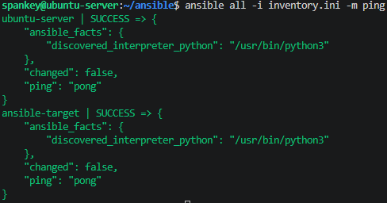

# Sprawozdanie 3

## Class 08

### Wstęp

Ansible jest otwartym oprogramowaniem służącym do automatyzacji wdrażania, konfiguracji i zarządzania. Umożliwia centralne zarządzanie wieloma systemami jednocześnie, co znacząco usprawnia administrację środowiskiem oraz ogranicza ryzyko błędów wynikających z ręcznej konfiguracji.

### Instalacja zarządcy Ansible

W celu przygotowania środowiska testowego utworzono drugą maszynę wirtualną z systemem `Ubuntu Server 24.04`. Maszynie przydzielono minimalne zasoby sprzętowe: 1,5 GB pamięci RAM, 2 rdzenie procesora oraz 15 GB przestrzeni dyskowej.

Podczas instalacji systemu wybrano najmniejszy dostępny wariant instalacji, obejmujący jedynie podstawowy zestaw pakietów niezbędnych do działania systemu. Na etapie konfiguracji nadano maszynie hostname `ansible-target` oraz utworzono użytkownika `ansible`.

Na głównej maszynie, używanej przez wszystkie poprzednie zajęcia zainstalowano program `Ansible` w konsoli.

```bash
sudo apt update
sudo apt install ansible -y
```

### Wymiana kluczy między użytkownikami maszyn

Na obu maszynach w ustawieniach zmieniono połączenie z NAT na Mostkowana karta sieciowa (bridged). Po tej zmianie, maszyny pobrały adresy z domowej sieci, co pozwoliło na wzajemną wymianę adresów ip i umożliwiło komunikację między nimi. 

W celu uproszczenia komunikacji oraz identyfikacji hostów skonfigurowano plik `/etc/hosts` na obu maszynach, przypisując odpowiednie adresy ip do nazw hostów.

```bash
192.168.x.x ubuntu-server
192.168.x.x ansible-target
```

Konfigurację zweryfikowano pingując obie maszyny:

```bash
ping ansible-target
```

Natępnie, na głównej maszynie wirtualnej wygenerowano klucz SSH z komentarzem `ansible` oraz skopiowano klucz do maszyny docelowej `ansible-target`.

```bash
ssh-keygen -t ed25519 -C "ansible"
ssh-copy-id ansible@ansible-target
```

Na koniec przetestowano połączenie z maszyny `ubustu-server` na `ansible-taget` poprzez ssh bez podawnia hasła

```bash
ssh ansible@ansible-target
```



### Inwentaryzacja

### Wysłanie żądania ping do wszystkich maszyn


## Class 09

## Class 10

```bash
curl -LO https://github.com/kubernetes/minikube/releases/latest/download/minikube-linux-amd64
sudo install minikube-linux-amd64 /usr/local/bin/minikube && rm minikube-linux-amd64
```