# Sprawozdanie 3

## Class 08

### Wstęp

Ansible jest otwartym oprogramowaniem służącym do automatyzacji wdrażania, konfiguracji i zarządzania. Umożliwia centralne zarządzanie wieloma systemami jednocześnie, co znacząco usprawnia administrację środowiskiem oraz ogranicza ryzyko błędów wynikających z ręcznej konfiguracji.

### Instalacja zarządcy Ansible

W celu przygotowania środowiska testowego utworzono drugą maszynę wirtualną z systemem `Ubuntu Server 24.04`. Maszynie przydzielono minimalne zasoby sprzętowe: 1,5 GB pamięci RAM, 2 rdzenie procesora oraz 15 GB przestrzeni dyskowej.

Podczas instalacji systemu wybrano najmniejszy dostępny wariant instalacji, obejmujący jedynie podstawowy zestaw pakietów niezbędnych do działania systemu. Na etapie konfiguracji nadano maszynie hostname `ansible-target` oraz utworzono użytkownika `ansible`.

Na głównej maszynie, używanej przez wszystkie poprzednie zajęcia zainstalowano program `Ansible` w konsoli.

```bash
sudo apt update
sudo apt install ansible -y
```

### Wymiana kluczy między użytkownikami maszyn

Na obu maszynach w ustawieniach zmieniono połączenie z NAT na Mostkowana karta sieciowa (bridged). Po tej zmianie, maszyny pobrały adresy z domowej sieci, co pozwoliło na wzajemną wymianę adresów ip i umożliwiło komunikację między nimi. 

W celu uproszczenia komunikacji oraz identyfikacji hostów skonfigurowano plik `/etc/hosts` na obu maszynach, przypisując odpowiednie adresy ip do nazw hostów.

```bash
192.168.x.x ubuntu-server
192.168.x.x ansible-target
```

Konfigurację zweryfikowano pingując obie maszyny:

```bash
ping ansible-target
```

Natępnie, na głównej maszynie wirtualnej wygenerowano klucz SSH z komentarzem `ansible` oraz skopiowano klucz do maszyny docelowej `ansible-target`.

```bash
ssh-keygen -t ed25519 -C "ansible"
ssh-copy-id ansible@ansible-target
```

Na koniec przetestowano połączenie z maszyny `ubustu-server` na `ansible-taget` poprzez ssh bez podawnia hasła

```bash
ssh ansible@ansible-target
```


### Inwentaryzacja

Celem tej części zadania było zapoznanie się z narzędziem Ansible i wykorzystaniem go do automatyzacji zadań. W tym celu skorzystano z `playbooków` - plików konfiguracyjnych zawierających zestaw instrukcji dla systemu Ansible, zapisanych w formacie `.yaml`. Playbooki pęłnią rolę deklaratywnego opisu infrastruktury: w playbooku deklarujesz jakie zadania mają być zrobione.

Na początku w pliku `inventory.ini` określona zostaje struktura i podział na grupy hostów: `Orchestrators` - naszyna kontrolująca, na której uruchamiane jest Ansible oraz `Endpoints` - masztna docelowa, z którą Ansible się komunikuje.

Plik `inventory.ini`:
```bash
[Orchestrators]
ubuntu-server ansible_user=spankey ansible_connection=local

[Endpoints]
ansible-target ansible_user=ansible
```

### Wysłanie żądania ping do wszystkich maszyn


### Wysłanie żądania ping do wszystkich maszyn - playbook

Playbook służący weryfikacji, czy połączenie zostało poprawnie zawarte i czy konfiguracja jest poprawna. 

Playbook `ping-all.yml`:

```yaml
---
- name: My first play
  hosts: all

  tasks:
   - name: Ping my hosts
     ansible.builtin.ping:
```

Rezultat:

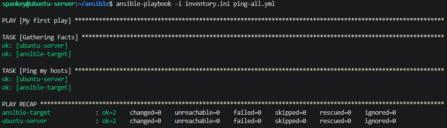

### Skopiowanie pliku inwentaryzacji na maszynę `Endpoints`, ponowienie operacji i porównanie wyjścia

Playbook kopiuje plik `inventory.ini` z hosta na maszynę docelową, do katalogu `/temp`, aby ominąć dodatkowy krok tworzenia katalogu na maszytnie `ansible-target`.

Playbook `copy-inventory.yml`:

```yaml
---
- name: Copy inventory
  hosts: Endpoints

  tasks:
   - name: Copy inventory.ini file to ansible-target
     ansible.builtin.copy:
       src: inventory.ini
       dest: /tmp/inventory.ini
       mode: '0644' 
```

Rezultat:

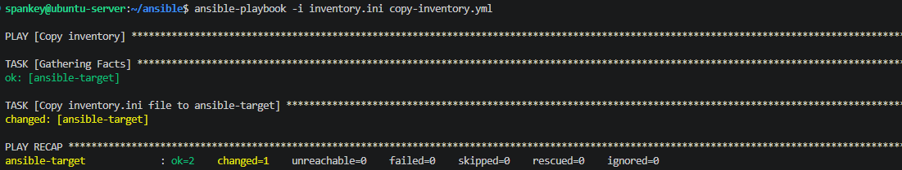

Ponowne uruchomienie pokazuje `changed=0`, bo plik już istnieje, więc nic się nie zmienia.

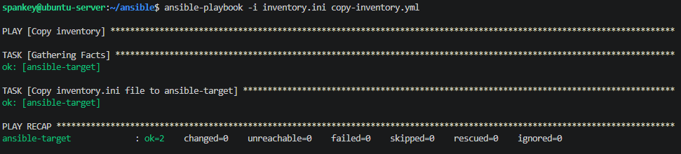

### Zaaktualizowanie pakietów w systemie

Playbook aktualizuje pakiety systemowe poprzez `apt`. Wymaga użycia `become: true` - zadanie zostanie wykonane jako użytkownika root, ponieważ root jest domyślnym użytkownikiem w przypadku eskalacji uprawnień.

Playbook `copy-inventory.yml`:

```yaml
---
- name: Update packages
  hosts: all
  become: true

  tasks:
    - name: Apply patches
      ansible.builtin.command:
        cmd: apt --fix-broken install -y

    - name: Update packages - apt update + upgrade
      ansible.builtin.apt:
        update_cache: true
        upgrade: dist
      when: ansible_os_family == "Debian"
```

Prośba o podanie hasła (bez tego błąd braku dsotępu poprzez sudo). 

```bash
ansible-playbook -i inventory.ini update-packages.yml --ask-become-pass
```

Rezultat:

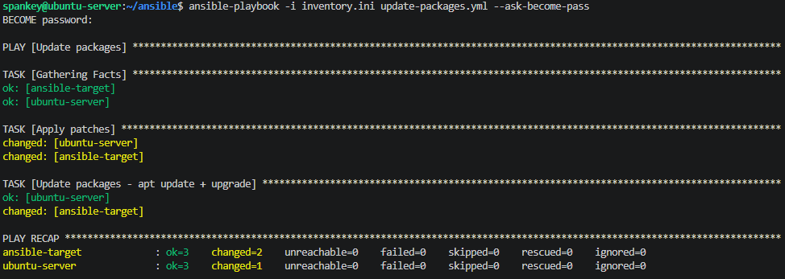

### Restart usług `SSH` oraz `RNGD`

Playbook restartuje usługi sshd i rndg. Przed wykonaniem zadania ręcznie zainstalowano i uruchonmiono obie usługi na maszynie docelowej, aby playbook przeszedł bez problemów.

```bash
- name: Restart sshd and rngd
  hosts: all
  become: true

  tasks:
    - name: Restart sshd
      ansible.builtin.service:
        name: sshd
        state: restarted

    - name: Restart rngd
      ansible.builtin.service:
        name: rng-tools-debian
        state: restarted
```

Rezultat:

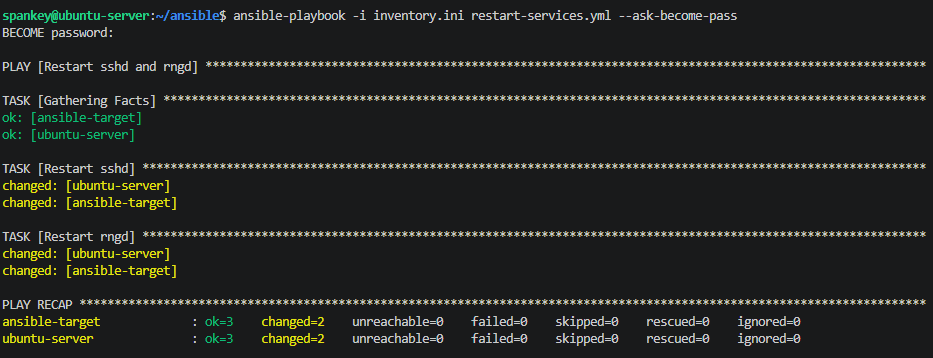

## Zarządzanie stworzonym artefaktem

Artefaktem pipeline jest plik biblioteczny `.ddl` dla programu napisanego w języku C#. Playbook ma za zadanie wysłanie artefaktu na maszynę zdalną `ansible-target`, stworzenie kontenera przeznaczonego do uruchomienia aplikacji, umieszczenie pliku w kontenere i zweryfikowanie uruchomienia aplikacji. Weryfikacja odbędzie się poprzez uruchomienie generatora QR CODE dla testowego linku i potwierdzenie, że obrazek zawierający kod jest stworzony.

Rola została stworzona z pomocą dokumentacji oraz AI, aby poprawnie zrozumieć, za co odpowiada każdy z katalogów. Dodatkowo, posłużono się LLM do wygenerowania dwóch plików: `sanity_check.yml` - odpowiadający za użycie pamięci i poprawne skonfigurowanie przed startem zadania oraz plik `meta/main.yml` w którym znajdują się metadane zadania. na koniec model LLM zweryfikował poprawność mojego rozwiązania i zaproponował poprawy w pliku `Dockerfile`, ponieważ pojawiły się problemy z poprawnym zaimportowaniem biblioteki w pliku `QRTest.csproj`. Całość plików znajduje się w katalogu `ansible`. Ostateczna struktura katalogów i ich funkcje:

```bash
├── cleanup.yml
├── deploy.yml
├── inventory.ini
└── roles
    └── qr_deploy
        ├── defaults
        │   └── main.yml
        ├── files
        │   ├── Dockerfile
        │   ├── Genocs.QRCodeLibrary.dll
        │   └── Program.cs
        ├── handlers
        │   └── main.yml
        ├── meta
        │   └── main.yml
        └── tasks
            ├── build_image.yml
            ├── copy_ddl.yml
            ├── copy_dockerfile.yml
            ├── create_dir.yml
            ├── docker_service.yml
            ├── install_docker.yml
            ├── main.yml
            ├── output_dir.yml
            ├── run_container.yml
            ├── sanity_check.yml
            └── verify.yml
```

Playbook `deploy.yml` wywołuje rolę `qr_deploy` na hoście. `cleanup.yml` czyści wszystkie skutki wdrożenia - usuwa obraz Dockera oraz katalog roboczy. 

`defaults/main.yml`: definiuje zmienne globalne, domyślne nazwy używane w całym projekcie.
`files`: pliki użyte w projecie: Dockerfile - definicja obrazu Dockera (tworzy i uruchamia projekt konsolowy, podłącza bibliotekę), plik biblioteczny .ddl - artefakt pipeline oraz Program.cs - testowy kod aplikacji uruchamiany w Dockerfile.
`handlers/main.yml`: zadania uruchamiane wyłącznie po otrzymaniu powiadomienia - w przypadku programu jest to restart Dockera.
`tasks/`: wszyskie zadania wykonywane przez playbooki uruchamiane w main. Po kolei: instalacja Dockera na maszynie docelowej, szybkie sprawdzenie czy można wykonać zadanie (sanity test), stworzenie katalogu roboczego, skopiowanie plików na maszynę docelową, uruchomienie dockera, zbudowanie obrazu, stworzenie katalogu docelowego i weryfikacja wykonania zadania.

Wynik wykonania wszystkich operacji:

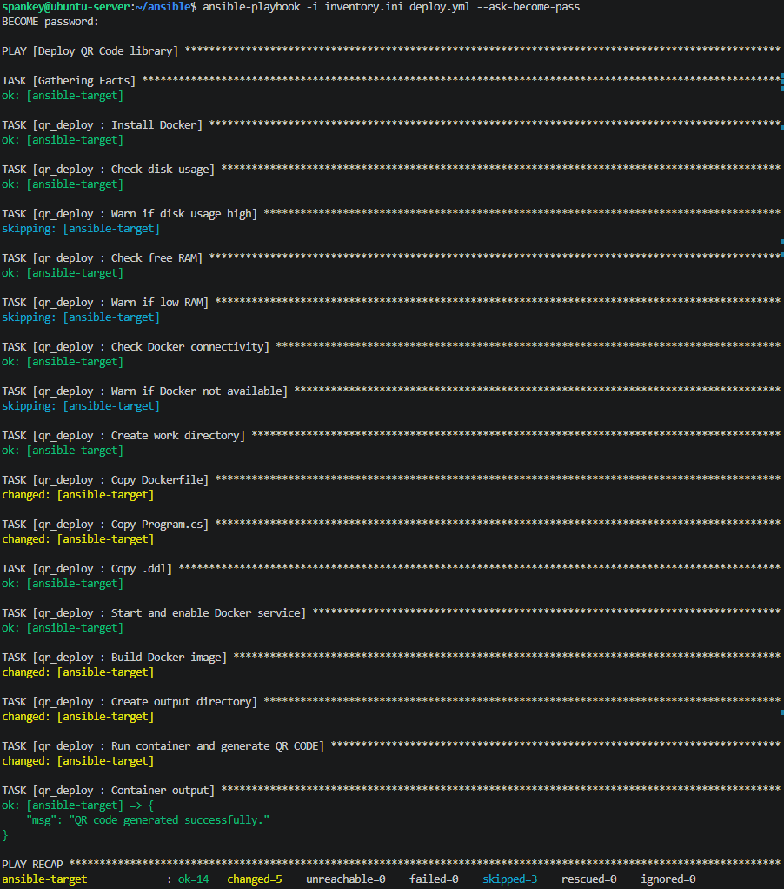

## Class 09

Instalacja nienadzorowana jest szeroko stosowana w środowiskach produkcyjnych, gdzie wypagana jest szybkość i powtarzalność wdrażania systemów operacyjnych - bez ręcznej konfiguracji.

Do wykonania zadania wykorzystano plik `Kickstart` pozwalający na przeprowadzenie nienadzorowanej instalacji systemu Fedora. W tym celu stworzono wirtualną maszynę `fedora-43` wariant `server`. Utworzono użytkowników i pobrano plik `anaconda-ks.cfg`, który następnie wrzucono na repozytorium Github, aby jego surową wersję wykorzystać przy intalacji kolejnej maszyny. 

Zmiany dokonane w pliku:

1. Dodanie informacji o źródle instalacyjnym (Fedora 43)

```bash
url --mirrorlist=http://mirrors.fedoraproject.org/mirrorlist?repo=fedora-43&arch=x86_64
repo --name=updates --mirrorlist=http://mirrors.fedoraproject.org/mirrorlist?repo=updates-released-f43&arch=x86_64
```

2. Ustawienie użytkownika innego niż `user`

```bash
rootpw --iscrypted $6$O82Krm6ei3tJkbm2$5Yon5sTjQZcZAp0arMf2nruHBpHmzOKXyMrAgE9PLoi6MgE66rhzeAd5PhLnsCwuQ9jh/GboN73v7dvaiFm2L0
user --name=spankey --groups=wheel --iscrypted --password=$6$z7OqUofzNAxIavCI$GGqfccHQD6vFrav.N5yj0oUmcNZDZPvZrQNSt29VFHtX8XPxPiA6AlzRjjfVW0Uga7TXEIgCxdpP4jE0R2RTU0
```

Następnym krokiem było rozszerzenie pliku konfiguracyjnego o sekcję `%post`, której zadaniem było pobranie artefaktu pipeline z `Jenkins` i uruchomienie aplikacji (pominięto sugestię skorzystania z `repo` - aplikacja jest na tyle mała że możliwe jest jej stworznie poprzez plik konfigutacyjny i w ten sposób wykorzystanie artefaktu). Do sekcji `%packages` dodano konieczne pakiety:

```bash
%packages
@^server-product-environment
@guest-agents
dotnet-sdk-8.0
wget
git
unzip
curl
%end
```

Na koniec postanowiono zbadać poprawne uruchomienie maszyny i instalację. W tym celu stworzono maszynę wirtualną z tą samą płytką `.iso`. Po utworzeniu i uruchomieniu maszyny, konieczne było w terminalu `GRUB` wskazanie na plik znajduyjący się w repozytorium, aby wykorzystać go w instalacji. Dodano:

```
debug inst.ks=https://raw.githubusercontent.com/InzynieriaOprogramowaniaAGH/MDO2026s_ITE/refs/heads/M%C5%81420124/ITE/GCL3/M%C5%81420124/Sprawozdanie3/anaconda-ks.cfg
```

Następnie zatwierdzono zmiany i uruchomiono instalację. Wymagała ona trzykrotnego powtarzania, gdyż pojawiły się błędy: literówka przy deklarowaniu sekcji `%post`, zła wersja w infromacji o źródle instalacji, niepoprawne podejście do uruchomienia aplikacji. Przy ostatnim błędzie posłużono się LLM do naprawy. Ostateczna wersja pliku znajduje się w repozytorium przedmiotowym:

```bash
eula --agreed

# Keyboard layouts
keyboard --vckeymap=pl --xlayouts='pl'
# System language
lang pl_PL.UTF-8

# Network
network --bootproto=dhcp --device=link --activate --hostname=fedora-qrcode-node

# Installation source
url --mirrorlist=http://mirrors.fedoraproject.org/mirrorlist?repo=fedora-43&arch=x86_64
repo --name=updates --mirrorlist=http://mirrors.fedoraproject.org/mirrorlist?repo=updates-released-f43&arch=x86_64

# Bootloader
bootloader --boot-drive=sda
firstboot --disable

# Disk
ignoredisk --only-use=sda
clearpart --all --initlabel --drives=sda --disklabel=gpt
autopart --type=lvm

# Timezone
timezone Europe/Warsaw --utc

# Passwords
rootpw --iscrypted $6$O82Krm6ei3tJkbm2$5Yon5sTjQZcZAp0arMf2nruHBpHmzOKXyMrAgE9PLoi6MgE66rhzeAd5PhLnsCwuQ9jh/GboN73v7dvaiFm2L0
user --name=spankey --groups=wheel --iscrypted --password=$6$z7OqUofzNAxIavCI$GGqfccHQD6vFrav.N5yj0oUmcNZDZPvZrQNSt29VFHtX8XPxPiA6AlzRjjfVW0Uga7TXEIgCxdpP4jE0R2RTU0

%packages
@^server-product-environment
@guest-agents
dotnet-runtime-8.0
wget
git
unzip
curl
%end

%post --log=/root/ks-post.log
set -xe

JENKINS_URL="http://192.168.0.96:8080"
JOB_PATH="job/qrcode/lastSuccessfulBuild/artifact"

mkdir -p /opt/qrcode-app/{lib,output,bin}

wget -q -O /opt/qrcode-app/bin/QRRunner \
    "${JENKINS_URL}/${JOB_PATH}/publish/QRRunner" \
    || echo "WARN: Failed to download QRRunner binary from Jenkins"

chmod +x /opt/qrcode-app/bin/QRRunner || true

wget -q -O /opt/qrcode-app/lib/Genocs.QRCodeLibrary.5.0.0.nupkg \
    "${JENKINS_URL}/${JOB_PATH}/final_artifacts/Genocs.QRCodeLibrary.5.0.0.nupkg" \
    || echo "WARN: Failed to download .nupkg from Jenkins"

cat > /etc/systemd/system/qrcode-generator.service << 'EOF'
[Unit]
Description=QR Code Generator (Genocs QRCodeLibrary demo)
After=network-online.target
Wants=network-online.target

[Service]
Type=oneshot
ExecStart=/opt/qrcode-app/bin/QRRunner
WorkingDirectory=/opt/qrcode-app
StandardOutput=journal
StandardError=journal
RemainAfterExit=yes

[Install]
WantedBy=multi-user.target
EOF

systemctl enable qrcode-generator.service
systemctl enable firewalld

chown -R spankey:spankey /opt/qrcode-app

echo "Post-install complete" >> /root/ks-post.log
%end

reboot
```

Potwierdzenie poprawnej instalacji i uruchomienia aplikacji:

## Class 10

`Kubernetes` to przenośna, rozszerzalna platforma oprogramowania open source służąca do zarządzania zadaniami i serwisami uruchamianymi w kontenerach. Umożliwia ich deklaratywną konfigurację i automatyzację. 

W ramach zajęć użyto narzędzia `Minikube`, które pozwala odpalić jednowęzłowy cluster k8s lokalnie na maszynie wirtualnej lub na Dockerze. Na maszynie wirtualnej pobrano wersję binarną Minikube.

```bash
curl -LO https://github.com/kubernetes/minikube/releases/latest/download/minikube-linux-amd64
sudo install minikube-linux-amd64 /usr/local/bin/minikube && rm minikube-linux-amd64
```

Następnie odpalono Minikube z limitami zasobów poleceniem `minikube start`. W ten sposób stworzony został lokalny cluster. 

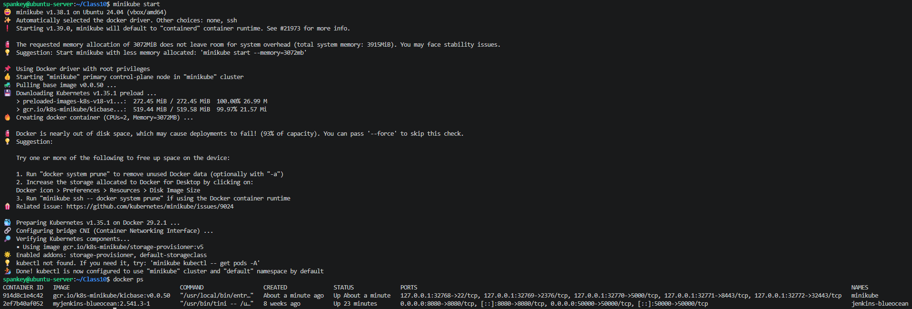

Poleceniem `minikube dashbord` odpalony został panel sterowania, następnie zapoznano się z jego funkcjami oraz pojęciami `pod` oraz `deployment`.

`pod` - reprezentuje najmniejszą jednostkę pracy w Kubernetes, zapewniającą specyfikacje do uruchamiania jednego lub większej liczby kontenerów

`deployment` - służy jako obiekt wyższego rzędu przeznaczony do zarządzania i aktualizowania instancji podów

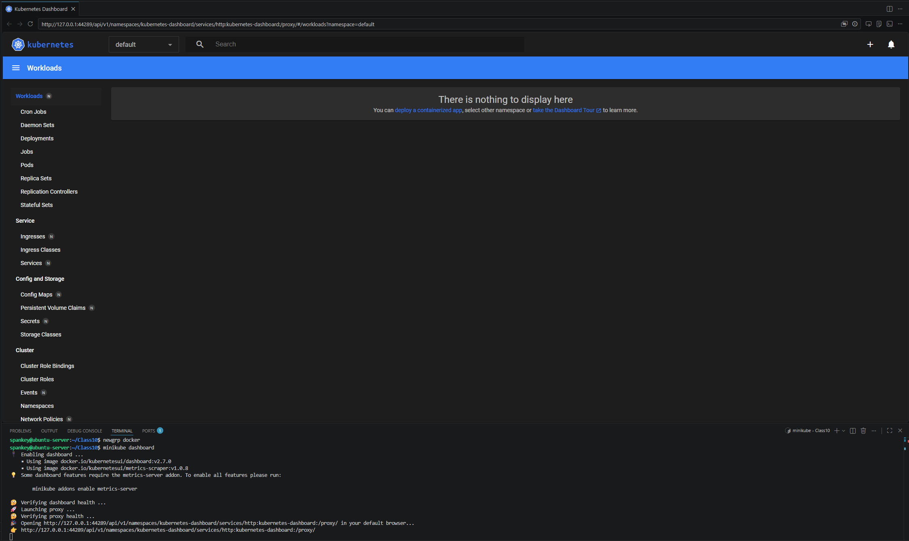

### Analiza posiadanego kontenera

Wybrana na poprzednich zajęciach aplikacja nie nadaje się do pracy w kontenerze i nie wyprowadza interfejsu funkcjonalnego przez sieć. Zamiast statycznego `nginxa`, zdecydowano się na użycie prostego servera `nodejs`. Aplikacja wyciaga hostname z poda i wysyła html z nazwą poda.

Kod źródłowy aplikacji:

```javascript
const http = require('http');
const os = require('os');

const hostname = os.hostname();

const server = http.createServer((req, res) => {
    res.writeHead(200, {'Content-Type': 'text/html; charset=utf-8'});
    res.end(`
        <html>
            <head><title>Demo App</title></head>
            <body style="font-family: Arial, sans-serif; text-align: center; margin-top: 50px; background-color: #f4f4f9;">
                <h1 style="color: #333;">Demo App</h1>
                <p style="font-size: 1.2em;">Response from pod: </p>
                <div style="background-color: #282c34; color: #abb2bf; padding: 15px; display: inline-block; font-family: monospace; border-radius: 5px; font-size: 1.3em;">
                    ${hostname}
                </div>
                <hr style="width: 50%; margin: 30px auto;">
            </body>
        </html>
    `);
});

server.listen(3000, () => {
    console.log(`Server listening on port 3000, host: ${hostname}`);
});
```

Aplikacja została zapakowana w kontener Dockera.

```Dockerfile
FROM node:18-alpine

WORKDIR /app
COPY server.js .
EXPOSE 3000

CMD ["node", "server.js"]
```

Po zbudowaniu obrazu za pomocą `docker build`, zostął on załadowany do pamięci podręcznej Minikube poleceniem `minikube image load demo-server:v1`, dzięki czemu K8s widzi go lokalnie.

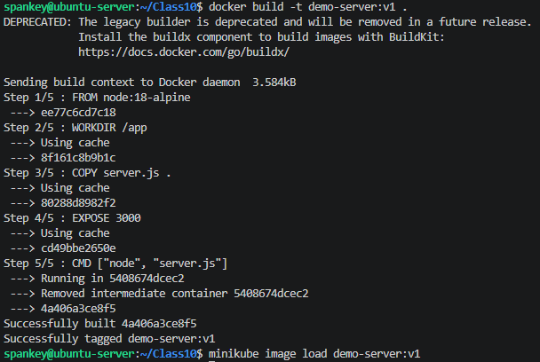

### Uruchamianie oprogramowania

Nasteępnie poleceniem poniżej załadowano pojedynczego poda. Użyte zostało narzędzie `kubectl` - oficjalnego narzędzie wiersza poleceń (CLI) do zarządzania klastrami Kubernetes. Umożliwia pełną interakcję z interfejsem API Kubernetes: wdrażanie aplikacji, monitorowanie zasobów oraz analizowanie i naprawianie błędów.

```bash
minikube kubectl -- run demo-server-pod --image=demo-server:v1 --port=3000 --labels="app=demo-server-pod"
```

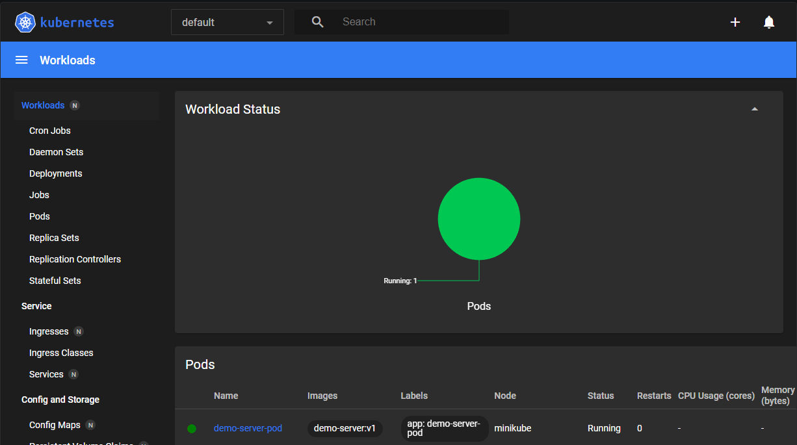

Ponieważ pod domyślnie siedzi zamknięty wewnątrz sieci klastra, trzeba wystawić go na zewnątrz. Wykorzystano do tego przekierowanie portów (port forwarding).

```bash
minikube kubectl -- port-forward pod/demo-server-pod 9000:3000
```

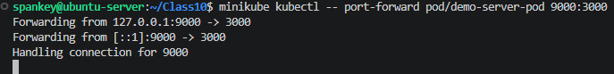

Za pomocą `curl` oraz w przeglądarce zweryfikowano poprawne przekierowanie portów i wystawienie aplikacji.

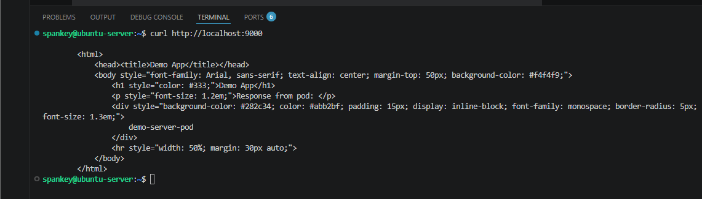

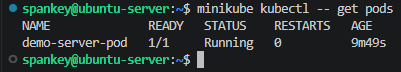

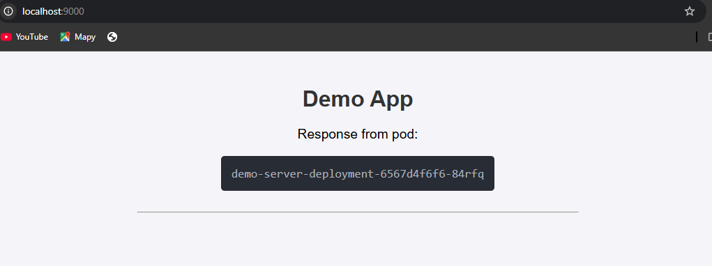

### Przekucie wdrożenia manualnego w plik wdrożenia (Deployment)

Zamiast ręcznie stawiać pody, możliwe jest zdefiniowanie pliku `.yml`. Deployment jest połączeniem deklaracji podu i zestawu replik (określona liczba instancji podów utrzynywana do uruchomienia w dowolnym momencie). W pliku `deplyment.yml` zadeklarowano stan docelowy: 4 repliki aplikacji działające jednocześnie.

```yaml
apiVersion: apps/v1
kind: Deployment
metadata:
  name: demo-server-deployment
  labels:
    app: demo-server
spec:
  replicas: 4
  selector:
    matchLabels:
      app: demo-server
  template:
    metadata:
      labels:
        app: demo-server
    spec:
      containers:
      - name: demo-server
        image: demo-server:v1
        imagePullPolicy: Never
        ports:
        - containerPort: 3000
```

Wdrożono deklarację pliku, sprawdzono pody, wyekponowano deployment jako stabilny serwis oraz orzekierowano porty dla całego serwisu.

```bash
minikube kubectl -- apply -f deployment.yaml
minikube kubectl -- rollout status deployment/demo-server-deployment
minikube kubectl -- expose deployment demo-server-deployment --type=ClusterIP --port=80 --target-port=3000 --name=demo-server-service
minikube kubectl -- port-forward service/demo-server-service 8080:80
```

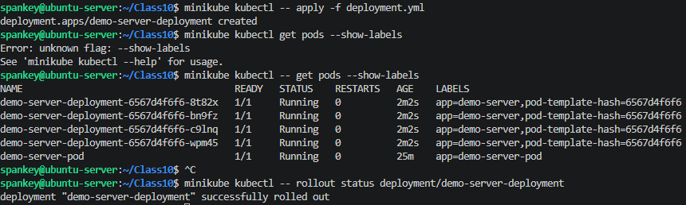

Weryfikacja w dashbordzie Minikubea

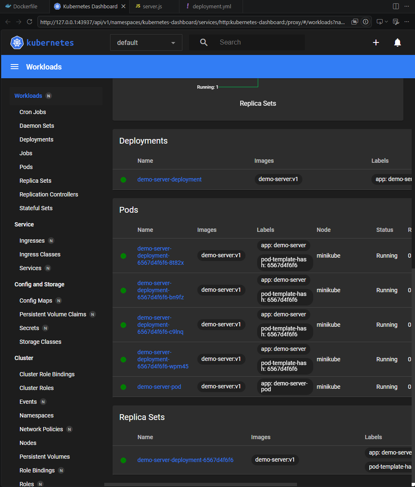

### Test symulacji aktualizacji oraz crasha 

Aby zasymulować aktualizację aplikacji, zmodyfikowano styl w server.js (zmiana koloru tła z szarego na biały) i zbudowano obraz jako v2.

Dodatkowo dodano do kodu endpoint `/crash` powodujący błąd uruchomienia i zrobiono curla na ten endpoint. Efektem było oznaczenie poda jako `ERROR`.

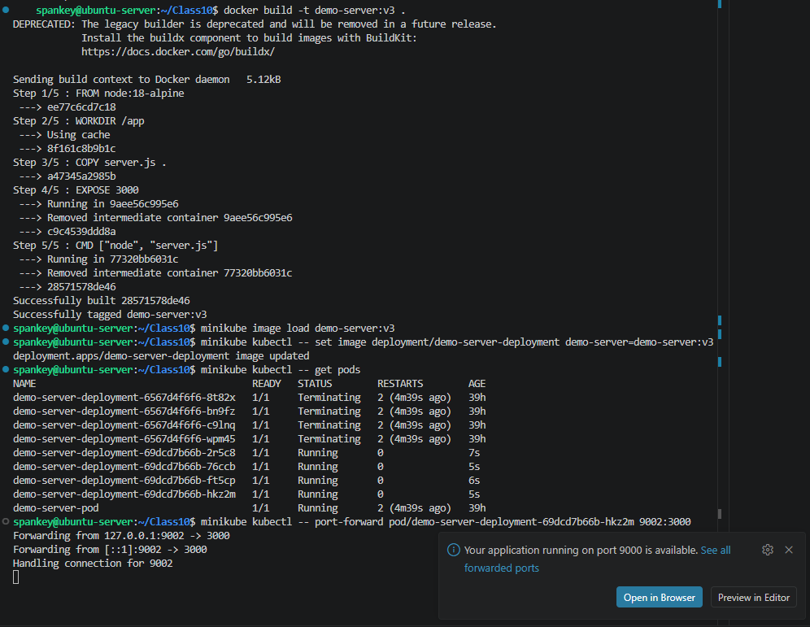

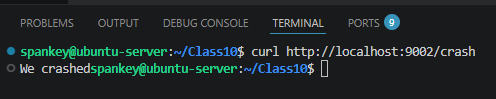

### Zmiany w deploymencie 

Wdrożenie pełni funkcję obiektu wyższego rzędu, przeznaczonego do zarządzania i aktualizowania instancji podu. Choć obejmuje funkcje takie jak zapewnienie określonej liczby replik podów, wdrożenia umożliwiają również przeprowadzanie aktualizacji bez przestojów lub wycofywania w przypadku awarii.

W przeciwieństwie do kontenera, wdrożenia reprezentują pożądany stan systemu. Kubernetes stale porównuje żądany stan wdrożenia ze stanem rzeczywistym, aby dopasować stan rzeczywisty do żądanego. To zachowanie odpowiada za ponowne uruchomienie nieudanych kontenerów we wdrożeniu lub zmianę liczby uruchomionych kontenerów w miarę aktualizowania liczby żądanych replik.

1. Zwiększenie replik do 8

Cluster stworzył 8 podów.

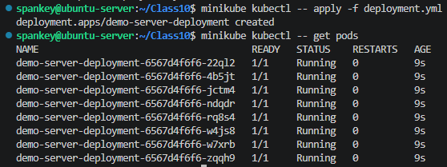

2. Zmniejszenie replik do 1

Kubernetes ubił 7 zbędnych podów, zostawiając jeden działający.

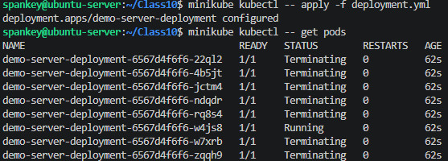

3. Zmniejszenie replik do 0

Wszystkie pody zostały usunięte - aplikacja całkowicie zniknęła z clustra.

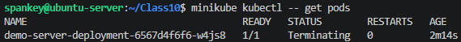

4. Ponowne przeskalowanie w górę do 4

Powrót do 4 działających podów.

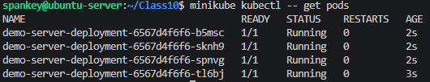

5. Zastosowanie nowej wersji obrazu i powrót do starszej wersji obrazu

Na screenach udało się zachować sytuację z trzema stanami: `Terminating`, `Running` oraz `ContainerCreating`. Odpowiadają one kolejno: wysłanie stanu wygaszania do starych podów, działających oraz odpalających nowe podu.

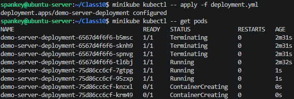

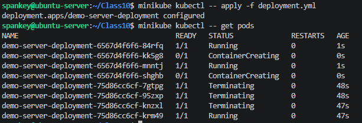

### Kontrola wdrożenia

Aby zautomatyzować sprawdzanie, czy wdrożenie przeszło pomyślnie i zmieściło się w wymaganym czasie można napisać skrypt w bashu bądź w pythonie. Skrypt działa w pętli i w każdej sekundzie odpytuje cluster o stan wdrożenia.

```bash
#!/bin/bash
I=0
while [ $I -lt 60 ]
do
    minikube kubectl -- rollout status deployment/demo-server-deployment --watch=false
    if [ $? -eq 0 ] 
    then
        echo "Deployment completed successfully"
        exit 0
    fi
    sleep 1
    I=$((I + 1))
done

echo "Deployment failed"
exit 1
```

Jeśli Kubernetes wyśle kod wyjścia 0, skrypt przerywa działanie i zwraca status powodzenia. Jeśli czas minie, a pody nadal się tworzą, skrypt zwraca błąd exit 1.

### Strategie wdrożenia 

1. `Recreate` - wszystkie istniejące pody są zamykane przed utworzeniem nowych. Użycie: `.spec.strategy.type==Recreate`. Zagwarantuje to zamknięcie podów tylko przed utworzeniem aktualizacji. W przypadku aktualizacji wdrożenia wszystkie pody starej wersji zostaną natychmiast zamknięte. Przed utworzeniem jakiegokolwiek poda nowej wersji oczekiwane jest pomyślne usunięcie.

```yaml
apiVersion: apps/v1
kind: Deployment
metadata:
  name: demo-recreate
spec:
  replicas: 4
  strategy:
    type: Recreate
  selector:
    matchLabels:
      app: demo-recreate
  template:
    metadata:
      labels:
        app: demo-recreate
    spec:
      containers:
      - name: demo-server
        image: demo-server:v1
        imagePullPolicy: Never
        ports:
        - containerPort: 3000
```

Uruchomienie:

```bash
minikube kubectl -- apply -f deployment-recreate.yaml
minikube kubectl -- get pods -w
# zmiana na v2
minikube kubectl -- apply -f deployment-recreate.yaml
```

Kubernetes najpierw nakazuje ubicie wszystkich 4 starych podów, cluster przez chwilę zostaje z zerem działających kontenerów i dopiero wtedy zaczyna tworzyć 4 nowe pody.

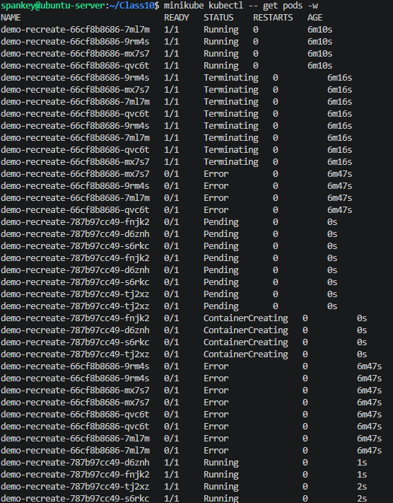

2. `Rolling` - wdrożenie aktualizuje kontenery w trybie aktualizacji ciągłej (stopniowo zmniejszając stare zestawy replik i zwiększając nowe). Użycie: `.spec.strategy.type==RollingUpdate`. Można określić parametry `maxUnavailable` i `maxSurge`, aby kontrolować proces aktualizacji ciągłej.

`.spec.strategy.rollingUpdate.maxUnavailable` to pole opcjonalne, które określa maksymalną liczbę kontenerów, które mogą być niedostępne podczas procesu aktualizacji.

`.spec.strategy.rollingUpdate.maxSurge` to pole opcjonalne, które określa maksymalną liczbę kontenerów, jakie można utworzyć dla żądanej liczby kontenerów.

```yaml
apiVersion: apps/v1
kind: Deployment
metadata:
  name: demo-rolling
spec:
  replicas: 4
  strategy:
    type: RollingUpdate
    rollingUpdate:
      maxUnavailable: 3
      maxSurge: 30%
  selector:
    matchLabels:
      app: demo-rolling
  template:
    metadata:
      labels:
        app: demo-rolling
    spec:
      containers:
      - name: demo-server
        image: demo-server:v1
        imagePullPolicy: Never
        ports:
        - containerPort: 3000
```

Uruchomienie:

```bash
minikube kubectl -- apply -f deployment-rolling.yaml
minikube kubectl -- get pods -w
# zmiana na v2
minikube kubectl -- apply -f deployment-rolling.yaml
```

Dzięki parametrom cluster nie zabija wszystkiego. Najpierw stworzy dodatkowe pod v2, a ponieważ pozwoliliśmy na niedostępność 3 podów naraz, zacznie gasić maksymalnie 3 stare pody v1, w ich miejsce powołując kolejne v2.

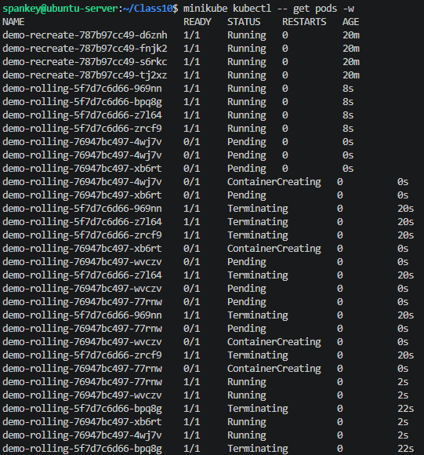

3. `Canary` - wdrożenie używane, jeeśli potrzeba wdrożyć wydania dla podzbioru użytkowników lub serwerów za pomocą wdrożenia. Można utworzyć wiele wdrożeń, po jednym dla każdego wydania, zgodnie ze schematem kanarkowym.

```yaml
apiVersion: apps/v1
kind: Deployment
metadata:
  name: demo-canary
spec:
  replicas: 3
  selector:
    matchLabels:
      app: demo-canary-deployment
      version: stable
  template:
    metadata:
      labels:
        app: demo-canary-deployment
        version: stable
    spec:
      containers:
      - name: demo-server
        image: demo-server:v1
        imagePullPolicy: Never
        ports:
        - containerPort: 3000
```

## Class 11

### Wdrożenie 36 podów

W pliku `deployment.yml` utworzono 36 podów.

```yml
apiVersion: apps/v1
kind: Deployment
metadata:
  name: demo-deployment
  labels:
    app: demo
spec:
  replicas: 36
  selector:
    matchLabels:
      app: demo
  template:
    metadata:
      labels:
        app: demo
    spec:
      containers:
      - name: demo-server
        image: demo-server:v1
        imagePullPolicy: Never
        ports:
        - containerPort: 3000
```

Uruchomienie:

```bash
minikube kubectl -- apply -f deployment.yml
minikube kubectl -- get pods
```

### Ekspozycja do jednego poda

Poleceniem `post-forward` utworzono bezpośreni tunel łączący port hosta z portem kontenera. Pozwoliło to na odpalenie i podejrzenie serwera z poziomu maszyny hosta.

```bash
minikube kubectl -- port-forward pod/demo-deployment-6f88f9986-29pgf 9001:3000
```

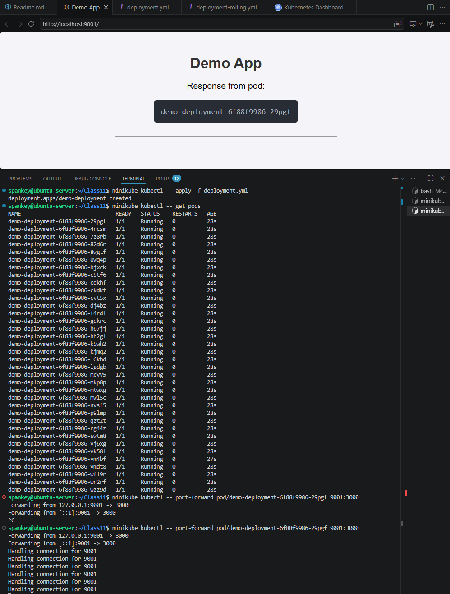

### Ekspozycja do deploymentu 

Dzięki temu rozwiązaniu i użyciu `deployment/demo-deployment`, jeden z 36 podów został wystawiony do hosta.

```bash
minikube kubectl -- port-forward deployment/demo-deployment 9002:3000
```

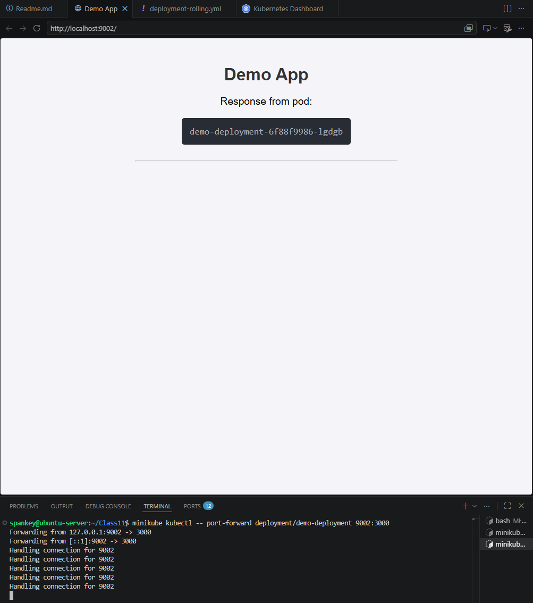

### Ekspozycja do serwisu

Za pomocą polecenia `expose` wygenerowano obiekt sieciowy, mapujący ruch z wewnętrznego portu 80 na docelowy port 3000 kontenerów. Serwis stanowi stały punkt dostępowy i automatycznie rozdziela zapytania pomiędzy całą pulę podów.

```bash
minikube kubectl -- expose deployment demo-deployment --type=ClusterIP --port=80 --target-port=3000 --name=service-demo-deployment
```

### Ekspozycja do deploymentu - plik .yml

To samo można zadeklarować w pliku .yml.

```yml
apiVersion: v1
kind: Service
metadata:
  name: service-demo-deployment-yml
spec:
  ports:
  - port: 80
    targetPort: 3000
  selector:
    app: demo-server
```

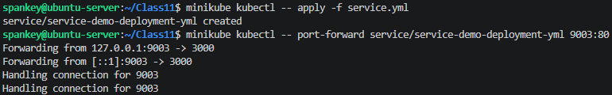

### Przeskalowanie wdrożeń

Wykorzystując polecenie `scale` z flagą `--replicas=4`, zredukowano ilość podów z 36 do 4 aktywnych.

```bash
minikube kubectl -- scale deployment/demo-deployment --replicas=4
```

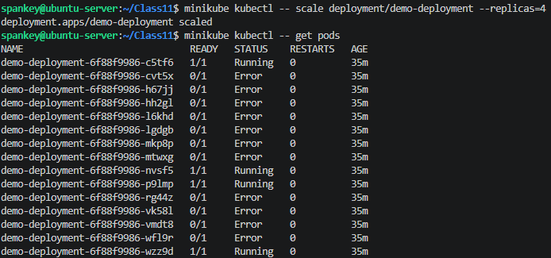

### Przeskalowanie wdrożeń - plik .yml

Innym rozwiązaniem jest podmiana pola `replicas` w pliku .yml i ponowne uruchomienie deploymentu.

```yml
apiVersion: apps/v1
kind: Deployment
metadata:
  name: demo-deployment
  labels:
    app: demo
spec:
  replicas: 4
  selector:
    matchLabels:
      app: demo
  template:
    metadata:
      labels:
        app: demo
    spec:
      containers:
      - name: demo-server
        image: demo-server:v1
        imagePullPolicy: Never
        ports:
        - containerPort: 3000
```
