# Sprawozdanie 1 #

**Autor:** Mateusz Żydek
**Grupa:** `GCL3`

---

## Środowisko pracy ##

Wszystkie laboratoria realizowane były na maszynie wirtualnej Ubuntu uruchomionej w VirtualBox na hoście z systemem Windows 11. Połączenie z maszyną wirtualną nawiązywano przez SSH z poziomu Visual Studio Code z Remote-SSH.

---

## Laboratorium 1: Wprowadzenie, Git, Gałęzie, SSH ##

Celem pierwszego laboratorium było przygotowanie środowiska do dalszych zajęć. W jego ramach skonfigurowano Git, wygenerowano i dodano klucze SSH do GitHuba, klonowano repozytorium metodą HTTPS i SSH, utworzono własną gałąź oraz napisano hook sprawdzający poprawność komunikatów commitów.

### 1.1 Instalacja Git oraz klienta SSH ###

Przed rozpoczęciem pracy sprawdzono dostępność do sieci oraz zainstalowano wymagane pakiety:

```bash
ping github.com
sudo apt install git openssh-client
```

Następnie sprawdzono pobrane wersje:

```bash
git --version
ssh -V
```

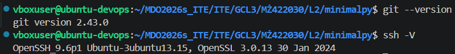

### 1.2 Klonowanie repozytorium przez HTTPS ###

W ustawieniach konta GitHub wygenerowano token, którego użyto do sklonowania repozytorium przez HTTPS:

```bash
git clone https://github.com/InzynieriaOprogramowaniaAGH/MDO2026s_ITE
```

### 1.3 Generowanie i konfiguracja kluczy SSH ###

Zgodnie z wymaganiami wygenerowano klucze SSH inne niż RSA:

```bash
ssh-keygen -t ed25519
```

Klucz publiczny dodano do ustawień konta GitHub, następnie zweryfikowano połączenie:

```bash
ssh -T git@github.com
```

### 1.4 Zarządzanie gałęziami i katalog roboczy ###

Przełączono się na gałąź grupową:

```bash
git checkout GCL3
git branch
```

Następnie utworzono nową gałąź:

```bash
git checkout -b MŻ422030
git branch
```


W katalogu grupy utworzono katalog roboczy, a także katalog na sprawozdanie.

### 1.5 Weryfikacja komunikatów commita ###

Utworzono skrypt weryfikujący, czy każdy komunikat commita zaczyna się od inicjałów i numeru indeksu:


Następnie nadano mu uprawnienia

```bash
cp commit-msg .git/hooks/commit-msg
chmod +x .git/hooks/commit-msg
```
Przykład błędnej oraz poprawnej próby commitu:


### 1.6 Publikacja zmian ###

Aby uniknąć straty czasu, na podawanie tokenu przy każdym pushu, zmieniono adres zdalny z HTTPS na SSH:

```bash
git remote set-url origin git@github.com:InzynieriaOprogramowaniaAGH/MDO2026s_ITE.git
git remote -v
```

Efekt po zmianie zdalnego adresu:

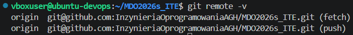

Następnie finalne zmiany zostały opublikowane:

```bash
git add .
git commit -m "MŻ422030 finalne zmiany"
git push -u origin MŻ422030
```

Finalny push:


---

## Laboratorium 2: Git, Docker ##

Celem drugiego laboratorium było przygotowanie środowiska kontenerowego do dalszej pracy. W ramach zajęć zainstalowano Dockera, przetestowano podstawowe obrazy, a następnie zbudowano własny obraz przy użyciu pliku Dockerfile.

### 2.1 Instalacja Dockera ###

Zamiast Docker Community Edition użyto pakietu docker.io bezpośrednio z repozytorium Ubuntu, zgodnie z zaleceniami prowadzącego zajęcia. Instalacja, wraz ze sprawdzeniem wersji:


```bash
sudo apt install docker.io
sudo docker version
```


Aby uniknąć uruchamiania poleceń przy użyciu sudo, dodano użytkownika do grupy docker.

### 2.2 Podstawowe obrazy ###

Po zapoznaniu się z kilkoma obrazami na Docker Hub, pobrano stamtąd kilka obrazów do przetestowania.

- hello-world

Obraz ten służy głównie do sprawdzenia działania Dockera. Uruchomiono go dwukrotnie, z flagą --rm i bez niej, aby pokazać różnicę:


- busybox

To minimalistyczny obraz z podstawowymi uniksowymi narzędziami, w jednym pliku binarnym. Przykładowe użycie oraz sprawdzenie wersji:

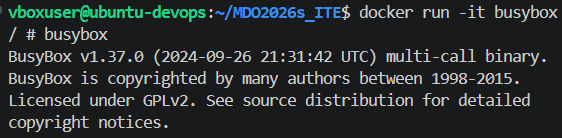

- ubuntu

Ten kontener z obrazem w trybie interaktywnym symuluje pracę z systemem operacyjnym wewnątrz kontenera. PID 1 w kontenerze, w przeciwieństwie do całego systemu, to bezpośrednio uruchomiona powłoka, co świadczy o izolacji procesów:

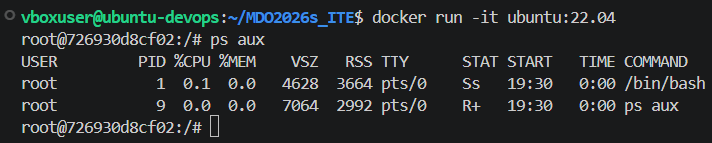
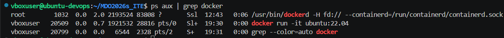

Zaktualizowano pakiety wewnątrz kontenera:

```bash
sudo apt-get update
sudo apt-get upgrade -y
```

Rozmiary pobranych kontenerów możemy sprawdzić za pomocą:

```bash
docker images
```

### 2.3 Dockerfile ###

Utworzono nowy Dockerfile zgodnie z dobrymi praktykami podanymi w instrukcji.

[F1](Dockerfile)

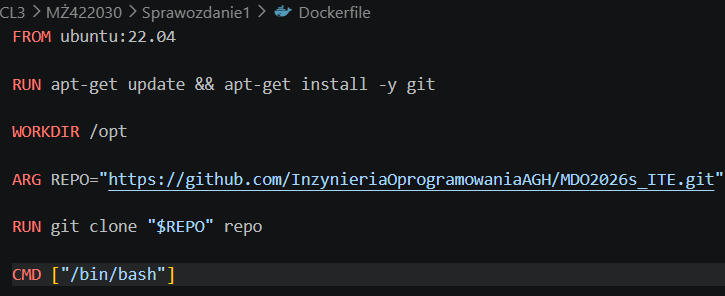

Poniżej znajduje się przykład udanego budowania i nieudanego, z powodu złego adresu klonowania repozytorium, a także widok z repozytorium wewnątrz powłoki.

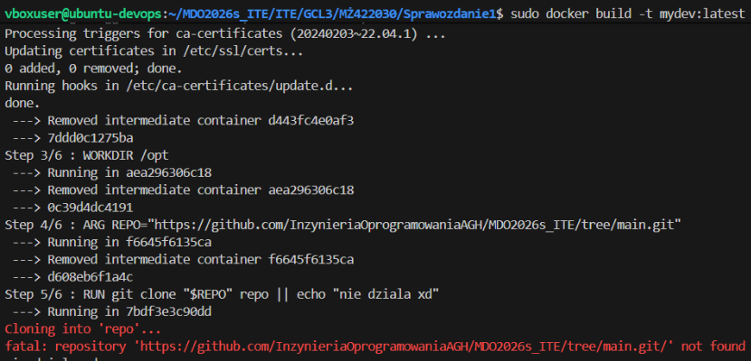


Po zakończeniu pracy należy usunąć zbędne kontenery i obrazy.


---

## Laboratorium 3: Dockerfiles, kontener jako definicja etapu ##

Celem zajęć było zbudowanie oprogramowania w powtarzalnym środowisku, które można łatwo przenieść między systemami. Proces wykonano najpierw lokalnie, potem w kontenerze, a na końcu zautomatyzowano przy użyciu dwóch plików Dockerfile.

### 3.1 Wybór oprogramowania ###

Wybrano repozytorium minimalpy, głównie ze względu na język Python. Projekt ten spełnia wymagania zadania, posiada testy jednostkowe, otwartą licencję oraz plik z zależnościami.

### 3.2 Build oraz testy lokalnie ###

Sklonowano repozytorium i zainstalowano wymagane zależności:

```bash
git clone https://github.com/blankdots/minimalpy.git
cd minimalpy
python3 -m venv .venv
source .venv/bin/activate
pip install -r requirements.txt
```

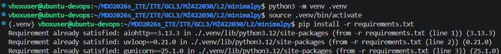

Następnie uruchomiono testy jednostkowe:


### 3.3 Build i testy w kontenerze interaktywnym ###

Przed automatyzacją przez Dockerfile powtórzono proces wewnątrz bazowego kontenera python w wersji slim. Pozwala to zweryfikować, że środowisko kontenera jest wystarczające do budowy i testowania projektu. Uruchomiono kontener, w którym doinstalowano brakujące paczki oraz Gita:

```bash
apt-get update
apt-get install -y build-essential git
pip install aiohttp uvloop pytest
git clone https://github.com/blankdots/minimalpy.git
cd minimalpy
pytest
```

Następnie znowu uruchomiono testy jednostkowe:

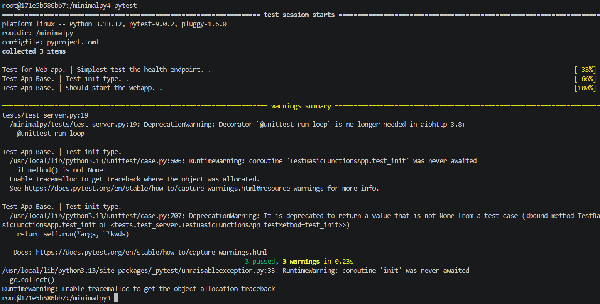

### 3.4 Dockerfile.build ###

Pierwszy plik automatyzuje wszystkie kroki aż do builda, instaluje zależności systemowe, jak i pythonowe oraz kopiuje projekt. Kontener nie uruchamia testów.

[F2](Dockerfile.build)

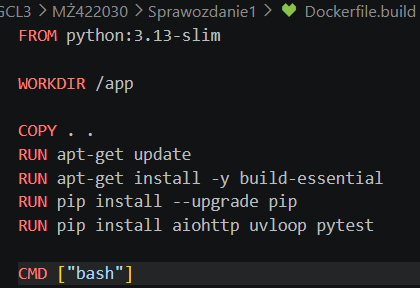

Poniżej zbudowany obraz:

```bash
docker build -t minimalpy_build -f Dockerfile.build .
```

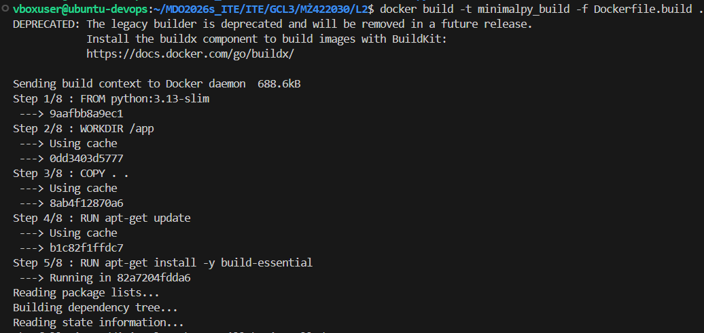

### 3.5 Dockerfile.test ###

Drugi plik bazuje na obrazie zbudowanym przez pierwszy. Nie powtarza kroków budowania, a jedynie uruchamia testy. Dzięki temu etapy są wyraźnie rozdzielone.

[F3](Dockerfile.test)

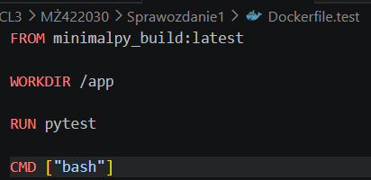

```bash
docker build -t minimalpy_test -f Dockerfile.test .
```

Zbudowany obraz testowy:


### 3.6 Weryfikacja poprawności kontenerów ###

Uruchomiono kontenery w trybie interaktywnym, aby sprawdzić ich działanie. Wewnątrz działa powłoka bash, a kontener pełni rolę izolowanego środowiska.

```bash
docker run -it minimalpy_build bash
docker run -it minimalpy_test bash
```

Poniżej obrazy oraz rozmiar kontenerów, a także widok wewnątrz powłoki.


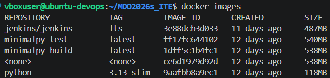

---

## Laboratorium 4: Dodatkowa terminologia w konteneryzacji, instancja Jenkins ##

Celem laboratorium było zapoznanie się z mechanizmami zachowywania stanu między kontenerami, zbadanie łączności między kontenerami przy użyciu iperfa, uruchomienie SSHD wewnątrz kontenera oraz przygotowanie skonteneryzowanej wersji Jenkinsa.

### 4.1 Woluminy, w metodzie bind mount ###

Utworzono dwa nazwane woluminy, wejściowy minpy_in i wyjściowy minpy_out:

```bash
docker volume create minpy_in
docker volume create minpy_out
docker volume ls
```

Wyniki powyższych operacji:


Zamiast klonowania przez Git zastosowano bind mount, katalog z kodem podmontowano do kontenera jako /src. Dzięki temu kontener nie potrzebuje Gita, a kod pochodzi wprost ze źródła.

```bash
docker run --rm -it --mount type=bind,src=./minimalpy,dst=/src --mount type=volume,src=minpy_in,dst=/in python:3.13-slim bash
ls /src
```


Dodatkowo zweryfikowano kod woluminu w oddzielnej sesji:

```bash
docker run --rm -it --mount type=volume,src=minpy_in,dst=/in python:3.13-slim bash
ls /in
```

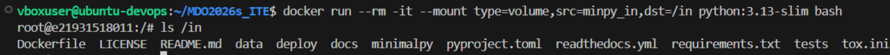

### 4.2 Build i zapis wyniku na wolumin wyjściowy ###

Uruchomiono kontener z woluminem wejściowym jako katalogiem roboczym i woluminem wyjściowym do zapisu wyników, wewnątrz kontenera uruchomiono testy:

```bash
docker run --rm -it --mount type=volume,src=minpy_in,dst=/work --mount type=volume,src=minpy_out,dst=/out python:3.13-slim bash
cd /work
pytest
```

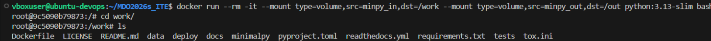


Następnie, do sprawdzenia możliwości zapisu nadpisano wolumin wyjściowy:


W celu sprawdzenia tezy o trwałości danych uruchomiono nowy kontener i odczytano zapisany plik:

```bash
docker run --rm -it --mount type=volume,src=minpy_out,dst=/out python:3.13-slim bash
cat /out/result.txt
``` 


Wolumin wejściowy usunięto i utworzono ponownie, aby zacząć od czystego stanu:

```bash
docker volume rm minpy_in
docker volume create minpy_in
docker volume ls
```


Tym razem klonowanie przeprowadzono bezpośrednio wewnątrz kontenera, za pośrednictwem Git, a wolumin służył jako miejsce docelowe:

```bash
docker run --rm -it --mount type=volume,src=minpy_in,dst=/in python:3.13-slim bash
git clone https://github.com/blankdots/minimalpy.git
cd minimalpy
pytest
```

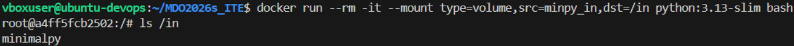

Następnie wewnątrz kontenera uruchomiono testy:


### 4.3 Klonowanie za pomocą docker build i pliku Dockerfile ###

Instrukcja RUN --mount w Dockerfile umożliwia dodanie zasobów tylko na czas wykonywania danej warstwy, a nie na trwałe. Podejście to jest wygodne i praktyczne, bardziej niż woluminy, bez potrzeby uruchamiania dodatkowych kontenerów pomocniczych.

### 4.4 Łączność pomiędzy kontenerami przez IP za pośrednictwem iperfa ###

Uruchomiono kontener z serwerem iperf3 w tle i sprawdzono jego adres IP:

```bash
docker run -d --name iperf-server networkstatic/iperf3 -s
docker inspect -f '{{range .NetworkSettings.Networks}}{{.IPAddress}}{{end}}' iperf-server
```

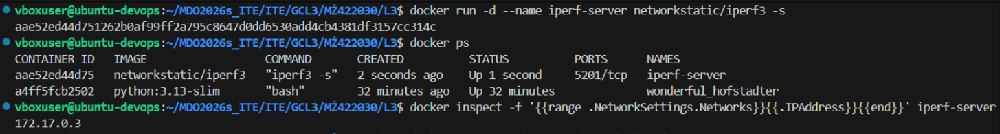

Uruchomiono drugi kontener jako klient i połączono się z serwerem po adresie IP:

```bash
docker run --rm -it networkstatic/iperf3 -c 172.17.0.3
```

W tym miejscu warto zaznaczyć, że warto sprawdzić czy adres IP serwera został poprawnie wprowadzony. Jest to częsty oraz trywialny błąd, którego niepopełnianie może zaoszczędzić wiele czasu.

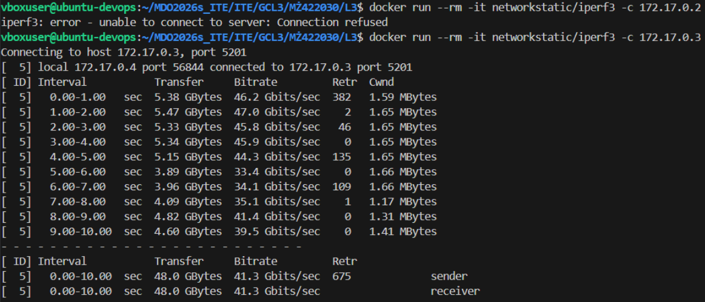

Zmierzono przepustowość, wynik wyniósł ponad 40 Gbits/s, co sugeruje, że ruch nie opuścił hosta.

### 4.5 Łączność pomiędzy kontenerami przez sieć mostkową za pośrednictwem iperfa ###

Utworzono nową sieć mostkową, która ma wbudowany DNS, dzięki czemu nie trzeba znać adresu IP, wystarczy sama nazwa kontenera:

```bash
docker network create mybridge
docker run -d --name iperf-server --network mybridge networkstatic/iperf3 -s
docker run --rm -it --network mybridge networkstatic/iperf3 -c iperf-server
```


### 4.6 Usługa SSHD w kontenerze ###

Pierwsza próba uruchomienia SSHD polegała na uruchomieniu kontenera ubuntu:

```bash
docker run -it --name sshd-test ubuntu:22.04 bash
```


Kontener miał problem z połączeniem SSH, z powodu braku poprawnej konfiguracji ustawień umożliwiających łączenie z użyciem roota. Warto pamiętać aby odkomentować zmienione ustawienia. Uruchomiono nowy kontener z wyeksponowanym portem 22 na port 2222 hosta:

```bash
docker run -it -p 2222:22 ubuntu:22.04 bash
```


Wewnątrz kontenera utworzono użytkownika i ustawiono mu hasło:

```bash
useradd -m devuser
passwd devuser
```

Następnie zweryfikowano konfigurację serwera SSH, poprzez upewnienie się że w pliku sshd_config włączono logowanie hasłem oraz uruchomiono serwer SSH w tle:


Z hosta nawiązano połączenie SSH z kontenerem jako nowo utworzony użytkownik devuser:

```bash
ssh devuser@localhost -p 2222
```

Zaletami SSH są prosty interfejs, możliwość tunelowania portów. Wadą jest wymóg zarządzania serwerem, jego użytkownikami oraz konfiguracja ustawień.


### 4.7 Uruchomienie instancji Jenkins ###

Przeprowadzono instalację skonteneryzowanej wersji Jenkinsa zgodnie z instrukcją. Uruchomiono kontener obrazu z wyeksponowanym portem 8080, a następnie pobrano hasło admina:

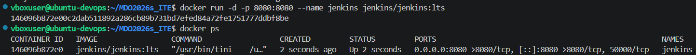

```bash
docker run -d -p 8080:8080 --name jenkins jenkins/jenkins:lts
docker ps
docker exec jenkins cat /var/jenkins_home/secrets/initialAdminPassword
```


Potem zalogowano się do panelu Jenkins w przeglądarce i zainstalowano wtyczki:


---

## Podsumowanie i wnioski ##

Pierwsze laboratorium pokazało, że konfigurowanie środowiska, wymaga kilku niezbyt skomplikowanych, za to długich kroków, które w znaczący sposób ułatwiają pracę, jak zmiana HTTPS na SSH. Git hooki mogą znaleźć zastosowanie do wymuszania konwencji commitów w repozytorium, może skutecznie eliminować błędy.

Drugie laboratorium pokazało, że praca z Dockerem może być znacznie prostsza i bardziej zrozumiała, niż wydawało mi się wcześniej. Wcześniejsze doświadczenie opierało się głównie na próbach łączenia wielu komponentów z frontendem, backendem i bazą danych w jeden obraz. Lepsze pokazanie różnicy między obrazem i kontenerem sprawiły, że całość stała się dużo bardziej zrozumiała.

Trzecie laboratorium pokazało, że podział procesu na dwa osobne Dockerfilee pozwala podzielić odpowiedzialność. Obraz buildowy nie musi wiedzieć o testach, a obraz testowy nie powtarza instalacji od zera. Gdy testy nie przechodzą, to wiadomo że problem leży w kodzie lub środowisku, a nie w procesie budowania.

Czwarte laboratorium pokazało, że bind mount pomimo prostej koncepcji, wymaga znajomości ścieżek, przez co jest mniej praktyczny. Woluminy nazwane są bardziej elastyczne, ale ich zawartość jest trudniejsza do zobaczenia. Długie instrukcje docker run z wieloma flagami są podatne na literówki, szczególnie na początku gdzie pomyłka w adresie IP czy typie potrafi zabrać dużo czasu.

---

## Uwagi ##

W tym miejscu chciałbym zaznaczyć, że plik z historią w formacie Markdown, podobnie jak pozostałe pliki znajduje się w tym samym folderze co sprawozdanie, warto dodać że część historii mogła zostać nadpisana między równoległymi sesjami terminali.

[F4](history.md)