# Sprawozdanie 2 #

**Autor:** Mateusz Żydek
**Grupa:** GCL3

---

## Środowisko pracy ##

Wszystkie laboratoria realizowane były na maszynie wirtualnej Ubuntu uruchomionej w VirtualBox na hoście z systemem Windows 11. Połączenie z maszyną wirtualną nawiązywano przez Visual Studio Code i Remote-SSH. Na maszynie wirtualnej uruchomiono Jenkinsa w kontenerze Docker, a jako backend do budowania i testowania użyto kontenera Docker-in-Docker.

---

## Laboratorium 5: Pipeline, Jenkins, izolacja etapów ##

Celem zajęć było przygotowanie łańcucha CI/CD w oparciu o Jenkinsa, w którym kolejne etapy są izolowane w osobnych kontenerach.

### 5.1 Przygotowanie instancji Jenkins ###

Na początku upewniono się że obrazy budujące i testujące działają. Następnie zapoznano się z instrukcją Jenkinsa. Uruchomienie Jenkinsa wymagało kontenera Jenkinsa z interfejsem Blue Ocean oraz drugiego z serwerem DIND. Blue Ocean jako nakładka na Jenkinsa daje dostęp do przystępnego interfejsu graficznego.

Utworzono dedykowaną sieć Dockera, a następnie uruchomiono kontener Docker-in-Docker:

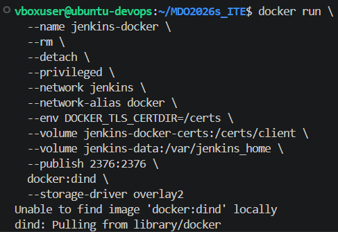

Zbudowano obraz Blue Ocean na podstawie obrazu Jenkinsa:

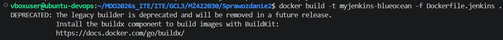

Uruchomiono kontener Blue Ocean:

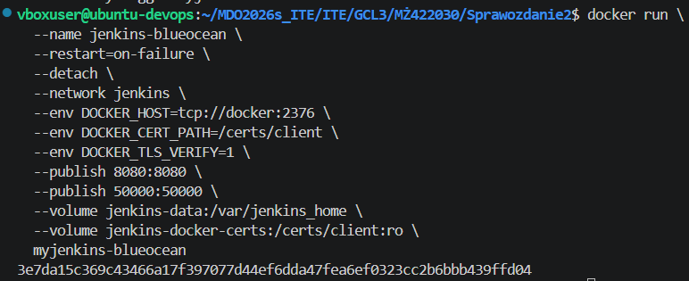

W kolejnym kroku sprawdzono działanie obu kontenerów:

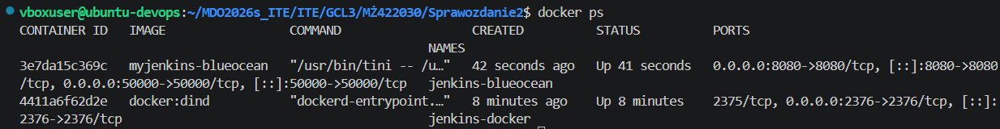

Wolumin jenkins-data zabezpiecza dane Jenkinsa, które przeżywają restart kontenera.

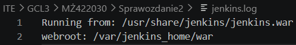

### 5.2 Pierwsza konfiguracja Jenkins ###

Po uruchomieniu zalogowano się do panelu, pobrano hasło i wykonano podstawową konfigurację. Następnie zainstalowano niezbędne wtyczki.

### 5.3 Zadania wstępne ###

W ramach potwierdzenia poprawności działania Jenkinsa wykonano trzy krótkie zadania testowe.

- Wyświetlanie uname

Pierwszym zadaniem było wyświetlenie informacji o systemie. Pozwoliło to potwierdzić działanie kroków w powłoce.

```bash
uname
```

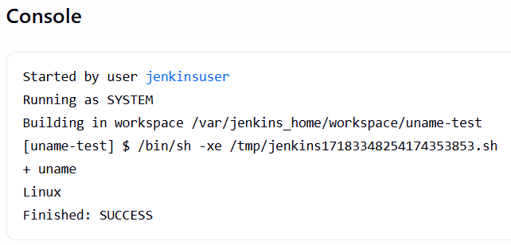

- Błąd przy nieparzystej godzinie

Drugie zadanie sprawdzało warunkowe zakończenie, poprzez zwracanie błędu w sytuacji, gdy godzina jest nieparzysta.

```bash
hour=$(date +%H)
if [ $((hour % 2)) -eq 1 ]; then
  echo "Godzina nieparzysta ($hour) <<< BŁĄD"
  exit 1
fi
echo "Godzina parzysta ($hour) <<< OKEJ"
```

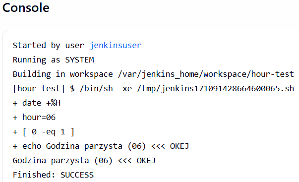

- Pobranie obrazu Ubuntu

Trzecie zadanie polegało na pobraniu obrazu Ubuntu z Docker Hub z poziomu projektu w Jenkinsie. Etap ten potwierdza, czy środowisko ma działający dostęp do Dockera i może działać na obrazach.

```bash
docker pull ubuntu
```

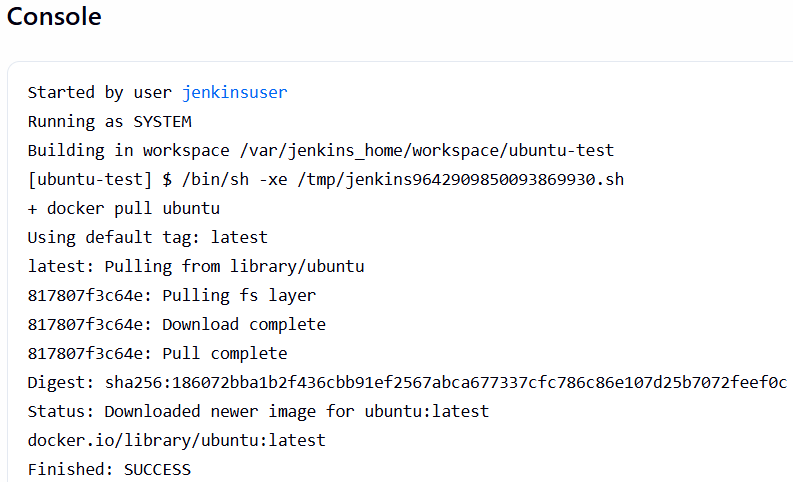

W tym miejscu warto podkreślić znaczenie tego testu. Problemy z Dockerem w Jenkinsie, objawiające się brakiem połączenia z siecią, nie zawsze wynikają z istniejących błędów. Często ich przyczyną, jak w moim przypadku jest niedziałający lub zatrzymany kontener DIND.

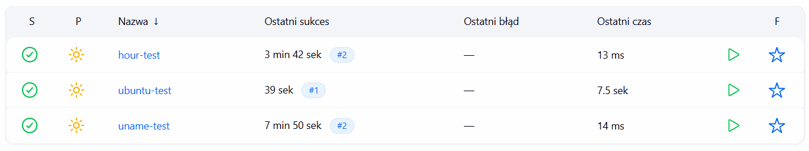

### 5.4 Utworzenie obiektu typu pipeline ###

Następnie utworzono nowy obiekt typu pipeline z treścią bezpośrednio w konfiguracji obiektu. Pipeline służył do klonowania repozytorium i budował Dockerfile.

```groovy
pipeline {
    agent any

    stages {
        stage('Clone') {
            steps {
                git url: 'https://github.com/InzynieriaOprogramowaniaAGH/MDO2026s_ITE.git',
                    branch: 'MŻ422030'
            }
        }

        stage('Build') {
            steps {
                sh 'docker build -t minimalpy_build -f ITE/GCL3/MŻ422030/Sprawozdanie1/Dockerfile.build .'
            }
        }
    }
}
```

Warto zaznaczyć, że checkout można pominąć poprzez klonowanie z podaną gałęzią. Fragment z klonowaniem:

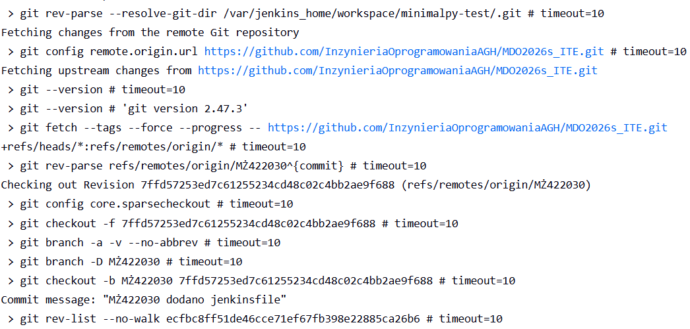

### 5.5 Pierwsze uruchomienie pipeline ###

W kroku Clone pipeline pobierał repozytorium przedmiotowe. Po sklonowaniu repozytorium w kroku Build uruchomiono docker build.

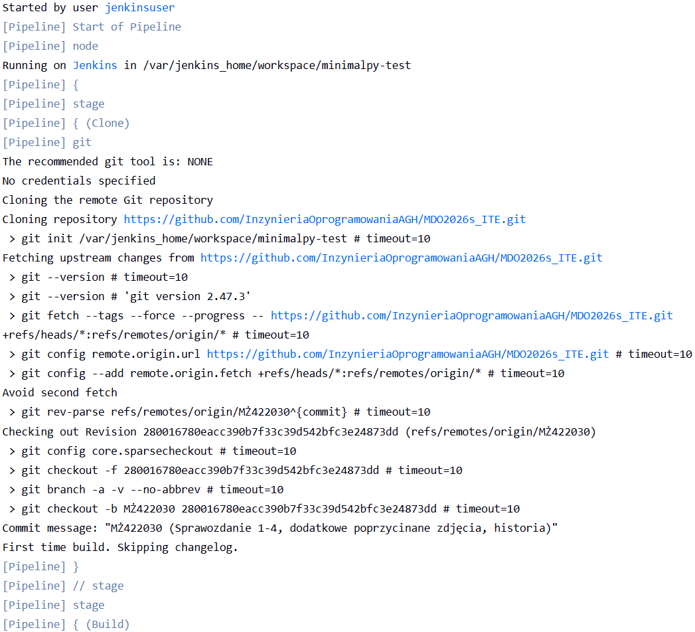

### 5.6 Ponowne uruchomienie pipeline ###

Pipeline został uruchomiony ponownie, aby potwierdzić, że działa więcej niż jeden raz i nie opiera się na jednorazowym stanie wewnątrz środowiska.


---

## Laboratorium 6: Pipeline, lista kontrolna ##

W tym etapie celem było uporządkowanie planu na pipeline i sprawdzenie, które elementy ścieżki krytycznej są już gotowe, a które wymagają dalszej implementacji, bądź poprawy.

### 6.1 Ścieżka krytyczna ###

Poniżej zaprezentowana ścieżka jest zgodna z diagramem UML zaprezentowanym poniżej:

- commit/manual trigger - pipeline jest uruchamiany ręcznie z poziomu Jenkinsa lub przez zmianę kodu w repozytorium,
- clone - repozytorium jest pobierane poprawnie z gałęzi wraz z submodułem z kodem aplikacji,
- build - obraz buildowy buduje się wewnątrz Dockera,
- test - testy są uruchamiane w osobnym kontenerze opartym o poprzedni obraz,
- deploy - uruchomienie kontenera aplikacji na porcie 5430,
- publish - publikacja obrazu na Docker Hub oraz archiwizacja artefaktów w Jenkinsie.

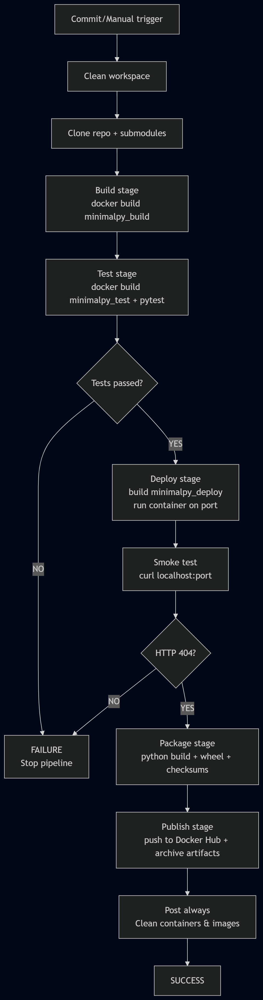

### 6.2 Realizacja listy kontrolnej ###

| Element listy kontrolnej | Opis realizacji podpunktu |
|---|---|
| Aplikacja została wybrana | Wybrano minimalpy, prosty serwer HTTP oparty o aiohttp |
| Licencja potwierdza możliwość użycia kodu | Projekt posiada licencję MIT |
| Wybrany program buduje się | Build wykonuje się poprawnie w kontenerze |
| Przechodzą testy | Testy jednostkowe przechodzą w kontenerze testowym |
| Decyzja o forku | Fork jest niepotrzebny, użyto submodule |
| Diagram UML CI/CD | Przygotowano diagram widoczny powyżej |
| Kontener bazowy/wstępny | python:3.13-slim z doinstalowanymi zależnościami |
| Build wewnątrz kontenera | Dockerfile.build budowany przez Jenkinsa |
| Testy wewnątrz kolejnego kontenera | Dockerfile.test osobny kontener |
| Kontener testowy oparty o build | Dockerfile.test bazuje na minimalpy_build |
| Logi jako artefakt | Pliki .log archiwizowane przez Jenkins. |
| Kontener deploy | Uruchamia aplikację na porcie 5430 |
| Buildowy kontener jako deploy/osobny deploy | Kontener buildowy posiada elementy niepotrzebne do produkcji |
| Wersjonowany kontener deploy wdrażany na Docker | Użyto tagu APP_VERSION-BUILD_NUMBER |
| Smoke test | Weryfikacja odpowiedzi HTTP, oczekiwany kod 404 |
| Zdefiniowany artefakt | Obraz Docker oraz paczki Pythona |
| Uzasadnienie wyboru artefaktu | Wygodny do wdrożenia, paczka .whl nadaje się do archiwizacji |
| Wersjonowanie artefaktu | Semantyczne wersjonowanie z numerem buildu |
| Dostępność artefaktu | Docker Hub i archiwum builda Jenkins |
| Identyfikacja pochodzenia artefaktu | Tag obrazu i sumy SHA256 |
| Pliki Dockerfile i Jenkinsfile w repo | Razem z plikami |
| Zgodność UML z Jenkinsfile | Potwierdzona |

### 6.3 Wybór aplikacji i decyzja o strukturze projektu ###

Za wyborem minimalpy przemawia spełnianie wymagań, bez wprowadzania zbędnej złożoności, otwarta licencja oraz proste testy. Nie było potrzeby forkowania całego projektu, wystarczyła praca z submodułem wskazującym na oryginał.

### 6.4 Wybór kontenera bazowego ###

Jako kontener bazowy do budowania wykorzystano obraz python:3.13-slim, ponieważ zapewnia środowisko Pythonowe o relatywnie niewielkim rozmiarze oraz pozwala doinstalować brakujące zależności. Kontener testowy nie musi powtarzać tego kroku, ponieważ bazuje na kontenerze buildowym.

### 6.5 Artefakty i wersjonowanie ###

Produktem końcowym będzie wersjonowany obraz, a także paczki Pythonowe, takie jak .whl, .tar.gz oraz plik checksums.txt z sumami SHA256. Wersjonowanie rozwiązano przez połączenie numeru wersji aplikacji z numerem builda w Jenkinsie, dzięki temu można zidentyfikować, z którego przejścia pipeline pochodzi dany obraz i na jakiej wersji bazuje.

---

## Laboratorium 7: Jenkinsfile, lista kontrolna ##

Pipeline został przeniesiony do repozytorium w postaci pliku Jenkinsfile, aby definicja procesu nie znajdowała się wyłącznie w ustawieniach obiektu Jenkins. Dzięki temu sama infrastruktura CI/CD staje się częścią kodu, podlega wersjonowaniu i może być odtwarzana bez ręcznej konfiguracji.

### 7.1 Przepis pobierany z SCM ###

Pipeline został umieszczony w repozytorium pod postacią Jenkinsfile, a w konfiguracji pliku zmieniono definicję na Pipeline script from SCM, dodano repozytorium, gałąź oraz ścieżkę do tego pliku.

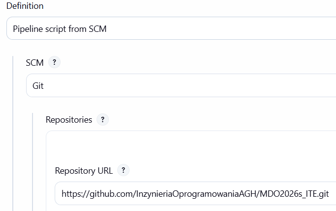

Pełna treść pliku:

```groovy
pipeline {
    agent any

    environment {
        APP_VERSION = '0.6.0'
        IMAGE_TAG = "${APP_VERSION}-${BUILD_NUMBER}"
        APP_DIR = 'ITE/GCL3/MŻ422030/minimalpy-jenkins'
    }

    stages {

        stage('Clean') {
            steps {
                cleanWs()
            }
        }

        stage('Clone') {
            steps {
                git url: 'https://github.com/InzynieriaOprogramowaniaAGH/MDO2026s_ITE.git', branch: 'MŻ422030'
                sh 'git submodule update --init --recursive'
            }
        }

        stage('Build') {
            steps {
                sh "docker build -t minimalpy_build:${IMAGE_TAG} -t minimalpy_build:latest -f ${APP_DIR}/Dockerfile.build ${APP_DIR}/app 2>&1 | tee build.log"
            }
        }

        stage('Test') {
            steps {
                sh "docker build -t minimalpy_test:${IMAGE_TAG} -f ${APP_DIR}/Dockerfile.test ${APP_DIR}/app 2>&1 | tee test.log"
            }
        }

        stage('Deploy') {
            steps {
                sh 'docker rm -f minimalpy_app || true'
                sh "docker build -t minimalpy_deploy:${IMAGE_TAG} -f ${APP_DIR}/Dockerfile.deploy ${APP_DIR}/app 2>&1 | tee deploy.log"
                sh "docker run -d --name minimalpy_app -p 5430:5430 minimalpy_deploy:${IMAGE_TAG}"
                sh 'sleep 3'
            }
        }

        stage('Smoke test') {
            steps {
                sh 'docker run --rm --network host curlimages/curl:latest -s -o /dev/null -w "%{http_code}" http://localhost:5430 | grep -qx 404'
            }
        }

        stage('Package') {
            steps {
                sh "docker run --rm -v \$PWD/${APP_DIR}/app:/app -w /app python:3.13-slim bash -c 'pip install build wheel setuptools && python -m build && python -m compileall . 2>&1' | tee artifacts.log"
                sh "find ${APP_DIR}/app/dist -type f -exec sha256sum {} \\; > ${APP_DIR}/app/checksums.txt"
            }
        }

        stage('Publish') {
            steps {
                withCredentials([usernamePassword(credentialsId: 'dockerhub-credentials', usernameVariable: 'DOCKER_USER', passwordVariable: 'DOCKER_PASS')]) {
                    sh 'echo "$DOCKER_PASS" | docker login -u "$DOCKER_USER" --password-stdin'
                    sh "docker tag minimalpy_deploy:${IMAGE_TAG} \$DOCKER_USER/minimalpy:${IMAGE_TAG}"
                    sh "docker tag minimalpy_deploy:${IMAGE_TAG} \$DOCKER_USER/minimalpy:latest"
                    sh "docker push \$DOCKER_USER/minimalpy:${IMAGE_TAG}"
                    sh "docker push \$DOCKER_USER/minimalpy:latest"
                    sh 'docker logout'
                }
                archiveArtifacts artifacts: "${APP_DIR}/app/dist/**", fingerprint: true
                archiveArtifacts artifacts: "${APP_DIR}/app/checksums.txt", fingerprint: true
                archiveArtifacts artifacts: '*.log', fingerprint: true
            }
        }
    }

    post {
        always {
            sh 'docker rm -f minimalpy_app || true'
            sh "docker rmi minimalpy_build:${IMAGE_TAG} minimalpy_build:latest minimalpy_test:${IMAGE_TAG} minimalpy_deploy:${IMAGE_TAG} || true"
        }
        success {
            echo "Sukces. Obraz: minimalpy:${IMAGE_TAG}"
        }
        failure {
            echo "Błąd. Sprawdź logi."
        }
    }
}
```

### 7.2 Czyszczenie workspace ###

Pipeline rozpoczyna się od cleanWs(), dzięki czemu każdorazowo pracuje na świeżym workspace. To ważne, ponieważ pozwala mieć pewność, że każdorazowo kolejny build nie bazuje na pozostałościach, a na aktualnym stanie repozytorium.

### 7.3 Etap Clone ###

Etap Clone pobiera repozytorium przedmiotowe z gałęzi, a następnie zostaje pobrany kod aplikacji jako submoduł. Dzięki submodułowi możemy uniknąć antywzorca, jakim są dwa niezależne źródła prawdy, co zostało poruszone na zajęciach. 

### 7.4 Etap Build ###

Etap Build dysponuje repozytorium oraz sklonowanymi plikami Dockerfile, ponieważ repozytorium zostało sklonowane w poprzednim kroku. Build tworzy obraz z dwoma tagami wersjonowanym oraz stosowanym wcześniej latest, na którym opierają się pozostałe pliki Dockerfile.

### 7.5 Etap Test ###

Etap Test przeprowadza testy w oddzielnym kontenerze opartym o poprzedni obraz, ale nie powtarza instalacji zależności od zera. Zaletą zastosowania izolacji jest łatwiejsza diagnoza problemów dotyczących kodu oraz środowiska.

### 7.6 Etap Deploy ###

Etap Deploy buduje obraz z entrypointem i uruchamia kontener na wskazanym porcie, zdefiniowanym w dokumentacji. Przed uruchomieniem poprzedni kontener jest usuwany, jeśli istnieje. Kontener buildowy, w przeciwieństwie do deployowego zawiera zbędne komponenty, takie jak git, czy build-essential, dlatego obecność oddzielnego pliku pozwala zredukować rozmiar zdeployowanej wersji.

### 7.7 Etap Smoke test ###

Etap Smoke test jest wykonywany z wykorzystaniem obrazu curlimages/curl. Obraz ten, mimo braku oficjalnej weryfikacji na Docker Hub, jest szeroko stosowany oraz dostępny również w rejestrze quay.io. Test polega na wysłaniu żądania HTTP do uruchomionej aplikacji. Oczekiwanym wynikiem jest kod 404, ponieważ aplikacja i tak nie udostępnia endpointu, jednak sama odpowiedź potwierdza poprawne działanie. Test wykonywany jest w osobnym kontenerze, wyniki tego i poprzedniego etapu są widoczne poniżej:

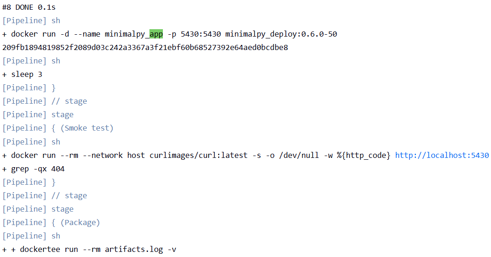

### 7.8 Etap Package ###

Etap Package przygotuje artefakty z wersjonowaniem. Wewnątrz kontenera python:3.13-slim tworzone są paczki .whl jako archiwum źródłowe oraz .tar.gz gotowe do użycia. W kolejnym kroku zostaje wygenerowany plik z sumami SHA256. Artefakty wraz z logami:

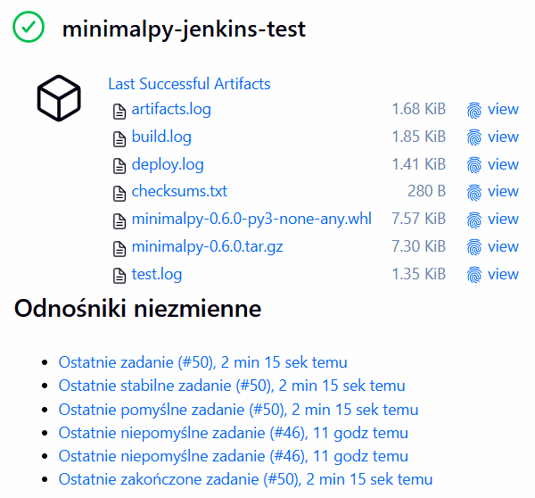

### 7.9 Etap Publish ###

Etap Publish wysyła obraz docelowy do Docker Hub z tagami latest oraz z wersją. Logowanie odbywa się przez credentials, przechowywane bezpiecznie w Jenkinsie, bez śladu obecności w kodzie. Artefakty i logi są archiwizowane przez archiveArtifacts z fingerprintem. Wyniki tego etapu wraz z potwierdzeniem działania wersjonowania poniżej:

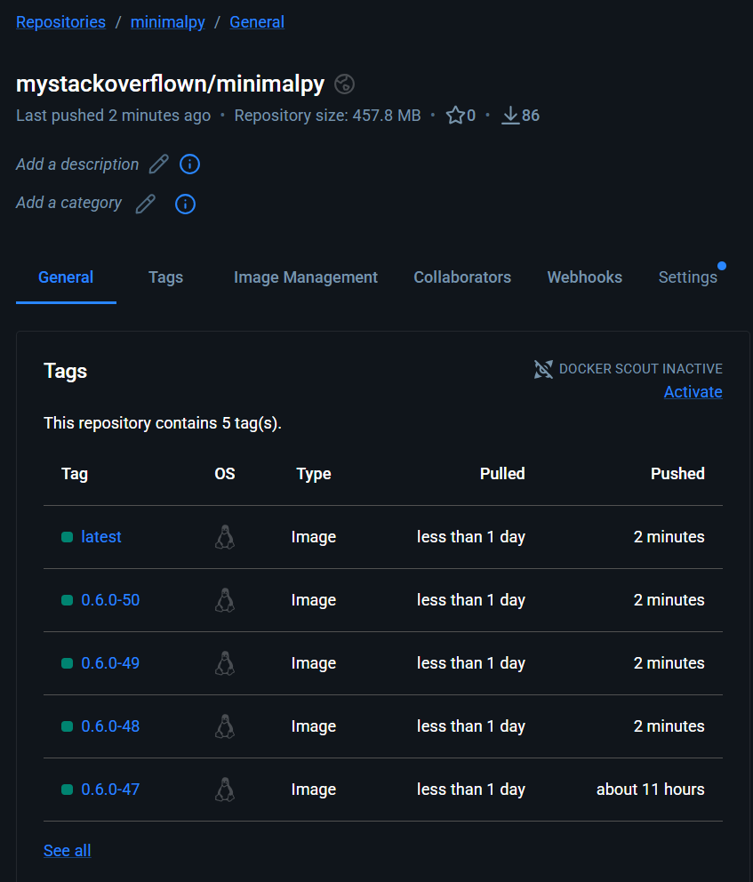

### 7.10 Ponowne uruchomienie ###

Pipeline został uruchomiony wielokrotnie, za każdym razem jego działanie zakończyło się sukcesem:

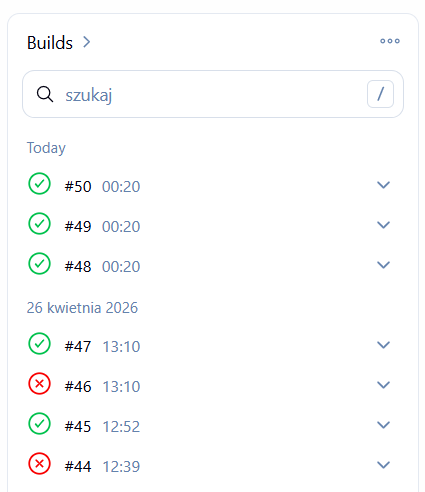

### 7.11 Definicja done ###

Proces można uznać za udany, gdy artefakty będące rezultatem można wdrożyć. W tym konkretnym przypadku są to wersjonowane obrazy w rejestrze, odpowiednia paczka i sumy kontrolne oraz działający kontener wdrożeniowy z pozytywnym smoke testem. W ten sposób zachowany obraz może zostać pobrany i uruchomiony co przedstawiono poniżej:

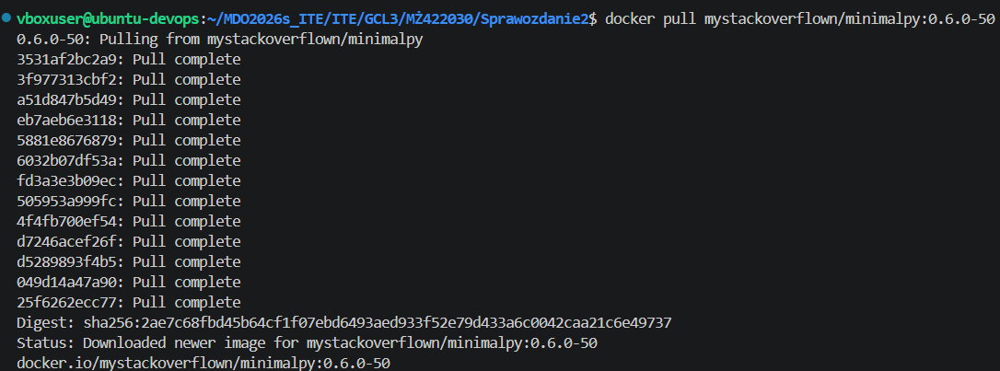
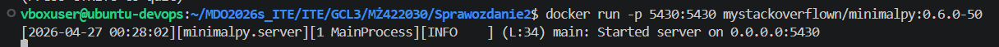

### 7.12 Weryfikacja zgodności ###

Diagram UML jest zgodny z implementacją, pipeline realizuje ścieżkę krytyczną, a etapy wykonują się zgodnie z planem. Nie występują znaczące rozbieżności pomiędzy implementacją, a diagramem, w którym znajdują się jedynie dodatkowe etapy pomocnicze, takie jak chociażby Clean. Jedyną faktyczną rozbieżnością jest wyodrębnienie etapu Package od Publish.

---

### Podsumowanie i wnioski ###

Piąte laboratorium pokazało jak ważna jest poprawna konfiguracja i przetestowanie Jenkinsa w środowisku skonteneryzowanym z DIND. Problemy z dostępem do Dockera z poziomu Jenkinsa często wynikają nie z błędów sieciowych, ale z zatrzymanego lub źle skonfigurowanego kontenera DIND.

Szóste laboratorium pokazało że dobry pipeline to nie taki który jedynie działa, ale wymaga odpowiednich decyzji dotyczących architektury, odpowiedni wybór kontenera bazowego, sposób wersjonowania oraz izolacja etapów pozwala szybko diagnozować i rozwiązywać problemy, aby utrzymać działanie procesu.

Siódme laboratorium pokazało że przechowywanie Jenkinsfile w repozytorium to fundamentalna, jak i praktyczna decyzja. Pipeline stanowi część kodu i podlega takim samym zasadom, może być odtworzony na innym środowisku bez ręcznej konfiguracji. Kolejnym ważnym elementem jest unikanie antywzorców, zastosowanie submodułu, to jeden ze sposobów który pozwala nam wyeliminować dwa źródła prawdy.