# Sprawozdanie 3 #

**Autor:** Mateusz Żydek  
**Grupa:** GCL3

---

## Środowisko pracy ##

Wszystkie laboratoria realizowane były na głównej maszynie wirtualnej Ubuntu uruchomionej w VirtualBox na hoście z systemem Windows 11. Połączenie nawiązywano za pomocą SSH z poziomu Visual Studio Code oraz Remote-SSH. W zależności od zadań środowisko było rozbudowywane o dodatkowe maszyny wirtualne Ubuntu, instancje instalacyjne Fedora Server oraz lokalny klaster Kubernetes zarządzany przez Minikube.

---

## Laboratorium 8: Automatyzacja i zdalne wykonywanie poleceń za pomocą Ansible

Celem zajęć było zapoznanie się z Ansible, przygotowanie inwentaryzacji oraz automatyzacji wdrażania artefaktów z wcześniejszych laboratoriów.

### 8.1 Przygotowanie połączenia i wymiana kluczy

Utworzono drugą, minimalistyczną maszynę wirtualną Ubuntu o nazwie ansible-target z serwerem OpenSSH oraz narzędziem tar.

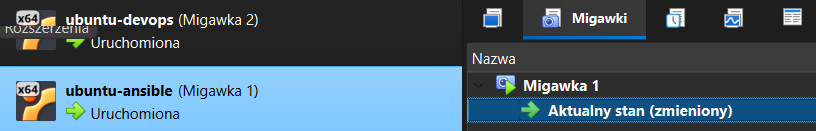

Na maszynie głównej zainstalowano pakiet Ansible, skonfigurowano oraz przetestowano połączenie.

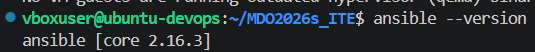
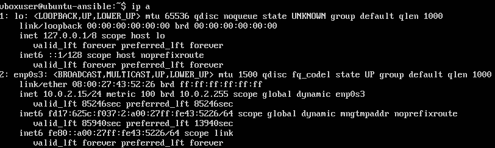
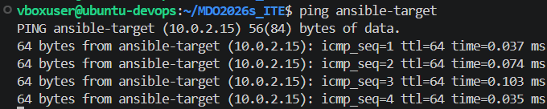

Następnie utworzony klucz przesłano na maszynę docelową, za pomocą ssh-copy-id i przetestowano połączenie.

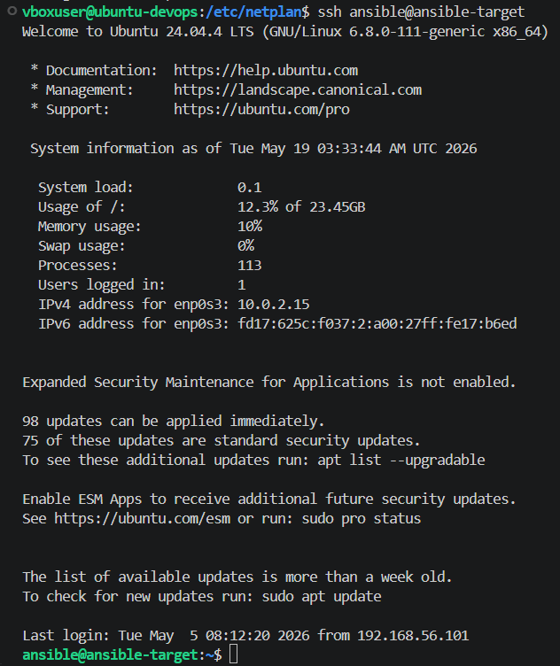

### 8.2 Inwentaryzacja i konfiguracja sieci

Aby uniknąć odwoływania się do maszyn po adresach IP, skonfigurowano plik hosts, przypisując stałe nazwy do adresów IP.

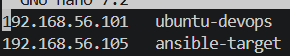

Następnie przygotowano i przetestowano prosty plik inwentaryzacji i wykonano testowy ping do maszyn w celu sprawdzenia łączności.

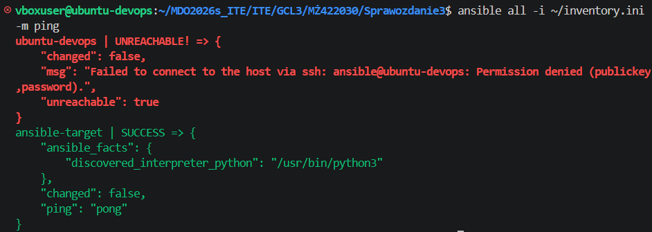
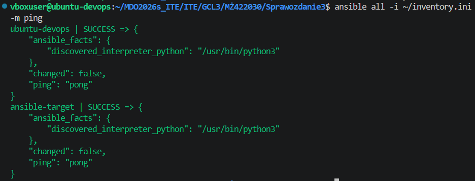
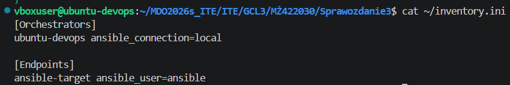

### 8.3 Tworzenie playbooka i weryfikacja łączności

 Następnie napisano prosty skrypt konfiguracyjny w formacie YAML, czyli playbook. Pierwszym krokiem w strukturze playbooka było wywołanie modułu, który w przeciwieństwie do pinga sieciowego, sprawdza czy na maszynie docelowej dostępny jest interpreter zdolny do przetwarzania instrukcji Ansible.

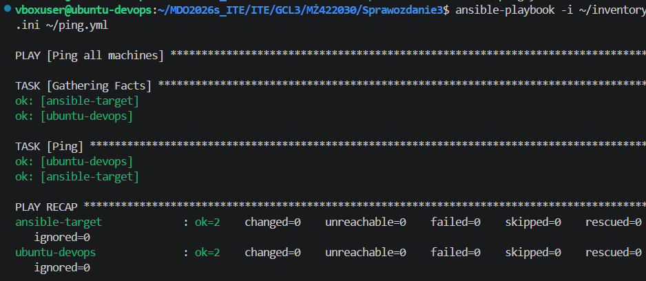
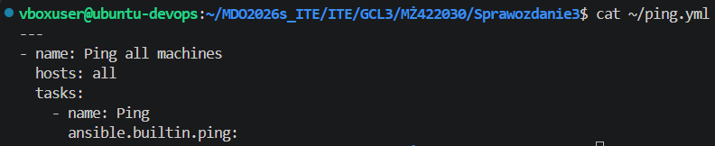

### 8.4 Testy na przykładzie kopiowania plików

 Do playbooka dopisano zadanie kopiujące lokalny plik inwentaryzacji do katalogu domowego na maszynie z grupy endpoints.

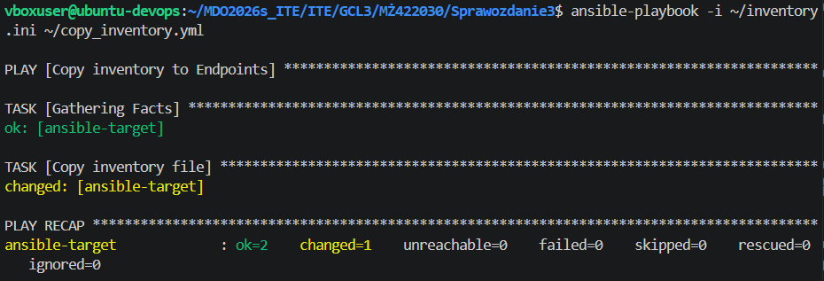
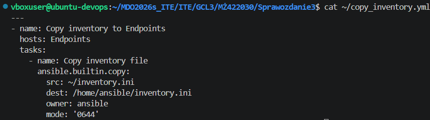

Podczas pierwszego uruchomienia zadanie zwróciło status changed, co oznacza fizyczne utworzenie nowego pliku. Ponowne uruchomienie playbooka poskutkowało statusem ok. Ansible porównał sumy kontrolne i uznał, że stan docelowy został już osiągnięty, nie wykonał kolejnej operacji zapisu.

### 8.5 Aktualizacja pakietów i zarządzanie usługami systemowymi

Rozbudowano playbook o zadania wymagające podniesienia uprawnień administratora. Wykorzystano moduł, który miał za zadanie zarządzanie pakietami do odświeżenia repozytoriów i pełnej aktualizacji systemu.

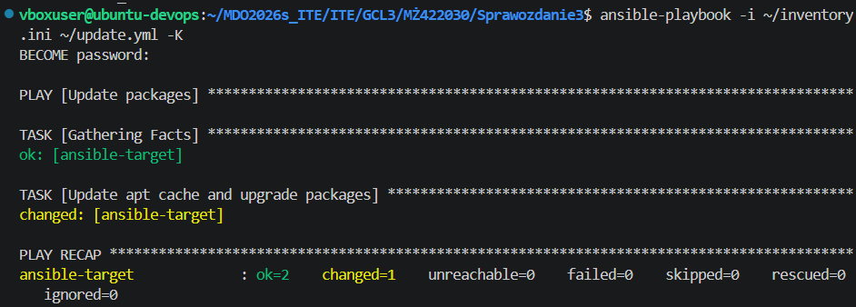
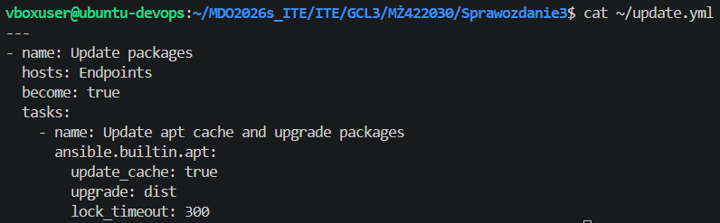

W kolejnym kroku zaimplementowano restart serwera SSH oraz generatora liczb losowych.

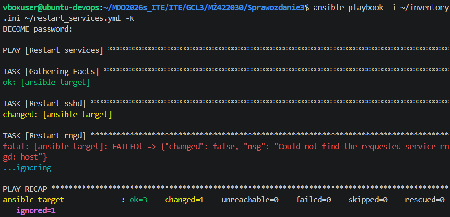
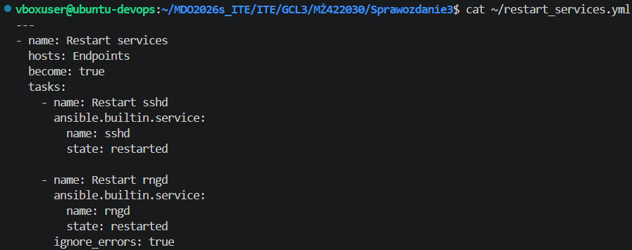

### 8.6 Test odporności na awarie maszyn i sieci

W celu zbadania automatyzacji w warunkach krytycznych, zasymulowano awarię, na maszynie docelowej celowo zatrzymano usługę OpenSSH.

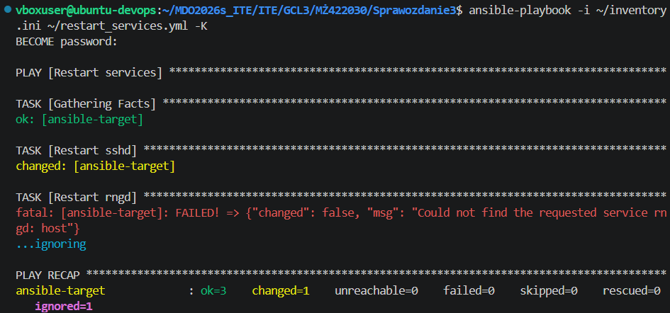

Ansible zareagował prawidłowo, przerwał próbę wykonania zadań dla niedostępnego hosta, wyrzucając komunikat o błędzie. Awaria jednego hosta końcowego izoluje błędy i nie psuje pracy playbooka na pozostałych maszynach.

### 8.7 Automatyzacja wdrożenia kontenera aplikacji

Napisano playbook instalujący środowisko Docker na czystym systemie, pobierający wskazany obraz z Docker Hub i uruchamiający kontener aplikacji.

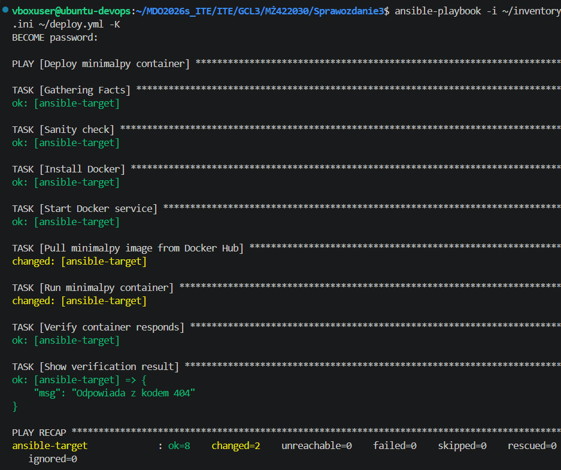
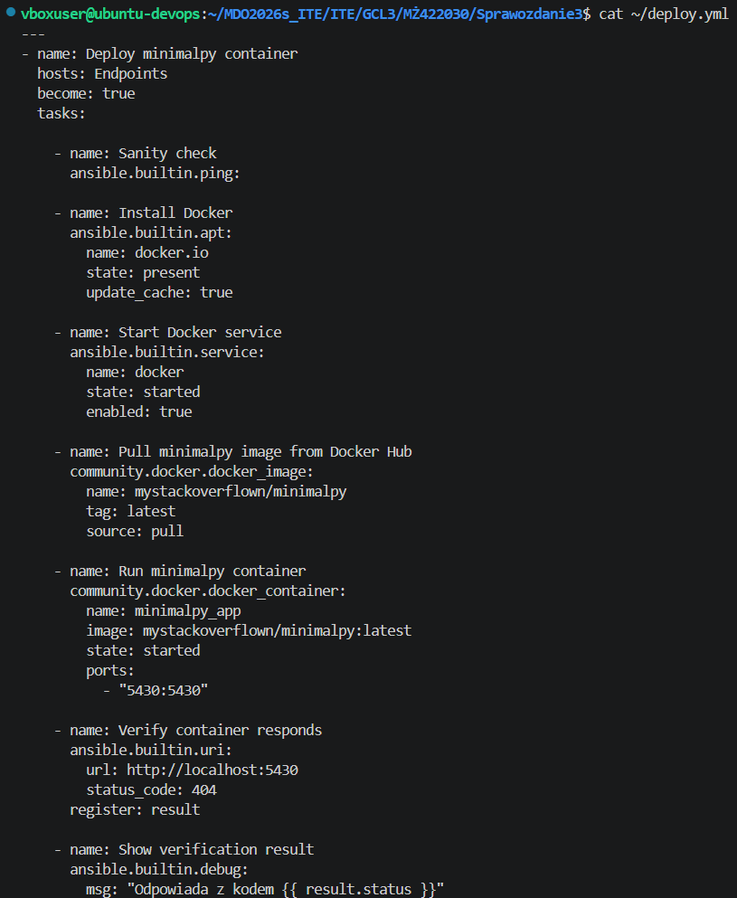

W ramach wdrożenia zaimplementowano sanity check, skrypt odpytał wystawiony port aplikacji, sprawdzając, czy kontener faktycznie działa i poprawnie zwraca kod odpowiedzi.

### 8.8 Czyszczenie środowiska docelowego

Zgodnie z dobrymi praktykami, przygotowano sekwencję czyszczącą środowisko po zakończonych testach.

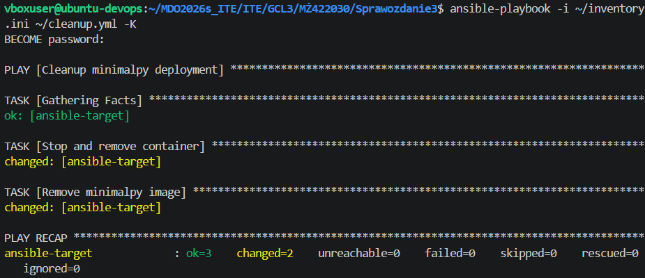
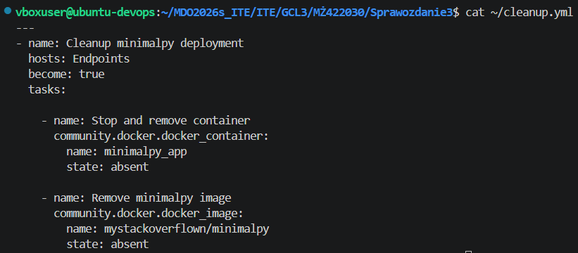

Działający kontener aplikacji został zatrzymany, a następnie usunięty wraz z powiązanymi zasobami, co przywróciło maszynę do stanu początkowego.

### 8.9 Strukturyzacja kodu z wykorzystaniem Ansible Galaxy

Aby uniknąć antywzorca monolitu polegającego na trzymaniu wszystkich zadań w jednym, monstrualnym pliku, przeprowadzono refaktoryzację. Wykorzystano narzędzie ansible-galaxy do wygenerowania modułowego szkieletu:

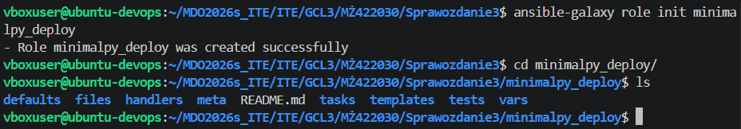

W pliku metadanych uzupełniono informacje o autorze oraz platformach.

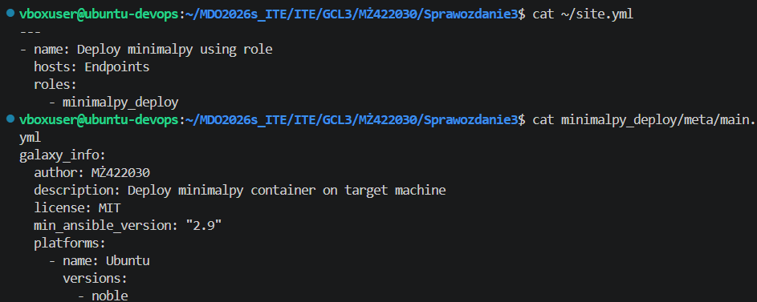

Dotychczasowe zadania podzielono i przeniesiono do pliku strukturalnego.

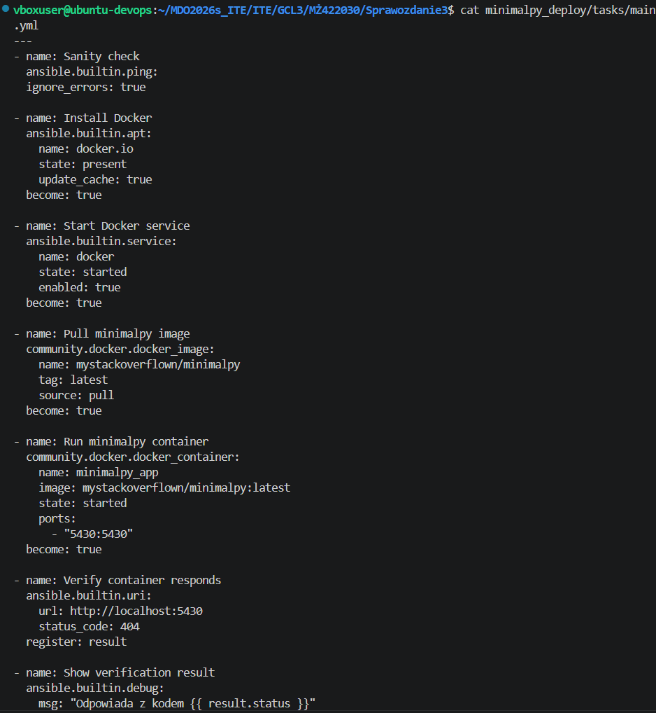

Dzięki takiemu podejściu, główny plik projektu został  odchudzony, jego zadaniem jest teraz jedynie wskazanie hostów oraz wywołanie stworzonej roli minimalpy_deploy.

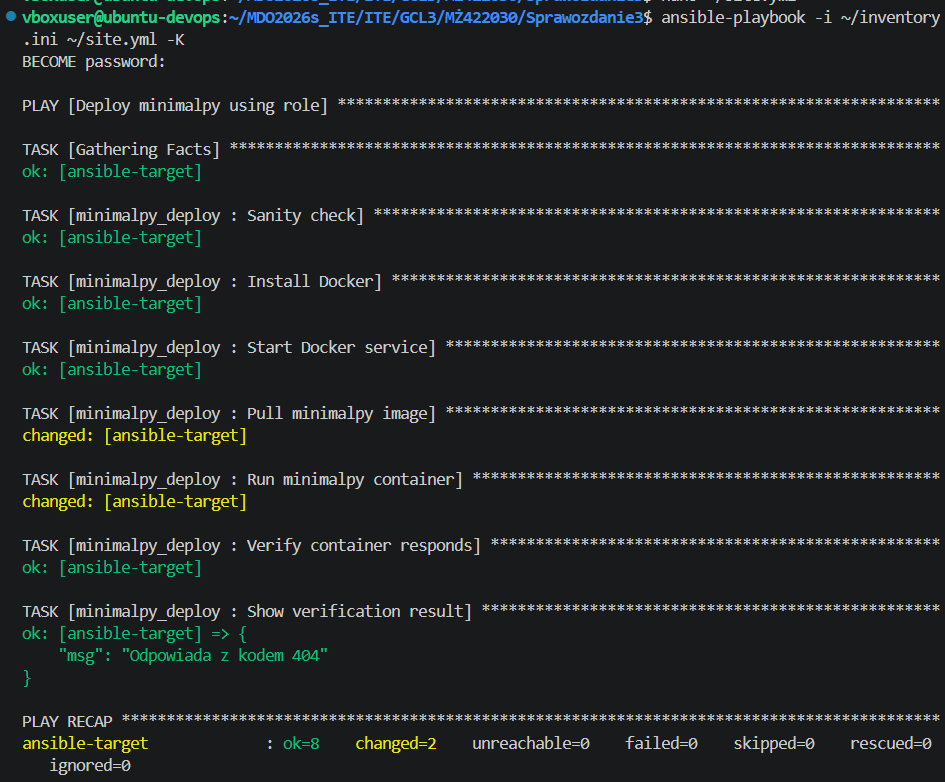

---

## Laboratorium 9: Pliki odpowiedzi dla wdrożeń nienadzorowanych

Celem laboratorium było pełne zautomatyzowanie procesu instalacji Fedora Server przy użyciu pliku odpowiedzi Anaconda. Konfiguracja miała na celu stworzenie środowiska, które bezpośrednio po instalacji i rozruchu automatycznie uruchomi oraz zacznie hostować aplikację.

### 9.1 Przygotowanie i sieciowe udostępnienie pliku

Instalator systemu Fedora wymaga dostępu do pliku odpowiedzi w trakcie bootowania maszyny. Konfigurację zahostowano jako GitHub Gist, co zapewniło do niej bezpośredni dostęp sieciowy podczas rozruchu instalatora.

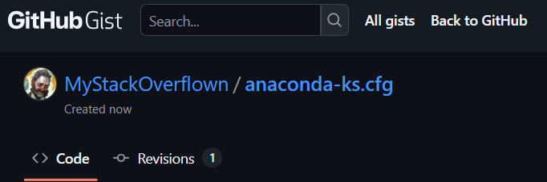
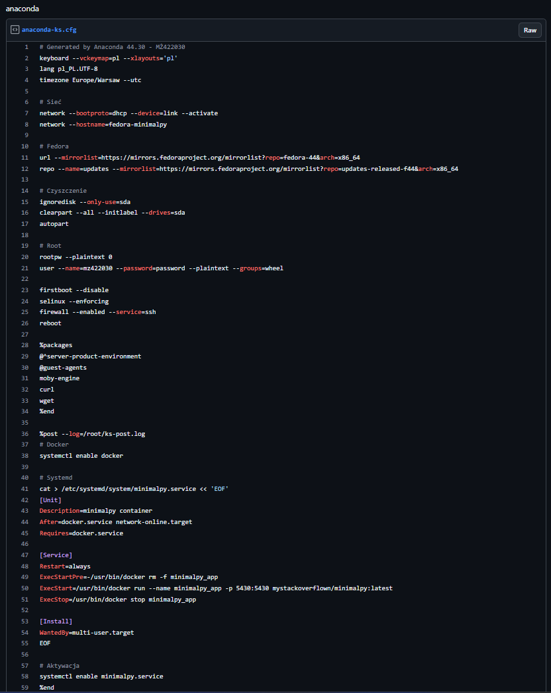

Plik zawierał dyrektywy automatycznego czyszczenia partycji, konfiguracji użytkowników, strefy czasowej oraz skrypty działające po instalacji.

### 9.2 Inicjalizacja nienadzorowanej instalacji systemu

Utworzono nową maszynę wirtualną w VirtualBox, skonfigurowaną w trybie UEFI. Po uruchomieniu maszyny z obrazu ISO Fedory, w menu GRUB edytowano domyślne parametry startowe. Za pomocą dyrektywy instalatora przekazano link do pliku Gist.

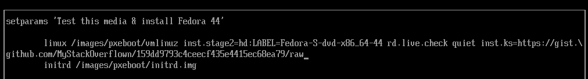

### 9.3 Analiza początkowych niepowodzeń i uszkodzenia pliku

Pierwsze próby wdrożenia nie zakończyły się sukcesem. Mimo poprawnego pobrania pliku przez instalator, proces instalacji ulegał awarii lub system nie podnosił się po restarcie.

Problem leżał po stronie struktury samego pliku. Podczas edycji i przesyłania konfiguracji błędy dotyczyły niekompatybilnych flag w automatycznym podziale partycji oraz niewłaściwego kodowania znaków końca linii, co paraliżowało poprawne przetwarzanie skryptów. Anaconda interpretowała te błędy jako krytyczne, przerywając proces.

### 9.4 Korekta konfiguracji i pomyślny rozruch systemu

Po poprawieniu struktury pliku na GitHub Gist, ponowne uruchomienie instalacji przebiegło bezbłędnie. Instalator sformatował dysk, pobrał pakiety, wykonał skrypty instalacyjne i automatycznie zrestartował maszynę.

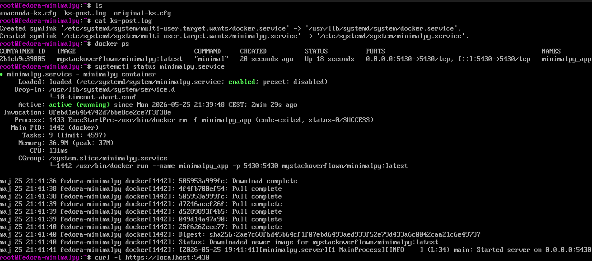

Po pierwszym uruchomieniu nowego systemu operacyjnego zalogowano się na konto i przeprowadzono weryfikację poprawności instalacji.

### 9.5 Weryfikacja działania wdrożonej aplikacji

Ostatnim etapem było udowodnienie, że nowo postawiony system faktycznie hostuje aplikację w tle. Z poziomu terminala nowo zainstalowanej Fedory wykonano test za pomocą curl na wystawiony port aplikacji.

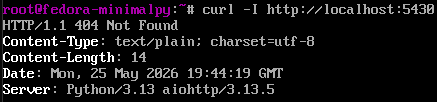

Aplikacja odpowiedziała prawidłowo, zwracając kod statusu. Proces od czystego dysku, przez automatyczną instalację systemu, aż po wdrożenie środowiska Docker i start kontenera został zautomatyzowany i działa poprawnie.

---

## Laboratorium 10: Wdrażanie na zarządzalne kontenery, Kubernetes

Celem laboratorium było przeniesienie aplikacji do lokalnego klastra Kubernetes zarządzanego za pomocą narzędzia Minikube. W ramach zajęć przeanalizowano cykl życia podów, aktualizacje aplikacji oraz zaawansowane strategie wdrożeń.

### 10.1 Instalacja i konfiguracja narzędzi minikube oraz kubectl

Prace rozpoczęto od pobrania i zainstalowania minikube oraz kubectl na głównej maszynie wirtualnej Ubuntu. Skonfigurowano również alias minikubctl mapujący polecenia do klastra.

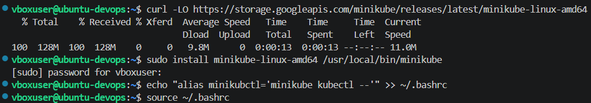

### 10.2 Weryfikacja stanu węzłów klastra

Uruchomiono lokalny klaster za pomocą komendy minikube start. Po zakończeniu bootowania sprawdzono status, upewniając się że węzeł jest w stanie gotowości.

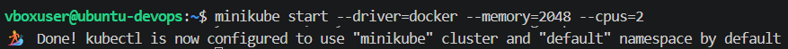
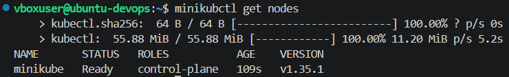

### 10.3 Uruchomienie graficznego panelu Dashboard

W celu uzyskania podglądu na stan zasobów, uruchomiono wbudowany Dashboard. Narzędzie automatycznie wystawiło interfejs webowy, umożliwiający podgląd z poziomu przeglądarki.

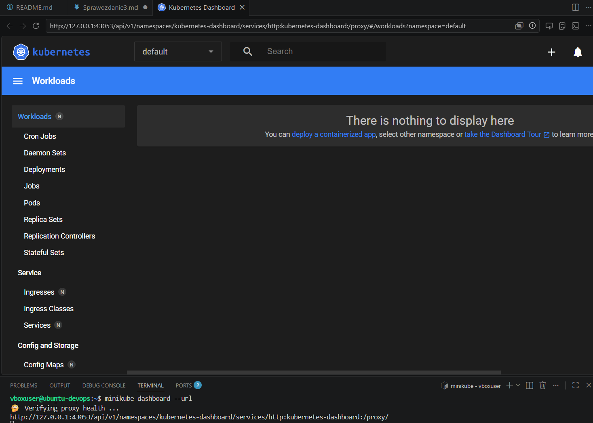

### 10.4 Manualne uruchomienie jednopadowego wdrożenia

W celach testowych wdrożono bezpośrednio z poziomu terminala, powołano do życia pojedynczy pod z aplikacją minimalpy, wskazując port kontenera oraz podstawowe etykiety.

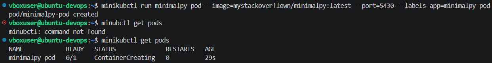

### 10.5 Przekierowanie portów i weryfikacja komunikacji

Z uwagi na domyślną izolację sieciową podów w klastrze, zastosowano mechanizm przekierowania portów. Przekierowano ruch z lokalnego portu maszyny bezpośrednio na port kontenera, a następnie sprawdzono komunikację narzędziem curl.

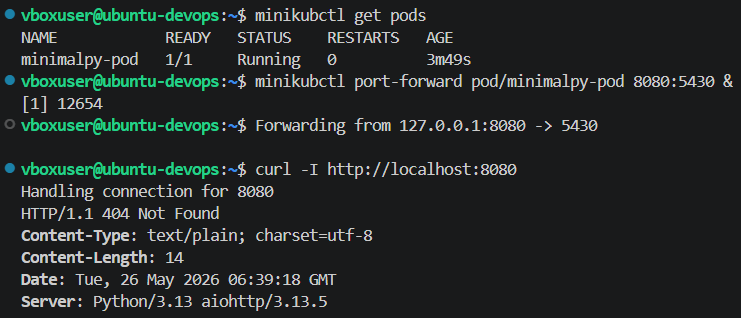

### 10.6 Deklaratywne wdrożenie za pomocą pliku YAML

Przygotowano plik YAML opisujący obiekt typu Deployment i zaaplikowano go bezpośrednio do klastra.

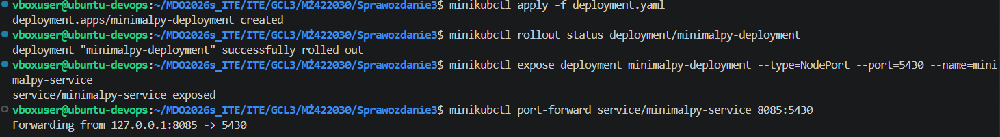

Odpytanie punktu końcowego nowo utworzonej usługi zwróciło kod HTTP 404 Not Found, co jest poprawnym rezultatem dla serwera nie obsługującego endpointów.

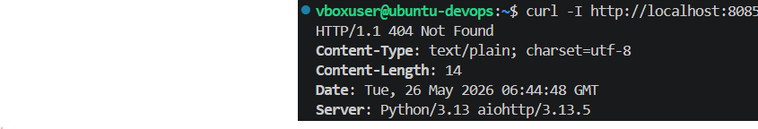

### 10.7 Skalowanie liczby replik i kontrola cyklu życia podów

Przetestowano elastyczność klastra poprzez modyfikację parametru replicas. Zwiększenie liczby replik wymusiło automatyczne i równoległe tworzenie nowych podów przez kontroler.

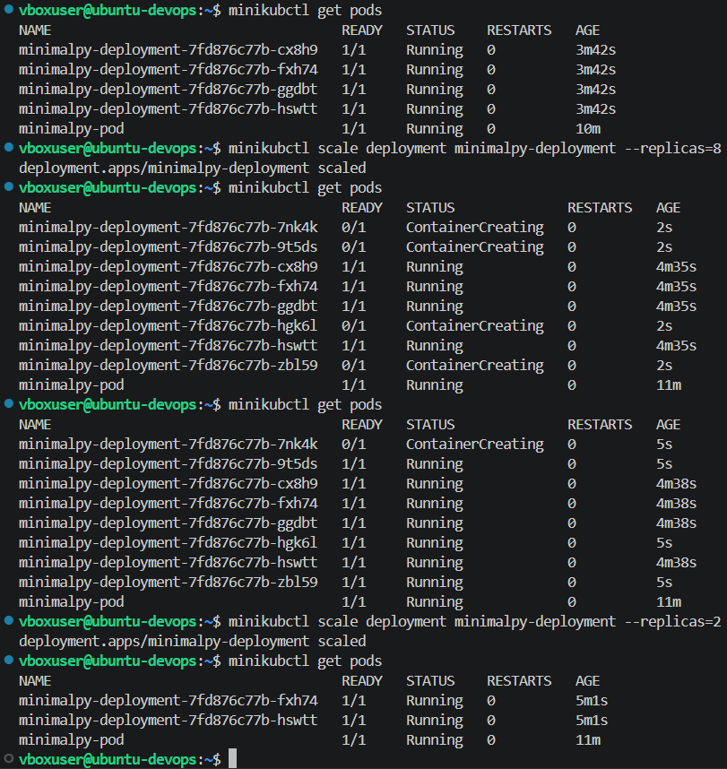

Następnie przetestowano proces skalowania w dół. Nadmiarowe pody przeszły w stan Terminating i zostały usunięte z zasobów.

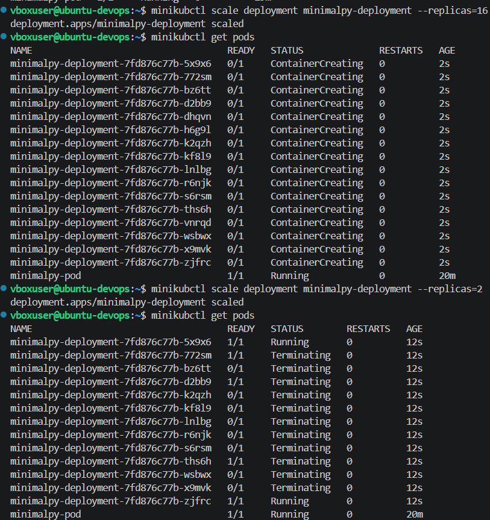

### 10.8 Zarządzanie wersjami obrazów i symulacja awarii

Zbudowano wersję testową aplikacji i oznaczono je dedykowanymi tagami.

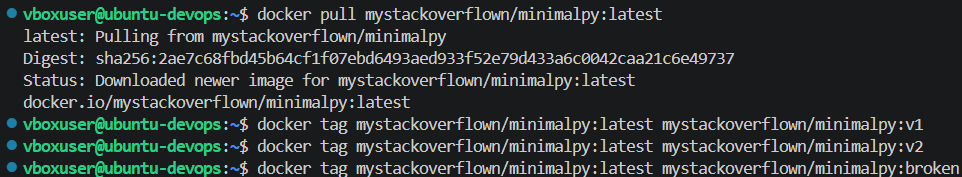

Aby obraz był widoczny, załadowano go do pamięci podręcznej minikube.

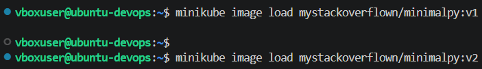

Wprowadzenie nieistniejącego tagu w manifeście wywołało błąd klastra, pody utknęły w pętli błędów, zgłaszając stan ErrImagePull oraz ImagePullBackOff.

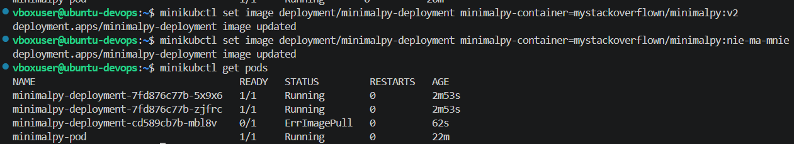

W celu przywrócenia stabilności środowiska wykorzystano mechanizm kontroli wersji wdrożeń. Za pomocą inspekcji i cofania zmian przywrócono stan do ostatniego stabilnego.

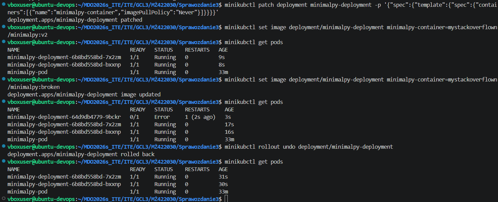

Operacja zakończyła się pełnym sukcesem, wadliwe kontenery zostały usunięte, a klaster automatycznie odtworzył pody oparte o poprawny obraz.

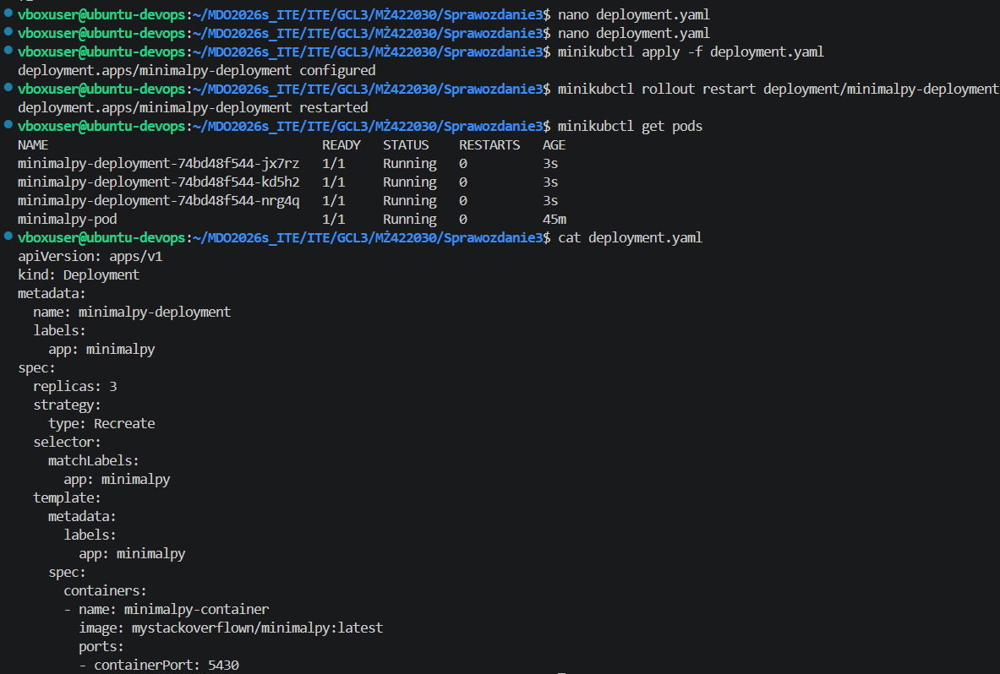

### 10.9 Analiza strategii wdrożeń

* Strategia Recreate - przed uruchomieniem nowej wersji Kubernetes całkowicie usuwa istniejące pody. Zapobiega to jednoczesnemu działaniu różnych wersji kodu, lecz generuje chwilowy przestój w dostępności usługi.

* Strategia RollingUpdate - wymiana podów następuje stopniowo, co zapewnia bezprzestojową aktualizację aplikacji. Aktualizacja pliku YAML przebiegła płynnie, bez utraty dostępności serwera.

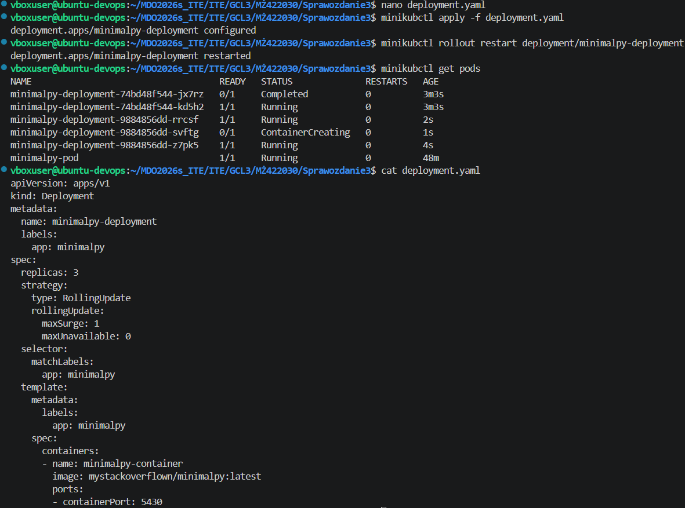

* Strategia Canary - polega na uruchomieniu małego wdrożenia z nową wersją aplikacji obok głównego, stabilnego środowiska. Oba wdrożenia współdzielą etykiety w usłudze sieciowej, dzięki czemu część ruchu trafia do wersji testowej, umożliwiając badanie nowego wdrożenia.

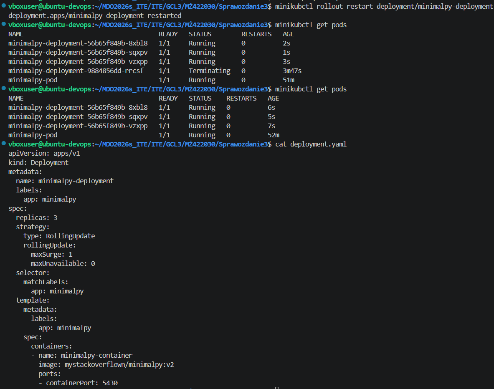

---

## Laboratorium 11: Wdrażanie na zarządzalne kontenery,Kubernetes

Celem laboratorium było zarządzanie siecią wewnątrz Kubernetes, implementacja mechanizmów masowego skalowania wdrożeń oraz analiza ruchu sieciowego za pomocą obiektów typu Service.

### 11.1 Zmiana komponentu wykonawczego

Aplikację minimalpy zastąpiono oficjalnym, zoptymalizowanym obrazem serwera Nginx z następujących przyczyn:

* Oszczędność zasobów - pełne środowisko Pythona generowało duży narzut pamięciowy. Masowe skalowanie ciężkiego obrazu groziło wyczerpaniem pamięci RAM i dysku Minikube. Obraz Nginx zajmuje zaledwie kilkanaście megabajtów.

* Wydajność - serwer Nginx jest zoptymalizowany do obsługi dużej liczby równoległych połączeń.

* Logowanie - przejrzysty i ustandaryzowany format logów ułatwia weryfikację dystrybucji ruchu sieciowego.

### 11.2 Diagnoza błędu komunikacji z API

Podczas pierwszej próby zaaplikowania konfiguracji narzędzie zgłosiło błąd przekroczenia limitu czasu połączenia.

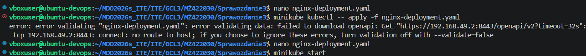

Problem wynikał z faktu, że lokalny klaster Minikube był wyłączony lub jego procesy kontrolne uległy zawieszeniu.

### 11.3 Deklaratywne uruchomienie wdrożenia Nginx

Po uruchomieniu klastra plik YAML został przetworzony pomyślnie. Komenda kubectl get pods pokazała stabilnie uruchomione  wdrożenie wielopodowe.

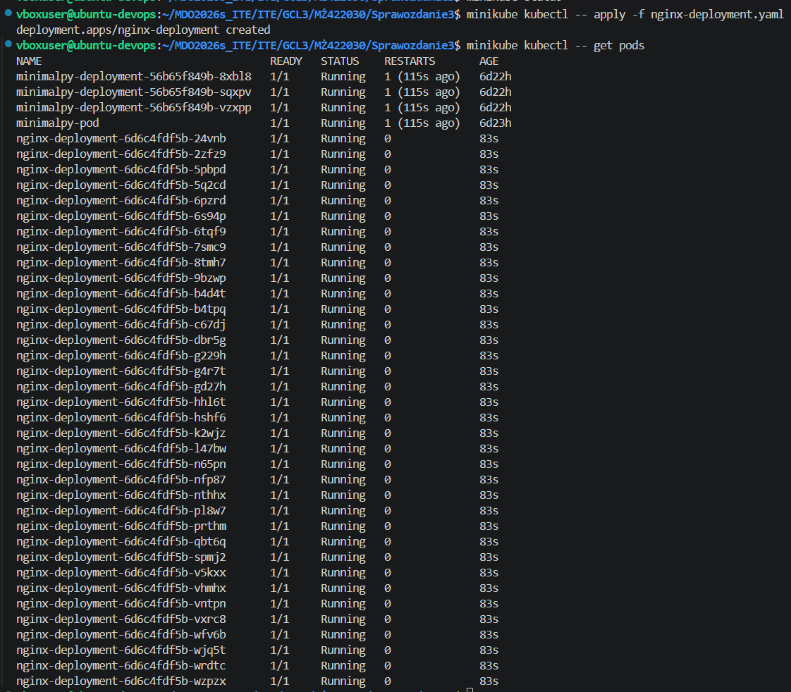

### 11.4 Przekierowanie portów

Przekierowanie do konkretnego poda zrealizowano poprzez związanie portu maszyny z instancją kontenera.

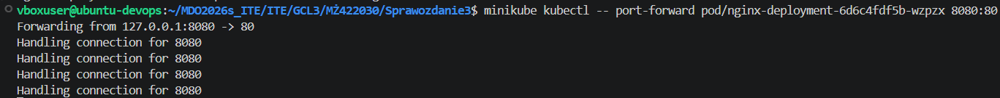
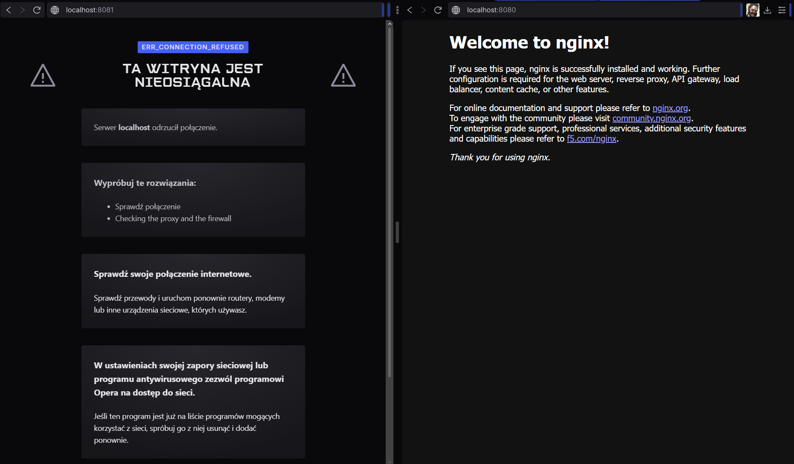

Próba odpytania portu przed pełnym powiązaniem routingu skutkowała błędem. Po poprawnym zainicjowaniu, serwer zaczął prawidłowo odpowiadać.

Przekierowanie polegało na równoległym przetestowaniu przekierowania ruchu na port 8081.

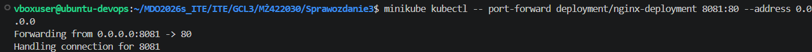
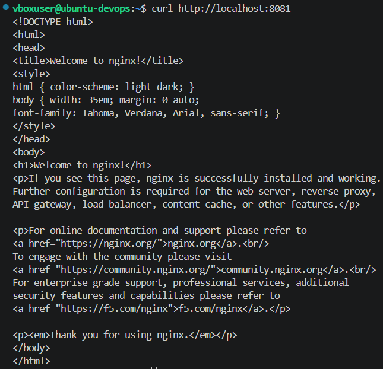

Poprawność zwracanego kodu HTML zweryfikowano także bezpośrednio w terminalu za pomocą narzędzia curl.

### 11.5 Eksponowanie wdrożenia przy użyciu usług

Usługę typu NodePort utworzono poleceniem kubectl expose deployment.

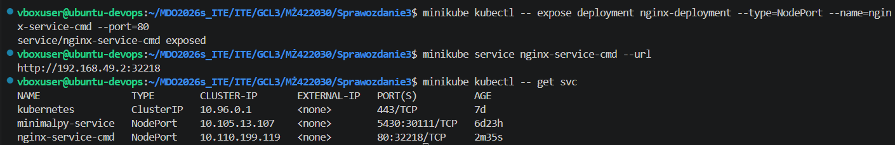

Klaster automatycznie zamapował wewnętrzny port kontenera na zewnętrzny port. Zapytanie skierowane na adres IP minikube i wyznaczony port zakończyło się sukcesem.

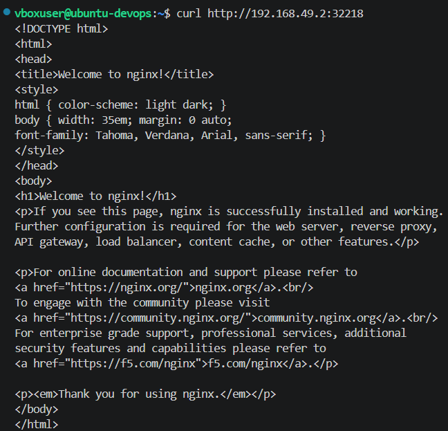

Konfigurację utrwalono w manifeście YAML.

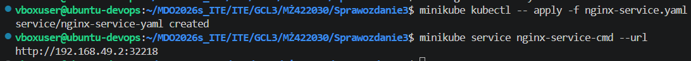

Usługa udostępniła aplikację na statycznym porcie, a poprawne działanie routingu zweryfikowano narzędziem curl.

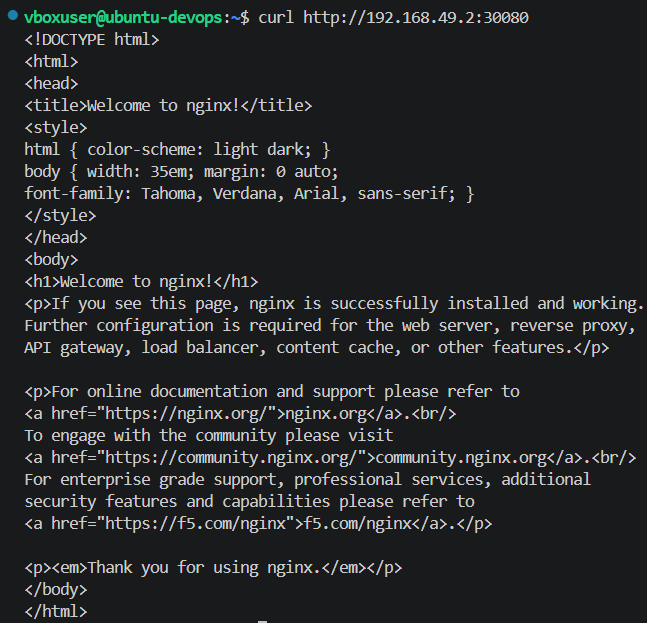

### 11.6 Skalowanie wdrożenia i modyfikacja manifestów

Zmniejszono liczbę żądanych replik w pliku YAML i zsynchronizowano stan środowiska poleceniem apply. Kontroler klastra automatycznie usunął nadmiarowe pody, pozostawiając docelową liczbę aktywnych instancji.

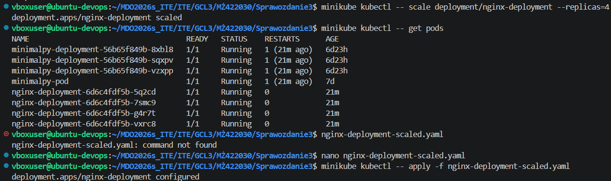

### 11.7 Analiza logów i weryfikacja mechanizmu Load Balancingu

W celu weryfikacji mechanizmu równoważenia obciążenia wygenerowano serię zapytań HTTP do usługi, a następnie pobrano skonsolidowane logi za pomocą selektora etykiet.

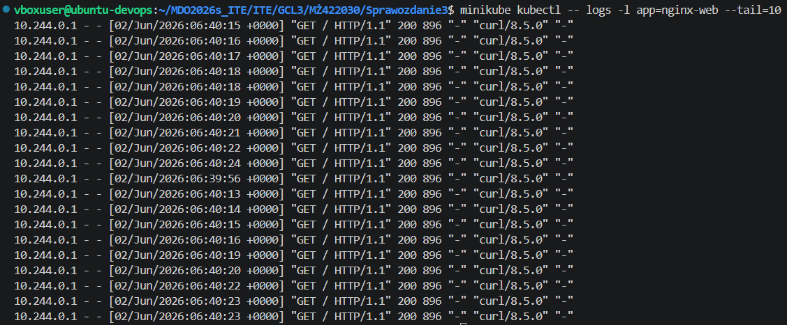
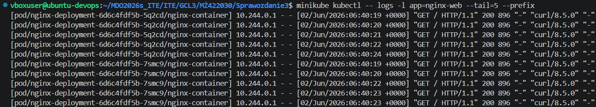

Analiza logów wykazała naprzemienne identyfikatory podów obsługujących ruch, co potwierdza, że usługa skutecznie i równomiernie dystrybuuje ruch pomiędzy kontenery wewnątrz wdrożenia.

### 11.8 Cykl życia podów podczas powrotu do aplikacji dedykowanej

Na zakończenie laboratorium powrócono do wdrażania aplikacji minimalpy, poprzez aplikację zaktualizowanego plik YAML.

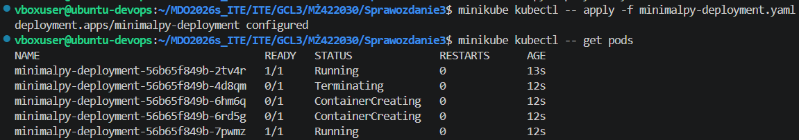

W wyjściu polecenia kubectl get pods zaobserwowano pełny cykl życia obiektów. Stare pody zostały skierowane do usunięcia, podczas gdy nowe pody automatycznie przeszły przez fazę inicjalizacji, aż do osiągnięcia docelowego statusu.

---

## Podsumowanie i wnioski

Ansible drastycznie ułatwia życie, pod warunkiem, że od razu podzieli się kod na mniejsze role za pomocą ansible galaxy, bez tego pliki szybko stają się zbyt skomplikowane i nieczytelne. Największym plusem tego narzędzia jest to, że nie nadpisuje bezsensownie konfiguracji, która działa już poprawnie. Dobrze izoluje awarie, jeśli jedna maszyna w sieci padnie, skrypt po prostu ją ignoruje i idzie dalej, zamiast przerywać pracę na reszcie sprawnych.

Postawienie całego systemu od zera wraz z Dockerem i aplikacją w sposób automatyczny to zdecydowana oszczędność czasu i gwarancja, że system zawsze zadziała tak samo. Minusem jest tutaj zerowa tolerancja na błędy. Prosty błąd w formatowaniu tekstu  albo pomyłka w konfiguracji dysku sprawia, że instalator nie zadziała. Automatyzacja systemu wymagaprecyzji przy pisaniu pliku odpowiedzi, ale po jego dopracowaniu proces staje się w automatyczny.

Pisanie manifestów YAML daje pełną kontrolę nad klastrem i pozwala łatwo odtworzyć środowisko. Kubernetes genialnie radzi sobie z błędami, jeśli wdroży się zepsuty obraz, istnieją funkcje które pozwalają natychmiast cofnąć zmiany do ostatniej działającej wersji, co pozwala unikać przestojów. Z kolei obiekty typu Service usuwa problem zmieniających się adresów IP podów, a logi z Nginxa pokazały, że ruch jest automatycznie i równo rozdzielany pomiędzy kontenery.