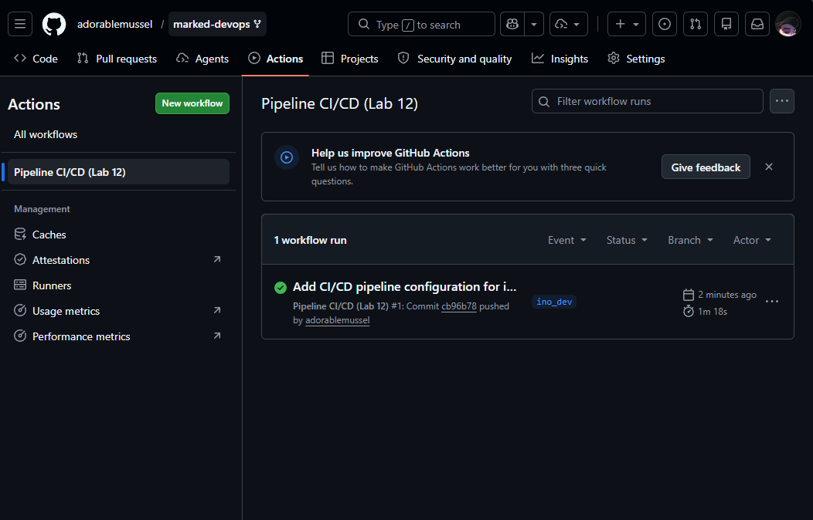
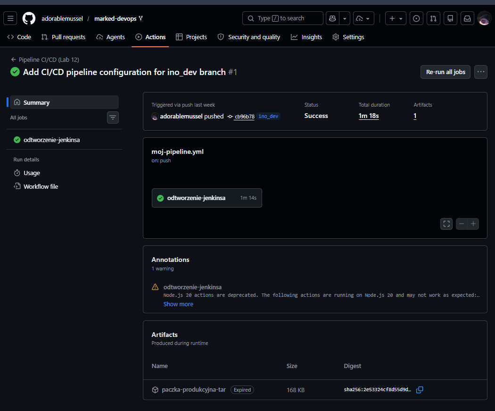

# Sprawozdanie z Laboratorium 12

## Temat: Shift-left: GitHub Actions

W ramach tego laboratorium zajmowałem się przeniesieniem procesu CI/CD (skonfigurowanego wcześniej w narzędziu Jenkins) bezpośrednio do repozytorium kodu, wykorzystując mechanizm GitHub Actions.

Na początku wykonałem rozwidlenie (fork) wybranego projektu na własne konto. Moje repozytorium znajduje się pod adresem: `https://github.com/adorablemussel/marked-devops`. Zgodnie z instrukcją, nie wprowadzałem zmian bezpośrednio do gałęzi głównej, aby uniknąć przypadkowego wypchnięcia konfiguracji do oryginalnego projektu. Zamiast tego utworzyłem dedykowaną gałąź o nazwie `ino_dev`. Usunąłem również istniejące w projekcie pliki workflows, aby zbudować proces od podstaw.

Następnie utworzyłem własną akcję (plik YAML w katalogu `.github/workflows`). Jako wyzwalacz (trigger) zdefiniowałem zdarzenie `push`, z ograniczeniem wyłącznie do nowej gałęzi `ino_dev`. 

Mój plik workflow `main.yml` prezentuje się następująco:

```yaml
name: Pipeline CI/CD (Lab 12)

# WYZWALACZ na gałęzi ino_dev
on:
  push:
    branches:
      - ino_dev

jobs:
  odtworzenie-jenkinsa:
    runs-on: ubuntu-latest # Darmowy runner GitHuba

    steps:
      - name: 📥 Pobranie kodu
        uses: actions/checkout@v4

      - name: 🛠️ Build Builder
        run: docker build -t marked-build:latest -f Dockerfile .

      - name: 🧪 Test
        run: |
          docker build -t marked-test:latest -f Dockerfile.test .
          docker run --rm marked-test:latest

      - name: 🚀 Deploy Smoke Test
        run: |
          docker build -t marked-deploy:latest -f Dockerfile.deploy .
          docker run --rm marked-deploy:latest

      - name: 📦 Pakowanie Artefaktu
        run: |
          docker create --name extract-container marked-deploy:latest
          docker cp extract-container:/app ./marked-production
          docker rm extract-container
          tar -czvf marked-artifact.tar.gz ./marked-production

      - name: 💾 Publikacja gotowego Artefaktu
        uses: actions/upload-artifact@v4
        with:
          name: paczka-produkcyjna-tar
          path: marked-artifact.tar.gz
          retention-days: 5
```

Odtworzyłem w nim strukturę z poprzedniego pipeline'u. Całość opiera się na trzech plikach Dockerfile, które realizują poszczególne kroki (Build, Test, Deploy):

**`Dockerfile` (budujący obraz główny):**
```dockerfile
FROM node:20
WORKDIR /app
RUN git clone https://github.com/markedjs/marked.git .
RUN npm install
RUN npm run build
```

**`Dockerfile.test` (uruchamiający testy na bazie zbudowanego obrazu):**
```dockerfile
FROM marked-build:latest
CMD ["npm", "test"]
```

**`Dockerfile.deploy` (środowisko wdrożeniowe i wykonanie smoke testu):**
```dockerfile
# Krok 1: Odnosimy się do obrazu budującego
FROM marked-build:latest AS builder

# Krok 2: Pobieramy bardzo lekką wersję Node.js (Alpine)
FROM node:20-alpine
WORKDIR /app

# Krok 3: Kopiujemy TYLKO niezbędne pliki produkcyjne z "buildera"
COPY --from=builder /app/package.json ./
COPY --from=builder /app/lib ./lib
COPY --from=builder /app/bin ./bin

# Krok 4: Instalujemy tylko lekkie zależności (bez narzędzi testowych)
RUN npm install --omit=dev

# Krok 5: SMOKE TEST - sprawdzamy, czy aplikacja odpowiada
CMD ["node", "bin/marked.js", "--version"]
```

Po wypchnięciu pierwszego commita na gałąź `ino_dev`, GitHub automatycznie wykrył zmiany i uruchomił zdefiniowany workflow.



*W zakładce Actions widać, że workflow "Pipeline CI/CD (Lab 12)" został poprawnie wyzwolony zdarzeniem push na gałąź ino_dev i zakończył się sukcesem