# Sprawozdanie z Laboratoriów 8-11

## Lab 8: Automatyzacja z Ansible

W ramach tego laboratorium zajmowałem się automatyzacją konfiguracji maszyn z wykorzystaniem narzędzia Ansible. Na początku skonfigurowałem plik `inventory.ini`, dodając do niego maszynę docelową jako `ansible-target` (wraz z użytkownikiem `ansible`). Następnie sprawdziłem za pomocą modułu ping, czy węzeł sterujący poprawnie komunikuje się z serwerem docelowym. Zastosowałem tu flagę pomijającą weryfikację stałych kluczy SSH.

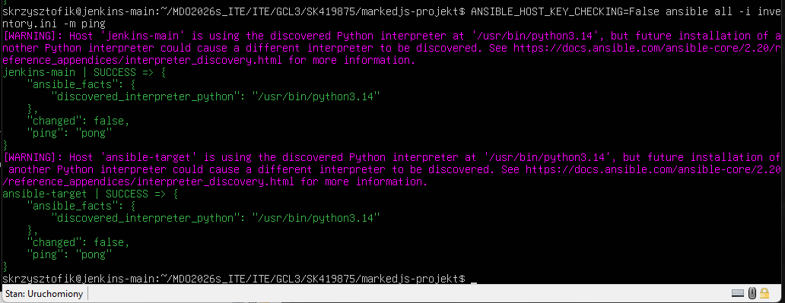
*Odpowiedź "pong" i status SUCCESS dla obu maszyn potwierdzają prawidłową komunikację sieciową.*

Kolejnym krokiem było uruchomienie przygotowanego scenariusza wdrożeniowego `deploy_app.yml`. Playbook ten automatycznie instalował środowisko Docker na maszynie docelowej, kopiował paczkę `artifact.tar.gz`, usuwał ewentualny stary kontener i uruchamiał nowy na bazie obrazu Node.js. Na koniec skrypt weryfikował działanie aplikacji – zwrócił zadeklarowany komunikat "Aplikacja Marked działa! Wersja: v4.0.0", co potwierdziło poprawne zakończenie całego wdrożenia.

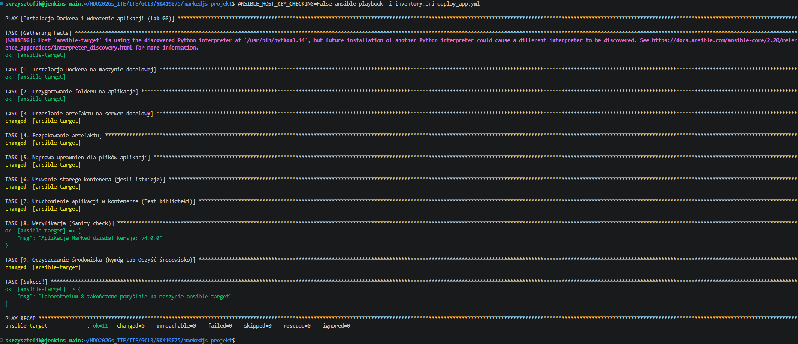
*W podsumowaniu `PLAY RECAP` wartość `failed=0` udowadnia, że operacja zakończyła się bez błędów.*

## Lab 9: Kickstart, czyli zautomatyzowana instalacja systemu

Celem tego zadania była zautomatyzowana instalacja systemu Fedora bez bezpośredniej ingerencji użytkownika. Zmodyfikowałem opcje rozruchowe w menu GRUB, dopisując parametr `inst.ks`, który wskazywał lokalizację mojego pliku `inst.ks` z repozytorium GitHub.

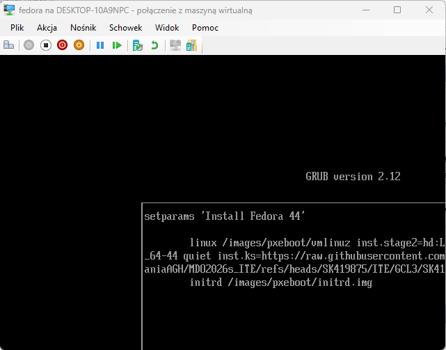
*Dopisanie flagi przy rozruchu wymusza na instalatorze pobranie gotowej konfiguracji.*

Instalator uruchomił się w trybie tekstowym, automatycznie sformatował dyski, utworzył partycje LVM, pobrał pakiety instalacyjne z sieci i ustawił nazwę maszyny na `fedora-markedjs-host`. 

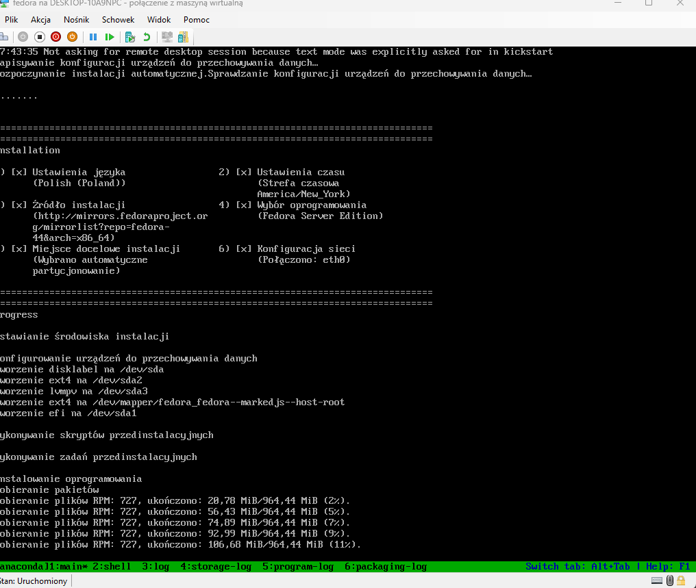
*Zautomatyzowany przebieg procesu instalacji.*

Kluczowym elementem konfiguracji była sekcja `%post` w pliku Kickstart. Umieściłem tam skrypt, który po zakończonej instalacji systemu tworzy nową usługę `markedjs-app.service` dla systemd. Po zalogowaniu na konto studenta (po pierwszym uruchomieniu nowej maszyny) wpisałem `sudo docker ps` i zweryfikowałem, że kontener Nginx uruchomił się automatycznie i działa w tle.

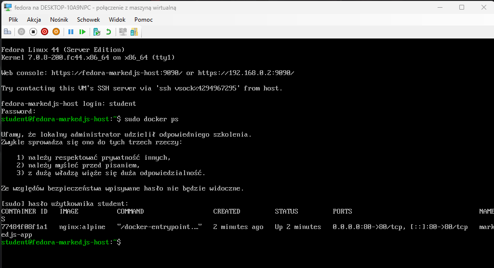
*Wdrożony kontener aplikacji wystartował zgodnie z definicją w skrypcie instalacyjnym.*

## Lab 10: Podstawy Kubernetes (Minikube)

W tym zadaniu zainstalowałem narzędzia Minikube oraz kubectl. Najpierw pobrałem pliki wykonywalne przy użyciu polecenia curl, a następnie uruchomiłem lokalny, jednowęzłowy klaster, wykorzystując środowisko Docker jako sterownik.

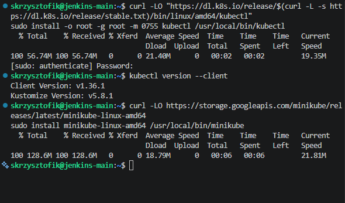
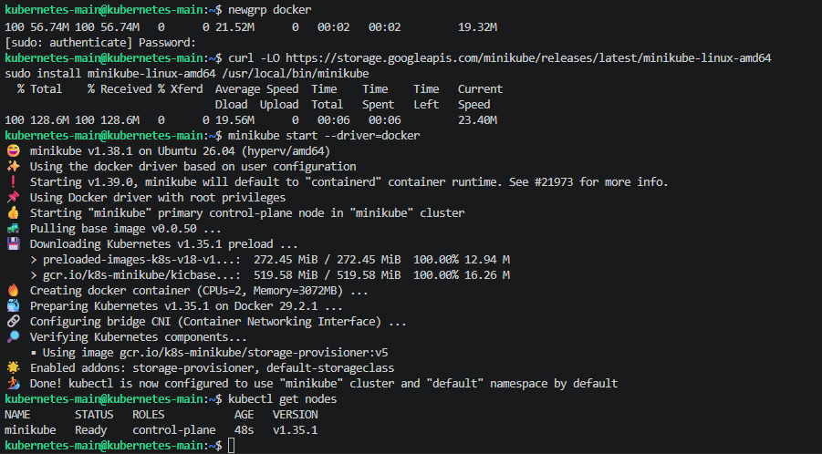

Następnie wywołałem polecenie `minikube dashboard`, aby uzyskać wizualny dostęp do panelu zarządzania klastrem. Został on udostępniony w przeglądarce pod adresem localhost na porcie 33133.

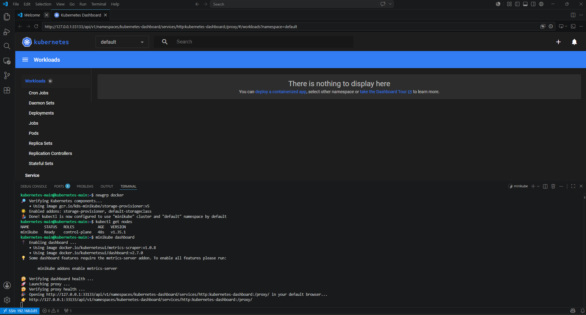

Wykorzystując demona Docker wbudowanego w środowisko Minikube, zbudowałem własny obraz aplikacji na bazie `nginx:alpine`, który udostępnia statyczny plik `index.html`. Obraz utworzyłem poleceniem `docker build -t moja-apka:v1`.
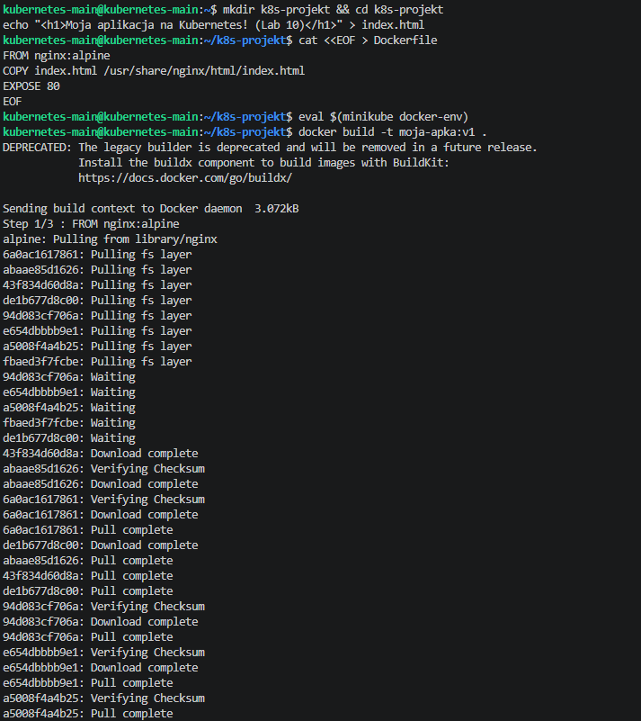

Uruchomiłem pierwszy Pod za pomocą polecenia `kubectl run` i przekierowałem ruch sieciowy narzędziem `port-forward` na port 8080 mojej maszyny lokalnej, co pozwoliło mi podejrzeć aplikację w oknie przeglądarki.
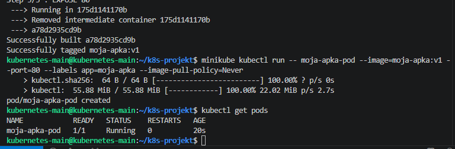
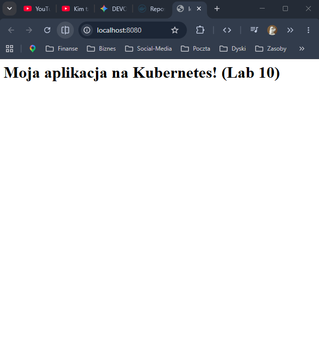
*Podgląd działania serwera Nginx przez udostępniony port.*

Ponieważ pojedynczy Pod nie zapewnia niezawodności, przeszedłem na zasób typu Deployment, uruchamiając z pliku deklaratywnego 4 repliki. Edytowałem następnie plik poleceniem `sed`, by zbadać zachowanie klastra. Najpierw przeskalowałem aplikację do 8 replik, potem zmniejszyłem do 1, następnie do 0, a na koniec przywróciłem 4 działające instancje. 

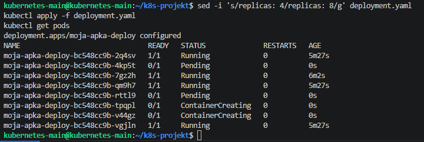
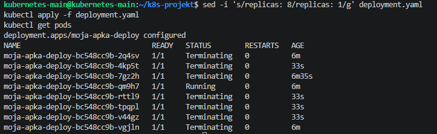
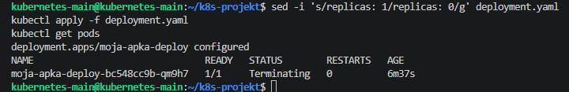
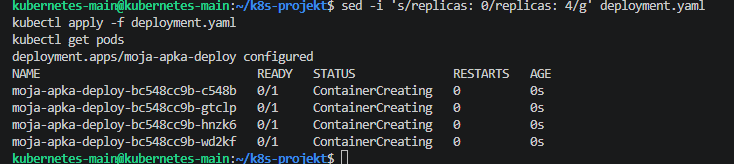
*Widoczne stany Poda (Terminating lub ContainerCreating) odzwierciedlają proces dostosowywania się klastra do zadeklarowanej liczby instancji.*

Kolejnym krokiem było przetestowanie aktualizacji wdrożenia (Rolling Update). Zbudowałem wersję `v2` aplikacji oraz obraz generujący błąd (korzystający z `Dockerfile.error`). Podczas próby aktualizacji do wadliwego obrazu Kubernetes wykrył problem (status Error) i wstrzymał operację, pozostawiając przy życiu działające, starsze Pody.
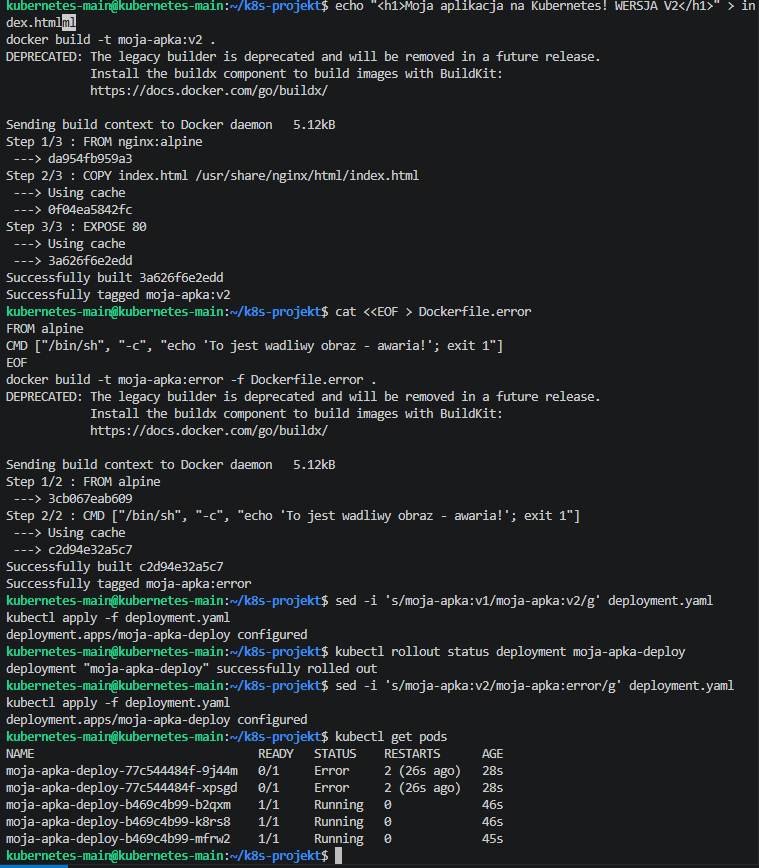

Za pomocą komendy `kubectl rollout undo` sprawnie wycofałem zmiany do poprzedniej, stabilnej konfiguracji. Sprawdziłem również strategię `Recreate`, która w przeciwieństwie do Rolling Update najpierw usuwa wszystkie stare instancje przed wdrożeniem nowych, co powoduje chwilową przerwę w dostępności usługi.
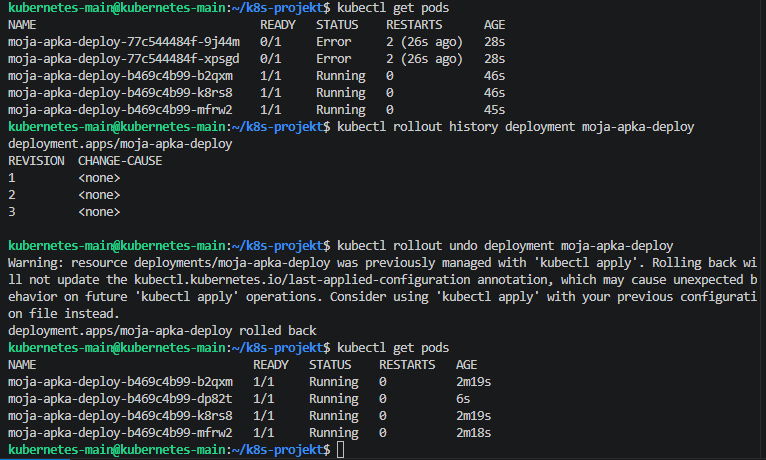
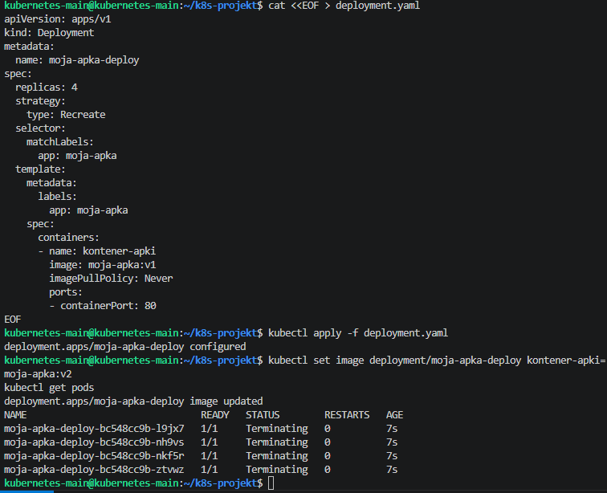

## Lab 11: Sieci i Usługi (Services) w Kubernetes

W ostatnim laboratorium testowałem metody komunikacji i udostępniania usług. Utworzyłem plik `deployment-lab11.yaml` dla aplikacji bazującej na serwerze Nginx z deklaracją 10 replik. W ramach testów elastyczności zaaplikowałem najpierw 36 replik, następnie przeskalowałem je imperatywnie do 5 sztuk przy pomocy polecenia `kubectl scale`, a na końcu wróciłem do 10 replik w sposób deklaratywny.

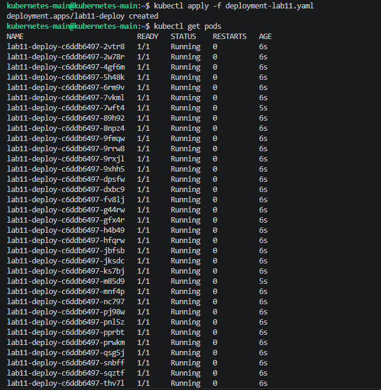
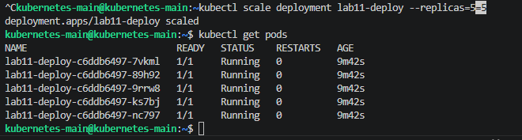
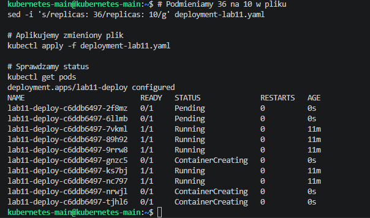

Analizowałem różne metody uzyskiwania dostępu do uruchomionej aplikacji. Najpierw przekierowałem ruch opcją `port-forward` bezpośrednio do konkretnego Poda.
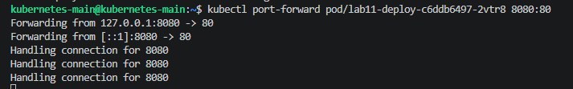
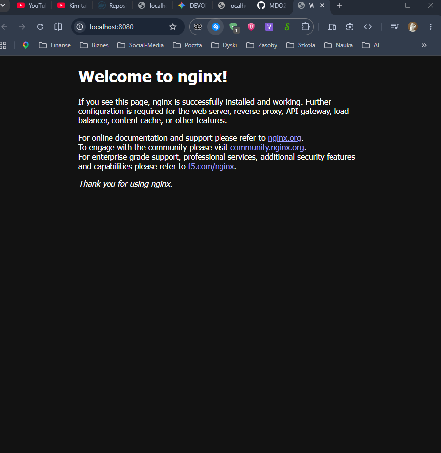

Następnie zastosowałem port-forwarding skierowany na cały obiekt Deployment. To drugie rozwiązanie jest znacznie bezpieczniejsze, ponieważ zapobiega utracie dostępu w przypadku awarii jednego z obsługujących aplikację Podów.
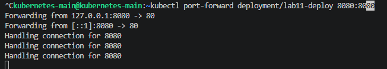
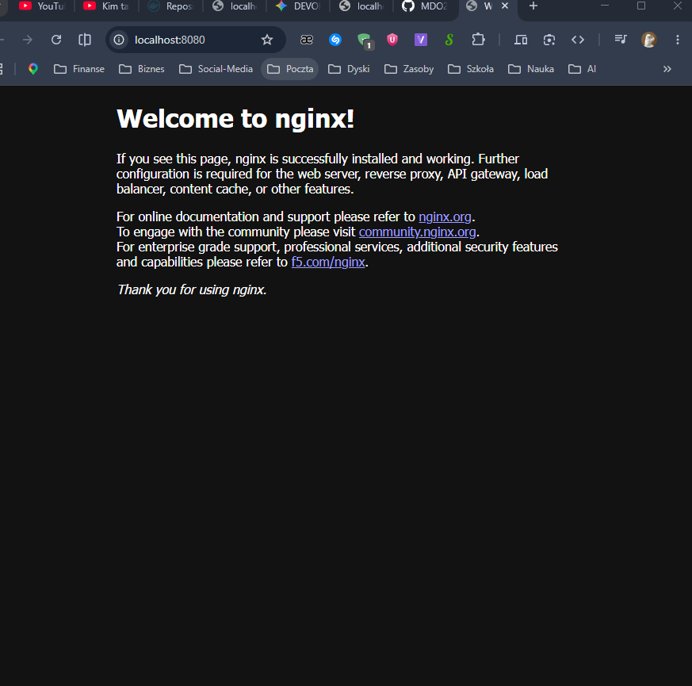

Na zakończenie powiązałem wszystkie działające instancje za pomocą trwałego punktu wejścia, czyli usługi (Service). Przetestowałem udostępnianie w sposób imperatywny (poleceniem `expose`) oraz deklaratywny (tworząc i aplikując plik `service-lab11.yaml`).
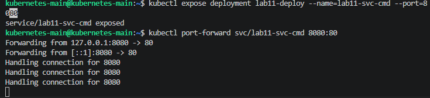
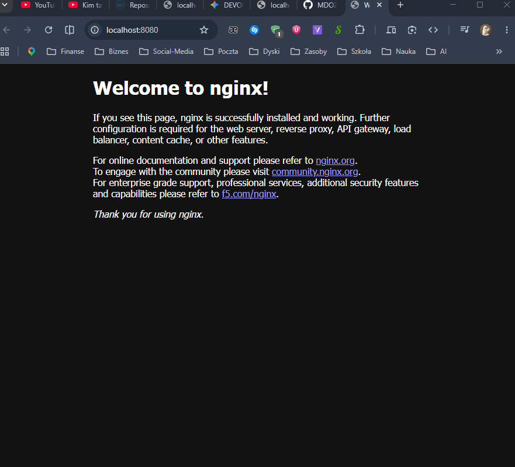
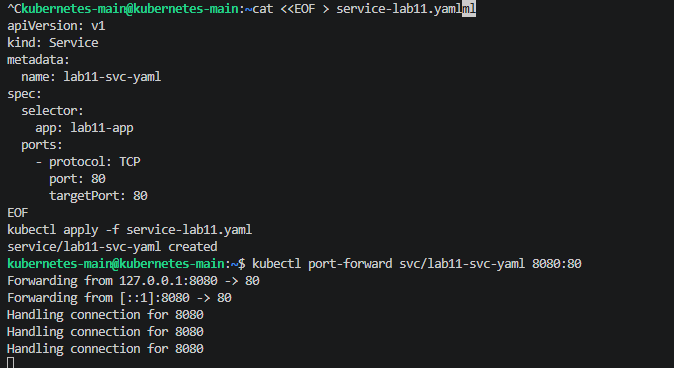
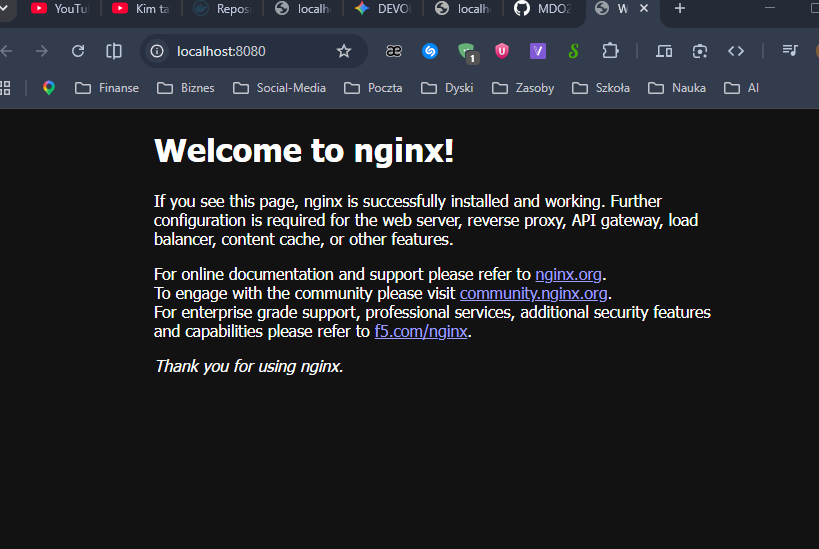

W ramach testu weryfikacyjnego wygenerowałem ruch sieciowy wymierzony w moją usługę. Użyłem skryptu powłoki, który wywołał serwer 10 razy narzędziem curl. Podgląd dzienników zdarzeń wykonany poleceniem `kubectl logs` potwierdził, że zapytania zostały prawidłowo rozesłane do uruchomionych Podów i obsłużone z sukcesem (kod 200 HTTP GET).
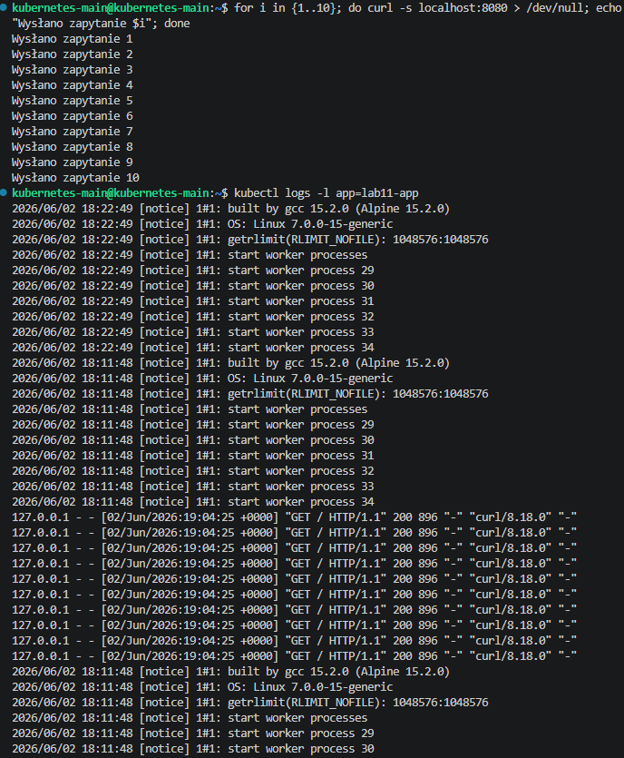
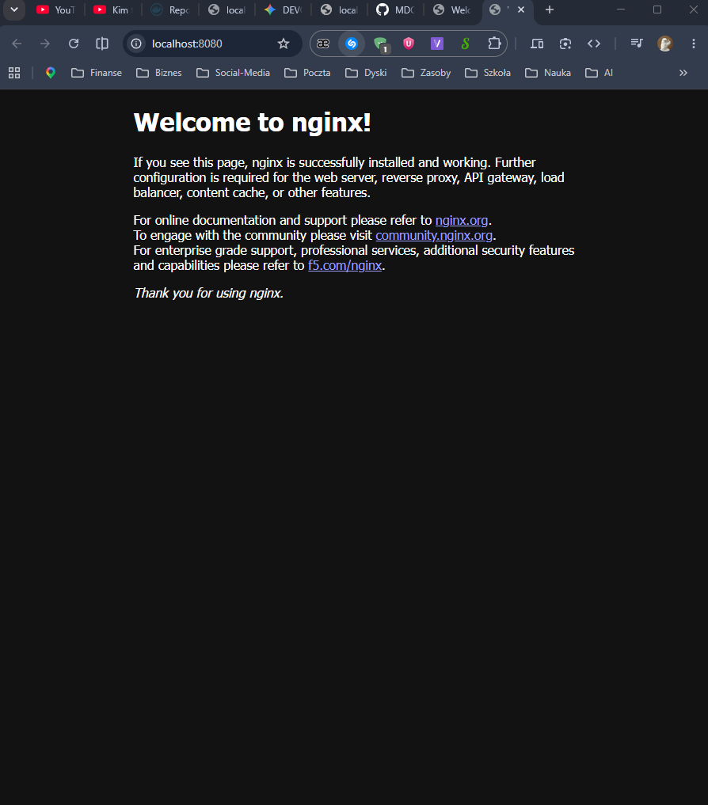