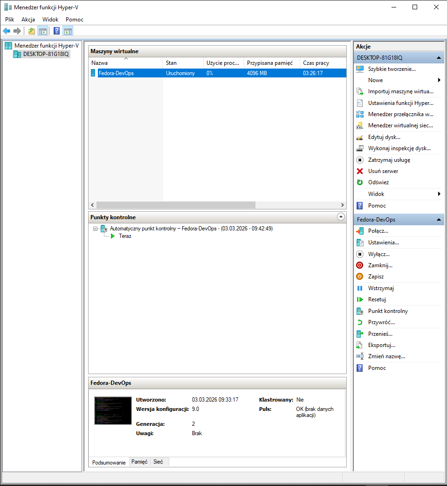
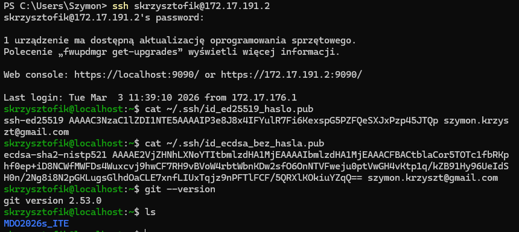
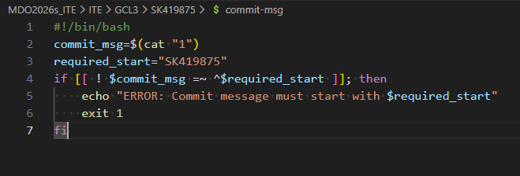
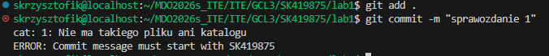

# Lab 1

## Maszyna wirtualna
Użyłem Hyper-V z systemem Fedora Server:


## Logowanie do maszyny przez SSH, klucze SSH, konfiguracja git
Stworzyłem klucze szyfrowane ed25519 z hasłem oraz ECDSA bez hasła, ich publiczne odpowiedniki widać na screenie. Skonfigurowałem także środowisko git.


## Git Hook
```bash
#!/bin/bash
commit_msg=$(cat "1")
required_start="SK419875"
if [[ ! $commit_msg =~ ^$required_start ]]; then
    echo "ERROR: Commit message must start with $required_start"
    exit 1
fi
```

