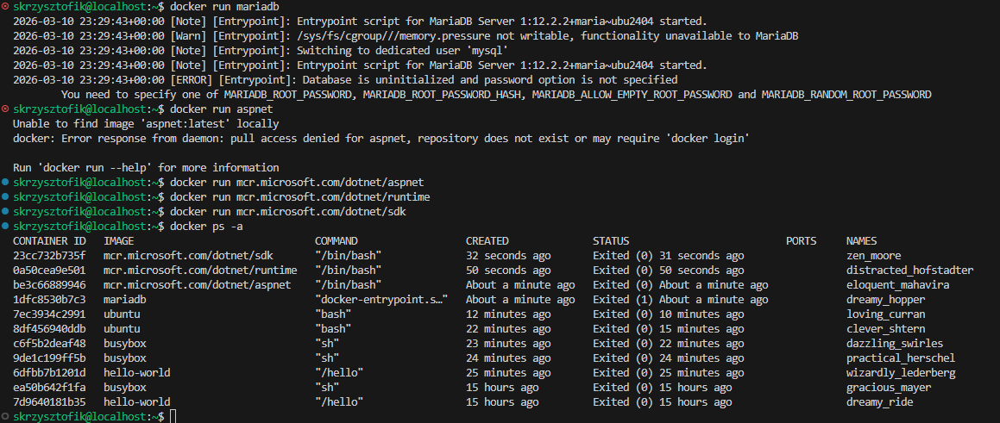
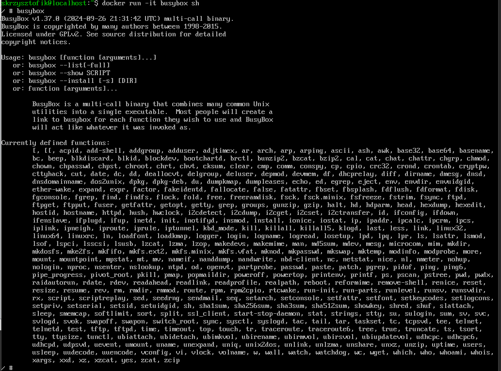
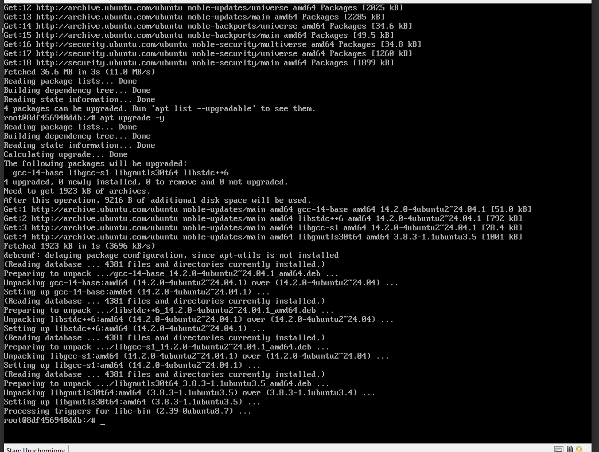
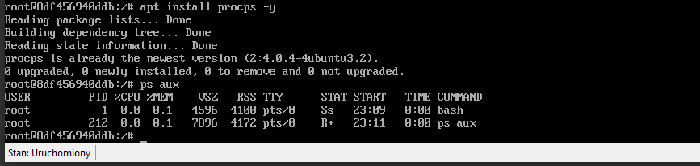
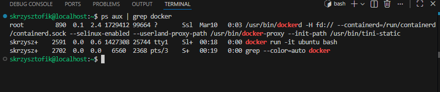
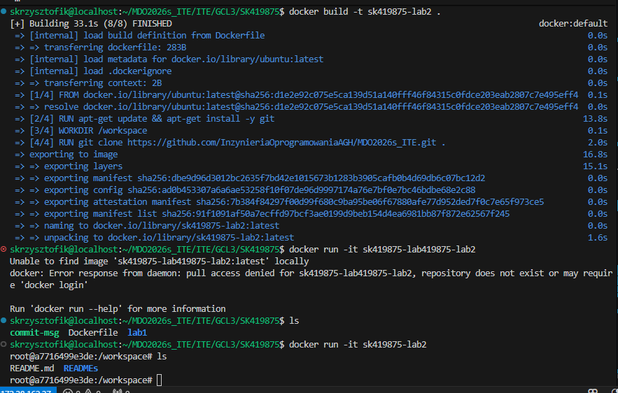
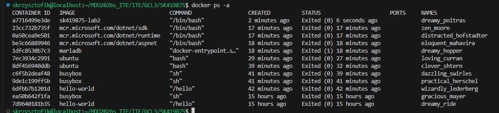

# Lab 2

Ściągnięte obrazy hello-world, busybox, ubuntu, mariadb, runtime, aspnet i sdk dla Microsoft .NET i ich kody wyjścia. Mariadb potrzebuje hasła, którego nie wpisałem - dlatego zakończyło się jako 1

Uruchomienie konteneru z obrazu busybox interaktywnie. Wersja to 1.37.0

Uruchomienie "systemu w kontenerze", PID1 w kontenerze - bash. Zaktualizowanie pakietów

Plik Dockerfile i sklonowanie w nim naszego repozytorium.

Na koniec wyczyściłem kontenery i obrazy.