kopiowanie na wolumin wejściowy kontener bazowy z pomocą kontenera pomocniczego
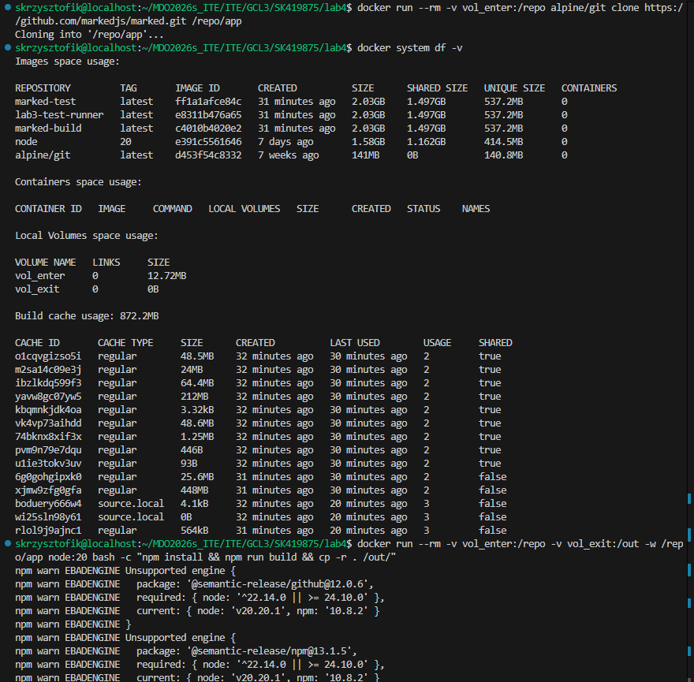 
build w kontenerze bazowym i zapis na wolumin wyjściowy
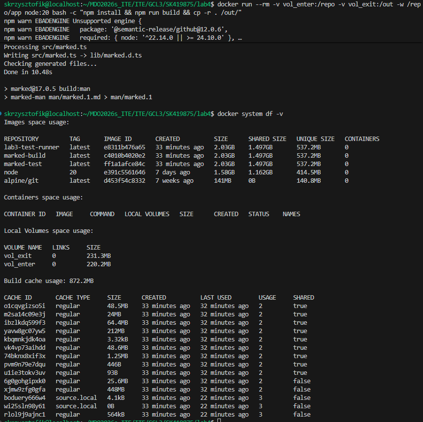 
alpine
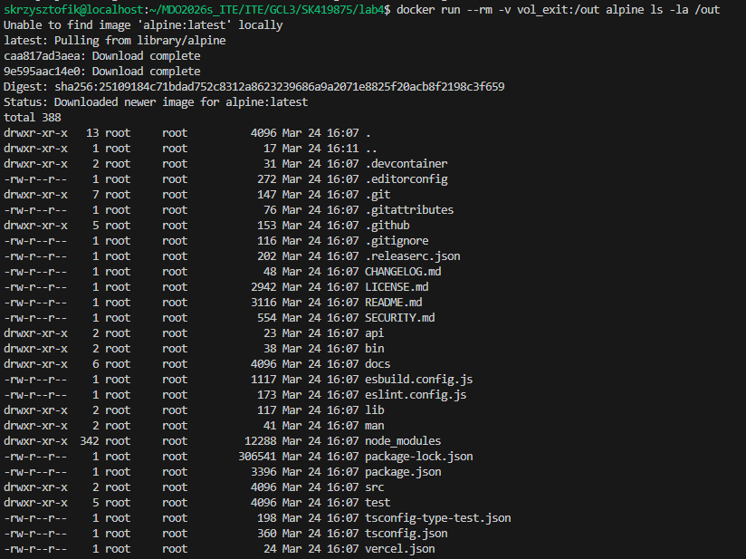 
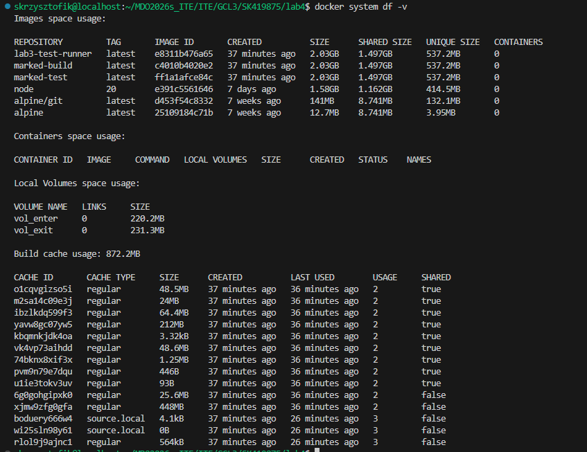 
sposób alternatywny: uruchomienie node:20 i instalacja gita i pobranie repo
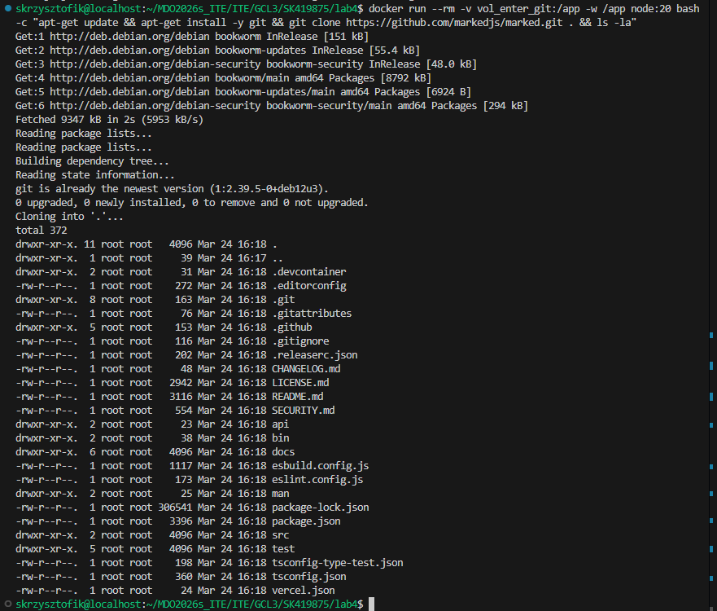 
pobranie iperf3 i odpalenie serwera, pobranie adresu serwera, uruchomienie klienta
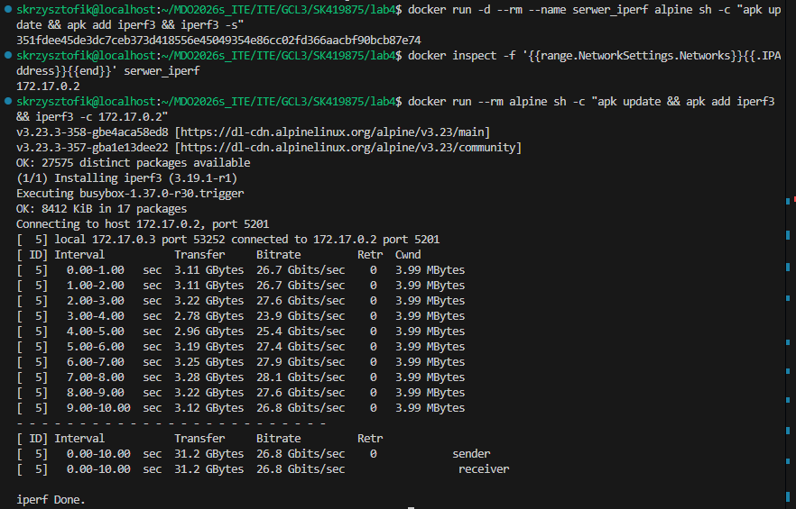 
stworzenie wirtualnej sieci, uruchomienie serwera w nowej sieci i uruchomienie klienta za pomocą nazwy (a nie IP)
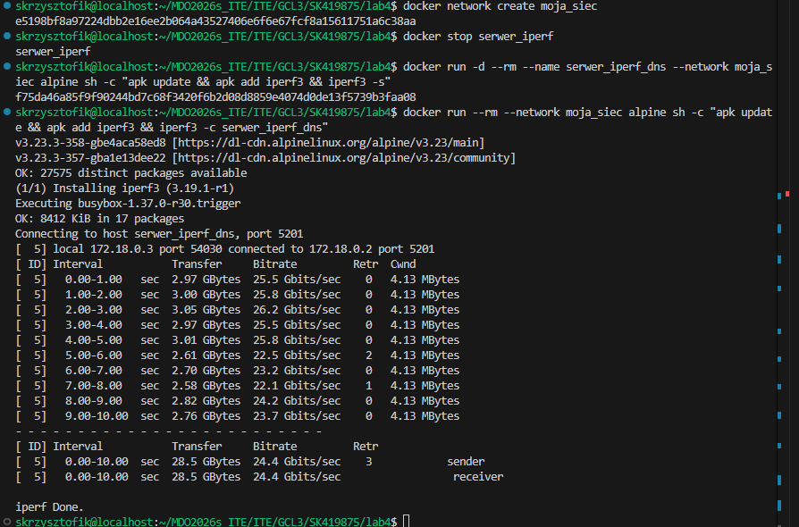 
łączenie się z serwerem spoza kontenera
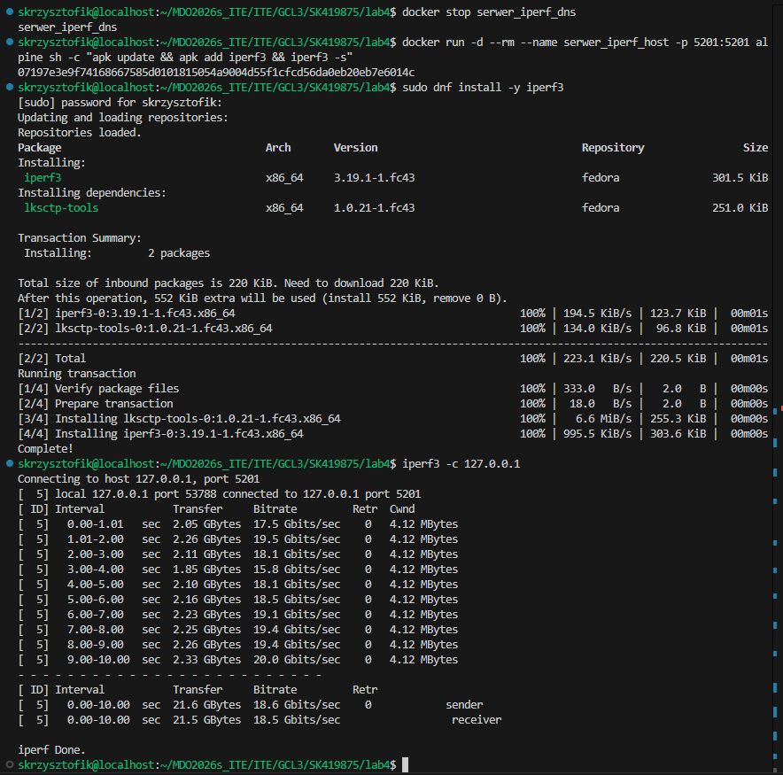 
serwer SSH
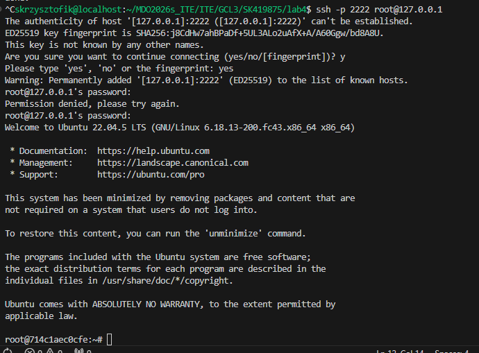 
jenkins i dind
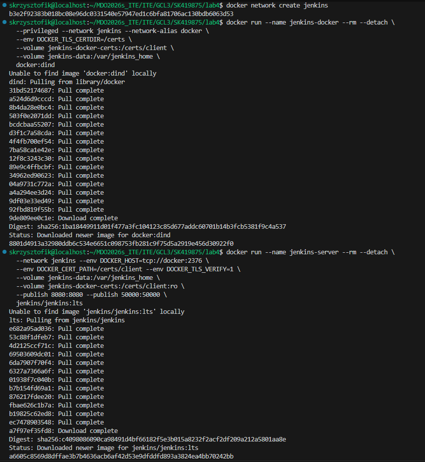 
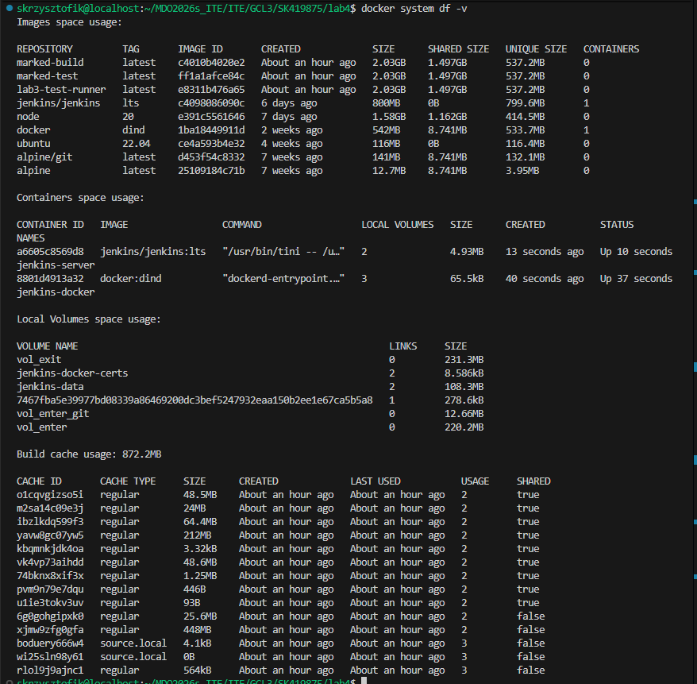
hasło do panelu jenkins 
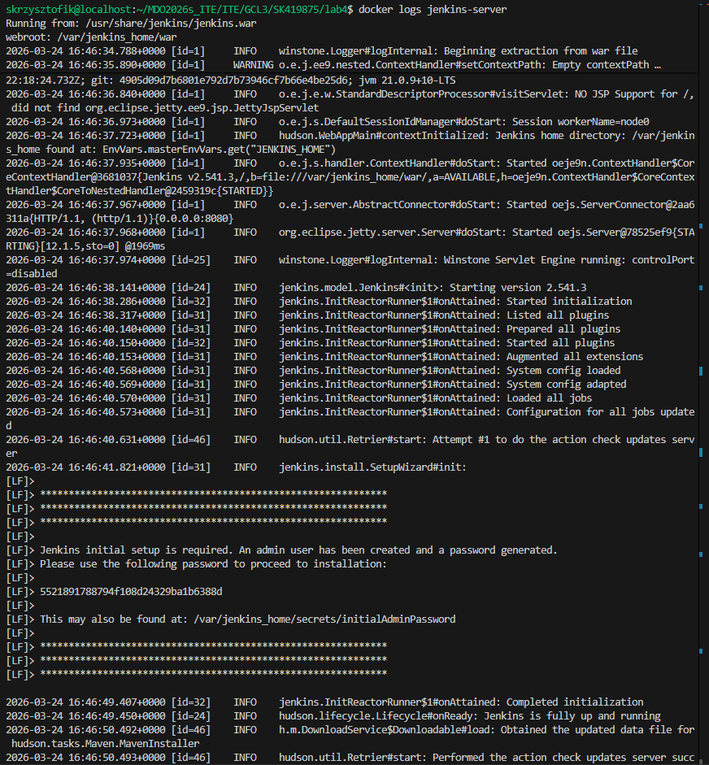 
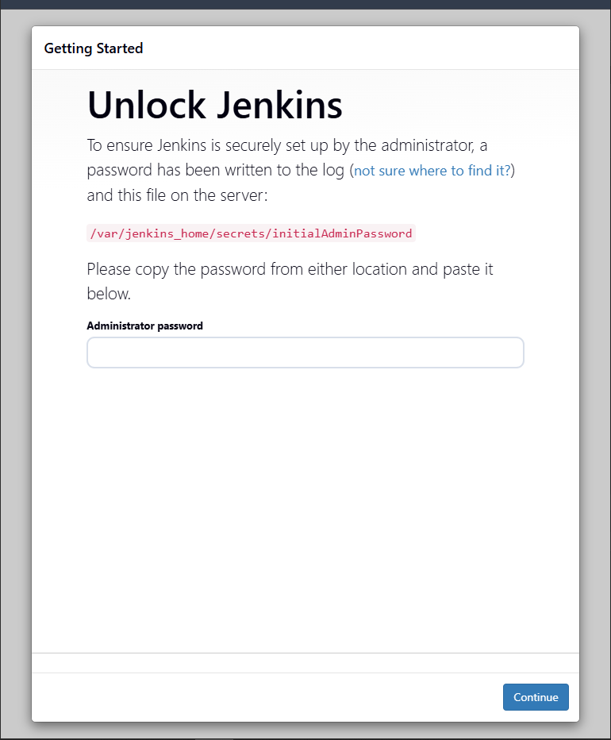 
jenkins w przeglądarce na adresie serwera
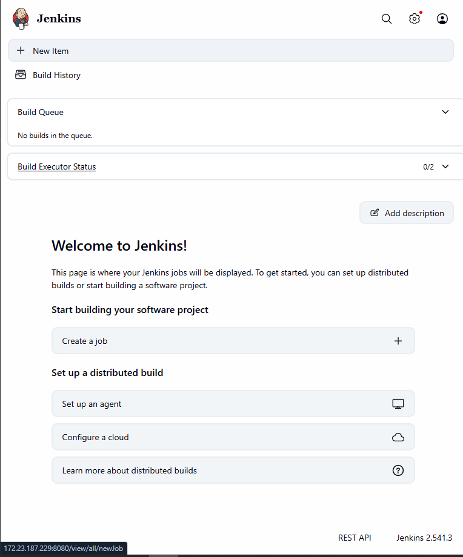