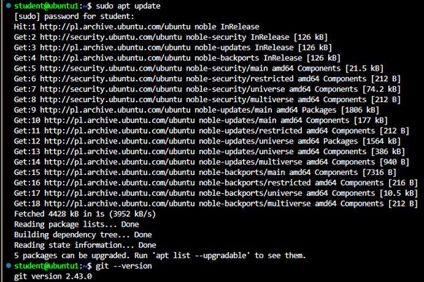
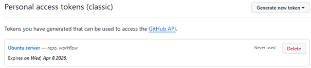
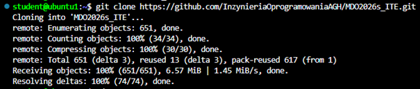
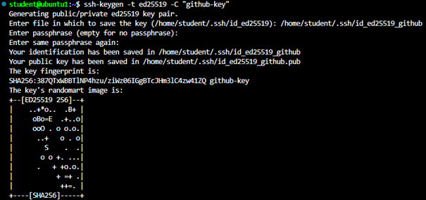
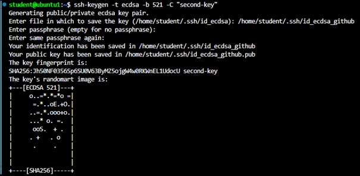
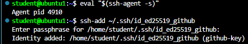
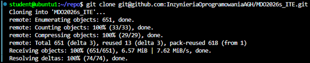
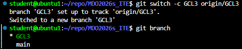
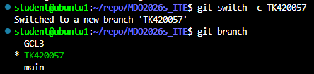
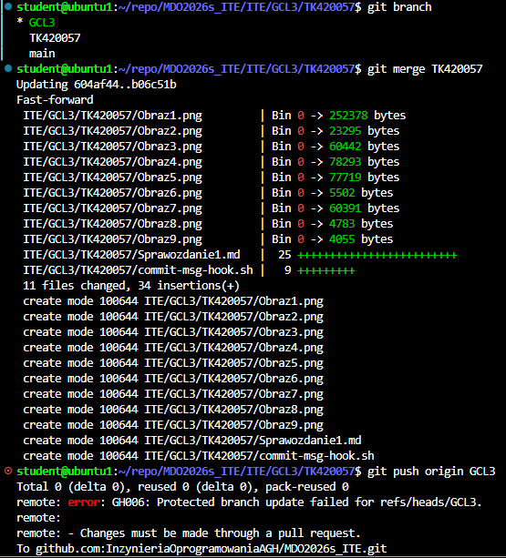

# Lab1

## 1. Treść githooka

```bash
#!/bin/bash

MESSAGE=$(cat $1)

if [[ "$MESSAGE" != TK420057* ]]; then
  echo "Commit message musi zaczynać się od TK420057"
  exit 1
fi
```
## 2. Zrzuty ekranu











## Próba włączenia gałęzi do gałęzi grupowej

