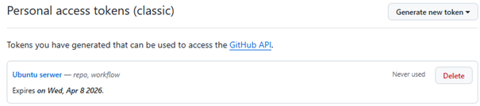
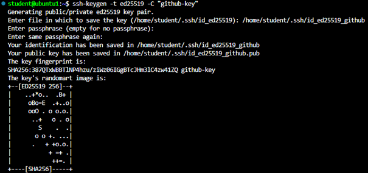
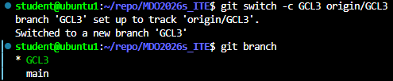
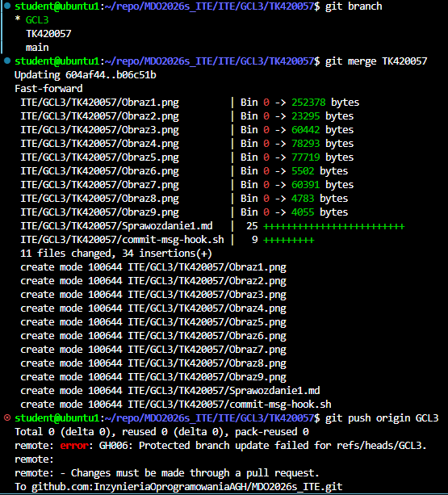
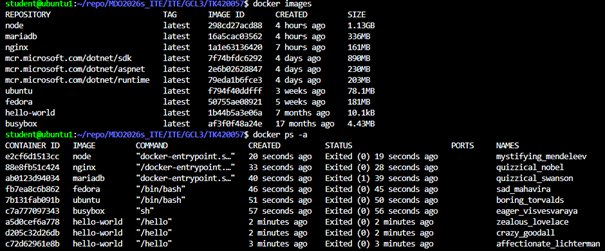
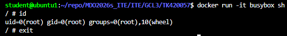
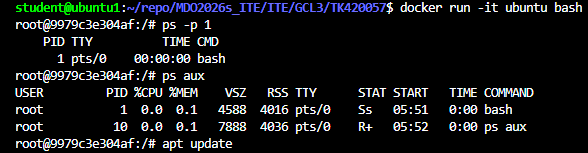
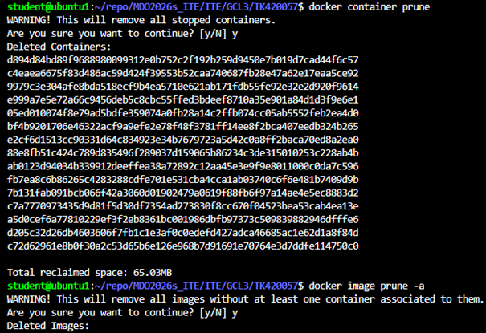

# Sprawozdanie z zajęć 1-4
# **Lab1:** Wprowadzenie, Git, Gałęzie, SSH

---

## Cel zajęć
Celem zajęć było przygotowanie stanowiska pracy, konfiguracja środowiska kontroli wersji Git, wykorzystanie kluczy ssh oraz utworzenie własnej gałezi.

---

## 1. Git
Zainstalowano klienta Git na maszynie wirtualnej z ubuntu serwer.


Sklonowanie repozytorium przedmiotowego za pomocą HTTPS i personal access token.



## 2. SSH
1. Utworzono dwa klucze SSH, inne niż RSA, w tym jeden został zabezpieczony hasłem oraz skonfigurowano klucz SSH jako metodę dostepu do githuba a następnie sklonowano repozytorium z wykorzystaniem protokołu SSH.

Klucze SSH:



2. Skonfigurowano 2FA na koncie GitHub.

## 3. Gałąź
Zgodnie z instrukcją wykonano następujące kroki:
1. Przełaczono się na gałąź grupy z gałęzi main.
2. Utworzono gałąź o nazwie TK420057.
3. Wewnątrz katalogu grupy utworzono nowy katalog TK420057.



## 4. Githook
Treść githooka:

```bash
#!/bin/bash

MESSAGE=$(cat $1)

if [[ "$MESSAGE" != TK420057* ]]; then
  echo "Commit message musi zaczynać się od TK420057"
  exit 1
fi
```

## 5. Próba włączenia gałęzi do gałęzi grupowej




# **Lab2:** Git, Docker

## Cel zajęć

Celem zajęć było zestawienie środowiska skonteneryzowanego do pracy nad CI i potwierdzenie łączności/możliwośi utrzymywania kodu w repozytorium GitHub.

## 1. Instalacja Dockera i rejestracja w dockerhub
Zainstalowano środowisko Docker w systemie Linux korzystając z oficjalnych repozytoriów dystrybucji. Utworzono konto w serwisie DockerHub i zapoznano się z oficjalnymi obrazami.

## 2. Analiza obrazów

### Zapoznanie z obrazami:


### Kontener Busybox
1. Uruchomiono kontener z obrazu busybox.
2. Nawiązano połączenie z kontenerem w trybie interaktywnym i wywołano numer wersji.




### Uruchomienie systemu w kontenerze
1. Uruchomiono system Ubuntu wewnątrz kontenera.
2. Zaprezentowano PID1 w kontenerze oraz procesy dockera na hoście a następnie zaktualizowano pakiety.


## 3. Dockerfile

Stworzono a następnie uruchomiono prosty plik Dockerfile bazujący na systemie ubuntu i sklonowano w nim nasze repozytorium.

```dockerfile
FROM ubuntu

RUN apt update && apt install -y git

WORKDIR /app

RUN git clone https://github.com/InzynieriaOprogramowaniaAGH/MDO2026s_ITE.git

CMD ["bash"]
```


## 4. Czyszczenie obrazów 



# **Lab3:** Dockerfiles, kontener jako definicja etapu

## Cel zajęć
Celem zajęć było zbudowanie oprogramowania w powtarzalnym środowisku CI tak, aby proces był przenośny między ustrojami.

## Wybór oprogramowania
Do realizacji zadań wybrano oprogramowanie flask.

## Sklonowanie repozytorium, build i testy jednostkowe


## Build w kontenerze

1. Wybranie obrazu kontenera python:3.11 oraz uruchomienie go.
2. Podłączenie się do niego celem rozpoczęcia interaktywnej pracy.
3. Zopatrzenie kontenera w wymagania wstępne.
4. Sklonowanie repozytorium.
5. Konfiguracja środowiska i uruchomienie builda.
6. Uruchomienie testów.


## Pliki Dockerfile
Stworzono dwa pliki Dockerfile automatyzujce wcześniej wymienione kroki.


Dockerfile.build:

```
FROM python:3.11

WORKDIR /app

RUN apt update && apt install -y git

RUN git clone https://github.com/pallets/flask.git .

RUN pip install -e .
RUN pip install pytest
```

Dockerfile.test:

```
FROM flask-build

WORKDIR /app

CMD ["pytest"]
```

# **Lab4:** Dodatkowa terminologia w konteneryzacji, instancja Jenkins

## Zachowywanie stanu między kontenerami

1. Przygotowano woluminy wejściowy i wyjściowy i podłaczono do kontenera.
2. Urumiono kontener i zainstalowano niezbędne wymagania wstępne (bez gita).
3. Sklonowano repozytorium na wolumin wejściowy.
4. Uruchomiono build w kontenerze.
5. Zapisanie plików na woluminie wyjściowym.

Praca na wolumenach bez gita.


Z gitem.


Wykonanie wcześniejszych kroków za pomocą docker build i pliku Dockerfile wykorzustując RUN --mount.
Dockerfile:

```
FROM ubuntu:22.04

RUN apt update && apt install -y python3 python3-pip

WORKDIR /app

RUN --mount=type=bind,source=.,target=/src \
    pip install /src
```

## Eksponowanie portu i łaczność między kontenerami

Stworzenie dwóch kontenerów, uruchomienie na jednym z nich serwera iperf oraz połączenie się z nim z drugiego kontenera i zbadanie ruchu.


Ponowne wykonanie powyższego zadania ale wykorzystując własną sieć mostkową oraz uzywając rozwiązania nazw. Zdecydowanie lepsze rozwiązanie gdyż zmniejsza ryzyko popełnienia kosztownej czasowo literówki.


Łączenie się spoza kontenera z hosta i spoza hosta.


Udało się nawiązać połaczenie z hosta natomiast w przypadku połączenia spozahosta pojawił się problem. Maszyna wirtualna miała wybrany default switch jako przełącznik wirtulany w karcie sieciowej co powodowało, że próba połączenia następowała z samą maszyną wirtualną, a nie z kontenerem. Przynajmniej tak mi się wydaję. Dlatego z pomocą AI spróbowałem to obejść tworząc nowy przełącznik wirtualny który w inny spośób ustawiał ip maszyny wirtualnej i dzięki temu kontenera co widać na screenie.

Niemniej wykonane pomiary między kontenerem a hostem wykazują bardzo wysoką przepustowość na poziomie 36.4 Gbits/s. Potwierdza to, że komunikacja odbywa się bez ograniczeń fizycznego łacza sieciowego.

Zestawienie w kontenerze ubuntu usługi SSHD i próba połączenia się z nią.

Zaletą SSH jest łatwe debugowanie i obsługa narzędzi legacy, ale wadą jest złamanie zasady efemeryczności kontenerów i obniżenie bezpieczeństwa. W DevOps zaleca się docker exec zamiast SSH, by nie traktować kontenerów jak zwykłych serwerów. (Odpowiedź cześciowo wygenerowana dzięki AI w odpowiedzi na pytanie zawarte w instrukcji).

## Jenkins
Przygotowanie do uruchowmienia serwera Jenkins. Instalacja Jenkinsa z pomocnikiem DIND, wykazanie działających kontenerów oraz ekranu logowania.

