# Lab1 Wprowadzenie, Git, Gałęzie, SSH

## 1. Treść githooka

```bash
#!/bin/bash

MESSAGE=$(cat $1)

if [[ "$MESSAGE" != TK420057* ]]; then
  echo "Commit message musi zaczynać się od TK420057"
  exit 1
fi
```
## 2. Zrzuty ekranu

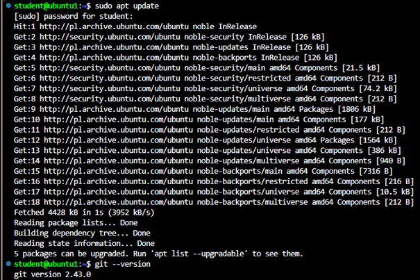

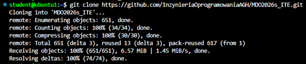

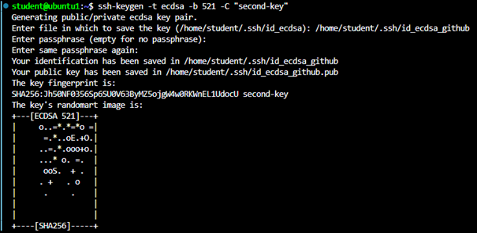
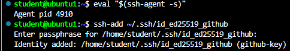
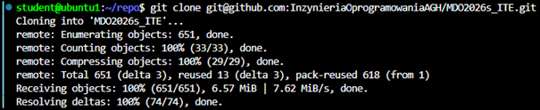

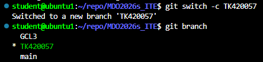

## Próba włączenia gałęzi do gałęzi grupowej


# Lab2 Git, Docker

## Pobieranie i uruchamianie obrazów, sprawdzenie ich rozmiarów.


## Uruchomienie kontenera z obrazu busybox oraz wywołanie numeru wersji

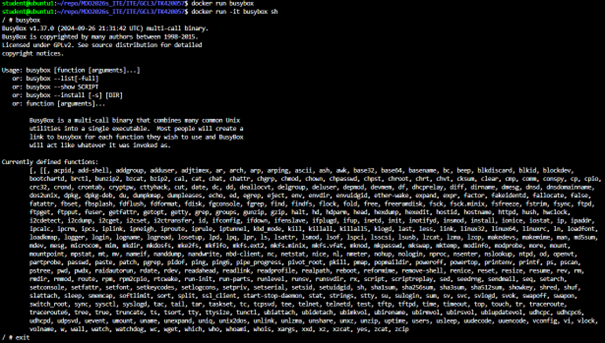

## Uruchomienie systemu w kontenerze


## Stworzenie i uruchomienie pliku Dockerfile klnoującego repozytorium przedmiotowe

```dockerfile
FROM ubuntu

RUN apt update && apt install -y git

WORKDIR /app

RUN git clone https://github.com/InzynieriaOprogramowaniaAGH/MDO2026s_ITE.git

CMD ["bash"]
```

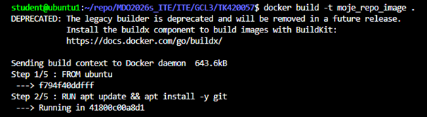
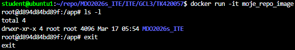

## Wyczyszczenie obrazów przechowywanych w lokalnym magazynie


# Lab3 Dockerfiles, kontener jako definicja etapu

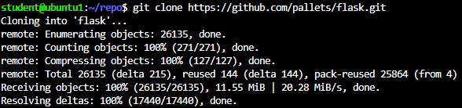
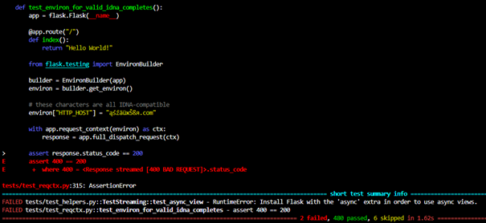
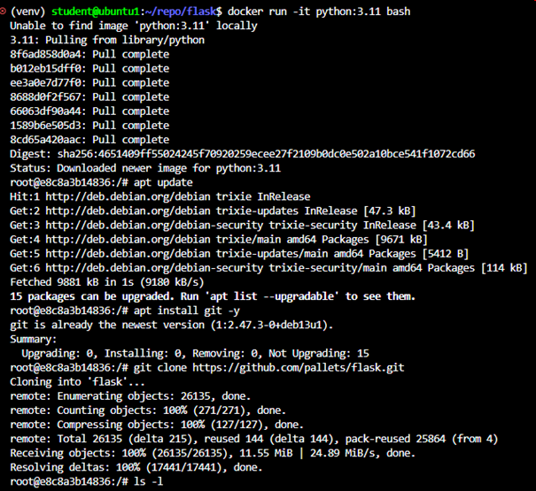
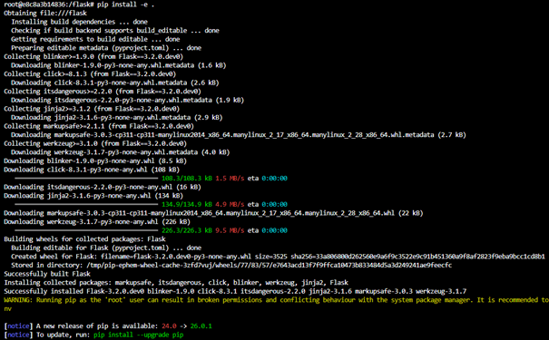
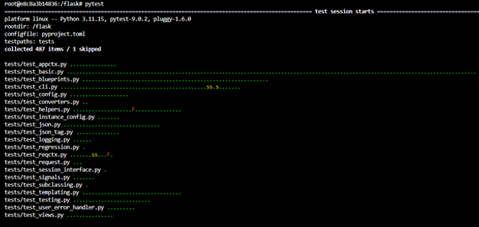
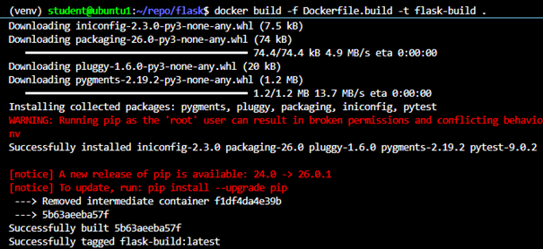
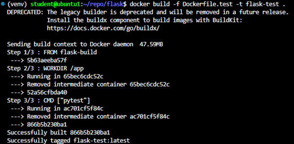
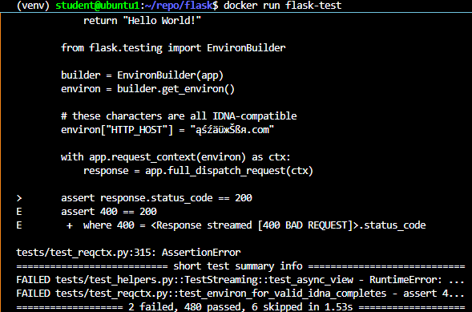

# Lab4 Dodatkowa terminologia w konteneryzacji, instancja Jenkins

## Zachowywanie stanu między kontenerami

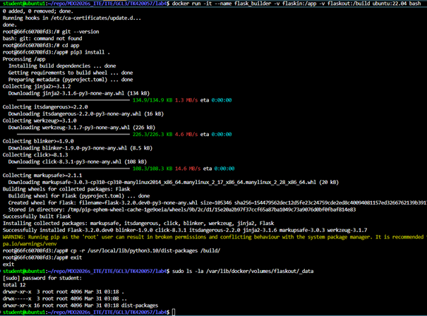
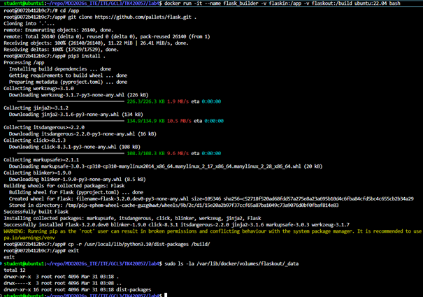

## Eksponowanie portu i łaczność między kontenerami

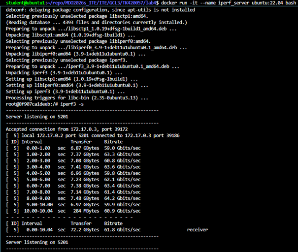
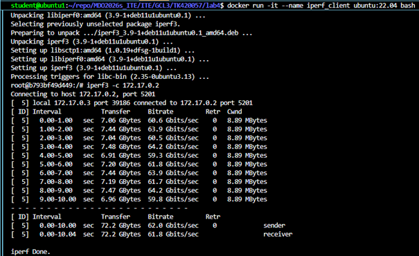
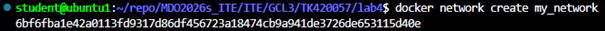
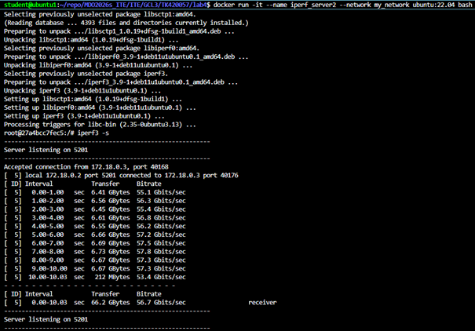
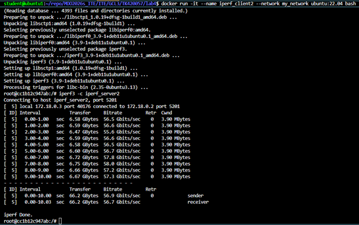
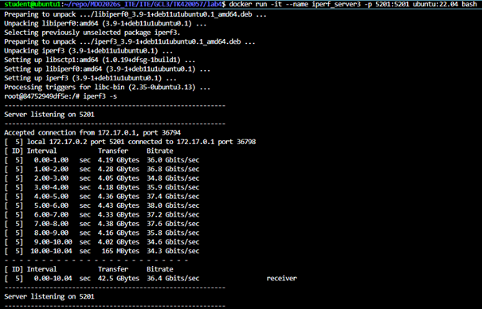
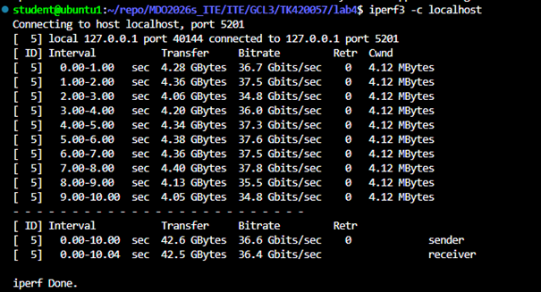
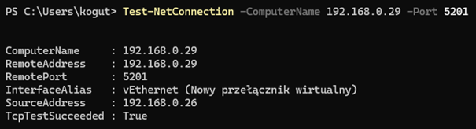
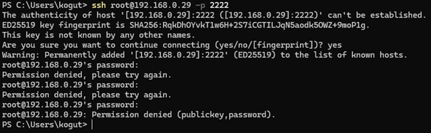

## Jenkins

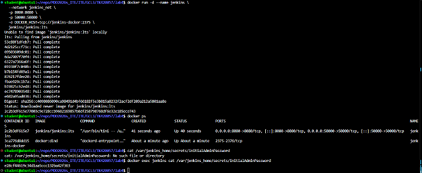
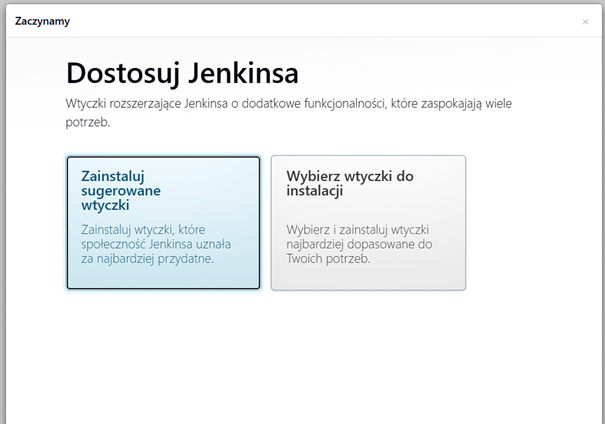