# Lab 5 - Przygotowanie, instalacja oraz testowanie środowiska Jenkins

## Instalacja oraz uruchomienie Jenkinsa
Zapoznano się z instrukcją instalacji Jenkinsa, a następnie przy jej pomocy zainstalowano oraz uruchomiono środowisko Jenkins. Stworzono dedykowaną sieć mostkową dockera, pobrano i uruchomiono obraz dockera dind, stworzono plik dockerfile z którego zbudowano obraz Blueocean który następnie uruchomiono.

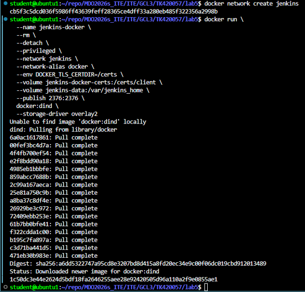
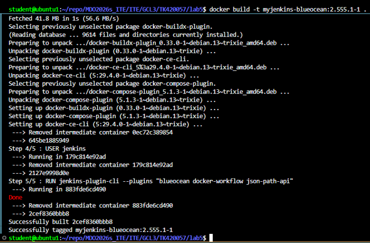
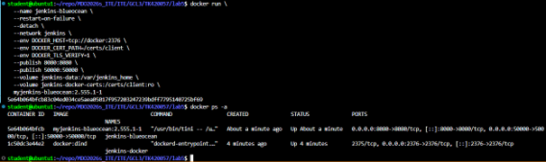

## Logowanie oraz wstępna konfiguracja środowiska Jenkins
Uruchomiono interfejs webowy Jenkinsa w przeglądarce w celu przeprowadzenia pierwszej konfiguracji. Odczytano wygenerowane jednorazowe hasło administratora przy pomocy następującej komendy:

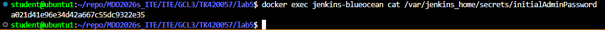

Skopiowane wprowadzone hasło pozwoliło odblokować Jenkinsa oraz przeprowadzić wstępną konfigurację. Przeprowadzono instalację sugerowanych domyślnych wtyczek oraz utworzono docelowe konto administratora wprowadzając własne dane logowania. Wyżej wykonane kroki sfinalizowały proces rejestracji oraz konfiguracji i dały pełny dostęp do panelu głównego.

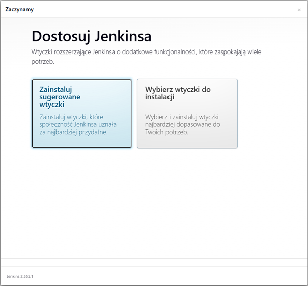
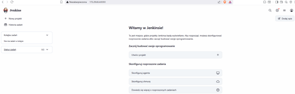

## Tworzenie pierwszych projektów i zaznajomienie z Jenkinsem

Utworzono 3 projekty zawarte w instrukcji laboratorium:
* 1. Stworzono projekt testowy wypisujący `uname`. Uruchomiono zadanie i zweryfikowano logi konsoli które zakończyły się sukcesem.

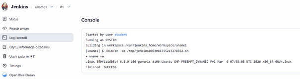

* 2. Stworzono projekt który zwraca błąd gdy godzina jest nieparzysta, a następnie tak samo jak w przypadku pierwszego projektu uruchomiono zadanie i sprawdzono logi.

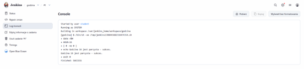

* 3. Stworzono projekt w którym stosując `docker pull` pobrano obraz kontenera ubuntu.

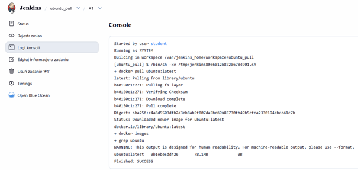

## Obiekt typu Pipeline

Utworzono nowy obiekt typu Pipeline którego zadaniem było sklonowanie repozytorium przedmiotowego, wykonanie operacji checkout do swojego pliku Dockerfile na osobostej gałęzi, a następnie zbudowanie obrazu oraz uruchomienie stworzonego potoku drgui raz.

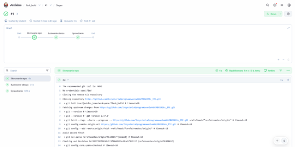

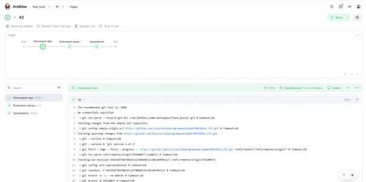

Drugie uruchomienie wykonało się szybciej, ponieważ za pierwszym razem Docker musiał pobrać całe repozytorium, natomiast za drugim razem wykorzytał mechanizm pamięci podręcznej (cache), dzięki czemu znacząco skrócił się czas wykonania.

# Lab 6 i 7 - Pipeline: lista kontrolna/ścieżka krytyczna

## Sforkowane repozytorium Flask

Pracę nad Pipeline'em zaczęto od sforkowania repozytorium wdrażanego oprogramowania (Flask). Następnie umieszczono w sforkowanym repozytorium pliki Dockerfile.build oraz Dockerfile.test z poprzednich zajęć i rozpoczęto implementacje potoku.

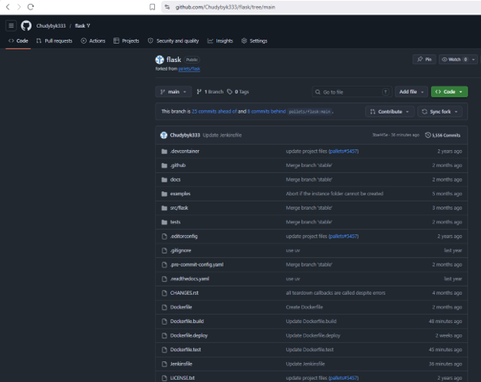

## 1. Konfiguracja Pipeline'u w Jenkinsie

Plik Jenkinsfile definiujący Pipeline umieszczono w sforkowanym repozytorium, a następnie w opcja konfiguracji ustawiono poprawnie zródło definicji (Pipeline script from SCM).

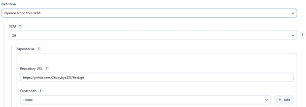

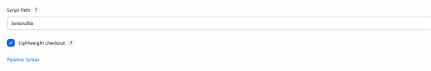

## 2. Opis Pipeline'u

### Build

W tym kroku Jenkins uruchamia proces budowania obrazu kontenera flask-build na podstawie instrukcji zawartych w pliku Dockerfile.build. Wewnątrz kontenera, bazującego na lekkiej dystrubucji python:3.12-slim, instalowane są niezbędne narzędzia systemowe oraz zależności projektowe. Na koniec wykonywane jest polecenie python -m build, które kompiluje kod źródłowy Flaska do gotowej, spakowanej postaci redystrybucyjnej (paczki .whl).

Dockerfile.build

```dockerfile
FROM python:3.12-slim

RUN apt-get update && apt-get install -y git && rm -rf /var/lib/apt/lists/*

WORKDIR /app
COPY . /app
RUN pip install --no-cache-dir .[test,async] build
RUN python -m build
```

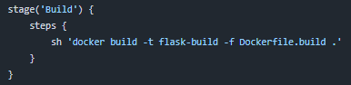

### Test

W etapie Test Jenkins buduje obraz flask-test bazujący na przygotowanym wcześniej flask-build, a następnie uruchamia testy za pomocą pytest. Ze względu na wykorzystanie obrazu bazowego w wersji slim (brak pełnych pakietów językowych), trzy testy modułu CLI kończą się niepowodzeniem z powodu niezgodności kodowania znaków. Dlatego, aby zapobiec przerwaniu potoku i wymusić końcowy status sukcesu, w instrukcji docker run zastosowano || true.

Dockerfile.test

```dockerfile
FROM flask-build:latest

WORKDIR /app

RUN pip install pytest

CMD ["python", "-m", "pytest"]
```

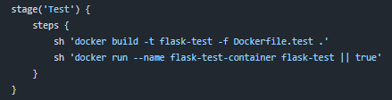

### Publish - Artifact

Tutaj Jenkins tworzy lokalny katalog dist, do którego montuje wolumen kontenera flask-build w celu wyekstraktowania paczki .whl. Następnie, za pomocą tymczasowego kontenera alpine, uprawnienia wyjściowych plików są ustawiane na stnadardowego użytkownika. Na koniec instrukcja archiveArtifacts zabezpiecza i zapisuje gotowy plik .whl jako pobieralny artefakt udostępniany w podsumowaniu udanego przejścia potoku Jenkinsa.

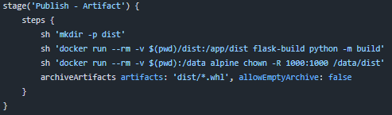

### Deploy

Ten etap realizuje symulację wdrożenia prodykcyjnego poprzez budowę czystego obrazu na bazie pliku Dockerfile.deploy, wykorzystując wcześniej utworzoną paczkę .whl oraz plik testowy wsgi.py. Przed uruchomieniem skrypt oczyszcza środowisko usuwając ewentualną działającą instancje kontenera aplikacyjnego. Finalnie aplikacja zostaje trwale uruchomiona w tle (flaga -d) jako kontener flask-app-prod, a jej port 5000 obsługiwany przez serwer Gunicorn zostaje zmapowany na port 5000 hosta.

Dockerfile.deploy

```dockerfile
FROM python:3.12-slim

WORKDIR /app
COPY dist/*.whl .
RUN pip install --no-cache-dir *.whl gunicorn

COPY wsgi.py .

EXPOSE 5000
CMD ["gunicorn", "--bind", "0.0.0.0:5000", "wsgi:app"]
```

wsgi.py

```python
from flask import Flask

app = Flask(__name__)

@app.route('/')
def hello():
    return "Works"
```

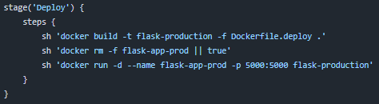

### Smoke Test

W tym kroku realizoawana jest automatyczna weryfikacja kondycji wdrożonej aplikacji. Skrypt wstępnie czeka 20 sekund, aby dać czas na inicjalizacje Gunicorna oraz w pętli wykonuje zapytania http za pomocą narzędzia curl. Pętla wykonuję 20 prób odpytania adresu http://jenkins-docker:5000/ oraz kończy swoje działanie wcześniej po odebraniu poprawnego kodu statusu http.

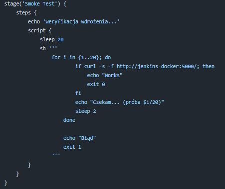

Alternatywne sprawdzenie działania aplikacji:

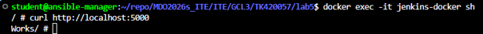

Pipline Overview:

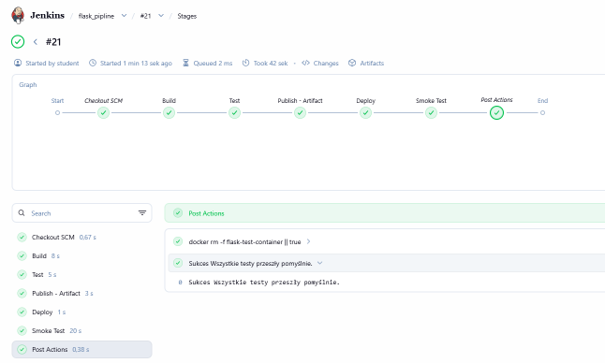