# Sprawozdanie z lab 8-11

# Lab 8 - Automatyzacja i zdalne wykonywanie poleceń za pomocą Ansible

## Instalacja zarządcy Ansible

Utworzono drugą maszynę wirtualną z systemem fedora. Zapewniono obecność programu tar i serwera OpenSSH.
Nadano maszynie hostname ansible-target oraz utworzono w systemie użytkownika ansible.

Następnie na głównej maszynie wirtualnej zainstalowano oprogramowanie Ansible z repozytorium dystrybucji.

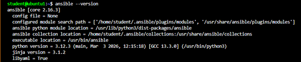

Wygenerowano i wymieniono klucze SSH między użytkownikiem w głównej maszynie wirtualnej, a użytkownikiem ansible tak, by logowanie było bezhasłowe.

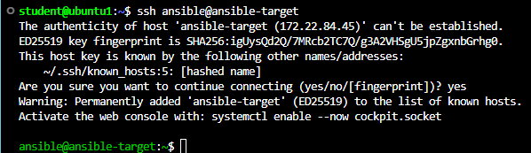

## Konfiguracja DNS i sprawdzenie łączności

Za pomocą narzędzia `hostnamectl` ustawiono przewidywalne nazwy dla maszyn wirtualnych. Następnie dokonano statycznego mapowania nazw na adresy IP poprzez edycję plików `/etc/hosts` na obu systemach.

* Konfiguracja na maszynie `ansible-manager`:

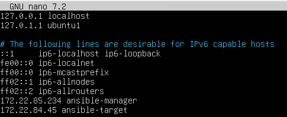

* Konfiguracja na maszynie `ansible-target`:

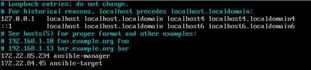

Po skonfigurowaniu lokalnego rozwiązywania nazw, zweryfikowano łączność sieciową za pomocą narzędzia `ping`. Maszyny bezproblemowo odnajdują się w sieci lokalnej przy użyciu aliasów:

* Test z poziomu `ansible-manager` do `ansible-target`:

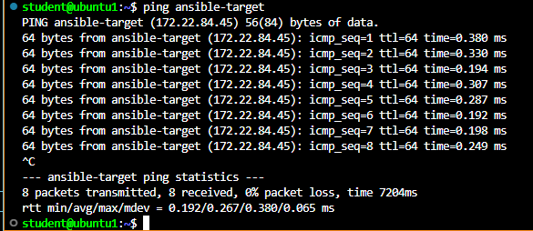

* Test z poziomu `ansible-target` do `ansible-manager`:

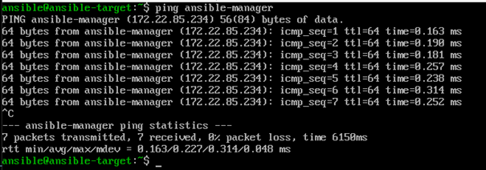

Wdrożenie automatyzacji za pomocą Ansible wymaga bezhasłowego dostępu do zarządzanych węzłów. W tym celu na maszynie dyrygencie wygenerowano parę kluczy SSH, a nastepnie przesłano klucz publiczy na maszynę docelową przy pomocy polecenia:
```bash
ssh-copy-id ansible@ansible-target
```

## Plik inwentaryzacji oraz test modułu ping

W katalogu utworzono plik `inventory.ini`, w którym odseparowano rolę maszyn.

```ini
[Orchestrators]
ansible-manager ansible_connection=local

[Endpoints]
ansible-target ansible_user=ansible
```

Ostatecznym testem poprawności konfiguracji było wywołanie modułu `ping` z poziomu Ansible dla wszsytkich maszyn.

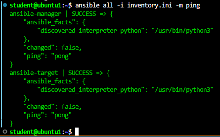

## Zdalne wywoływanie procedur

W pierwszej kolejności uruchomiono uproszczoną wersję `playbook.yaml`, która jedynie wykonywała jedynie ping do wszytkich maszyn oraz kopiowanie pliku inwentaryzacji na maszynę `Endpoints`.

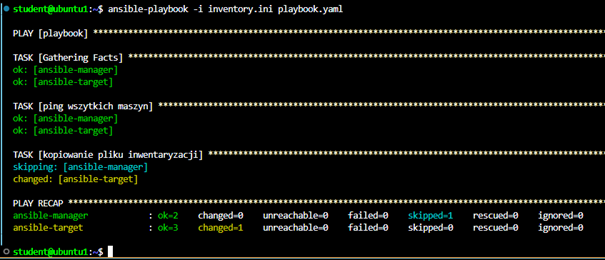

Status zadania kopiowania pliku przy pierwszym uruchomieniu dla maszyny ansible-target zmienił się na changed, a na maszynie ansible-manager został pominięty.

* Utworzony plik na maszynie ansible-target:*

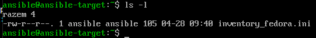

Następnie ponownie wywołano playbooka oraz rozszerzono go o wykonanie aktualizacji pakietów systemowych oraz restar usług `sshd` i `rngd`. W przypadku ponownego uruchomienia moduł copy zweryfikował, że plik na maszynie docelowej ma identyczną zawartość co plik źródłowy. W rezultacie status zadania zmienił się na `OK`.

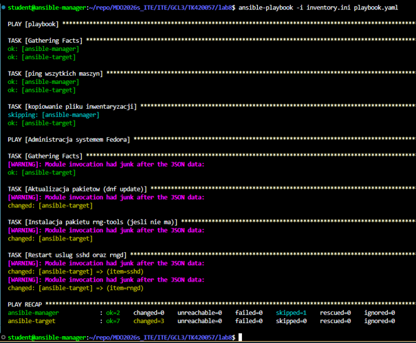

Wszystkie operacje zakończyły się sukcesem i poprawnie się wykonały. Następnie wykonano test w którym tą samą operacje spróbowano wykonać z wyłączonym serwerem SSH.

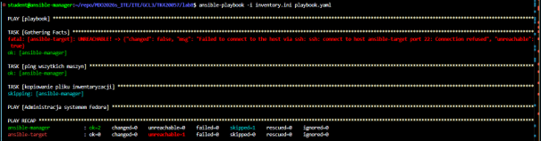

Podczas uruchomienia playbooka, na etapie zbierania faktów Ansible zgłosił krytyczny błąd połączenia. Mechanizm poprawnie przerwał dalsze wykonywanie działań dla niedostępnego hosta.

## Zarządzanie stworzonym artefaktem

Ostatnim etapem laboratorium było spakowanie kompletnego potoku budowania, testowania i wdrażania aplikacji w rolę Ansible o nazwie `deploy_app`. Strukturę roli zainicjalizowano poleceniem `ansible-galaxy role init deploy_app` i umieszczono w katalogu lab8. Główny plik zadań `deploy_app/task/main.yaml` realizuję proces wdrażania dzieląc się na poszczególne bloki operacyjne. Na koniec wykonywany jest smoke test w celu potwierdzenia działania aplikacji oraz po weryfikacji następuje automatyczne czyszczenie środowiska docelowego.

Całość została wywołana za pomocą dedykowanego pliku `run_deploy_app.yaml`:

```yaml
- name: Uruchomienie pelnego wdrozenia za pomoca roli
  hosts: Endpoints
  become: true
  roles:
    - deploy_app
```

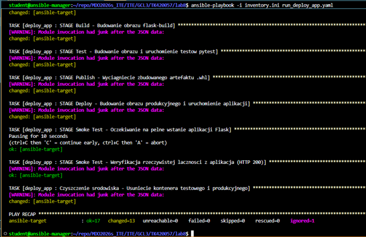

# Lab 9 - Pliki odpowiedzi dla wdrożeń nienadzorowanych

## Pobranie pliku odpowiedzi

Na nowo utworzonej maszynie wirtualnej UEFI zainstalowano system fedora w wersji 44 stosując instalator sieciowy (Everything Netinst). Po przejściu przez instalację przy użyciu polecenia `sudo cat /root/anaconda-ks.cfg` wyśweitlono treść pliku odpowiedzi i skopiowano do pliku ks.cfg.

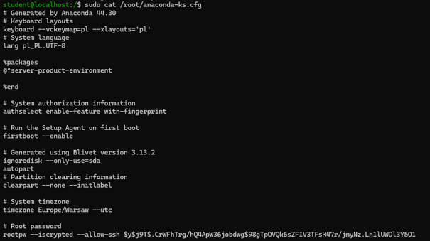

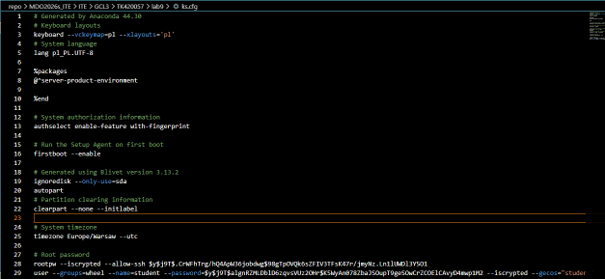

Następnie wzbogacono plik o zdefiniowanie zewnętrznych repozytoriów sieciowych dla Fedory 44. Dodano flagi `text` (instalacja w trybie tekstowym) oraz `reboot` (automatyczny restart po zakończeniu pracy instalatora). Zapewniono możliwość czyszczenia nośnika i instalacji "w kółko" poprzez dyrektywę `clearpart --all --initlabel --drives=sda`.

## Instalacja nienadzorowana

Utworzono maszynę wirtualną w trybie UEFI. Podczas bootowania instalatora z płyty ISO Fedora Everything Netinst, w menu GRUB przekazano parametrem ścieżkę do przygotowanego pliku odpowiedzi za pomocą dyrektywy `inst.ks=hd:LABEL=OEMDRV:/ks.cfg`.

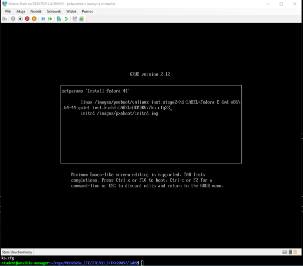

Instalator pomyślnie przetworzył plik `ks.cfg` tym samym wykonując cały proces w pełni bezobsługowo.

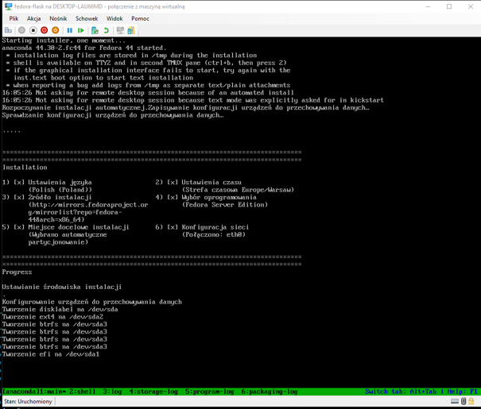

## Automatyczne wdrożenie aplikacji w sekcji `%post`

Ponieważ artefaktem w tym wariancie zadania była paczka dsytrybucyjna Pythona, w sekcji `%post` zaimplementowano pełny proces instalacji zależności oraz aplikacji. Po automatycznym restarcie maszyny wirtualnej, zweryfikowano stan środowiska oraz działania utworzonej i zajerestrowanej usługi systemowej o nazwie `flaskapp.service`.

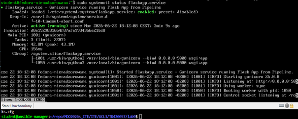

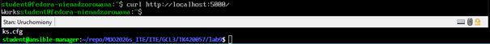

# Lab 10 - Wdrażanie na zarządzalne kontenery: Kubernetes

## Inicjalizacja klastra Minikube

Jako lokalną implementację stosu Kubernetes wykorzystano narzędzie Minikube. Środowisko uruchomiono poleceniem `minikube start`. W celu spełnienia wymagań sprzętowych i zapewnienia stabilności klastra, przydzielono zasoby maszyny wirtualnej (2 CPU, minimalna przestrzeń pamięci RAM oraz sterownik Docker).

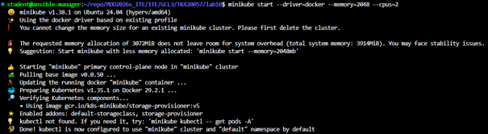

W celu uniknięcia konfliktów z ewentualnymi innymi instalacjami k8s, polecenia administracyjne wywoływano poprzez wbudowany wariant klastra: `minikube kubectl --`.

Poprwaność startu środowiska sprawdzono za pomocą poleceń:

```bash
minikube status
minikube kubectl -- get nodes
```

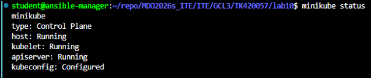

Następnie uruchomiono dashboard którego następnie otwarto w przeglądarce i przedstawiono łączność.

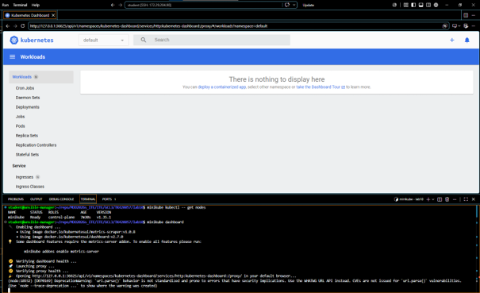

## Analiza posiadanego kontenera

Do wykonania tego zadania wykorzystano wcześniej sforkowane repozytorium Flaska na którym z wcześniejszych zajęć znajdowały się pliki Dockerfile. Jako bazę do wdrożenia w klastrze Kubernetes wykorzystano kontener produkcyjny.

W katalogu roboczym, zawierającym sklonowane (sforkowane) repozytorium aplikacji, zainicjalizowano czyste środowisko wirtualne `venv`. Następnie przy użyciu pliku definicji `Dockerfile.deploy`, zbudowano produkcyjny obraz kontenera.

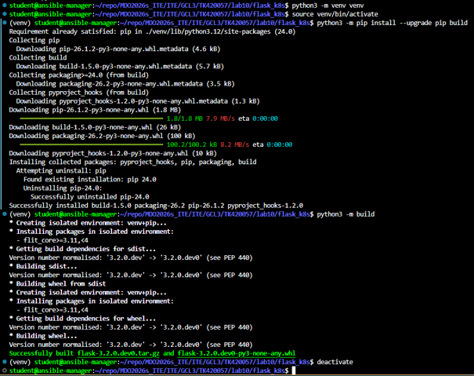

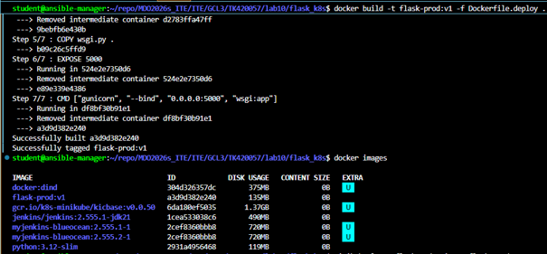

## Uruchamianie oprogramowania

Następnie tak powstały obraz Docker załadowano do minikube i sprawdzono poprawność jego działania.

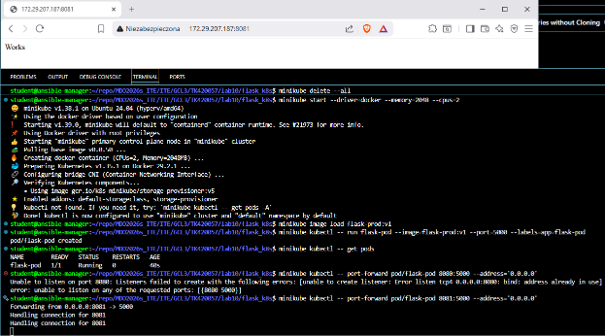

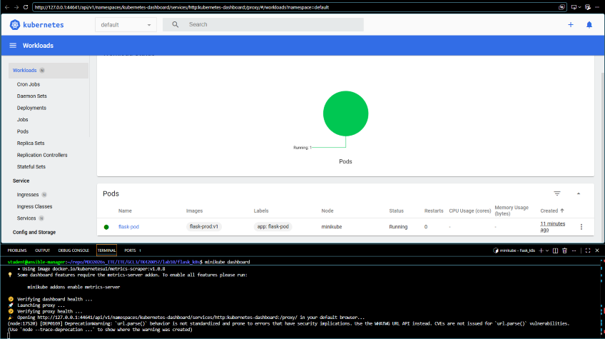

## Wdrożenie jako plik YML

Poprzednie wdrożenie zapisano do pliku `deployment.yaml`. Następnie przeprowadzono próbne wdrożenie za pomocą `minikube kubectl -- apply deployment.yaml`.

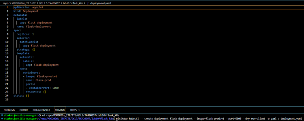

Następnie dokonano modyfikacji pliku wdrożenia i zmieniono ilość replik na 4 i ponownie rozpoczęto wdrożenie.

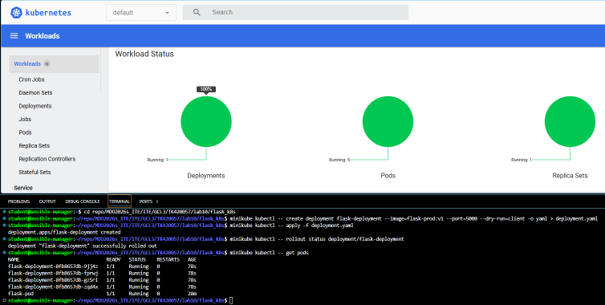

## Przygotowanie nowego obrazu

Wykorzystując to samo podejście co przy budowie piewrszego obrazu wykonano w ten sam sposób dwa kolejne obrazy z czego jeden był dobry, a drugi zwracał błąd.

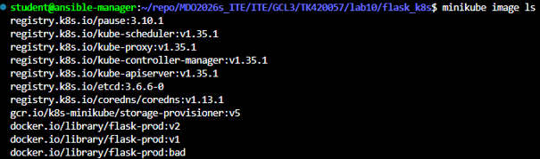

## Zmiany w deploymencie i kontrola wdrożeń

Zgodnie z wytycznymi z polecenia przeprowadzono następujące aktualizację pliku YAML z wdrożeniem.

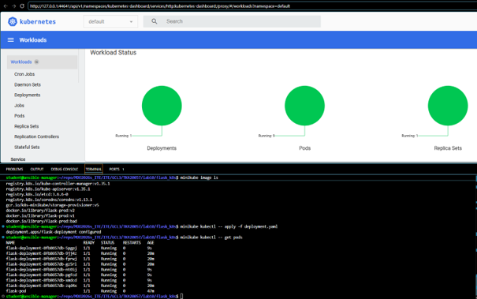

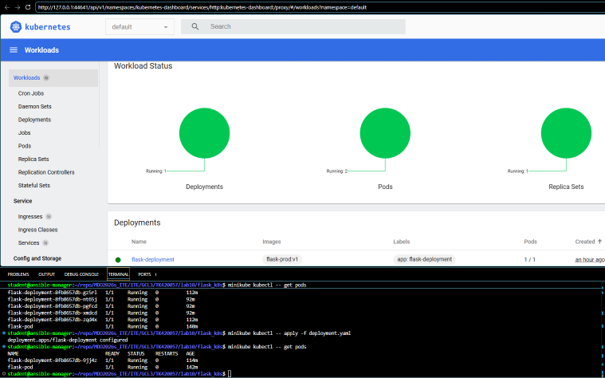

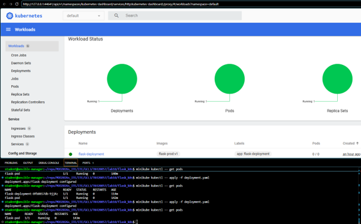

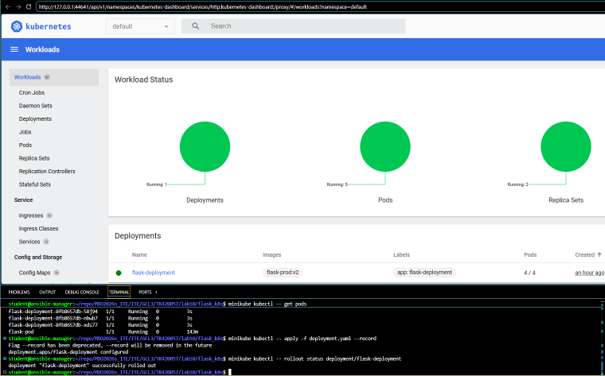

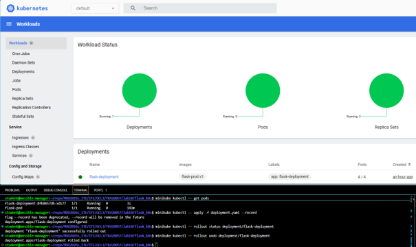

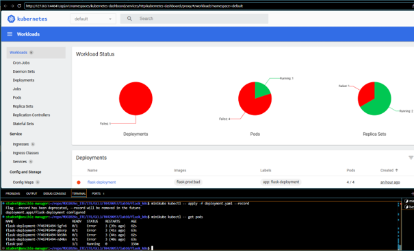

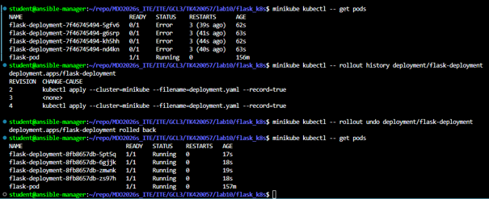

Skrypt weryfikujący `verify_deployment.sh`:

```bash
#!/bin/bash

echo "Rozpoczynam weryfikację wdrożenia..."

if minikube kubectl -- rollout status deployment/flask-deployment --timeout=60s; then
    echo "Sukces! Wdrożenie zakończyło się pomyślnie w 60sekund."
    exit 0
else
    echo "Błąd! Wdrożenie zakończyło sie niepowodzeniem w 60 sekund."
    exit 1
fi
```

## Strategie wdrożeń

Przygotowano wersje wdrożeń stosujące różne strategie.

-Recreate: Wszytkie pody starej wersji były jednocześnie usuwane, a dopiero po ich całkowitym zamknięciu klastry uruchamiały nową wersję.

-Rolling Update: Nowa wersja była wdrażana partiami przy jednoczesnym powolnym wygaszaniu starej wersji.

-Canary: Nowa wersja jest wprowadzana tylko dla pojedynczych przypadków.

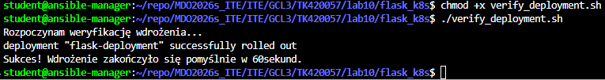

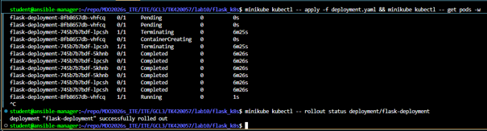

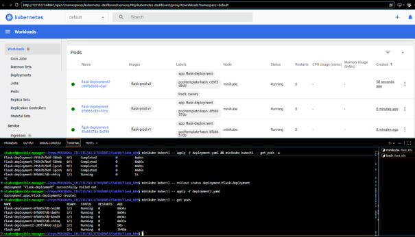

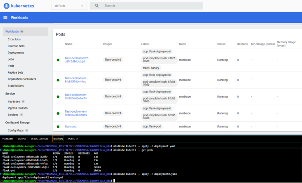

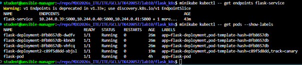

# Lab 11 - Kubernetes (2)

## Eksponowanie

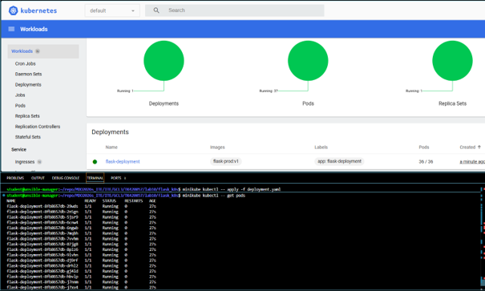

Dokonano wdrożenia web-serwera za pomocą deploymentu w pliku YAML. Wdrożono początkowo liczbę podów w ilości 36, a następnie weksponowano dostęp do web-serwera.

* Do jednego poda:*

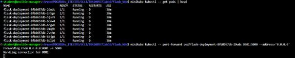

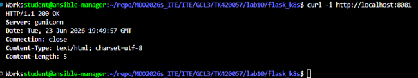

* Do deploymentu:*

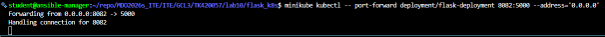

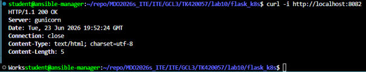

* Do serwisu (poleceniem i plikiem yaml):*

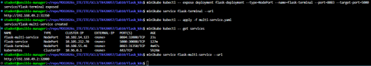

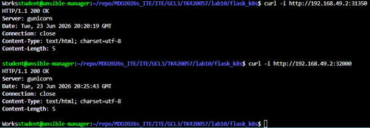

## Skalowanie

Przeskalowanie wdrożenia przy pomocy dyrektywy `scale` oraz nowego pliku yaml.

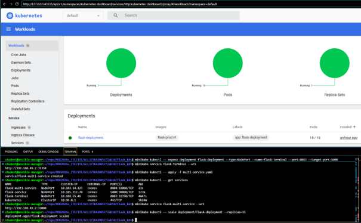

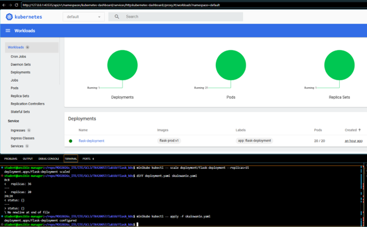

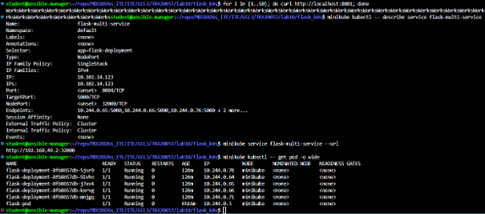
