# Sprawozdanie 1


## Zajęcia 01 - Git


Na maszynie wirtualnej z Ubuntu zainstalowano klienta Git oraz narzędzia do obsługi kluczy SSH. Repozytorium przedmiotowe zostało najpierw sklonowane przez HTTPS z użyciem personal access token, a następnie ponownie sklonowane przez SSH po skonfigurowaniu klucza.

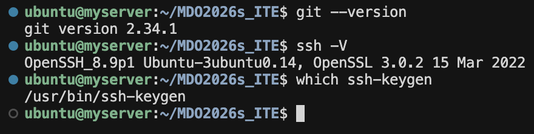

Sklonowanie repozytorium z użyciem SSH:

```bash
git clone git@github.com:InzynieriaOprogramowaniaAGH/MDO2026s_ITE.git
```

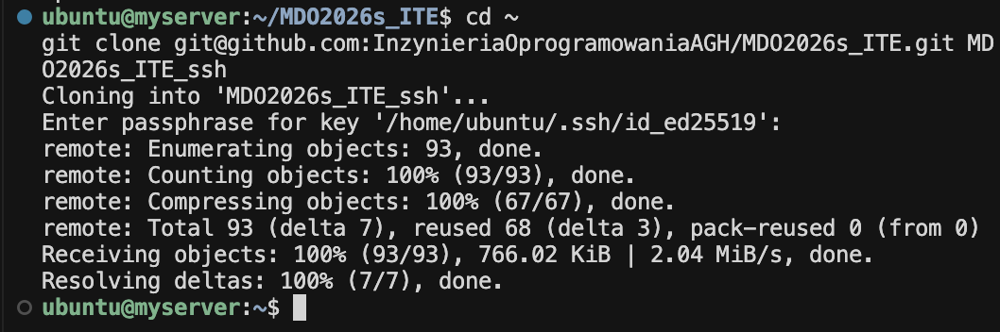

Przełączono się na gałąź `main`, następnie na gałąź grupową `GCL3`, a z niej utworzono gałąź osobistą `YK424367`:

```bash
git checkout main
git checkout GCL3
git checkout -b YK424367
```

W katalogu `ITE/GCL3` utworzono folder `YK424367`.

```bash
cd ITE/GCL3
mkdir YK424367
```


Napisano skrypt weryfikujący, że każdy commit message zaczyna się od identyfikatora `YK424367`. Treść hooka (`commit-msg.sh`):

```bash
MSG_FILE="$1"                          # plik z komunikatem commita
MSG="$(sed -n '1p' "$MSG_FILE")"        # pierwsza linia = tytuł

PREFIX="YK424367"                      

echo "$MSG" | grep -q "^$PREFIX" || {   # czy zaczyna się od YK424367?
  echo "No '$PREFIX'" >&2               # błąd na stderr
  exit 1                                # odrzuć commit
}

exit 0                                  # OK
```

Skrypt został skopiowany do `.git/hooks/commit-msg` i nadano mu uprawnienia do wykonywania (`chmod +x`). Każdy commit bez prefiksu `YK424367` jest odrzucany przez hook.

#### Pytania do LLM

1. Jak zrobić hook dla gita zeby sprawdzal kazdy commit zeby sie zaczynal od YK424367?
2. Po kolei wytlumacz kazda linijke i co ona robi.

---

## Zajęcia 02 - Docker


Docker zainstalowano z repozytorium dystrybucji Ubuntu (pakiet `docker.io`), bez Snap / FlatPak.

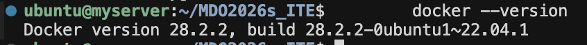


Uruchomiono i sprawdzono rozmiary następujących obrazów:

```text
REPOSITORY                         TAG       IMAGE ID       CREATED         SIZE
mcr.microsoft.com/dotnet/sdk       latest    b04611ee9e1b   2 weeks ago     942MB
mcr.microsoft.com/dotnet/runtime   latest    c29a58701692   2 weeks ago     232MB
mariadb                            latest    b5e2b28c0536   2 weeks ago     362MB
fedora                             latest    db87ba79973f   4 weeks ago     193MB
hello-world                        latest    ca9905c726f0   7 months ago    5.2kB
busybox                            latest    cd9176cd36f9   17 months ago   4.11MB
```

Kody wyjścia: `hello-world` zakończyło się z kodem `0`, pozostałe obrazy po interaktywnym wyjściu tak samo.

### Kontener busybox — tryb interaktywny

```bash
sudo docker run -it busybox
/ # busybox --help
BusyBox v1.37.0 (2024-09-26 21:31:42 UTC) multi-call binary.
BusyBox is copyrighted by many authors between 1998-2015.
Licensed under GPLv2. See source distribution for detailed
copyright notices.
```

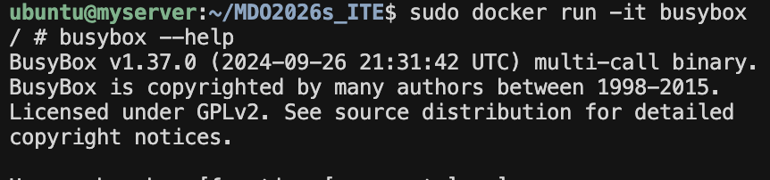

Polecenie `busybox --version` zwróciło „applet not found", ale `--help` wyświetliło informacje o wersji.


### System w kontenerze — Fedora

```bash
docker run -it fedora
dnf install -y procps-ng
[root@8d7eee9ccca3 /]# ps -p 1
    PID TTY          TIME CMD
      1 pts/0    00:00:00 bash
dnf upgrade -y
exit
```
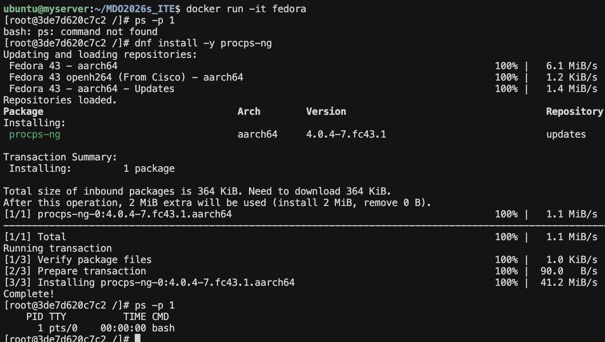

Trzeba było zainstalować `ps`, bo to polecenie nie istniało w minimalnym obrazie.
PID 1 wewnątrz kontenera to proces `bash`. Kontener nie uruchamia pełnego inita systemowego, lecz wyłącznie powłokę.


Plik `Dockerfile.zajecia02`:

```dockerfile
FROM fedora:latest
RUN dnf install -y git
RUN git clone https://github.com/InzynieriaOprogramowaniaAGH/MDO2026s_ITE.git /MDO2026s_ITE
```

Budowanie i weryfikacja:

```bash
docker build -t lab2 -f ITE/GCL3/YK424367/Sprawozdanie1/Dockerfile.zajecia02 .
docker run -it lab2
[root@ea68b3384e6c]# ls /MDO2026s_ITE
README.md  READMEs
```
-t - nadanie nazwy
-f - sciezka do Dockerfile
-it - tryb interaktywny

Repozytorium jest dostępne wewnątrz kontenera pod ścieżką `/MDO2026s_ITE`.


```text
CONTAINER ID   IMAGE                              COMMAND                  CREATED          STATUS                      PORTS     NAMES
bef7a2ca6a9b   mcr.microsoft.com/dotnet/sdk       "/bin/bash"              46 seconds ago   Exited (0) 45 seconds ago             practical_turing
f2d09e98052a   mcr.microsoft.com/dotnet/runtime   "/bin/bash"              4 minutes ago    Exited (0) 4 minutes ago              gracious_montalcini
d2af9b1d4d47   mariadb                            "docker-entrypoint.s…"   5 minutes ago    Exited (1) 5 minutes ago              vigilant_khayyam
12f3ddb5be00   fedora                             "/bin/bash"              7 minutes ago    Exited (0) 7 minutes ago              sleepy_clarke
5d2bfffc6dae   busybox                            "sh"                     8 minutes ago    Exited (0) 8 minutes ago              keen_margulis
98b6b7dc5de4   hello-world                        "/hello"                 10 minutes ago   Exited (0) 10 minutes ago             beautiful_bohr
```

Czyszczenie zakończonych kontenerów: `docker container prune`, czyszczenie obrazów: `docker image prune -a`.

#### Pytania do LLM
Jak wyczyścić zakończone kontenery?
Czemu Fedora nie ma `ps` i jak go zainstalować?

---

## Zajęcia 03 — Dockerfile, Docker Compose


Wybrano projekt [readme-aura](https://github.com/collectioneur/readme-aura) to moja biblioteka na Node.js z licencją open-source, budowana poleceniem `npm run build`, z testami uruchamianymi przez `npm test` (vitest).

### Dockerfile do builda (`Dockerfile.build`)

```dockerfile
FROM node:20
WORKDIR /readme-aura
RUN apt-get install -y git
RUN git clone https://github.com/collectioneur/readme-aura.git .
RUN npm install
RUN npm run build
```

Obraz bazowy `node:20` zawiera Node.js i npm. Git jest potrzebny tylko do sklonowania repozytorium (nie jest zależnością runtime). 
Po `npm run build` w kontenerze znajduje się folder `dist/` ze zbudowaną biblioteką.

Budowanie:

```bash
docker build -t ra-build -f ITE/GCL3/YK424367/Sprawozdanie1/Dockerfile.build .
```

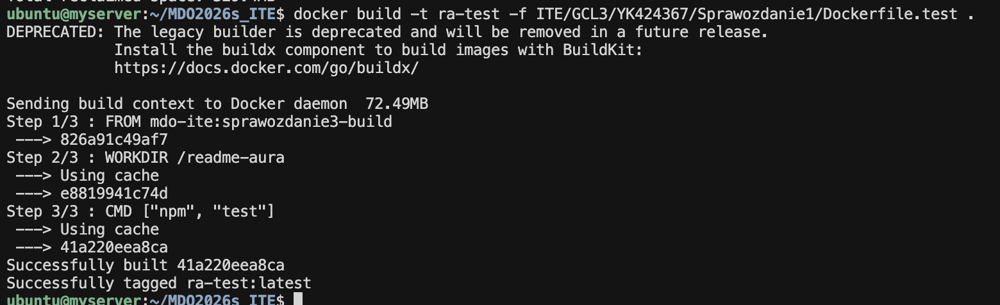

Wynik: obraz `ra-build` zbudowany pomyślnie.

Dockerfile do testów (`Dockerfile.test`):

```dockerfile
FROM ra-build
WORKDIR /readme-aura
CMD ["npm", "test"]
```

Kontener testowy **bazuje na obrazie builda** — nie powtarza kroków kompilacji. Uruchamia wyłącznie testy:

```bash
docker build -t ra-test -f ITE/GCL3/YK424367/Sprawozdanie1/Dockerfile.test .
docker run --rm ra-test
```

Wynik testów:

```text
 RUN  v4.1.0 /readme-aura

 ✓ src/tests/renderer.test.ts (28 tests) 47ms
 ✓ src/tests/init.test.ts (13 tests) 114ms
 ✓ src/tests/parser.test.ts (7 tests) 13ms
 ✓ src/tests/github.test.ts (12 tests) 3ms
 ✓ src/tests/templates.test.ts (12 tests) 3ms

 Test Files  5 passed (5)
      Tests  72 passed (72)
   Start at  08:07:52
   Duration  771ms (transform 92ms, setup 0ms, import 320ms, tests 180ms, environment 0ms)
```

Wszystkie 72 testy przeszły pomyślnie w 5 plikach testowych.

### Docker Compose (`docker-compose.yml`)

```yaml
version: "3.9"

services:
  readme-aura-build:
    build:
      context: .
      dockerfile: Dockerfile.build
    image: ra-build

  readme-aura-test:
    build:
      context: .
      dockerfile: Dockerfile.test
    image: ra-test
    depends_on:
      - readme-aura-build
```

Kompozycja definiuje dwie usługi: `readme-aura-build` (buduje projekt) i `readme-aura-test` (uruchamia testy, zależy od builda). Polecenia:

```bash
docker-compose build
docker-compose run --rm readme-aura-test
```

Wynik po `docker-compose run`:

```text
 Test Files  5 passed (5)
      Tests  72 passed (72)
   Start at  08:22:32
   Duration  786ms (transform 109ms, setup 0ms, import 329ms, tests 187ms, environment 0ms)
```

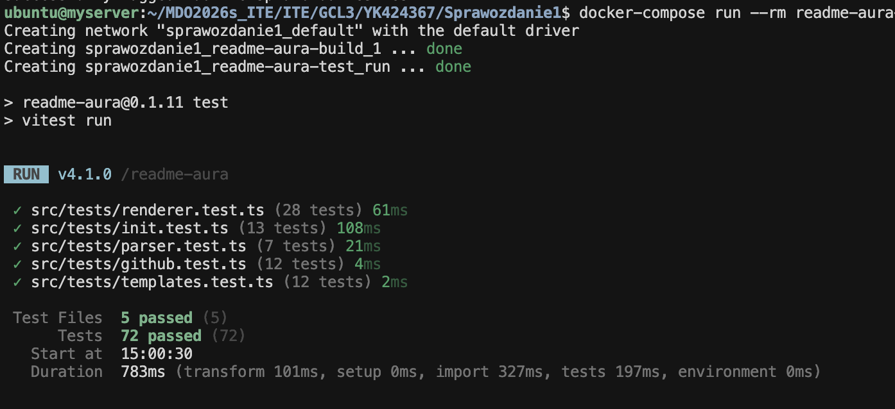


`readme-aura` to narzędzie CLI (generowanie plików README).
Jako kontener nadaje się do użycia w pipeline CI albo do izolowanego środowiska dla innych maintainerów, ale dystrybucja odbywa się przez npm — użytkownicy instalują globalnie (`npm install -g readme-aura`) albo bez instalacji korzystają przez `npx readme-aura init` / `npx readme-aura build` (+ GitHub Workflow, który również korzysta z `npx`).
Kontener builda zawiera narzędzia kompilacji (TypeScript, dependencje), których nie trzeba dostarczać użytkownikowi końcowemu — dlatego oddzielny Dockerfile „deploy" mógłby kopiować tylko `dist/` i `node_modules`
do lekkiego obrazu bazowego (`node:20-alpine`). Formaty JAR, DEB, RPM, EGG dotyczą innych ekosystemów; tutaj zbudowanym programem jest paczka npm.

#### Pytania do LLM
Jak zrobić docker-compose, z czego się on składa?


---

## Zajęcia 04 - Woluminy, sieć, iperf


Uruchomiono serwer iperf3 w kontenerze i połączono się z nim z drugiego kontenera:

```bash
docker run -d --name server networkstatic/iperf3 -s

docker inspect -f '{{range.NetworkSettings.Networks}}{{.IPAddress}}{{end}}' server
# 172.17.0.2

docker run --rm --name client networkstatic/iperf3 -c 172.17.0.2 -t 5
```

Wynik:

```text
[ ID] Interval           Transfer     Bitrate         Retr  Cwnd
[  5]   0.00-1.00   sec  9.64 GBytes  82.8 Gbits/sec    0   3.10 MBytes
[  5]   1.00-2.00   sec  10.0 GBytes  86.0 Gbits/sec    0   3.10 MBytes
[  5]   2.00-3.00   sec  9.77 GBytes  83.9 Gbits/sec    0   3.10 MBytes
[  5]   3.00-4.00   sec  9.89 GBytes  85.0 Gbits/sec    0   3.10 MBytes
[  5]   4.00-5.00   sec  9.72 GBytes  83.5 Gbits/sec    0   3.10 MBytes
- - - - - - - - - - - - - - - - - - - - - - - - -
[  5]   0.00-5.00   sec  49.0 GBytes  84.2 Gbits/sec    0             sender
[  5]   0.00-5.00   sec  49.0 GBytes  84.2 Gbits/sec                  receiver
```

Przepustowość w domyślnej sieci bridge: **~84 Gbits/sec** — komunikacja odbywa się przez wirtualny most na tym samym hoście, dlatego jest tak wysoka szybkość.

Próba połączenia po nazwie (`-c server`) z domyślnej sieci bridge **nie powiodła się** — domyślna sieć bridge nie oferuje rozwiązywania nazw DNS między kontenerami:

```text
iperf3: error - unable to connect to server: Name or service not known
```

#### Część 2 — dedykowana sieć mostkowa z DNS

```bash
docker network create lab4

docker run -d --name server --network lab4 networkstatic/iperf3 -s
docker run --rm --name client --network lab4 networkstatic/iperf3 -c server -t 5
```

Wynik:

```text
[  5]   0.00-5.00   sec  44.5 GBytes  76.4 Gbits/sec    0             sender
[  5]   0.00-5.00   sec  44.5 GBytes  76.4 Gbits/sec                  receiver
```

W dedykowanej sieci mostkowej `lab4` rozwiązywanie nazw działa — kontener `client` łączy się z serwerem po nazwie `server` bez problemu. Przepustowość nieco niższa (~76 Gbits/sec), co mieści się w granicach normalnych wahań.


Uruchomiono serwer z mapowaniem portu:

```bash
docker run -d --name server --network lab4 -p 5201:5201 networkstatic/iperf3 -s
```

Połączenie z hosta przez loopback:

```bash
iperf3 -c 127.0.0.1 -p 5201 -t 5
```

```text
[  7]   0.00-5.00   sec  40.0 GBytes  68.7 Gbits/sec    0             sender
[  7]   0.00-5.00   sec  40.0 GBytes  68.7 Gbits/sec                  receiver
```

Połączenie z hosta przez jego adres IP (np. `192.168.2.2`):

```bash
iperf3 -c 192.168.2.2 -p 5201 -t 5
```

```text
[  7]   0.00-5.00   sec  42.0 GBytes  72.2 Gbits/sec    0             sender
[  7]   0.00-5.00   sec  42.0 GBytes  72.1 Gbits/sec                  receiver
```

Przepustowość z hosta do kontenera: ~68–72 Gbits/sec — mapowanie portu (`-p 5201:5201`).


```bash
docker logs server
```

```text
Server listening on 5201 (test #1)
Accepted connection from 172.19.0.1, port 45530
[  5] local 172.19.0.2 port 5201 connected to 172.19.0.1 port 45546
[  5]   0.00-5.00   sec  40.0 GBytes  68.7 Gbits/sec                  receiver

Server listening on 5201 (test #2)
Accepted connection from 192.168.2.2, port 44758
[  5] local 172.19.0.2 port 5201 connected to 192.168.2.2 port 44768
[  5]   0.00-5.00   sec  42.0 GBytes  72.1 Gbits/sec                  receiver
```


### build readme-aura z woluminami wejściowym i wyjściowym

Projekt: [readme-aura](https://github.com/collectioneur/readme-aura) (Node.js, `npm run build` → folder `dist/`).

Wolumin przechowuje dane poza warstwą kontenera — po `docker rm` dane nadal istnieją w Dockerze. Jeden wolumin na źródła (`ra-in`), drugi na artefakty (`ra-out`), żeby oddzielić input od output.

`node:20-bookworm-slim` ma Node.js i npm, ale nie ma `git`. Pełny obraz `node:20` ma już Git, więc użyłem `node:20-bookworm-slim`.


Repozytorium trafia na wolumin wejściowy przez pomocniczy obraz `alpine/git` (jednorazowy kontener do klonowania):

```bash
docker volume create ra-in
docker volume create ra-out

docker run --rm -v ra-in:/data alpine/git \
  clone https://github.com/collectioneur/readme-aura.git /data

docker run --rm -v ra-in:/src -v ra-out:/out -w /src \
  node:20-bookworm-slim sh -c "npm install && npm run build && cp -r dist /out/"
```

Klon wykonuje się w osobnym, lekkim kontenerze; kod leży na woluminie `ra-in`, więc kontener builda widzi źródła jak zwykły katalog.

Sprawdzenie, że `dist/` jest na wyjściu:

```bash
docker run --rm -v ra-out:/out alpine ls /out/dist
# cli.d.ts
# cli.js
# ...
```

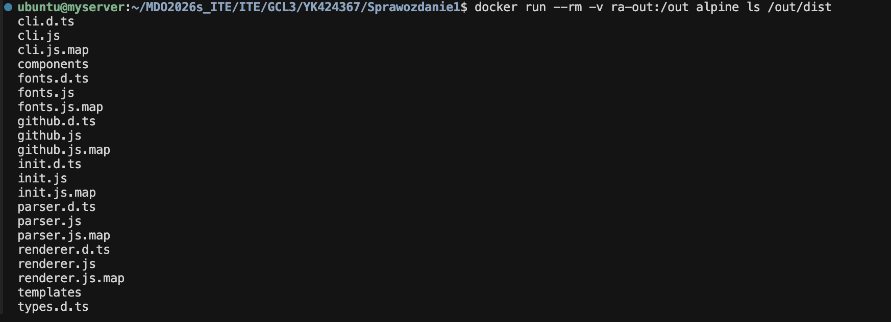


Ten sam układ woluminów. W jednym `docker run` doinstalowywany jest `git`, repozytorium jest klonowane do `/src` (czyli do `ra-in`), następnie build i kopiowanie `dist` na `ra-out`:

```bash
docker volume rm ra-in ra-out
docker volume create ra-in
docker volume create ra-out

docker run --rm -v ra-in:/src -v ra-out:/out -w /src \
  node:20-bookworm-slim sh -c \
  "apt-get update && apt-get install -y git && \
   git clone https://github.com/collectioneur/readme-aura.git . && \
   npm install && npm run build && cp -r dist /out/"
```

**Różnica:** wszystko w jednym kontenerze — wygodne, ale `apt-get install git` ściąga sporo pakietów i nie jest potrzebne do samego builda, jeśli kod już znajduje się na woluminie.


Zamiast ręcznego `docker run` można w Dockerfile z BuildKit stosować 
np. `RUN --mount=type=cache` na cache npm albo `RUN --mount=type=bind` 
do podpięcia katalogu na czas jednego krokue. Wadą jest konieczność pilnowania, 
żeby sekrety i zbędne pliki nie trafiły do warstw obrazu. 
Klonowanie przez `RUN git clone` w obrazie też działa, 
ale w CI zwykle klonuje się **poza** Dockerem i przekazuje 
kontekst lub wolumin.

### Usługa sshd w kontenerze Fedora

**Cel:** uruchomić w obrazie Fedora serwer SSH (`sshd`), wystawić go na porcie hosta i połączyć się klientem `ssh` z maszyny hosta.


```bash
# --- na hoście ---
# Kontener w tle (-d), nazwa ssh-lab4, port hosta 2222 -> 22 w kontenerze (żeby nie kolidować z sshd na hoście).
# sleep infinity utrzymuje kontener przy życiu.
docker run -d --name ssh-lab4 -p 2222:22 fedora:latest sleep infinity

# Wejście do już działającego kontenera
docker exec -it ssh-lab4 bash

# --- wewnątrz kontenera ---
# Instalujemy pakiet openssh-server.
dnf install -y openssh-server

# Wygenerowanie kluczy hosta w /etc/ssh/ 
ssh-keygen -A

# Konto użytkownika do logowania.
useradd -m -s /bin/bash yehor
# Ustawienie hasła.
passwd yehor


dnf install -y nano
# W pliku: PasswordAuthentication yes.
nano /etc/ssh/sshd_config


# wracamy na hosta.
exit

docker exec ssh-lab4 /usr/sbin/sshd -D


# Klient łączy się z localhost, port 2222
ssh -p 2222 yehor@127.0.0.1
```

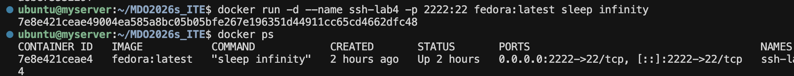
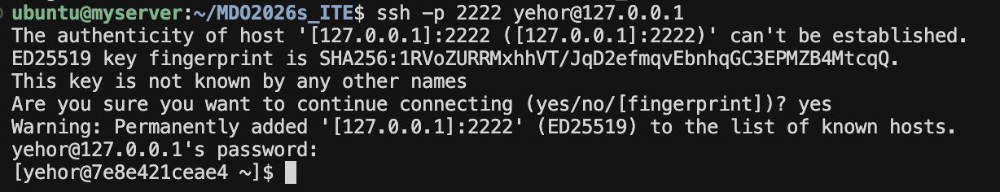

#### Zalety komunikacji z kontenerem przez SSH

- Szyfrowanie — cała sesja jest szyfrowana; można bezpiecznie przekazywać dane nawet przez niezaufaną sieć.
- Uwierzytelnianie kluczem — logowanie kluczem publicznym jest wygodniejsze i bezpieczniejsze niż hasło.
- Transfer plików — `scp` / `sftp` działają od razu bez dodatkowej konfiguracji, jeśli `sshd` jest uruchomiony.

#### Wady komunikacji z kontenerem przez SSH

- Zbędna warstwa — Docker udostępnia `docker exec`, który daje taki sam dostęp do powłoki bez instalowania dodatkowych pakietów.
- Większa powierzchnia ataki — `sshd` to dodatkowy demon nasłuchujący na porcie; wymaga aktualizacji, zarządzania kluczami i konfiguracji.

#### Przypadki użycia

- Do nauki — szybki, znany sposób na interakcję z kontenerem.
- Legacy — aplikacje wymagające SSH, np. starsze systemy CI lub narzędzia do deployu.


### Skonteneryzowany Jenkins z pomocnikiem DIND

Zainstalowano Jenkins w kontenerze Docker wraz z pomocnikiem Docker-in-Docker (DIND). DIND to osobny kontener z demonem Docker, dzięki któremu Jenkins może uruchamiać kontenery do budowania projektów.


Komendy do setupowania Jenkinsa:

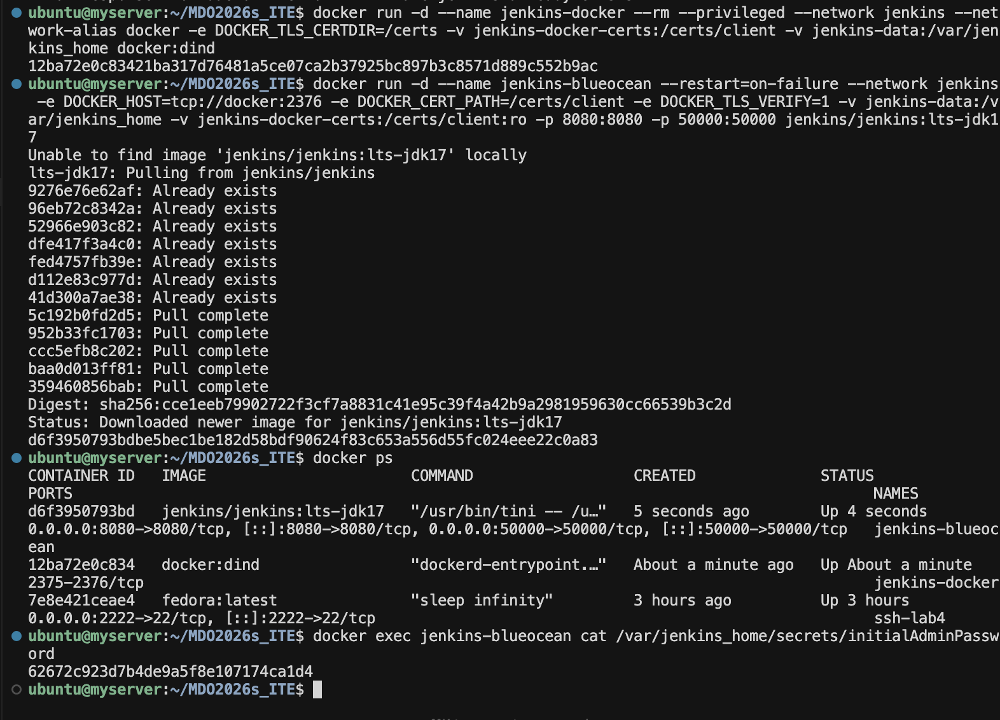

Po wpisaniu hasła w przeglądarce (`http://192.168.2.2 (adres serwera):8080`) wyświetla się ekran inicjalizacji Jenkinsa:

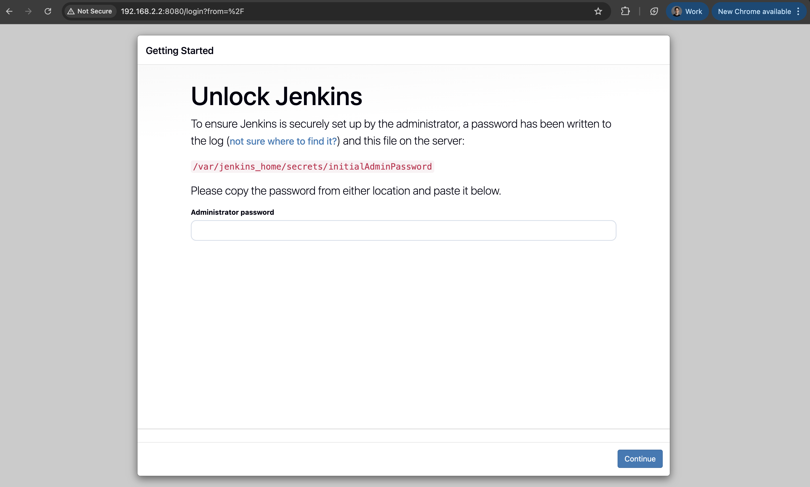

#### Pytania do LLM
Sformatuj plik README i popraw wszystkie błędy gramatyczne.