Srawozdanie 1 Kamil Lewandowski 03.03.2026

utworzono maszyne wirtualną Fedora Linux 43 Server Edition oraz połączono się z nią po ssh
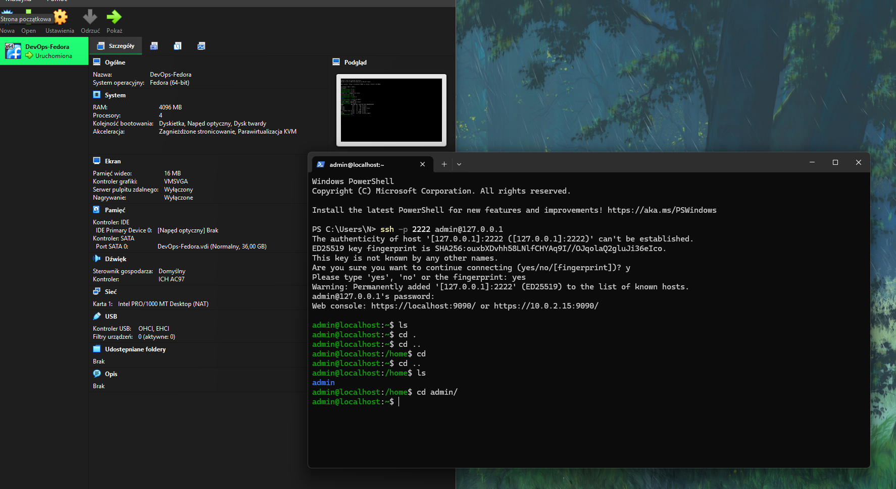

skonfigurowano remote ssh w vs code
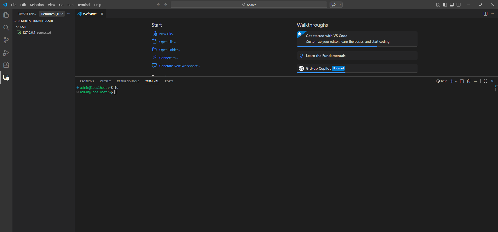

wygenerowano klucze 

sklonowano repozytorium po https i ssh

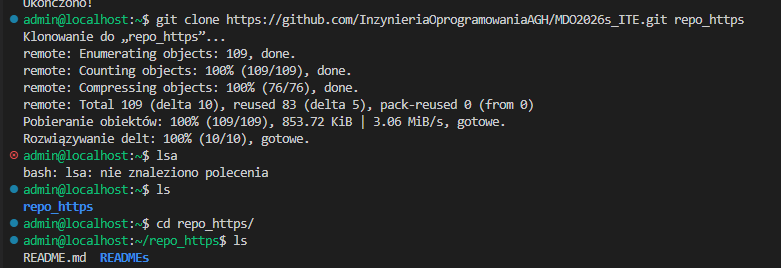
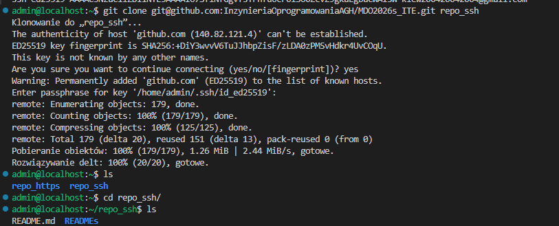

utworzono brancha

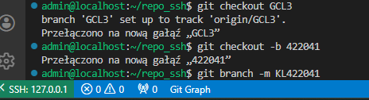

stworzono hooka (commit-msg)

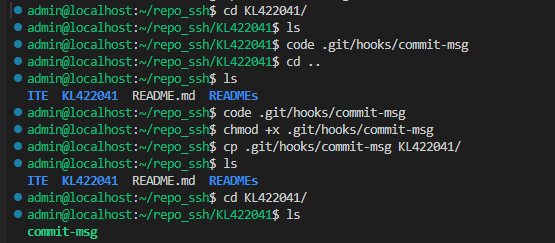

przetestowano hooka

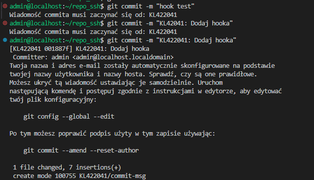

zainstalowano dockera

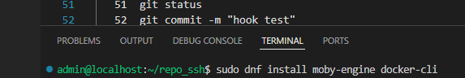

zalogowano się do dockerhub

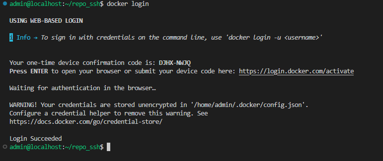

uruchomiono kontenery 

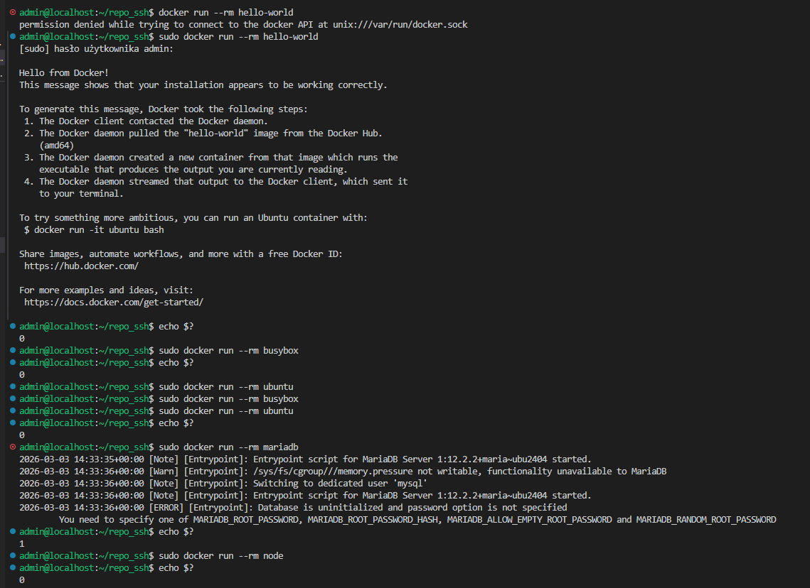
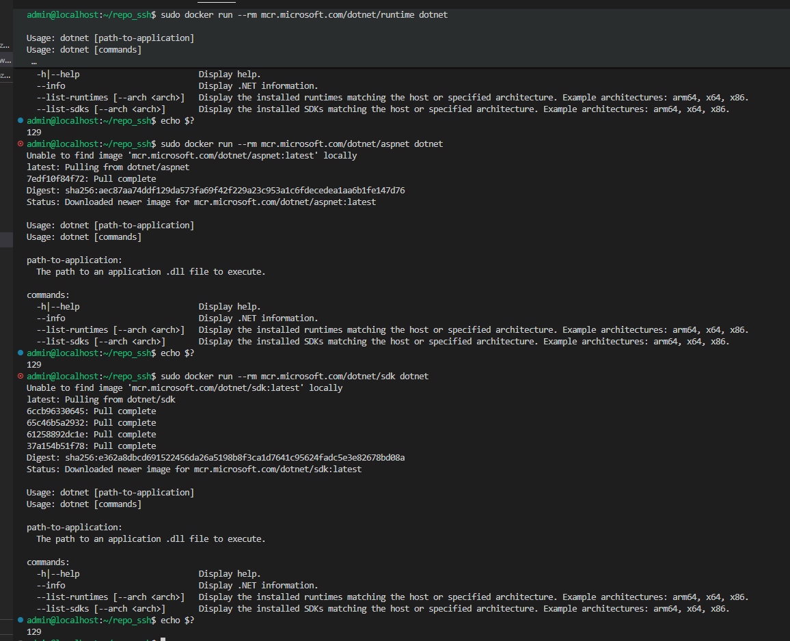

sprawdzono rozmiar kontenerów

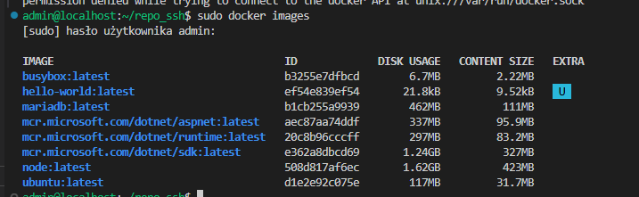

uruchomiono interaktywnie busybox 
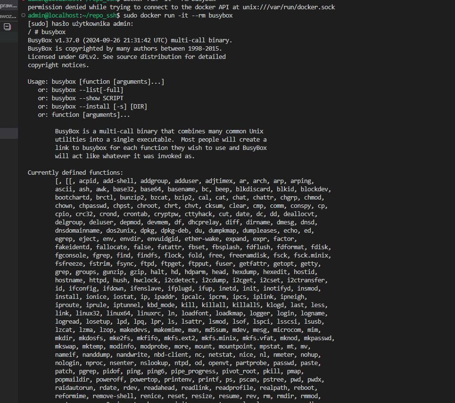

uruchomiono kontener z ubuntu
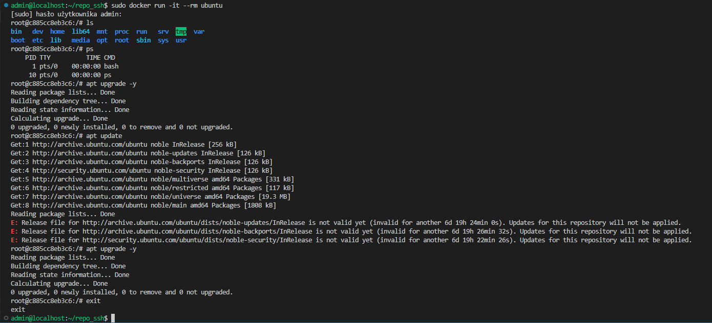

stworzono obraz za pomocą dockerfile i uruchomiono kontener
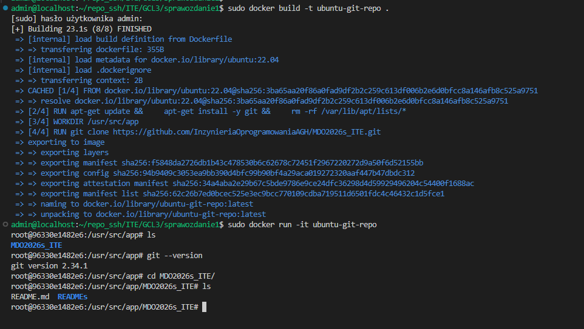

usunięto kontenery
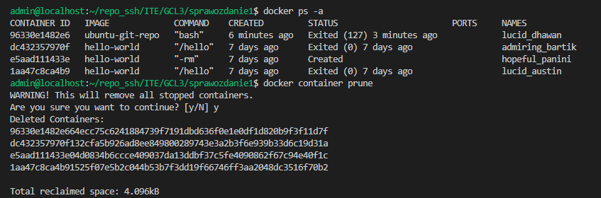

usunięto obrazy
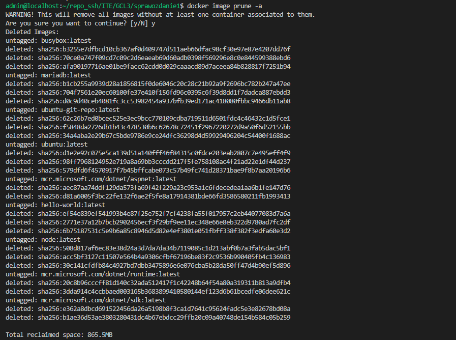