# Sprawozdanie 1 — Kamil Lewandowski

> **Data:** 31.03.2026  
> **Środowisko:** Fedora Linux 43 Server Edition (VM) + host Windows, dostęp przez SSH  

## Zajęcia 01 — Git, SSH, Gałęzie

### Środowisko pracy

Utworzono maszynę wirtualną z systemem **Fedora Linux 43 Server Edition** i nawiązano połączenie przez SSH z hosta Windows.

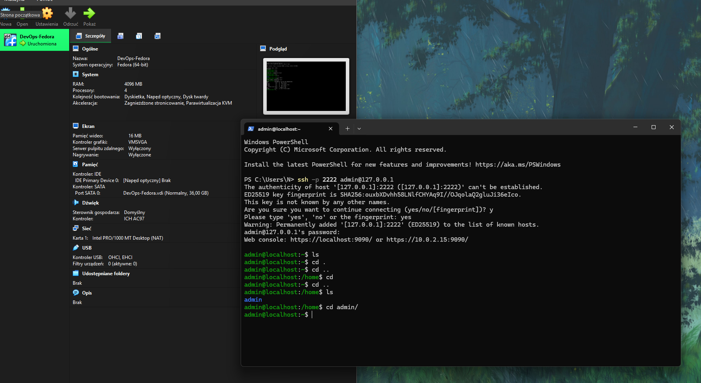

Skonfigurowano zdalny dostęp do repozytorium i maszyny wirtualnej w **Visual Studio Code** za pomocą rozszerzenia Remote SSH.

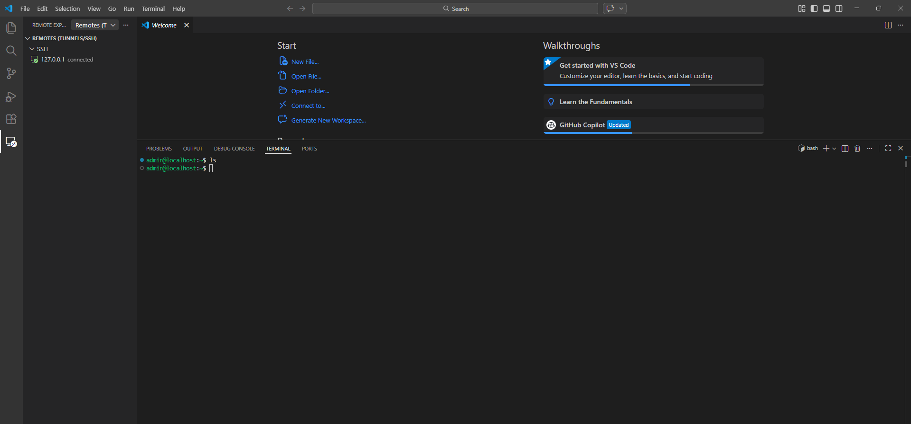

---

### Klucze SSH i klonowanie repozytorium

Wygenerowano dwa klucze SSH (inne niż RSA), w tym jeden zabezpieczony hasłem. Klucz publiczny dodano do konta GitHub. Następnie skonfigurowano uwierzytelnianie dwuskładnikowe (2FA) na koncie GitHub.

Repozytorium przedmiotowe sklonowano najpierw przez HTTPS z użyciem *personal access token*:

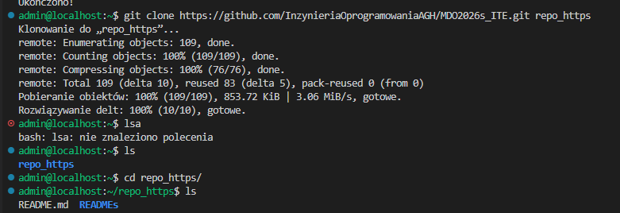

Następnie ponownie z wykorzystaniem protokołu SSH:

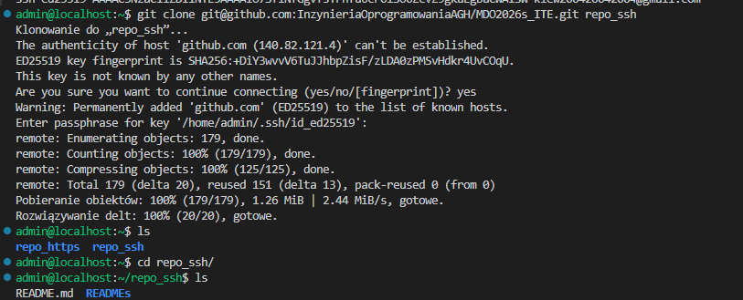

---

### Gałąź robocza

Przełączono się na gałąź `KL422041`


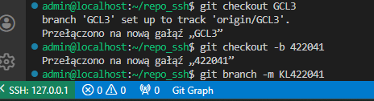

---

### Git Hook — weryfikacja wiadomości commitu

Napisano skrypt `commit-msg` weryfikujący, że każda wiadomość commitu zaczyna się od inicjałów i numeru indeksu autora. Hook umieszczono w katalogu sprawozdania oraz skopiowano do `.git/hooks/commit-msg` i nadano mu uprawnienia do wykonywania.


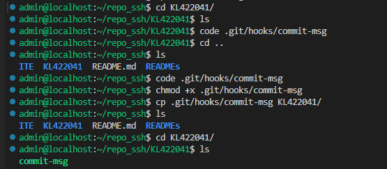

Poprawne działanie hooka zweryfikowano — odrzuca commity z nieprawidłowym prefiksem:

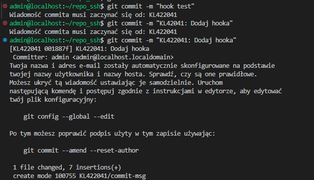

---

## Zajęcia 02 — Docker

### Instalacja i konfiguracja Dockera

Zainstalowano Dockera z repozytorium dystrybucji Fedory:

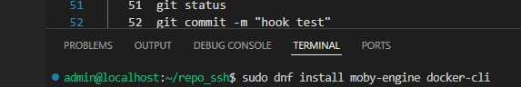

Zalogowano się do **Docker Hub**:


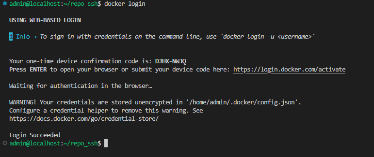

---

### Uruchamianie i eksploracja obrazów

Uruchomiono kolejno obrazy: `hello-world`, `busybox`, `ubuntu`, `nginx`, `node` — sprawdzając ich kody wyjścia i rozmiary:


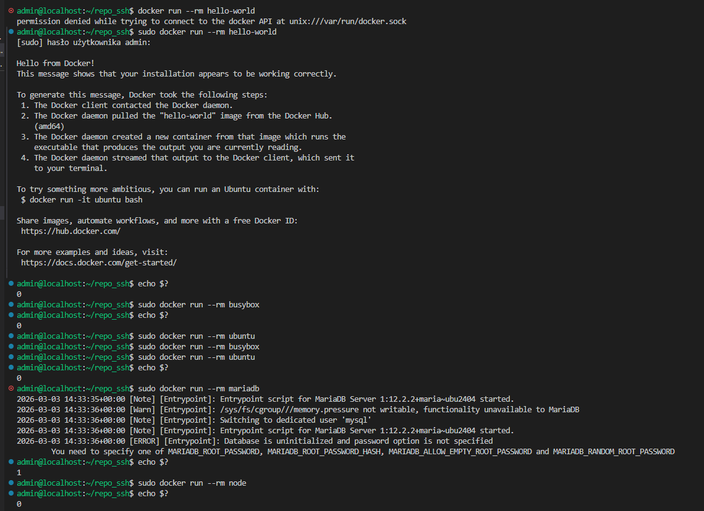
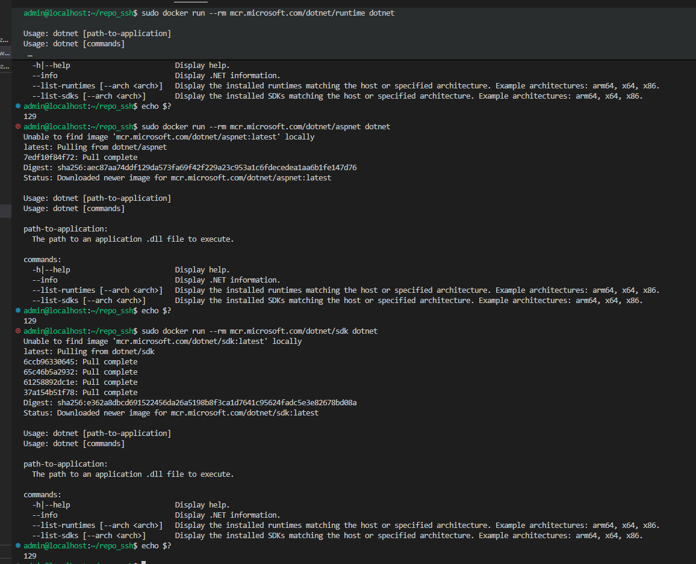
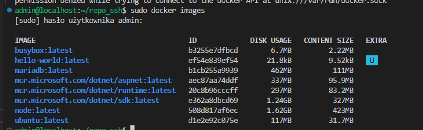

---

### Interaktywna praca z busybox

Uruchomiono kontener `busybox` interaktywnie i sprawdzono wersję:


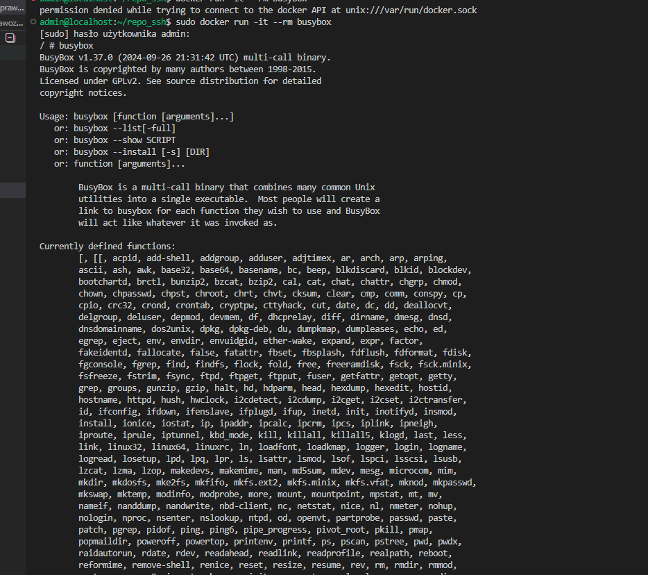

---

### Kontener z Ubuntu — PID1 i aktualizacja pakietów

Uruchomiono kontener `ubuntu` interaktywnie. Zbadano **PID1** wewnątrz kontenera (proces inicjujący, tu: `bash`) i zestawiono z procesami Dockera widzianymi na hoście:

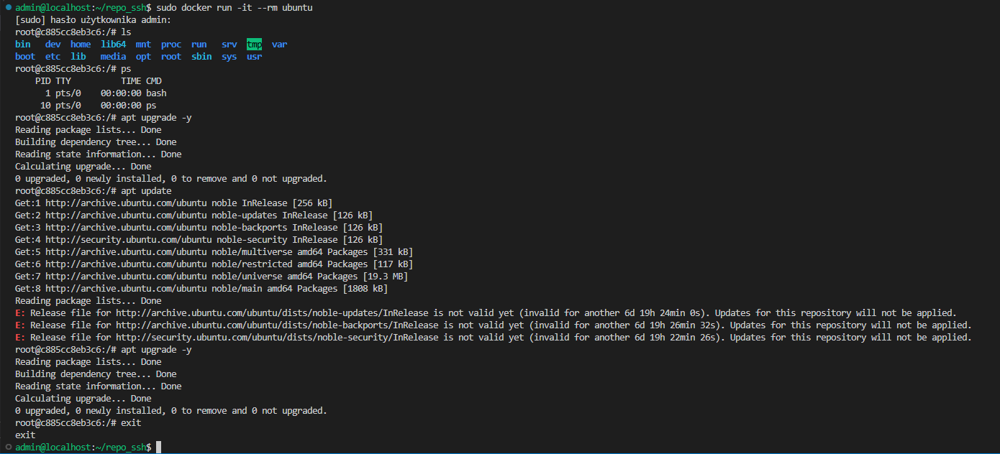

---

### Własny Dockerfile — klonowanie repozytorium

Stworzono plik `Dockerfile` bazujący na obrazie `fedora`, który instaluje `git` i klonuje repozytorium przedmiotowe zgodnie z [dobrymi praktykami](https://docs.docker.com/develop/develop-images/dockerfile_best-practices/):


Zbudowano i uruchomiono kontener interaktywnie, weryfikując obecność repozytorium:

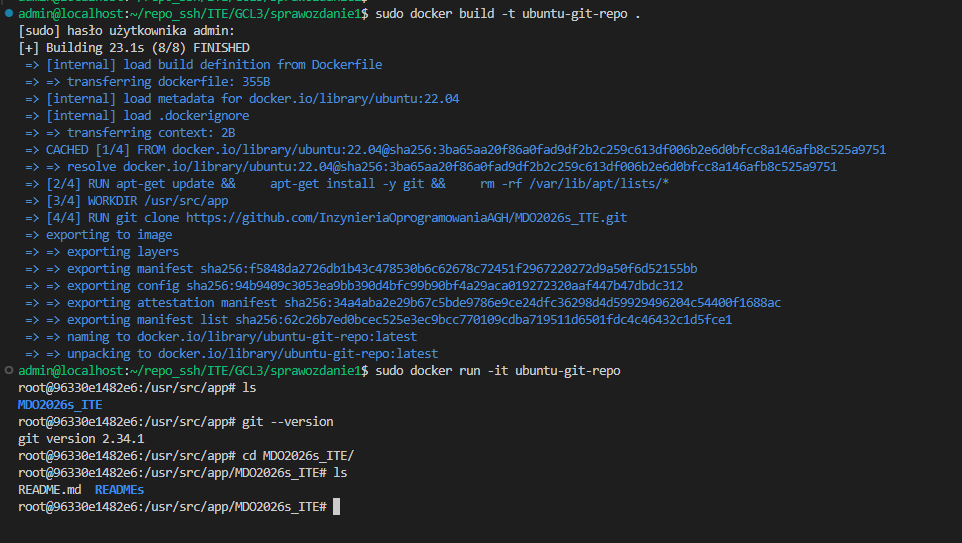

---

### Czyszczenie środowiska

Po zakończeniu pracy usunięto zatrzymane kontenery i lokalne obrazy:

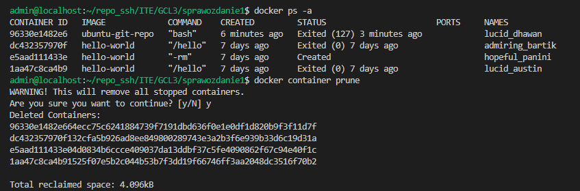
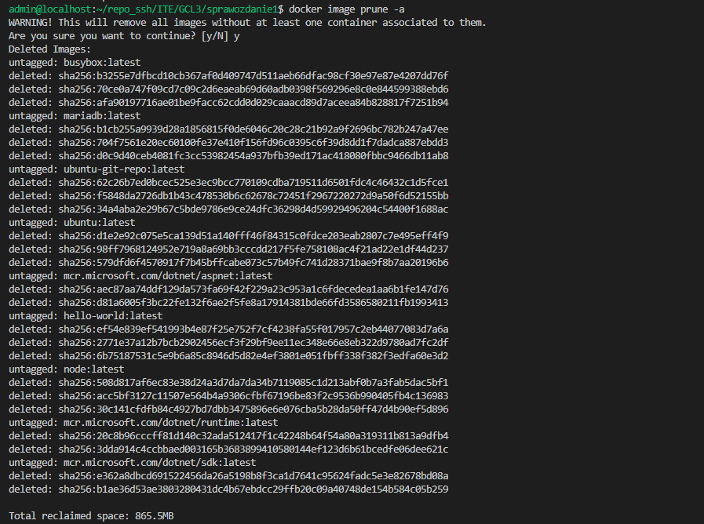

---

## Zajęcia 03 — Dockerfiles, build w kontenerze

### Wybór projektu: ripgrep

Wybrano projekt **[ripgrep](https://github.com/BurntSushi/ripgrep)** — narzędzie do przeszukiwania tekstu napisane w Rust. Projekt posiada otwartą licencję (Unlicense/MIT), system budowania `cargo` oraz zestaw testów jednostkowych.

Sklonowano repozytorium na maszynę wirtualną:

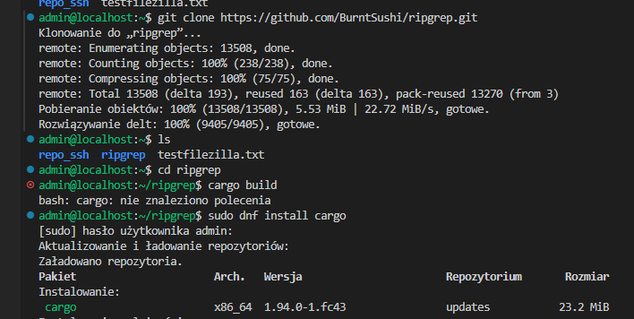

---

### Build i testy na hoście

Zbudowano projekt przy użyciu `cargo`:

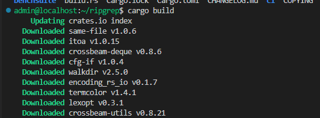

Uruchomiono testy jednostkowe:

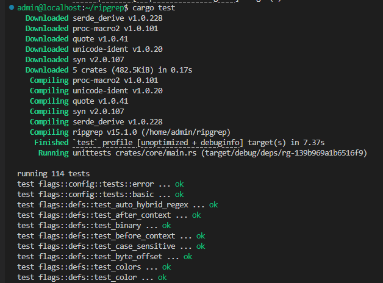

---

### Build i testy w kontenerze Dockera

Cały powyższy proces powtórzono wewnątrz kontenera bazowanego na oficjalnym obrazie `rust`, co zapewnia izolację i powtarzalność środowiska:

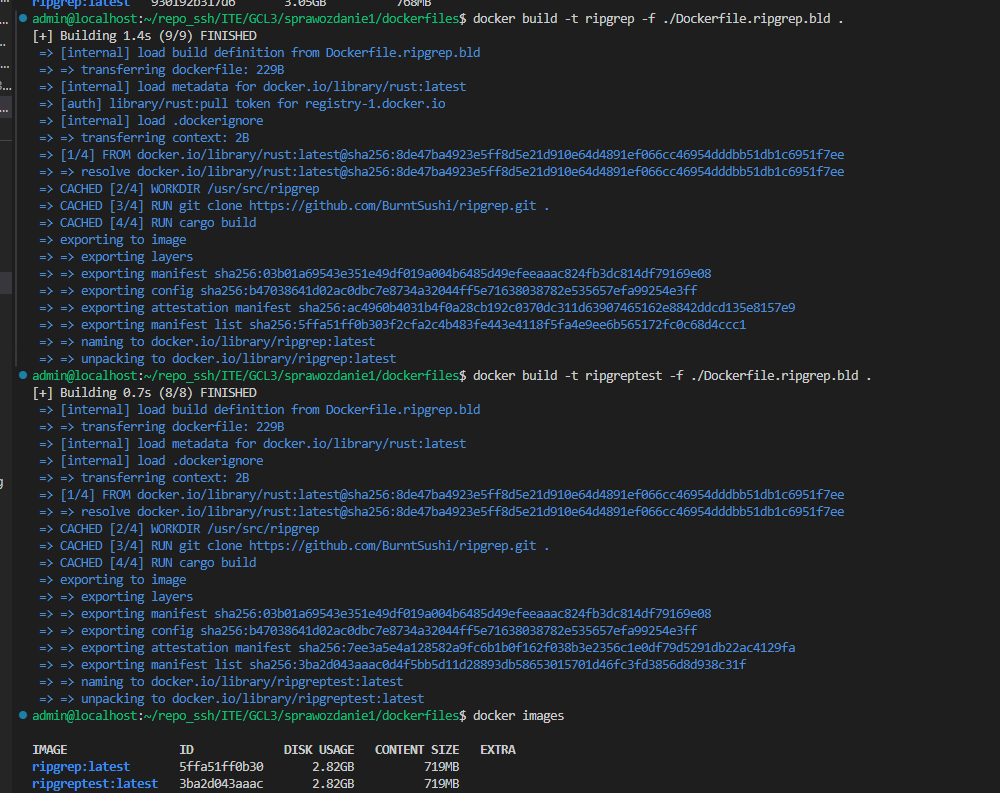

---

### Automatyzacja przez Dockerfile

Stworzono dwa pliki `Dockerfile`:

**`Dockerfile.ripgrep.bld`** — instaluje zależności i buduje projekt:


**`Dockerfile.ripgrep.test`** — bazuje na obrazie budowania i uruchamia testy (bez ponownego builda):


> W kontenerze builda działa skompilowany program `rg`. Kontener testowy nie powiela builda — korzysta z artefaktów z pierwszego etapu.

---

### Dyskusja: czy ripgrep nadaje się do wdrożenia jako kontener?

**ripgrep** jest narzędziem CLI. Jego wdrożenie jako kontener ma sens głównie na potrzeby CI/CD (np. jako krok skryptu pipeline'u), jednak nie jako samodzielna usługa.

Możliwe podejścia do dystrybucji:
- **Pakiet binarny** (`.rpm`, `.deb`) — preferowane dla narzędzi CLI.
- **Oddzielny Dockerfile deploy** — minimalny obraz (np. `scratch` lub `alpine`) zawierający tylko skompilowany binarny plik `rg`, bez toolchaina Rust.
- **Trzeci kontener (publish)** kopiujący artefakt z etapu build przy użyciu multi-stage build.

---

## Zajęcia 04 — Woluminy, sieć, Jenkins

### Woluminy wejściowy i wyjściowy

Utworzono dwa woluminy Docker — jeden na kod źródłowy (wejście), drugi na artefakty builda (wyjście):

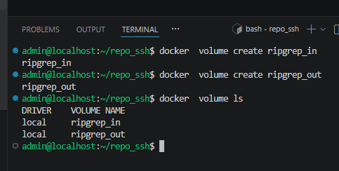

#### Klonowanie na wolumin wejściowy

Kod sklonowano do woluminu wejściowego przy użyciu **kontenera pomocniczego** (z zainstalowanym `git`). Takie podejście jest właściwe, ponieważ kontener budujący nie powinien zawierać `git` — zasada minimalnych zależności.


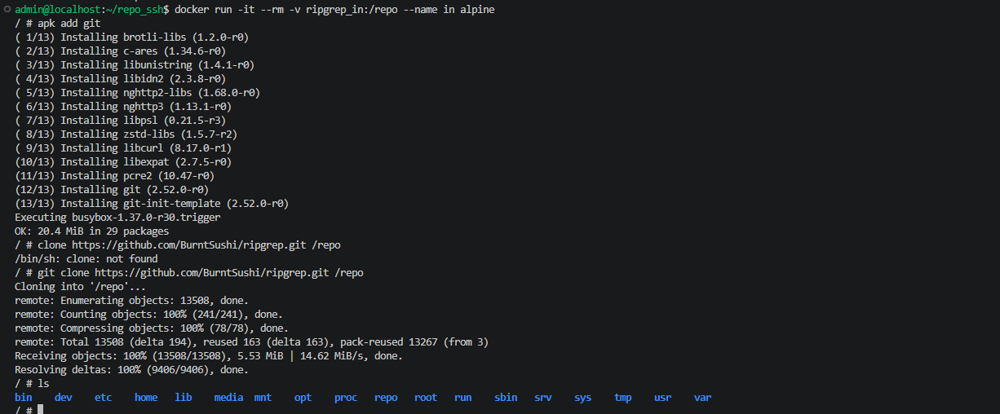

#### Build z zapisem artefaktów na wolumin wyjściowy

W kontenerze budującym (ze środowiskiem Rust) podmontowano oba woluminy. Po zakończeniu builda skopiowano plik wynikowy do woluminu wyjściowego:


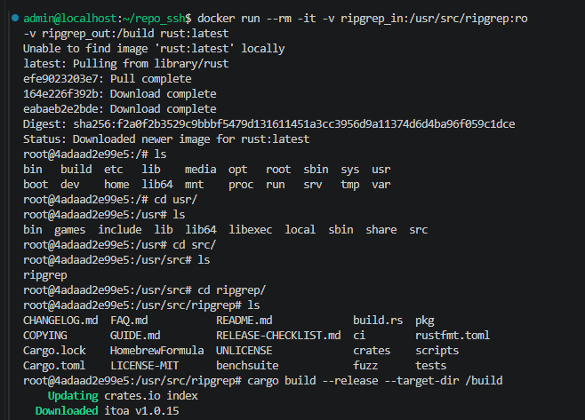

Zawartość woluminu wyjściowego zweryfikowano za pomocą kontenera pomocniczego:


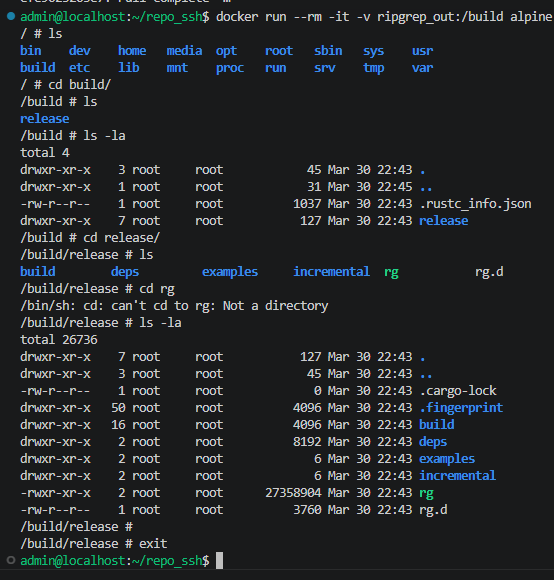

---

#### Wariant: klonowanie wewnątrz kontenera

Ponowiono operację używając jednego kontenera z zainstalowanym `git`, który samodzielnie klonuje repozytorium na wolumin wejściowy i przeprowadza build:

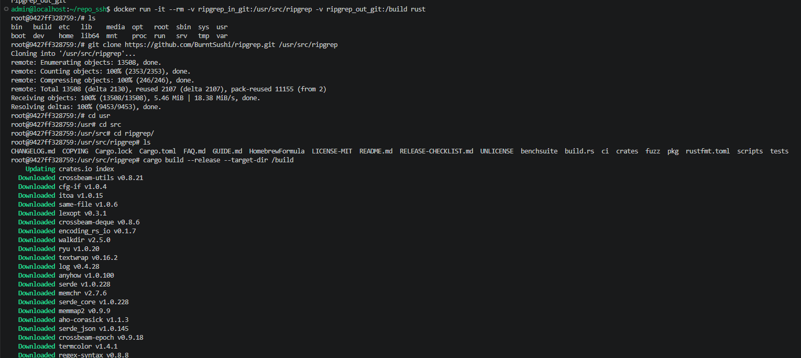
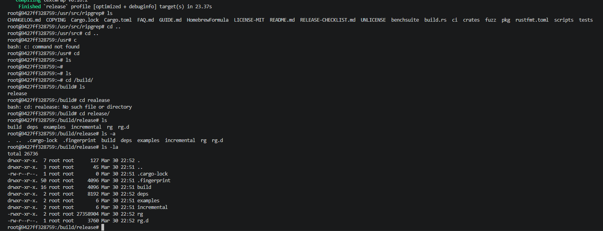

---

#### Możliwość realizacji przez Dockerfile z `RUN --mount`

To samo można zrealizować w `Dockerfile` używając flagi `--mount` bezpośrednio po `RUN` (cache dla rejestru Cargo przyspiesza kolejne buildy):

```dockerfile
FROM rust:latest

WORKDIR /app
RUN git clone https://github.com/BurntSushi/ripgrep.git .

RUN --mount=type=cache,target=/usr/local/cargo/registry \
    --mount=type=cache,target=/app/target \
    cargo build --release && \
    cp target/release/rg /usr/local/bin/rg
```

---

### Sieć i iperf3

#### Podstawowy test przepustowości między kontenerami

Uruchomiono kontener serwera `iperf3`:

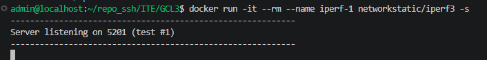

Odczytano adres IP kontenera:

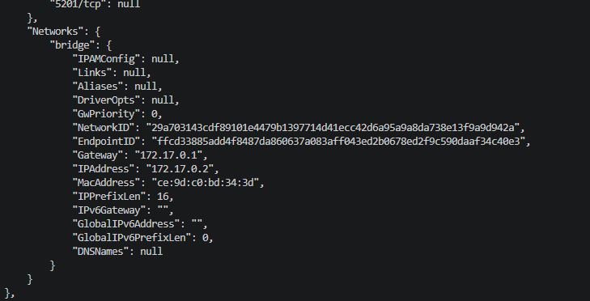

Z drugiego kontenera nawiązano połączenie z serwerem po adresie IP:


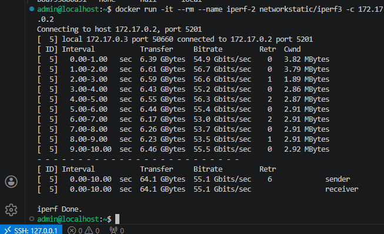

---

#### Dedykowana sieć mostkowa z rozwiązywaniem nazw

Utworzono własną sieć i uruchomiono serwer z nazwą, umożliwiającą adresowanie po nazwie zamiast IP:

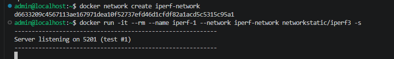

Klient połączył się z serwerem **po nazwie**:

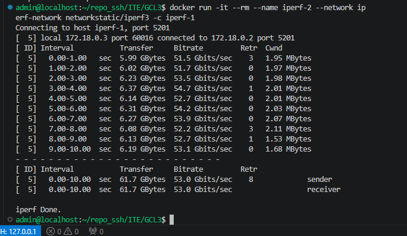

---

#### Połączenie z hosta (VM) i spoza hosta (Windows)

Połączono się z kontenerem z poziomu maszyny wirtualnej:

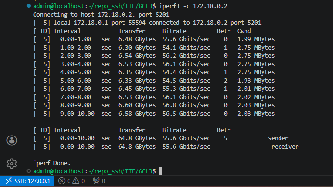

Aby umożliwić dostęp z Windows (spoza hosta), uruchomiono kontener w trybie sieci `host` i skonfigurowano przekierowanie portów w VM:

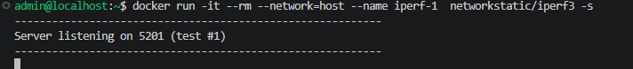

Sprawdzono adres maszyny wirtualnej:

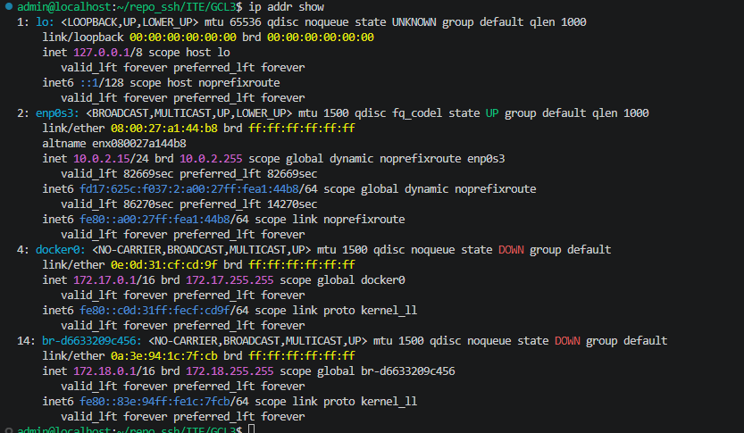

Pierwsze próby połączenia z Windows zakończyły się niepowodzeniem z powodu błędnego adresu:

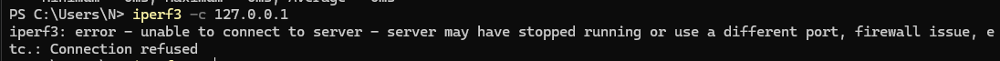
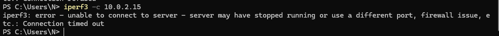

Dodano przekierowanie portu `5201` w ustawieniach VM oraz otwarto port w firewallu:

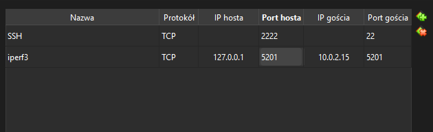
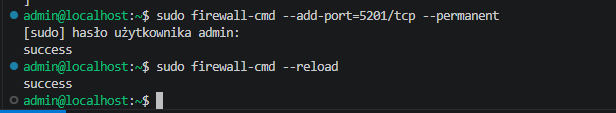

Po ponownym uruchomieniu serwera:

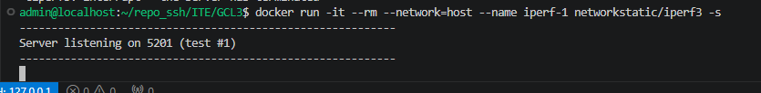

Połączenie z Windows powiodło się:

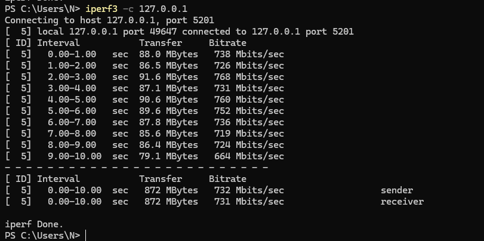

---

### SSHD w kontenerze

Za pomocą pliku `Dockerfile.fedora-sshd` uruchomiono kontener Fedory z usługą SSHD i nawiązano z nim połączenie:

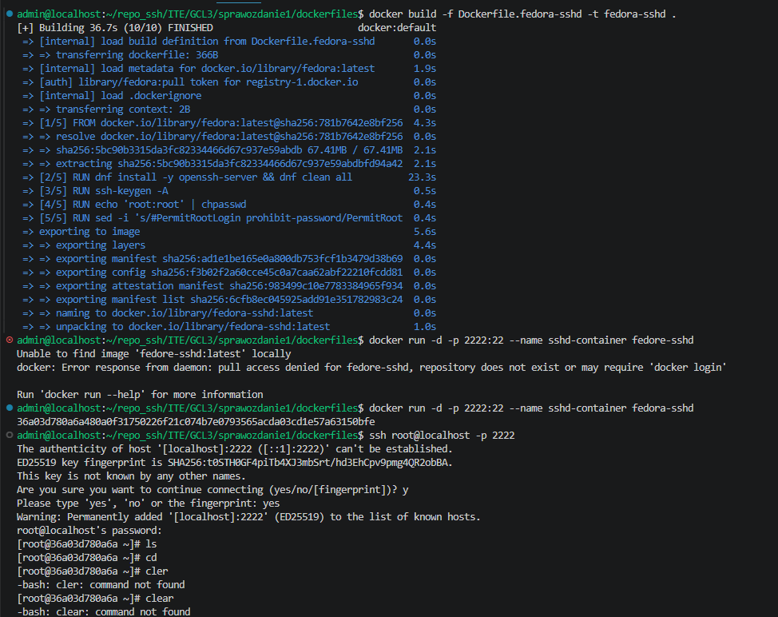

**Zalety komunikacji przez SSH z kontenerem:**
- Niektóre narzędzia i przepływy pracy wymagają SSH jako protokołu dostępu.
- Umożliwia zdalną pracę interaktywną.

**Wady:**
- Dodatkowa złożoność konfiguracji (zarządzanie kluczami/hasłami wewnątrz kontenera).
- Łamie zasadę **jednego procesu na kontener** — serwer SSH działa równolegle z główną aplikacją.

---

### Uruchomienie Jenkins (DIND)

Stworzono dedykowaną sieć i woluminy dla Jenkinsa:

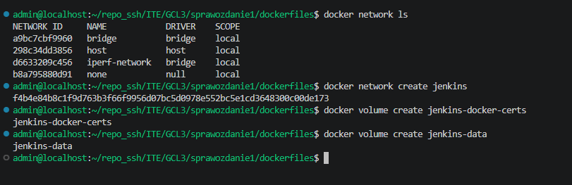

Uruchomiono kontener **Docker-in-Docker (DIND)** wymagany przez Jenkinsa:

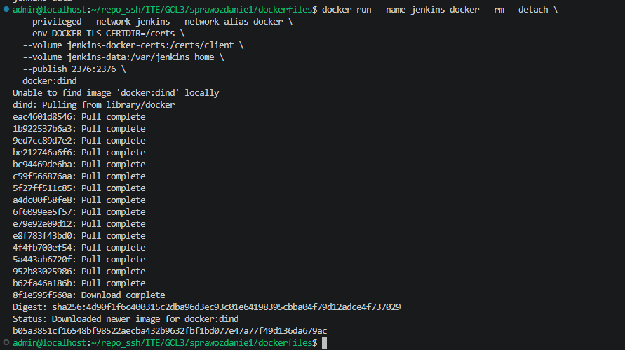

Zbudowano niestandardowy obraz Jenkinsa z preinstalowanymi pluginami:

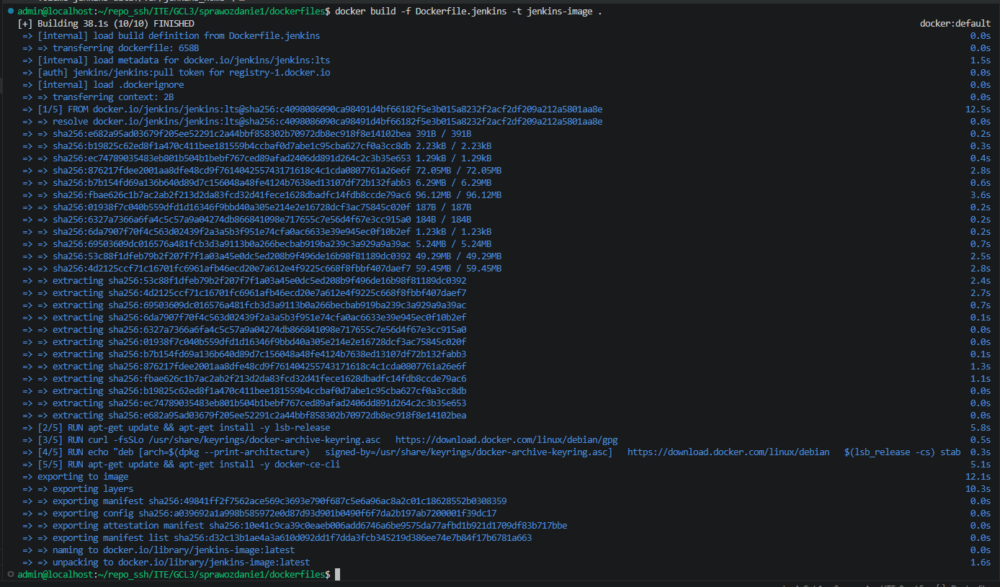

Uruchomiono kontener Jenkinsa:

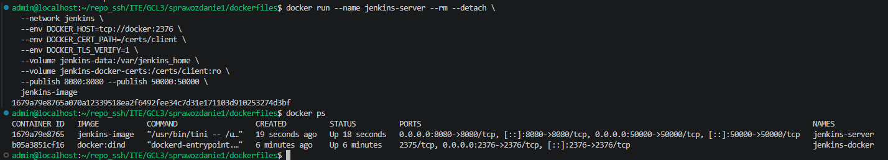

Odczytano hasło inicjalizacyjne Jenkinsa używając polecenia:

```bash
docker exec jenkins-server cat /var/jenkins_home/secrets/initialAdminPassword
```

Dodano przekierowanie portu `8080` w ustawieniach VM:

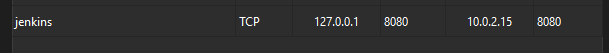

Po wejściu na adres `http://127.0.0.1:8080/` z Windows zainstalowano sugerowane wtyczki:

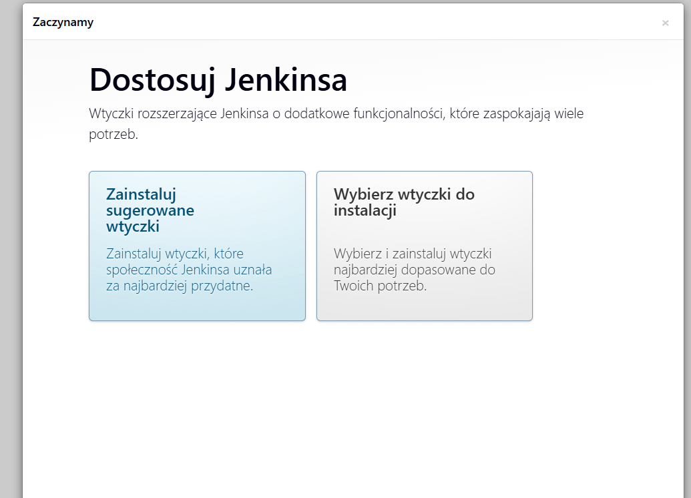

Po zalogowaniu uzyskano dostęp do panelu Jenkinsa:

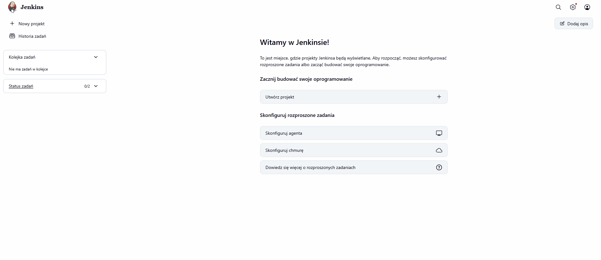