# Sprawozdanie 2 - Kamil Lewandowski

> **Data:** 19.05.2026
> **Środowisko:** Fedora Linux 43 Server Edition (VM) + host Windows, dostęp przez SSH
>
> **Projekt:** [ripgrep](https://github.com/BurntSushi/ripgrep) (Rust)
>
> **Branch repozytorium:** `KL422041`

---

## Zajęcia 05 - Pipeline, Jenkins, izolacja etapów

### Środowisko

Instancja Jenkinsa została uruchomiona już na poprzednich zajęciach (sprawozdanie 1) zgodnie z [oficjalną instrukcją](https://www.jenkins.io/doc/book/installing/docker/)

Archiwizacja i zabezpieczenie logów odbywa się poprzez wolumen `jenkins-data` montowany do `/var/jenkins_home`, w którym Jenkins przechowuje historię buildów i ich logi.

---

### Zadanie 1 - projekt `uname`

Utworzono projekt, który w kroku budowania uruchamia powłokę z poleceniem `uname -a`.

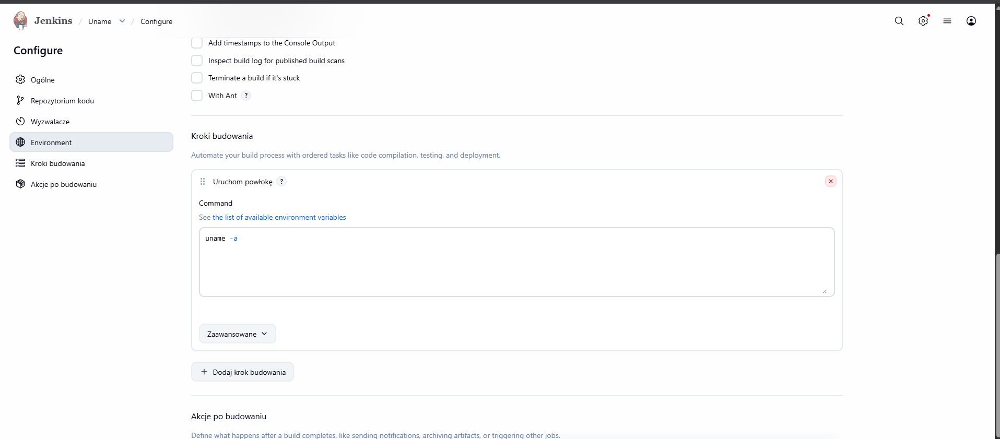

Po uruchomieniu projekt wyświetla informacje o systemie operacyjnym kontenera Jenkinsa (Linux + wersja jądra). Build zakończony powodzeniem:

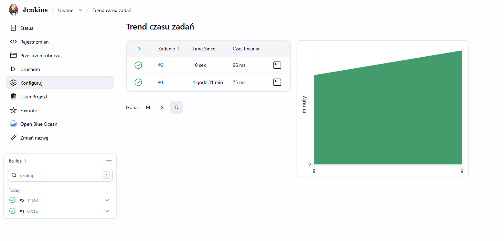

---

### Zadanie 2 - projekt zwracający błąd dla nieparzystej godziny

Utworzono projekt `OddHourErr`, który w skrypcie powłoki sprawdza aktualną godzinę i wychodzi z kodem `1` jeśli jest nieparzysta:

```bash
HOUR=$(date +%H)
echo "Godzina: $HOUR"
if [ $((HOUR % 2)) -ne 0 ]; then
    echo "Err: Godzina $HOUR jest nieparzysta"
    exit 1
else
    echo "Godzina $HOUR jest parzysta. Wszystko OK."
    exit 0
fi
```

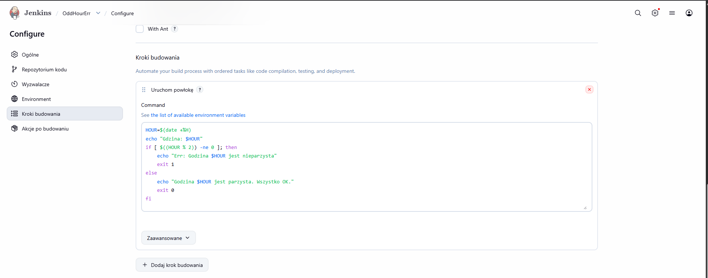

Oba uruchomienia projektu odbyły się w godzinach nieparzystych (7:21 i 11:49), więc projekt poprawnie zakończył się błędem:

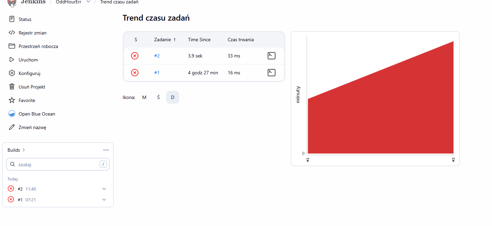

---

### Zadanie 3 - projekt pobierający obraz Ubuntu

Projekt `Ubuntu` wykonuje polecenia `docker pull ubuntu:latest` oraz `docker images`

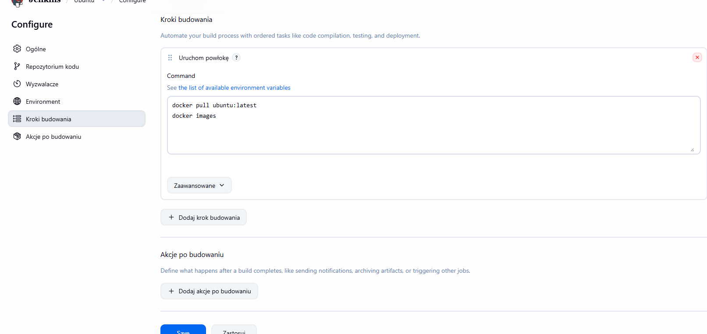

Build kończy się powodzeniem, obraz `ubuntu:latest` zostaje pobrany:

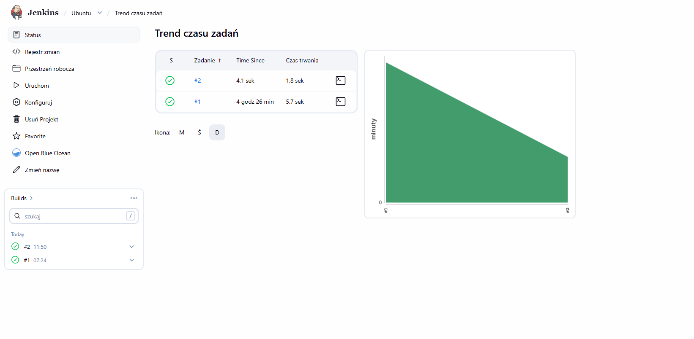

---

### Zadanie 4 - obiekt typu Pipeline

Utworzono obiekt typu **Pipeline** i wpisano definicję bezpośrednio w pole „Pipeline script".

Pipeline realizuje następujące kroki:
1. Sprzątanie workspace'a (`deleteDir()`)
2. Klonowanie repozytorium przedmiotowego (`MDO2025_INO`) z osobistej gałęzi
3. Budowanie obrazu Dockera z pliku `Dockerfile` w workspace
4. Weryfikacja zbudowanego obrazu (`--version`)

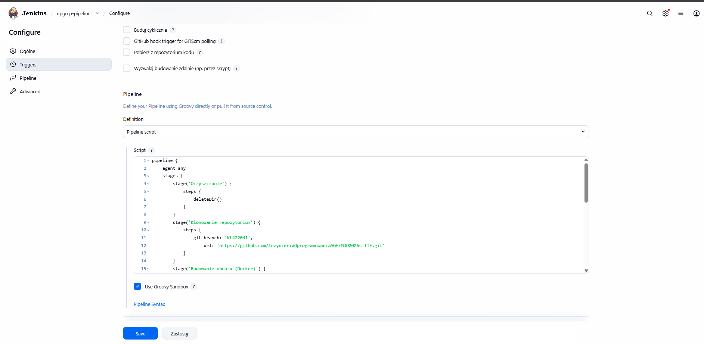

Pipeline uruchomiono dwa razy - drugi raz potwierdził, że workspace jest poprawnie czyszczony przed każdym uruchomieniem (`deleteDir()`), a klonowanie i build odbywają się od nowa.


---

## Zajęcia 06 - Pełny pipeline CI/CD dla ripgrep

### Plan - diagramy UML

#### Wymagania wstępne środowiska

- Host z Dockerem (Linux/Windows z WSL2)
- Kontener Jenkins z BlueOcean (port 8080)
- Kontener DIND (Docker-in-Docker) podpięty do tej samej sieci `jenkins`
- Dostęp sieciowy do GitHub (klonowanie repo) i Docker Hub (pobieranie obrazów bazowych)
- Wolumeny: `jenkins-data` (persystencja), `jenkins-docker-certs` (TLS między Jenkinsem a DIND)


#### Diagram aktywności
 

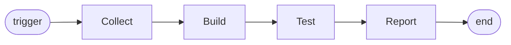
 
#### Diagram wdrożeniowy
 

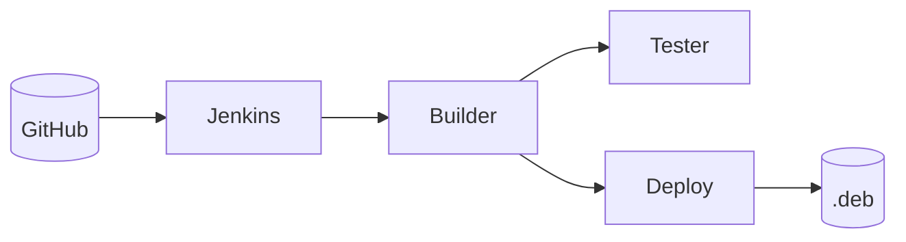
 
---


## Zajęcia 07 - Jenkinsfile

### Migracja pipeline'u do repozytorium

W konfiguracji obiektu Pipeline zmieniono *Definition* z „Pipeline script" na **„Pipeline script from SCM"** i dokonana konfiguracji:

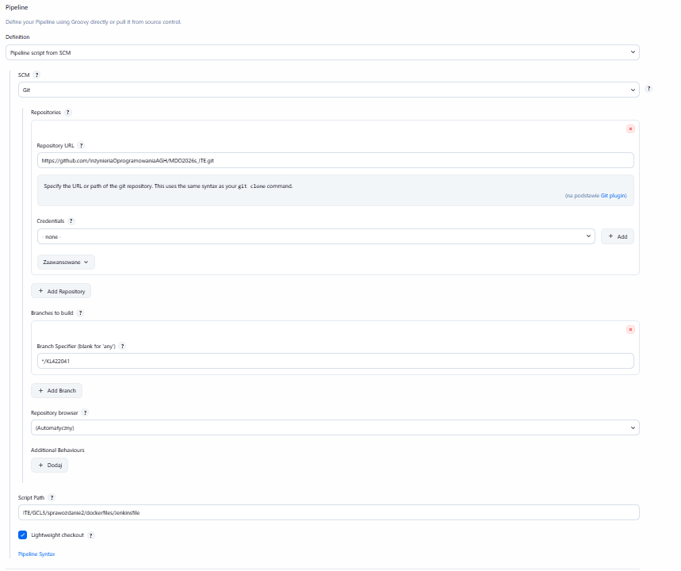


Dzięki temu Jenkins przed każdym buildem pobiera świeży Jenkinsfile z repozytorium.

---

### Problemy i ich rozwiązanie

Pierwsze uruchomienia pipelineu kończyły się błędami.

**Problem 1:** `cargo install cargo-deb` próbował zainstalować wersję 3.7.0, która wymaga Rusta 1.85, podczas gdy obraz bazowy miał Rusta 1.83.

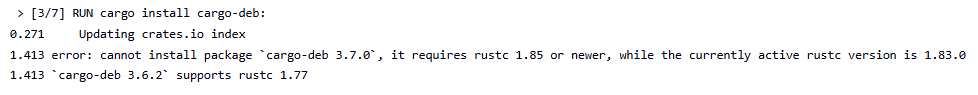

więc obniżono wersję cargo-deb do 3.6.2:

```dockerfile
RUN cargo install cargo-deb --version 3.6.2
```

Nie rozwiązało to problemu, ponieważ nawet starsza wersja cargo-deb ściąga zależności, które wymagają funkcji `edition2024`:

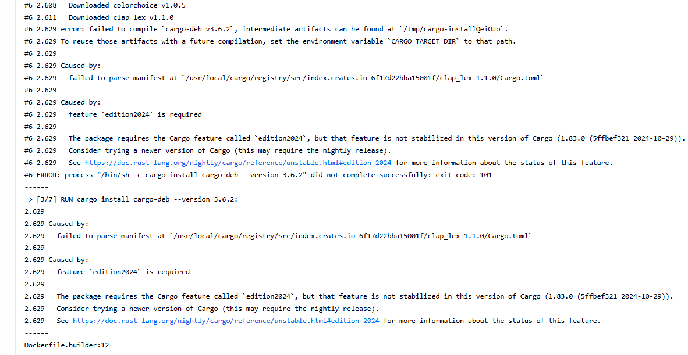

więc podbito wersję Rust w obrazie bazowym:

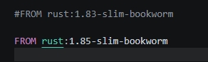

**Problem 2:** `cargo deb` nie znalazł man page i completions dla ripgrepa:

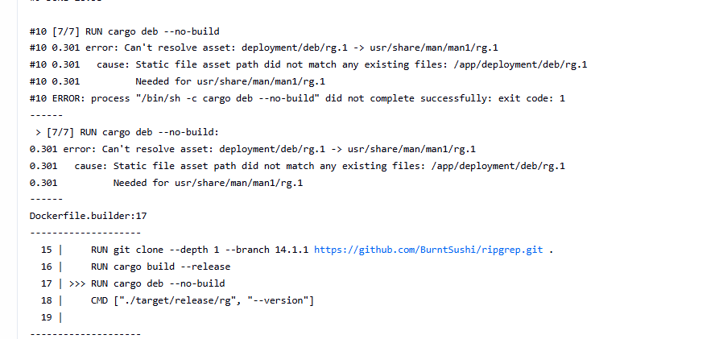

W ripgrep 14.x build script nie generuje już man i completions automatycznie. Trzeba je wygenerować ręcznie używając samej skompilowanej binarki:

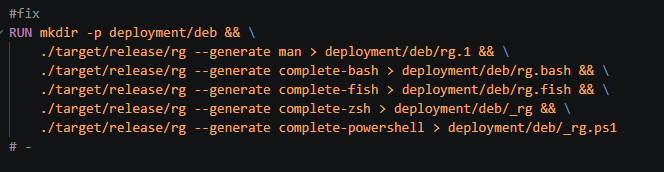

```dockerfile
RUN mkdir -p deployment/deb && \
    ./target/release/rg --generate man > deployment/deb/rg.1 && \
    ./target/release/rg --generate complete-bash > deployment/deb/rg.bash && \
    ./target/release/rg --generate complete-fish > deployment/deb/rg.fish && \
    ./target/release/rg --generate complete-zsh > deployment/deb/_rg && \
    ./target/release/rg --generate complete-powershell > deployment/deb/_rg.ps1
```

Ostatecznie całość działa:

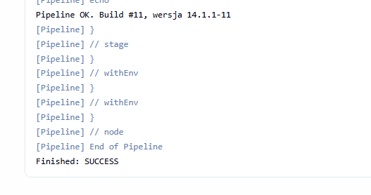

