# Sprawozdanie 3 - Kamil Lewandowski

> **Data:** 13.06.2026
> **Branch repozytorium:** `KL422041`

---

## Zajęcia 08 - Automatyzacja za pomocą Ansible

### Środowisko i sieć

Utworzono dwie maszyny wirtualne Fedora 44: `ansible-control` (dyrygent, edycja Server) oraz `ansible-target` (końcówka, instalacja minimalna - możliwie najmniejszy zbiór pakietów, z `tar` i `sshd`). Hostname ustawiono już podczas instalacji; po instalacji wykonano migawkę (dedykowanego użytkownika `ansible` dodano później - patrz sekcja Inwentaryzacja).

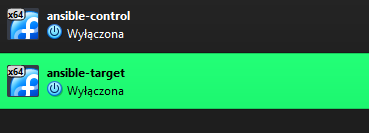

Każdej maszynie dodano drugą kartę sieciową w trybie *host-only* (sieć `192.168.56.0/24`) obok karty NAT (internet do `dnf`). Adresy statyczne nadano na karcie host-only: control `192.168.56.10`, target `192.168.56.11`.

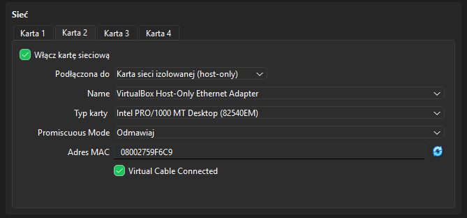
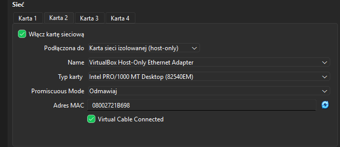
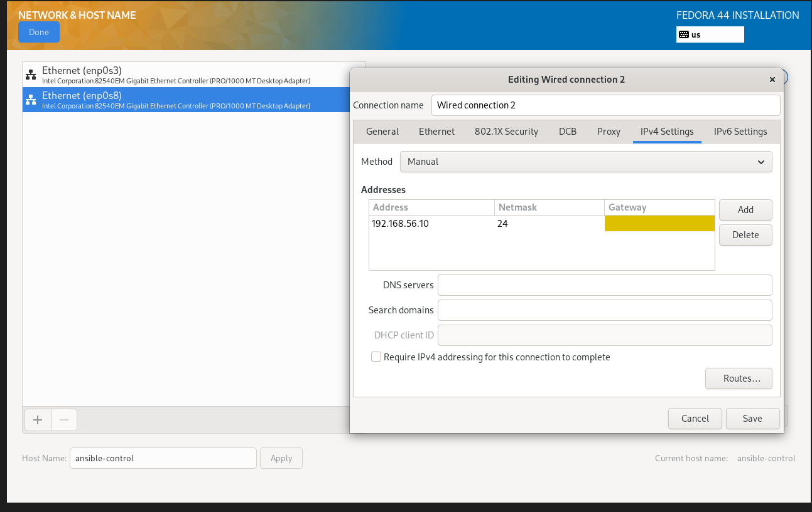
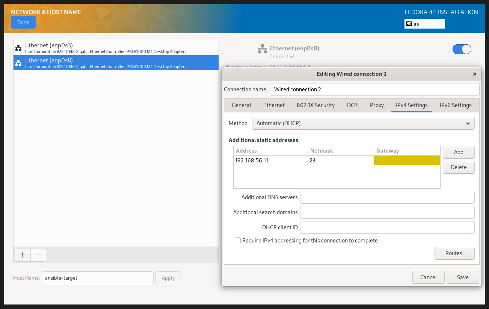

Połączenie SSH z hosta Windows (VS Code Remote-SSH) działa do obu maszyn.

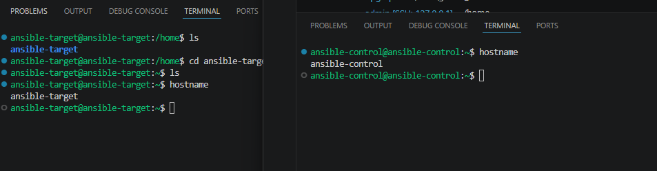

### Inwentaryzacja

Hostname ustawiono przez instalator (`hostnamectl` potwierdza `ansible-control`/`ansible-target`, bez `localhost`). Nazwy DNS wprowadzono wpisami w `/etc/hosts` na obu maszynach, dzięki czemu maszyny są osiągalne po nazwie, a nie tylko po adresie IP.

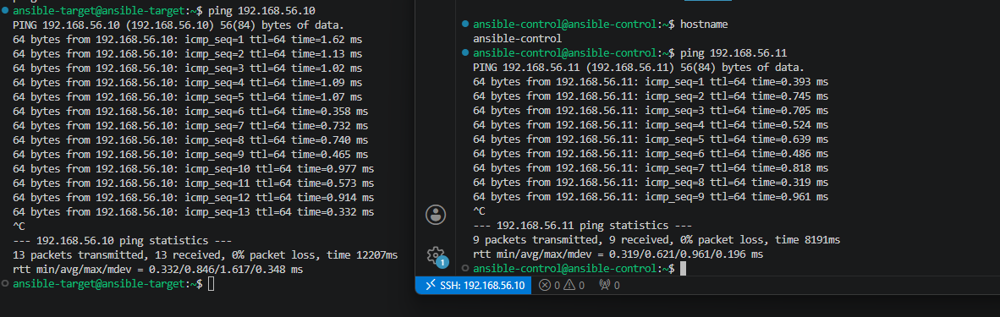
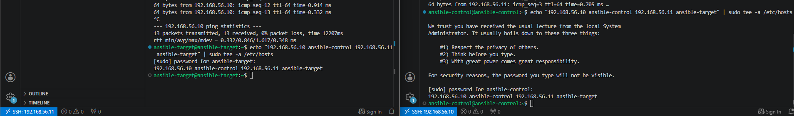
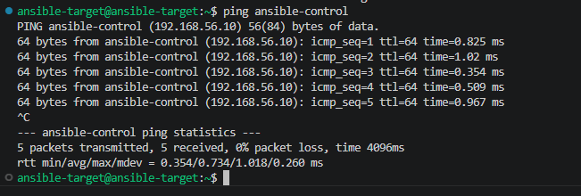

Na końcówce utworzono użytkownika `ansible` (zgodnie z wymogiem - inny niż domyślny) i nadano mu `sudo` bez hasła (plik `/etc/sudoers.d/ansible`), co jest potrzebne playbookom z `become`.

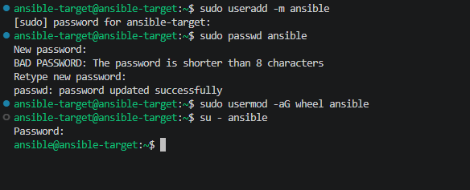
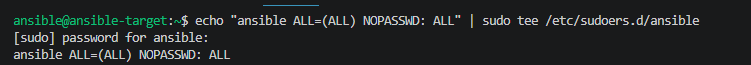

Wymieniono klucze SSH (`ssh-copy-id ansible@ansible-target`) - logowanie odbywa się bez hasła.

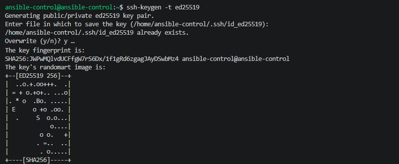
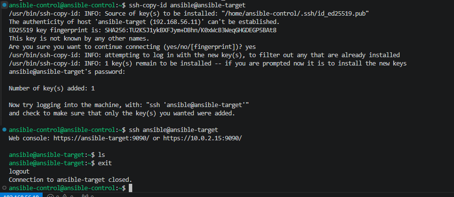

Ansible zainstalowano na maszynie głównej z repozytorium dystrybucji (`sudo dnf install -y ansible`).

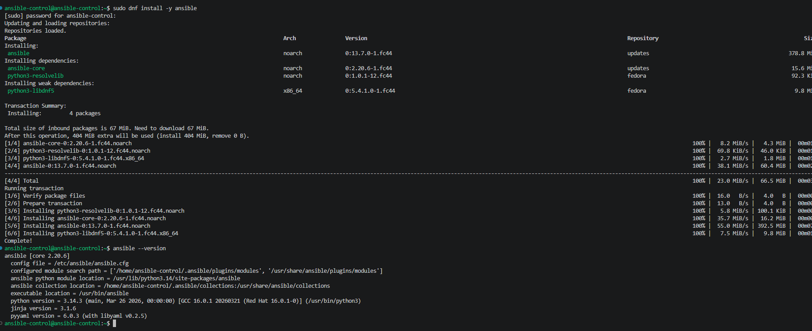

Plik inwentaryzacji `inventory.ini` z sekcjami `Orchestrators` i `Endpoints`:

```ini
[Orchestrators]
ansible-control ansible_connection=local

[Endpoints]
ansible-target ansible_user=ansible

[all:vars]
ansible_python_interpreter=/usr/bin/python3
```

Polecenie `ansible all -m ping` zwraca `pong` z obu maszyn (control - lokalnie, target - przez SSH).

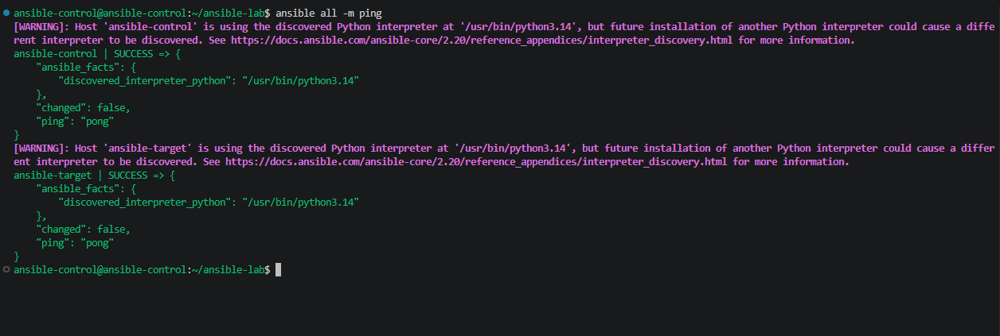

### Zdalne wywoływanie procedur (playbooki)

`01-ping.yml` - `ping` przez playbook:

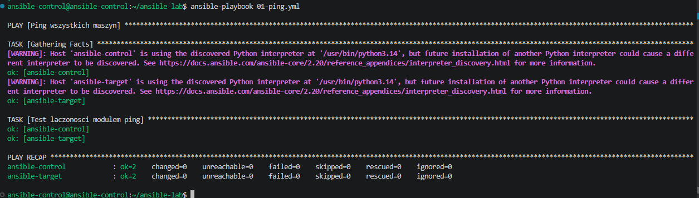

`02-copy-inventory.yml` - kopia pliku inwentaryzacji na końcówki. Playbook uruchomiono dwukrotnie: za pierwszym razem `changed=1` (plik skopiowany), za drugim `ok`/`changed=0` - moduł `copy` porównał sumy kontrolne i nie zrobił nic. Pokazuje to idempotencję Ansible.

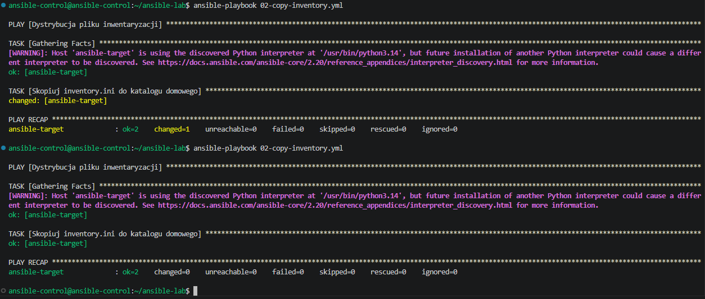

`03-update.yml` - aktualizacja pakietów. Pierwsze dwa taski (bindingi `python3-libdnf5` oraz odświeżenie metadanych) obchodzą [problem modułu `dnf5` #84634](https://github.com/ansible/ansible/issues/84634):

```yaml
- name: Zapewnij python3-libdnf5 (wymagane przez modul dnf5)
  ansible.builtin.command: dnf -y install python3-libdnf5
  register: bootstrap
  changed_when: "'Nothing to do' not in bootstrap.stdout"

- name: Odswiez metadane repozytoriow
  ansible.builtin.command: dnf clean expire-cache
  changed_when: false

- name: Zaktualizuj wszystkie pakiety
  ansible.builtin.dnf5:
    name: "*"
    state: latest
```

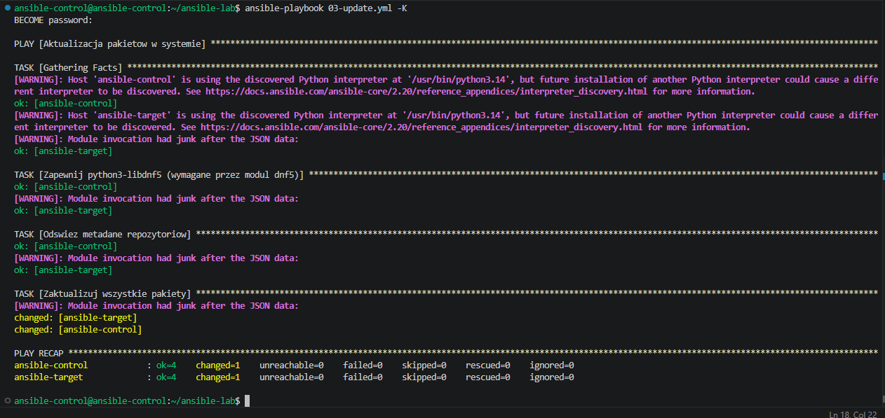

`04-services.yml` - instaluje pakiet `rng-tools` (minimalna Fedora nie zawiera `rngd`), włącza `rngd`, po czym restartuje usługi `sshd` i `rngd`.

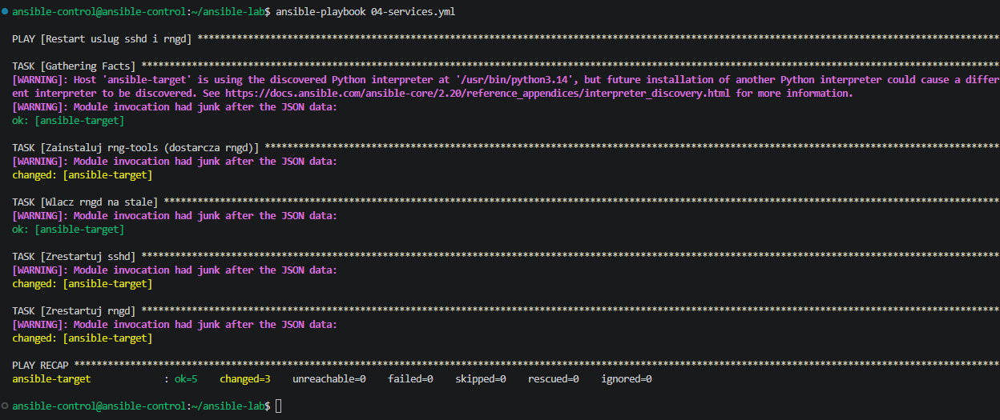

Operacje wobec niedostępnej maszyny: po zatrzymaniu `sshd` na końcówce playbook oznacza host jako `UNREACHABLE` (Connection refused) i kontynuuje. Ansible nie zawiesza się i kończy z niezerowym kodem.

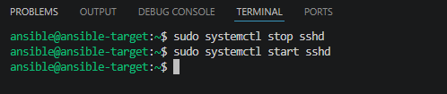
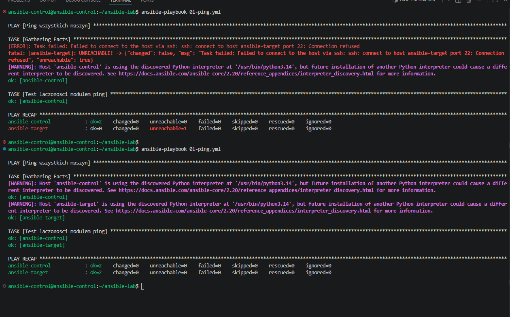

### Rola wdrażająca artefakt

Kroki wdrożenia ujęto w rolę wyszkieletowaną `ansible-galaxy role init ripgrep_deploy` (z wypełnionym `meta/main.yml`). Artefaktem pipeline'u jest `.deb`, więc rola: wykonuje *sanity check*, instaluje Dockera, buduje obraz z `.deb`, uruchamia kontener i weryfikuje działanie aplikacji.

Sanity check w bloku `block`/`rescue` - przy niepowodzeniu host jest pomijany bez awarii całego playbooka:

```yaml
- name: Sanity check maszyny docelowej
  block:
    - name: Sprawdz wolne miejsce na /
      ansible.builtin.assert:
        that:
          - root_mount.size_available > (min_free_gb | int) * 1024 * 1024 * 1024
        fail_msg: "Za malo wolnego miejsca na dysku"
      vars:
        root_mount: "{{ ansible_facts['mounts'] | selectattr('mount','equalto','/') | first }}"
    - name: Sprawdz dostep do Docker Hub
      ansible.builtin.uri:
        url: https://registry-1.docker.io/v2/
        status_code: [200, 401]
  rescue:
    - ansible.builtin.debug:
        msg: "Sanity check nieudany - pomijam wdrozenie"
    - ansible.builtin.meta: end_host
```

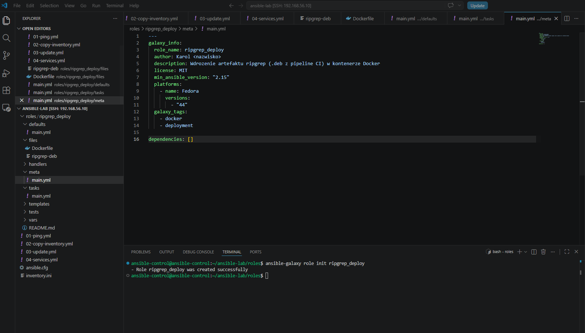

Pierwsze uruchomienie roli zakończyło się błędem - task kopiujący artefakt nie znalazł pliku `ripgrep.deb` (plik miał błędną nazwę). Po jej poprawieniu wdrożenie przeszło.

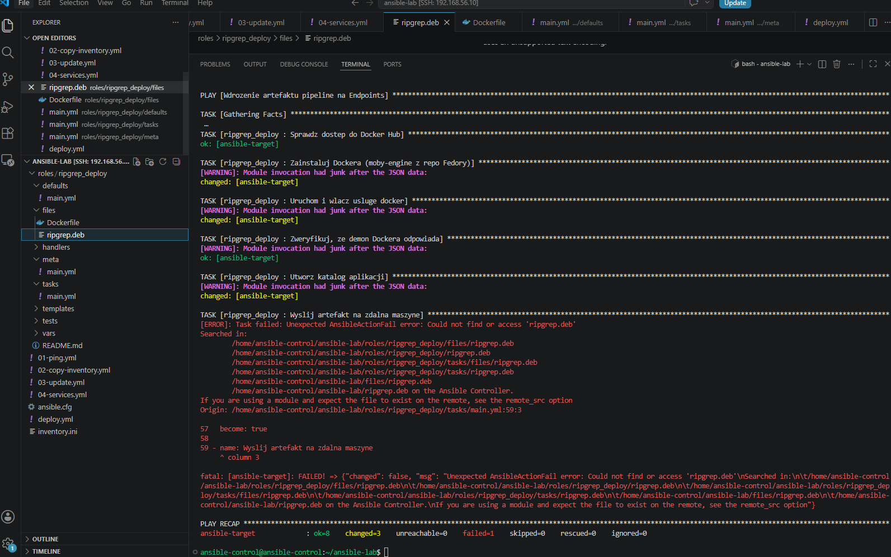

Wdrożenie zakończone sukcesem - kontener działa, a aplikacja odpowiada (`rg --version` wykonane *wewnątrz* działającego kontenera, nie tylko sam playbook):

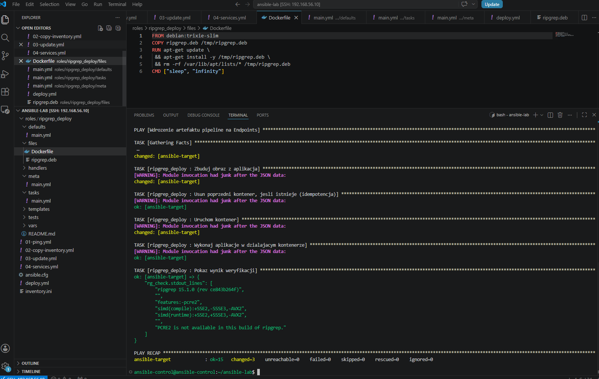
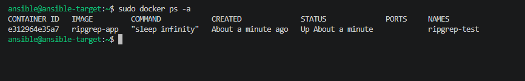

Sprzątanie środowiska (`--tags cleanup`) - zatrzymanie i usunięcie kontenera oraz obrazu:

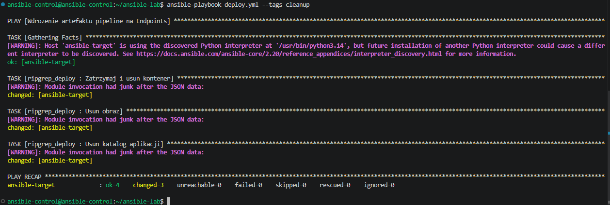
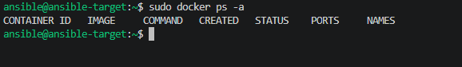

Test sanity checku: po sztucznym podniesieniu progu (`-e min_free_gb=50`) assert kończy się kontrolowanym komunikatem, a playbook mimo to kończy się sukcesem (`rescued=1`, `failed=0`).

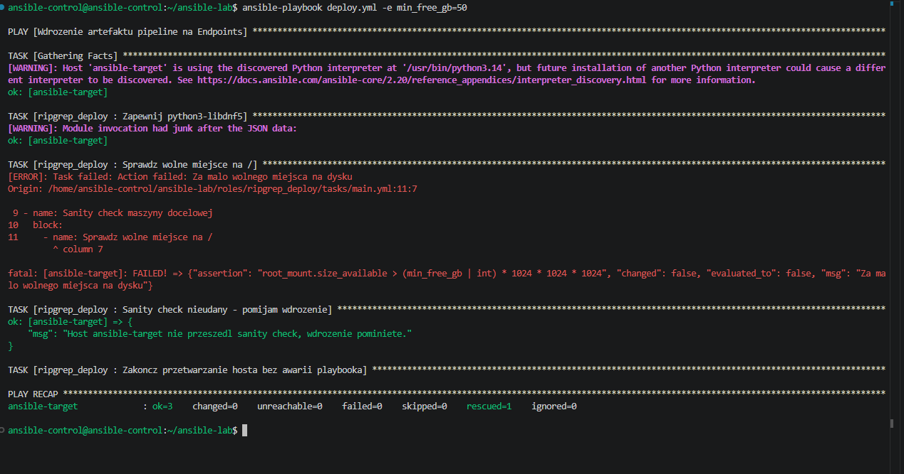

---

## Zajęcia 09 - Instalacja nienadzorowana (Kickstart)

### Przygotowanie pliku odpowiedzi i artefaktu

Jako bazę pobrano `/root/anaconda-ks.cfg` z istniejącej maszyny i zmodyfikowano go do postaci `ks.cfg`.

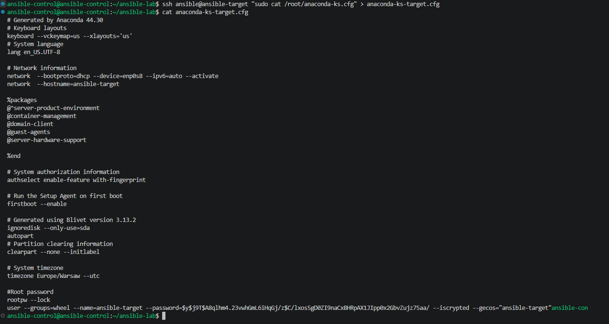

Artefaktem projektu jest `.deb`, a docelowy system to Fedora (RPM), więc z pakietu wyjęto samą binarkę `rg` (`.deb` to archiwum `ar`):

```bash
ar x ripgrep.deb
tar xf data.tar.*
cp ./usr/bin/rg rg
./rg --version
```

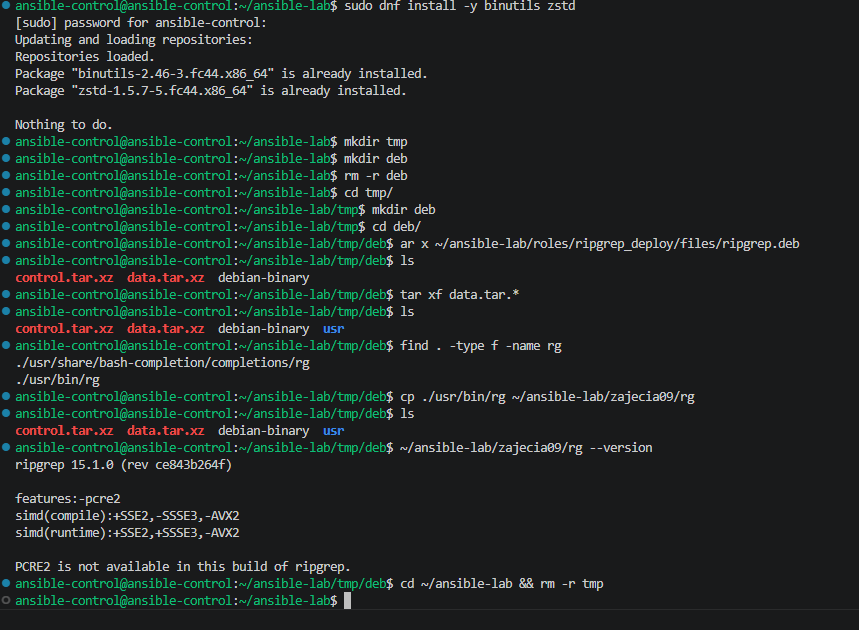

Plik `ks.cfg` oraz binarka `rg` zostały umieszczone w repozytorium, skąd instalator pobiera je przez `raw.githubusercontent.com`.


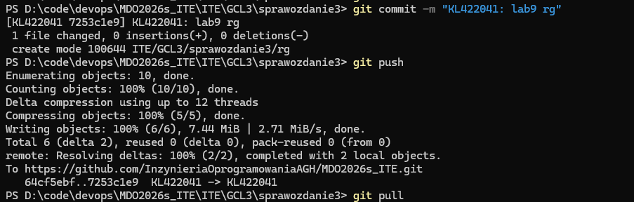

Najważniejsze fragmenty `ks.cfg`: tryb tekstowy i automatyczny restart, źródło z płyty + repozytorium aktualizacji, oraz - kluczowe dla reinstalacji "w kółko" - bezwarunkowe czyszczenie i formatowanie wszystkich nośników:

```text
text
reboot
...
cdrom
repo --name=updates --mirrorlist=https://mirrors.fedoraproject.org/mirrorlist?repo=updates-released-f44&arch=x86_64

zerombr
clearpart --all --initlabel
autopart

network --hostname=ks-demo
user --name=basicuser --groups=wheel --iscrypted --password=$6$...
```

Hostname (`ks-demo`) i użytkownik (`basicuser`) są inne niż domyślne. Sekcja `%post` pobiera artefakt do `/usr/local/bin/` i włącza usługę `systemd`, która uruchamia aplikację przy pierwszym starcie:

```bash
%post --log=/root/ks-post.log
curl -fsSL -o /usr/local/bin/rg "https://raw.githubusercontent.com/InzynieriaOprogramowaniaAGH/MDO2026s_ITE/KL422041/ITE/GCL3/sprawozdanie3/rg"
chmod 0755 /usr/local/bin/rg
systemctl enable pipeline-app.service
%end
```

### Instalacja nienadzorowana

Utworzono nową maszynę z włączonym **EFI (UEFI)**.

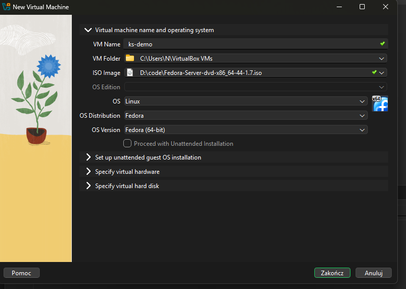
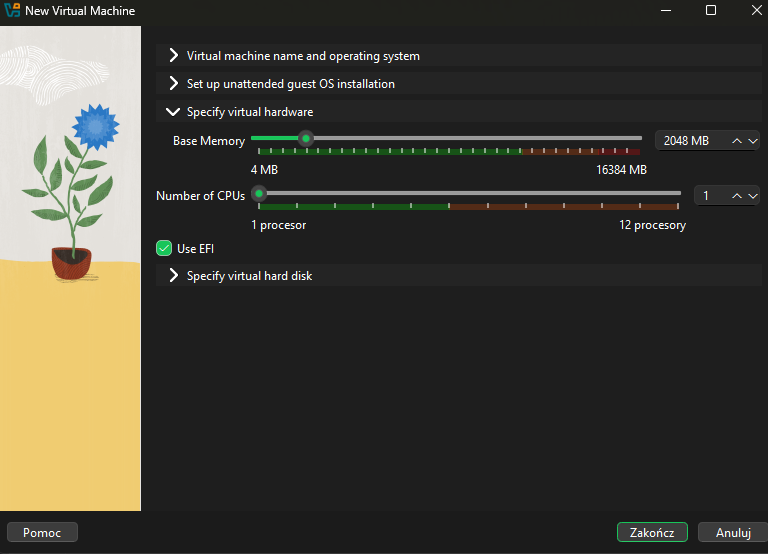

Przy starcie z ISO, w edytorze GRUB do linii kernela dopisano dyrektywę wskazującą plik odpowiedzi z repozytorium:

```
inst.ks=https://raw.githubusercontent.com/InzynieriaOprogramowaniaAGH/MDO2026s_ITE/KL422041/ITE/GCL3/sprawozdanie3/ks.cfg ip=enp0s3:dhcp
```

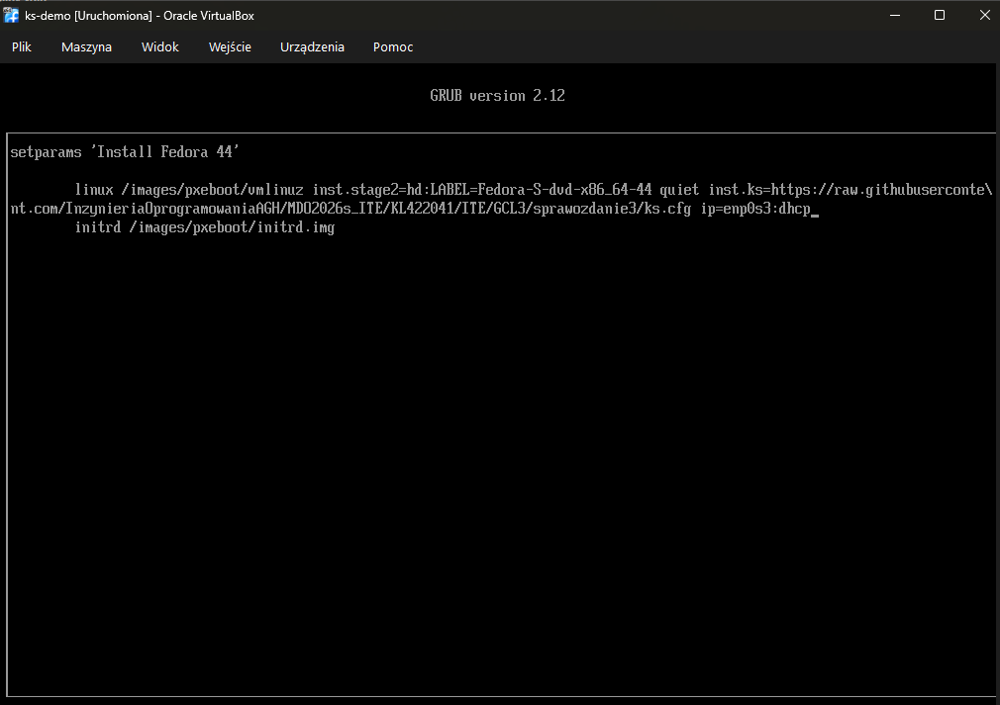

### Weryfikacja

Instalator nie zadał żadnego pytania i po zakończeniu sam zrestartował maszynę. Po pierwszym uruchomieniu hostname to `ks-demo`, binarka jest w `/usr/local/bin/rg`, a usługa `pipeline-app` wykonała się i pozostawiła log z wersją aplikacji.

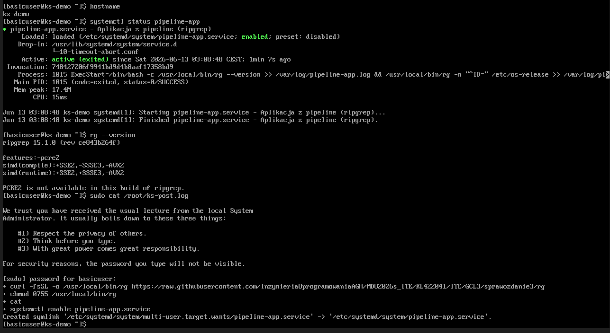

---

## Zajęcia 10 - Kubernetes (minikube)

> Maszyna projektowa (Fedora 44) z minikube; polecenia wykonywane przez SSH jako użytkownik `admin`.

### Instalacja klastra i Dashboard

Zainstalowano i uruchomiono minikube (`minikube start`) - sterownik Docker (z uprawnieniami roota), Kubernetes v1.35.1. Serwer API dostępny jest lokalnie, uwierzytelnianie odbywa się certyfikatami z `~/.minikube` - to poziom zabezpieczeń domyślnej instalacji. Instalator ostrzega o przydziale pamięci (3072 MiB), co przy tym labie nie stanowi problemu.

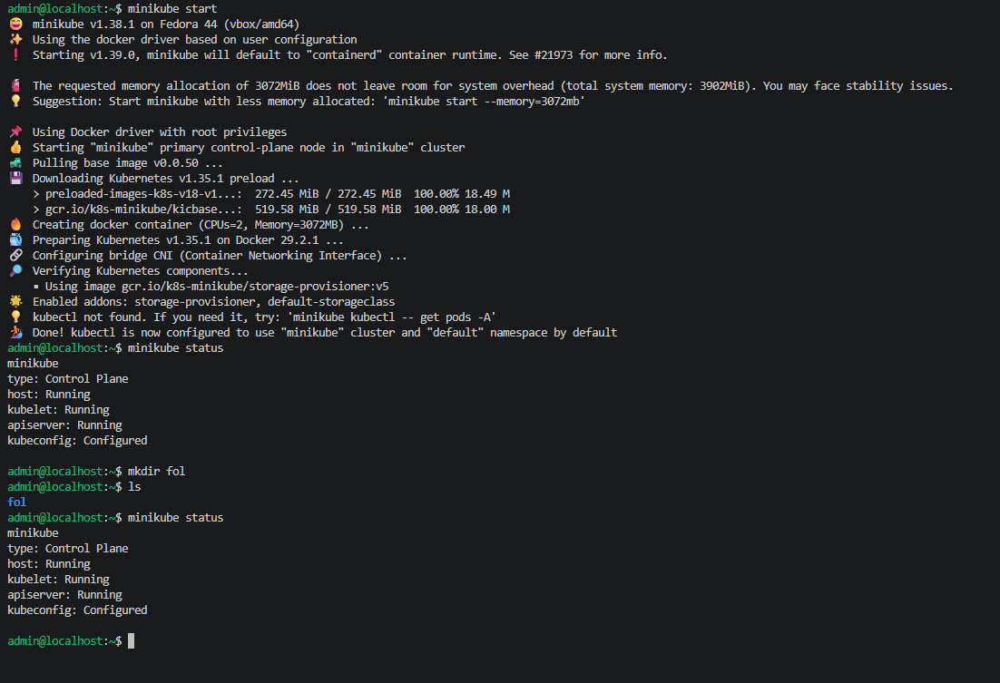

`kubectl` użyto w wariancie minikube przez alias `alias kubectl='minikube kubectl --'`:

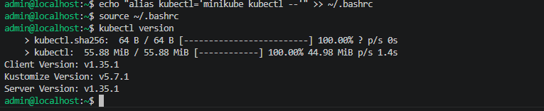

Klaster działa - jeden węzeł `minikube` w stanie `Ready` oraz pody systemowe `kube-system`:

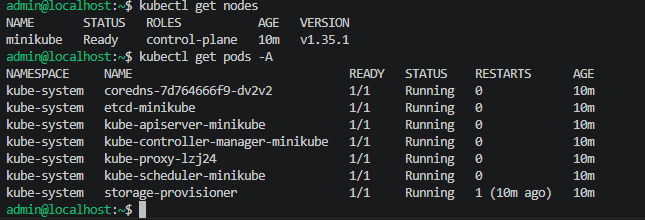

Uruchomiono Dashboard (`minikube dashboard --url`) i otwarto go w przeglądarce na hoście (przez przekierowanie portu VS Code).

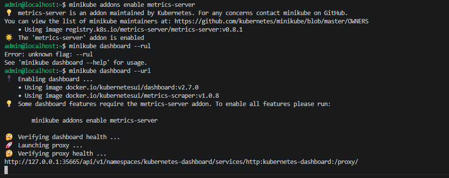
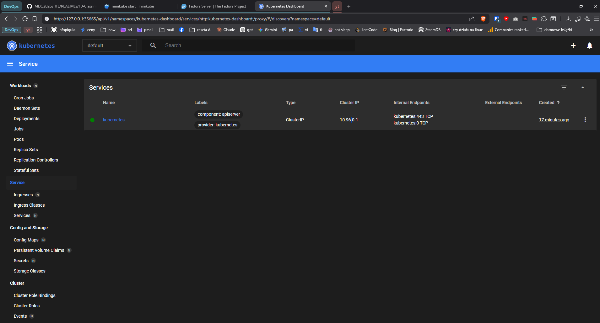

### Obraz aplikacji (krok "Deploy")

Ponieważ ripgrep nie wyprowadza interfejsu sieciowego, jako web-server użyto własnego obrazu `nginx-custom` (nginx z własnym `index.html` i endpointem `/healthz`):

```dockerfile
FROM nginx:1.27-alpine
COPY default.conf /etc/nginx/conf.d/default.conf
COPY index.html /usr/share/nginx/html/index.html
```

Obraz zbudowano i uruchomiono lokalnie (`docker run -d -p 8088:80`), aby potwierdzić, że kontener pracuje, a nie kończy się natychmiast:

```bash
docker build -t evernever2000/nginx-custom:1.0 .
docker run --rm -d -p 8088:80 --name nc-test evernever2000/nginx-custom:1.0
docker ps
```

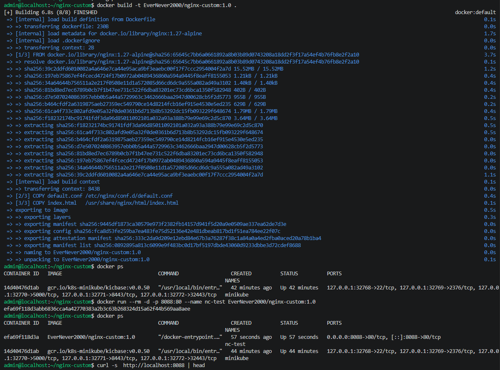

Strona odpowiada w przeglądarce, a endpoint `/healthz` zwraca `ok`:

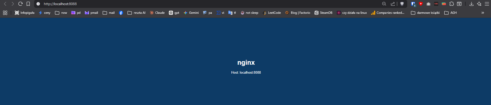
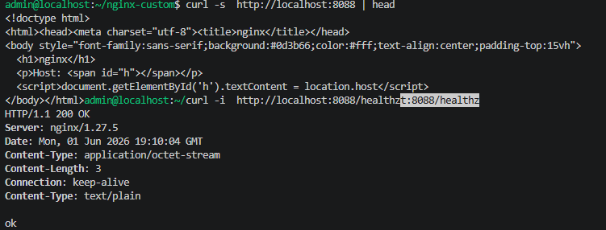

Obraz oznaczono i wypchnięto na Docker Hub (konto `evernever2000`):

```bash
docker tag EverNever2000/nginx-custom:1.0 evernever2000/nginx-custom:1.0
docker push evernever2000/nginx-custom:1.0
```

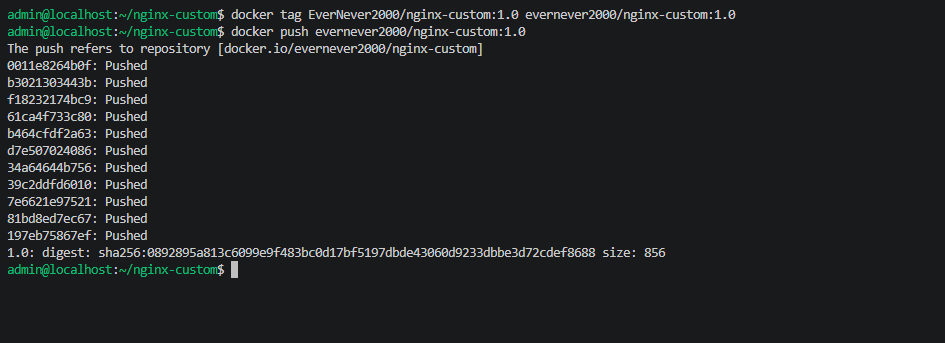

### Uruchomienie poda i ekspozycja

Uruchomiono jednopodowe wdrożenie i wyeksponowano port:

```bash
kubectl run nginx-custom --image=evernever2000/nginx-custom:1.0 --port=80 --labels="app=nginx-custom"
kubectl port-forward pod/nginx-custom 8080:80
```

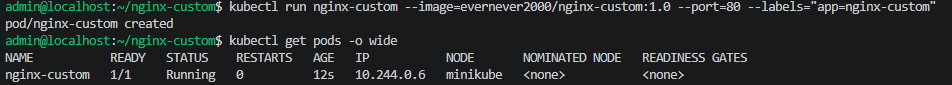
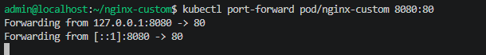

Weryfikacja - `curl localhost:8080` zwraca stronę, a `/healthz` odpowiada `ok`:

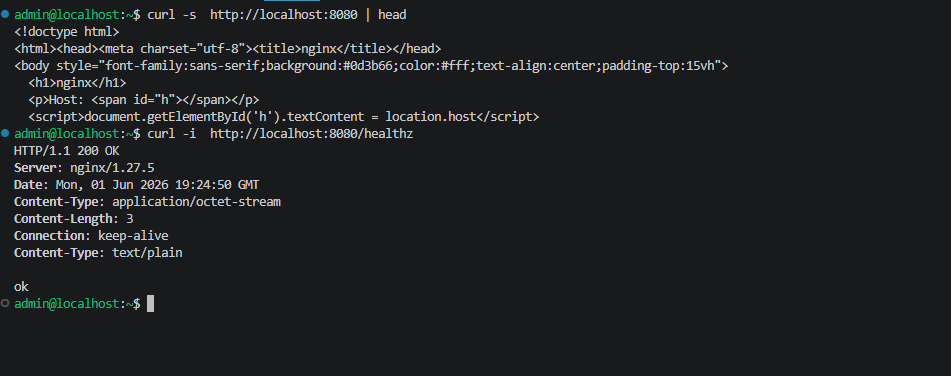

### Wdrożenie jako plik YAML

Najpierw wykonano próbne wdrożenie przykładowego deploymentu z pliku `nginx-test.yaml`:

```bash
kubectl apply -f nginx-test.yaml
kubectl get deploy,pods
```

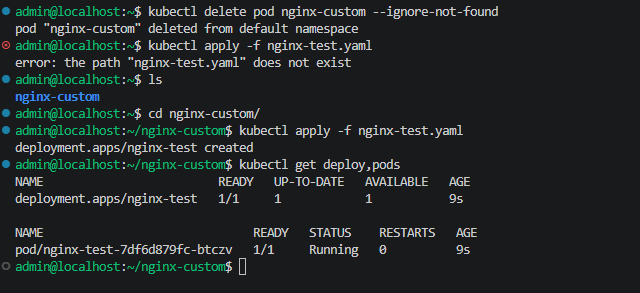

Właściwe wdrożenie zapisano jako `deployment.yaml` (4 repliki), zaaplikowano i sprawdzono `rollout status`:

```yaml
apiVersion: apps/v1
kind: Deployment
metadata:
  name: nginx-custom
  labels:
    app: nginx-custom
  annotations:
    kubernetes.io/change-cause: "init 1.0"
spec:
  replicas: 4
  selector:
    matchLabels:
      app: nginx-custom
  template:
    metadata:
      labels:
        app: nginx-custom
    spec:
      containers:
        - name: nginx-custom
          image: evernever2000/nginx-custom:1.0
          imagePullPolicy: IfNotPresent
          ports:
            - containerPort: 80
```

```bash
kubectl apply -f deployment.yaml
kubectl rollout status deployment/nginx-custom
```

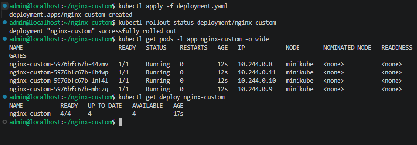

### Wyeksponowanie jako serwis

Deployment wyeksponowano jako serwis (`kubectl expose`) i przekierowano do niego port:

```bash
kubectl expose deployment nginx-custom --name=nginx-custom-svc --port=80 --target-port=80 --type=ClusterIP
kubectl port-forward service/nginx-custom-svc 8080:80
```

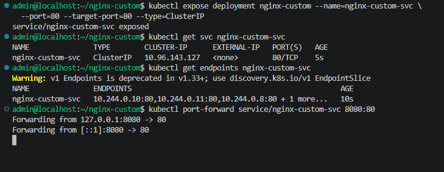

Serwis obejmuje wszystkie repliki (`kubectl get endpoints`), a zapętlone `curl .../healthz` zwraca `ok`:

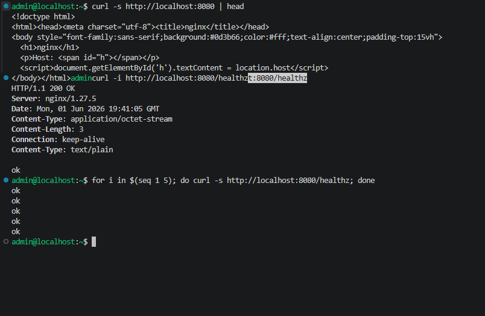

### Dodatkowe obrazy i zmiany w deploymencie

Przygotowano co najmniej dwie wersje obrazu (`:1.0`, `:2.0`) oraz wersję "wadliwą" (`:broken`), której kontener kończy pracę błędem:

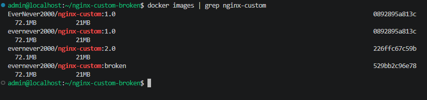

Liczbę replik zmieniano przez edycję `deployment.yaml` i `kubectl apply`: 8 -> 1 -> 0 -> 4.

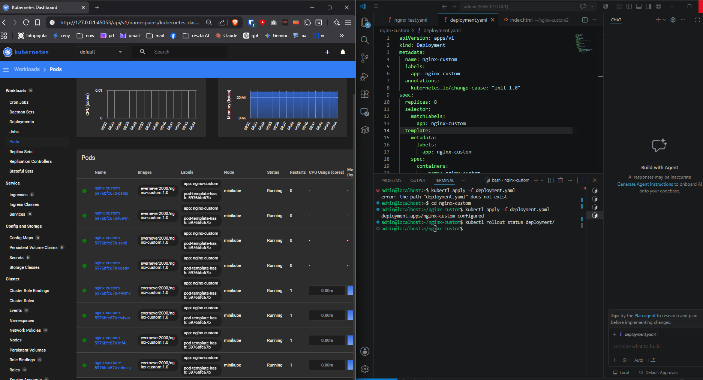
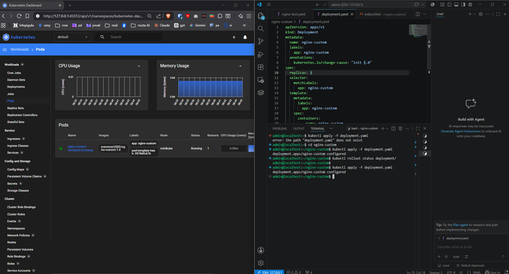
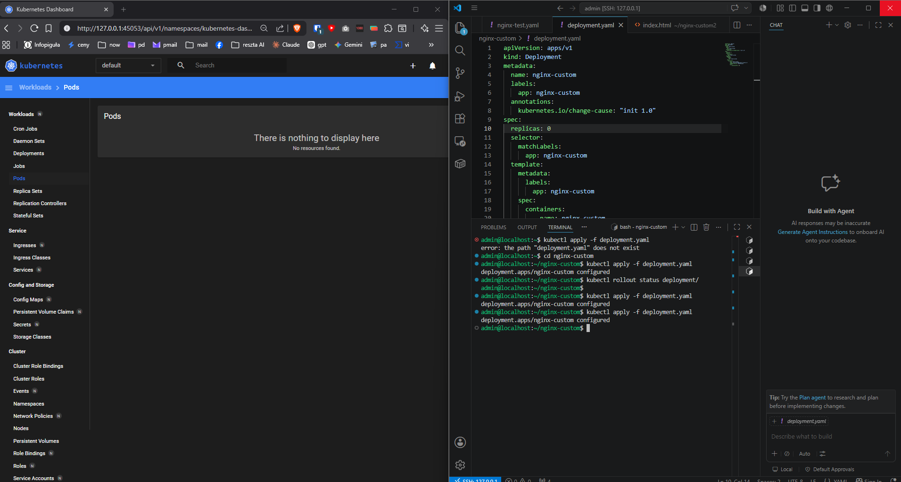
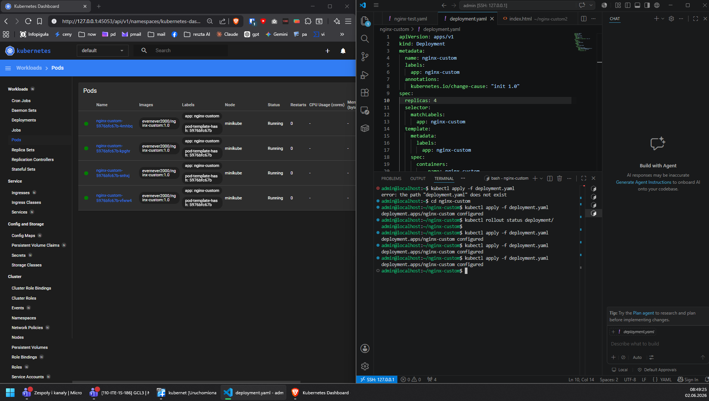

Następnie zastosowano nową wersję obrazu (`:2.0`), starszą (`:1.0`) i wadliwą (`:broken`). Wadliwy obraz powoduje status `Error`/`CrashLoopBackOff` podów.

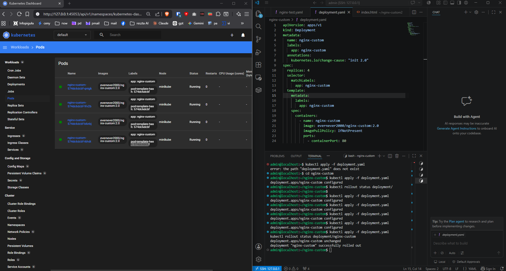
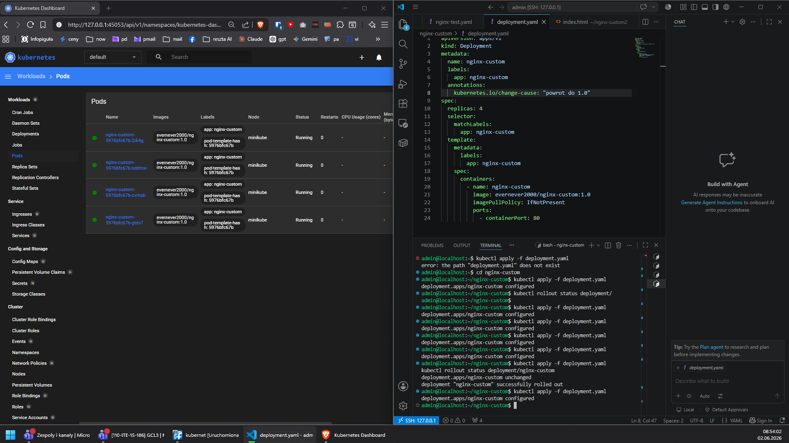
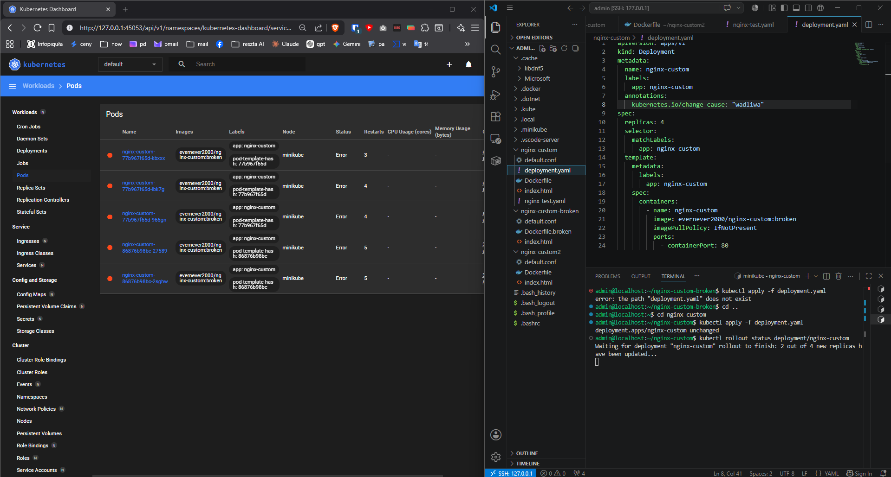

### Historia i wycofywanie wdrożeń

`kubectl rollout history` pokazuje rewizje skorelowane z czynnościami (przez `change-cause`). `kubectl rollout undo` wymaga wskazania zasobu (`deployment/nginx-custom`) i cofa o jedną rewizję - wycofano wadliwe wdrożenie.

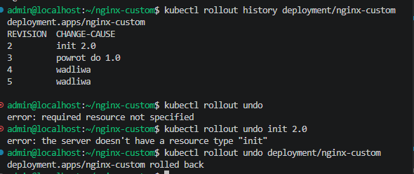

---

## Zajęcia 11 - Kubernetes (2): eksponowanie i skalowanie

> Ta sama maszyna projektowa z minikube, dostęp przez SSH.

### Duża liczba podów

W `deployment.yaml` ustawiono `replicas: 36` (obraz `:2.0`), zaaplikowano i potwierdzono liczbę podów.

```bash
kubectl apply -f deployment.yaml
kubectl get pods -l app=nginx-custom --no-headers | wc -l   # 36
```


### Eksponowanie web-servera

**Do jednego poda** - `kubectl port-forward pod/<pod> 8080:80`; weryfikacja `curl localhost:8080` zwraca stronę (`wersja 2.0`):


**Do deploymentu** - `kubectl port-forward deployment/nginx-custom 8081:80`:


**Do serwisu - dedykowanym poleceniem** (weryfikacja `curl localhost:8082/healthz` -> `ok`):

```bash
kubectl expose deployment nginx-custom --name=nginx-custom-svc --port=80 --target-port=80 --type=ClusterIP
kubectl port-forward service/nginx-custom-svc 8082:80
```


**Do serwisu - dodatkowym plikiem YAML** (`service.yaml`):

```yaml
apiVersion: v1
kind: Service
metadata:
  name: nginx-custom-svc-file
spec:
  type: ClusterIP
  selector:
    app: nginx-custom
  ports:
    - port: 80
      targetPort: 80
```

Po `kubectl apply -f service.yaml` serwis obejmuje wszystkie repliki - `kubectl get endpoints` listuje 36 adresów podów jako backend.


### Skalowanie

**Dyrektywą `scale`** (do 20 replik):

```bash
kubectl scale deployment nginx-custom --replicas=20
```


**Nowym plikiem YAML** - w `deployment.yaml` zmieniono pole `replicas` na `6` i zaaplikowano:

```bash
kubectl apply -f deployment.yaml   # replicas: 6
```


Różnica między metodami: po imperatywnym `kubectl scale` (20 replik) zaaplikowanie pliku z `replicas: 6` sprowadza klaster do 6 podów - deklaratywny plik nadpisuje ręczne skalowanie. Pokazuje to przewagę podejścia deklaratywnego nad imperatywnym.