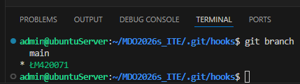
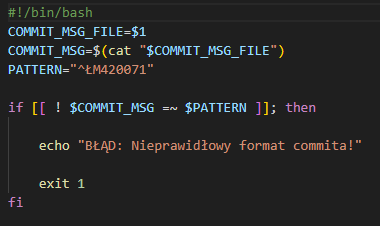

**Sprawozdanie**

<pre>
 git clone https://github.com/InzynieriaOprogramowaniaAGH/MDO2026s_ITE/tree/ŁM420071
  154  github.com/InzynieriaOprogramowaniaAGH/MDO2026s_ITE
  155  history
  156  cd ..
  157  git clone https://github.com/InzynieriaOprogramowaniaAGH/MDO2026s_ITE
  158  rm -rf MDO2026s_ITE/
  159  git clone https://github.com/InzynieriaOprogramowaniaAGH/MDO2026s_ITE
  160  cd MDO2026s_ITE/
  161  ssh-keygen -t ed25519 -C "maciejnylukasz@gmail.com" -f ~/.ssh/id_ed25519_github
  162  ssh-keygen -t ed25519 -C "maciejnylukasz@gmail.com" -f ~/.ssh/id_ed25519_secure
  163  cd ITE/GCL3/
  164  mkdir ŁM420071
  165  mkdir Sprawozdanie1.md
  166  ls -a
  167  touch ŁM420071/Sprawozdanie1.md
  168  cd ŁM420071/
  169  ls
  170  git config --global user.name "Łukasz"
  171  git config --global user.email maciejnylukasz@gmail.com"
  172  git config --global user.email "maciejnylukasz@gmail.com"
  173  cd ..
  174  cd .git
  175  cd hooks
  176  chmod +xcommit-msg
  177  chmod +x commit-msg
  178  git branch
  179  history
<pre>