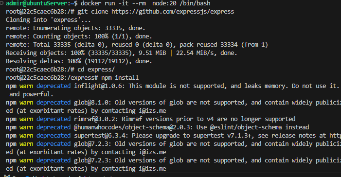
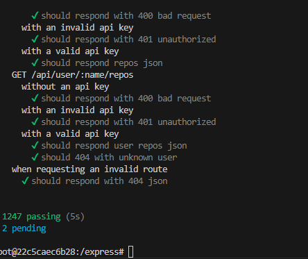
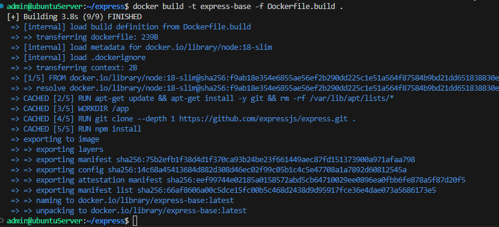
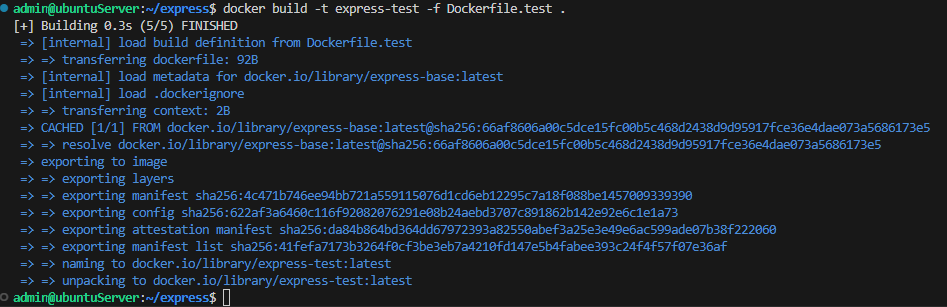
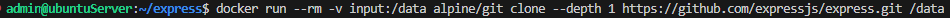
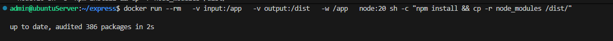
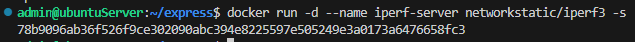
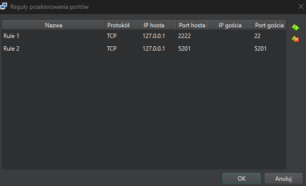

# Sprawozdanie Lab 1-4

## Łukasz Maciejny

## Środowisko

Wszystkie ćwiczenia zostały przeprowadzone w systemie operacyjnym Ubuntu Server 24.04.4 LTS, pracującym jako maszyna wirtualna w środowisku Oracle VM VirtualBox.  
Interakcja z serwerem oraz edycja plików odbywały się zdalnie z wykorzystaniem rozszerzenia Remote - SSH w edytorze Visual Studio Code.

## Lab 1

1. Za pomocą polecenia `git checkout -b`, utworzono nową gałąź, poniżej potwierdzenie utworzenia gałęzi

   

2. Stworzono skrypt `commit-msg`, który wymusza format wiadomości commita zaczynający się od inicjałów i numeru indeksu.  
   Plik umieszczono w folderze `.git/hooks`.

   

3. Test działania skryptu

   


## Lab 2

Zainstalowano Docker Engine bezpośrednio z oficjalnych repozytoriów, co zapewnia dostęp do najnowszych poprawek bezpieczeństwa.

```bash
sudo mkdir -p /etc/apt/keyrings

curl -fsSL https://download.docker.com/linux/ubuntu/gpg | sudo gpg --dearmor -o /etc/apt/keyrings/docker.gpg

echo "deb [arch=$(dpkg --print-architecture) signed-by=/etc/apt/keyrings/docker.gpg] https://download.docker.com/linux/ubuntu \$(lsb_release -cs) stable" | sudo tee /etc/apt/sources.list.d/docker.list > /dev/null

sudo apt update

sudo apt install docker-ce docker-ce-cli containerd.io docker-compose-plugin
```


Po pobraniu i uruchomieniu wymaganych obrazów, na podstawie wyniku polecenia `docker images` można zauważyć znaczące różnice w rozmiarach obrazów.   
Rozpiętość rozmiarów badanych obrazów wynika z ich specjalizacji. Obrazy typu SDK oraz Node są największe, ponieważ dostarczają kompletne środowiska budowania aplikacji, natomiast BusyBox reprezentuje podejście minimalistyczne, oferując jedynie podstawowe narzędzia przy marginalnym zużyciu pamięci dyskowej.  


Korzystając z komendy `sudo docker container ls -a`, przeanalizowano historię uruchomień. Kod wyjścia `Exited (0)` oznacza sukces, natomiast inne wartości mogą wskazywać na błędy lub wymuszone zatrzymanie.
W przypadku obrazu mariadb odnotowano kod wyjścia 1, co jest typowym zachowaniem przy próbie uruchomienia kontenera bazy danych bez wymaganej konfiguracji parametrów startowych.


Uruchomiono kontener busybox w trybie interaktywnym, aby sprawdzić wersję oprogramowania wewnątrz izolowanego środowiska.  
Efekt: Konsola wyświetliła wersję BusyBox v1.37.0.


Uruchomiono obraz ubuntu w celu analizy izolacji procesów.  
Wewnątrz kontenera po wpisaniu komendy `ps -ef` widać, że proces posiada ID 1.  
Na hoście komenda `ps -ef` pokazała, że ten sam proces posiada ID 17620.

.png)

.png)

Utworzono własny plik Dockerfile, kierując się dobrymi praktykami oraz pobrano na niego repozytorium przedmiotu.

```dockerfile
FROM ubuntu:latest     

ENV DEBIAN_FRONTEND=noninteractive 

RUN apt-get update && apt-get install -y \
    git \
    && apt-get clean \
    && rm -rf /var/lib/apt/lists/*

WORKDIR /app

RUN git clone https://github.com/InzynieriaOprogramowaniaAGH/MDO2026s_ITE

CMD ["bash"]
```


Za pomocą polecenia `docker image prune` usunięto obrazy z lokalnego magazynu.


## **<center>Lab3</center>**

Do realizacji tych laboratoriow wybralem Express.js (repozytoium https://github.com/expressjs/express),  
Utworzono kontener node, nastepnie sklonowano do niego repozytorium, zainstalowano zaleznosci oraz uruchomiono testy
za pomoca polecenia npm test.





Stworzony plik wykorzystuje obraz Node:20 jako fundament środowiska. Zastosowano w nim optymalizację warstw poprzez łączenie komend instalacyjnych (&&) oraz parametr --depth 1 przy klonowaniu repozytorium, co pozwoliło na ograniczenie pobieranych danych jedynie do niezbędnych plików źródłowych. Katalog /app został zdefiniowany jako przestrzeń robocza, w której następuje finalna instalacja zależności za pomocą menedżera npm.
<pre>FROM node:20

RUN apt-get update && apt-get install -y git && rm -rf /var/lib/apt/lists/*


WORKDIR /app
RUN git clone --depth 1 https://github.com/expressjs/express.git .
RUN npm install</pre>



Drugi plik Dockerfile został zaprojektowany jako wyspecjalizowane środowisko uruchomieniowe dla testów jednostkowych. Jego struktura opiera się na wcześniej zbudowanym obrazie bazowym, co gwarantuje pełną spójność środowiska:

FROM express-base: Wykorzystuje obraz przygotowany w poprzednim kroku. Dzięki temu kontener posiada już wszystkie niezbędne zależności (node_modules) i kod źródłowy, co eliminuje potrzebę ponownej instalacji i skraca czas budowy do minimum.

ENTRYPOINT ["npm"]: Definiuje punkt wejścia kontenera. Powoduje to, że kontener zachowuje się jak interfejs linii komend menedżera pakietów, przekazując wszelkie parametry startowe bezpośrednio do binarnego pliku npm.

CMD ["test"]: Deklaruje domyślny argument instrukcji startowej. W efekcie, uruchomienie kontenera bez dodatkowych parametrów automatycznie inicjuje proces npm test, wywołując framework testowy i zwracając raport z wynikiem weryfikacji kodu.

<pre>
FROM express-base
ENTRYPOINT ["npm"]
CMD ["test"]
</pre>



Po zbudowaniu obu obrazow uruchomiono obraz wykonujacy testy za pomoca polecenia docker run --rm express-test  
W kontenerze testowym głównym procesem (PID 1) jest npm test, który z kolei uruchamia binaria frameworka Mocha


## Lab 4

### Zachowywanie stanu między kontenerami

Utworzono wolumin wejściowy i wyjściowy za pomocą polecenia `volume create`.


Do wolumina wejściowego sklonowano repozytorium za pomocą kontenera pomocniczego alpine.



Po sklonowaniu repozytorium do wolumenu input uruchomiono kontener bazowy (node:20), podłączając oba woluminy. Kod jest czytany z jednego, a wynik zapisywany na drugim.



Zawartość wolumina wejściowego:


Zawartość wolumina wyjściowego:


W drugim podejściu zainstalowano Gita wewnątrz kontenera i przeprowadzono klonowanie bezpośrednio na zamontowany wolumin.


Tradycyjny Dockerfile (instrukcja COPY) kopiuje dane do obrazu na stałe, co zwiększa jego rozmiar. Nowoczesne podejście z użyciem (RUN --mount) pozwala na optymalizację tego procesu:

- `RUN --mount=type=bind`: Pozwala na dostęp do plików z hosta tylko na czas budowania, bez włączania ich do finalnego obrazu.

- `RUN --mount=type=cache`: Pozwala współdzielić katalogi takie jak `node_modules` między różnymi procesami budowania, co drastycznie przyspiesza instalację zależności.

### Eksponowanie portu i łączność między kontenerami

Uruchomiono serwer Iperf w kontenerze, a następnie sprawdzono jego IP za pomocą polecenia `docker inspect`.




Uruchomiono drugi kontener jako klienta, wskazując bezpośrednio adres IP serwera:


Za pomocą polecenia `docker create network my-network` utworzono własną sieć, ponownie uruchomiono serwer i klienta w nowej sieci.


Uruchomiono server z przekierowaniem portów, następnie sprawdzono połączenie z hosta.


Aby sprawdzić połączenie spoza hosta konieczne było przekierowanie portu w opcjach maszyny wirtualnej.  
Następnie sprawdzono połączenie z spoza hosta (Windows 11).  
Na screenie można zauważyć, że prędkość transferu jest znacząco niższa podczas próby połączenia spoza hosta.




Za pomoca docker logs wyciagnieto logi z serwera iperf.


### **<center>Usługi w rozumieniu systemu, kontenera i klastra</center>**

Przygotowano plik Dockerfile, ktory tworzy obraz z dzialajacym serwerem ssh.
<pre>
FROM ubuntu:latest

RUN apt-get update && apt-get install -y openssh-server

RUN mkdir -p /run/sshd

RUN echo 'root:rootpass' | chpasswd
RUN sed -i 's/#PermitRootLogin prohibit-password/PermitRootLogin yes/' /etc/ssh/sshd_config
RUN ssh-keygen -A

EXPOSE 22

CMD ["/usr/sbin/sshd", "-D"]
</pre>

Po przygotowaniu obrazu uruchomiono kontener i przetestowano polaczenie.  
Port przekierowano na port 5201 aby nie kolidowal on z portem ssh na maszynie wirtualnej.


Wdrożenie serwera SSH w kontenerze Ubuntu pozwoliło na uzyskanie zdalnego dostępu identycznego jak w przypadku fizycznej maszyny. Należy jednak zaznaczyć, że w profesjonalnych środowiskach produkcyjnych praktyka ta jest unikana na rzecz komendy docker exec. SSH w kontenerze znajduje zastosowanie głównie w specyficznych scenariuszach deweloperskich oraz przy integracji ze starszymi systemami zarządzania, które wymagają protokołu SSH do poprawnego działania.

### **<center>Przygotowanie do uruchomienia serwera Jenkins</center>**

Przeprowaczono instalacje Jenkinsa wraz z pomocnikiem DIND ponizej widac obydwa dzialajace kontenery oraz ekran logowania do Jenkinsa.


