# **
Sprawozdanie
**
### 
Łukasz Maciejny

## **
Srodowisko
**
Wszystkie ćwiczenia zostały przeprowadzone w systemie operacyjnym Ubuntu Server 24.04.4 LTS, pracującym jako maszyna wirtualna w środowisku Oracle VM VirtualBox.  
  Interakcja z serwerem oraz edycja plików odbywały się zdalnie z wykorzystaniem rozszerzenia Remote - SSH w edytorze Visual Studio Code.

## **
Lab1
**

1.Za pomoca polecenia git checkout -b, utworzono nowa galaz, ponizej potwierdzenie utworzenia galezi

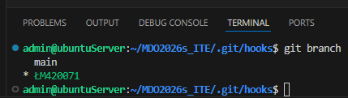

Stworzono skrypt commit-msg, który wymusza format wiadomości commita zaczynający się od inicjałów i numeru indeksu.  
Plik umieszczono w folderze .git/hooks.

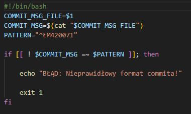

Test dzialania skryptu

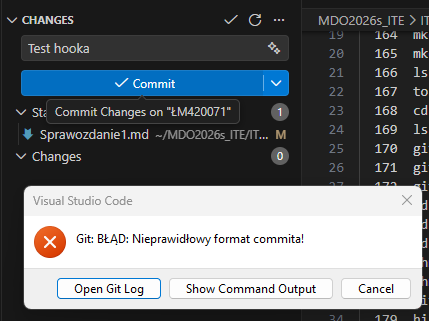

## **
Lab2
**

Zainstalowano Docker Engine bezposrednio z oficjalnych repozytoriow, co zapewnia dostep do najnowszych poprawek bezpieczenstwa  

<pre>
sudo mkdir -p /etc/apt/keyrings

curl -fsSL https://download.docker.com/linux/ubuntu/gpg | sudo gpg --dearmor -o /etc/apt/keyrings/docker.gpg

echo   "deb [arch=$(dpkg --print-architecture) signed-by=/etc/apt/keyrings/docker.gpg] https://download.docker.com/linux/ubuntu \$(lsb_release -cs) stable" | sudo tee /etc/apt/sources.list.d/docker.list > /dev/null

sudo apt update

sudo apt install docker-ce docker-ce-cli containerd.io docker-compose-plugin
</pre>

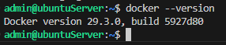

Po pobraniu i uruchomieniu wymaganych obrazow, na podstawie wyniku polecenia docker images mozna zauwazyc znaczace roznice w rozmiarach obrazow.   
Rozpiętość rozmiarów badanych obrazów wynika z ich specjalizacji. Obrazy typu SDK oraz Node są największe, ponieważ dostarczają kompletne środowiska budowania aplikacji, natomiast BusyBox reprezentuje podejście minimalistyczne, oferując jedynie podstawowe narzędzia przy marginalnym zużyciu pamięci dyskowej.  

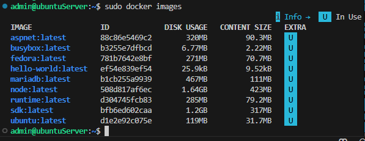

Korzystając z komendy sudo docker container ls -a, przeanalizowano historię uruchomień. Kod wyjścia Exited (0) oznacza sukces, natomiast inne wartości mogą wskazywać na błędy lub wymuszone zatrzymanie.
W przypadku obrazu mariadb odnotowano kod wyjścia 1, co jest typowym zachowaniem przy próbie uruchomienia kontenera bazy danych bez wymaganej konfiguracji parametrów startowych.

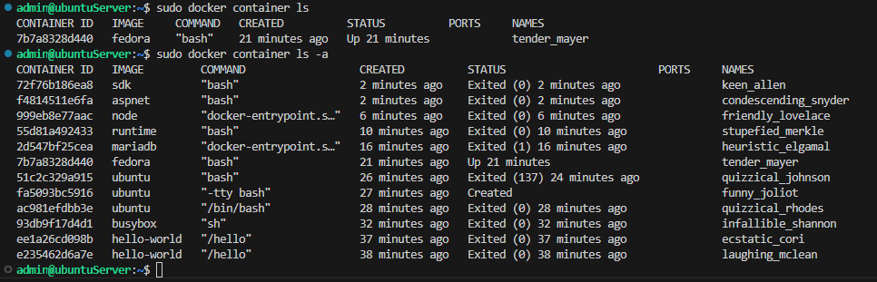

Uruchomiono kontener busybox w trybie interaktywnym, aby sprawdzić wersję oprogramowania wewnątrz izolowanego środowiska.
Efekt: Konsola wyświetliła wersję BusyBox v1.37.0.

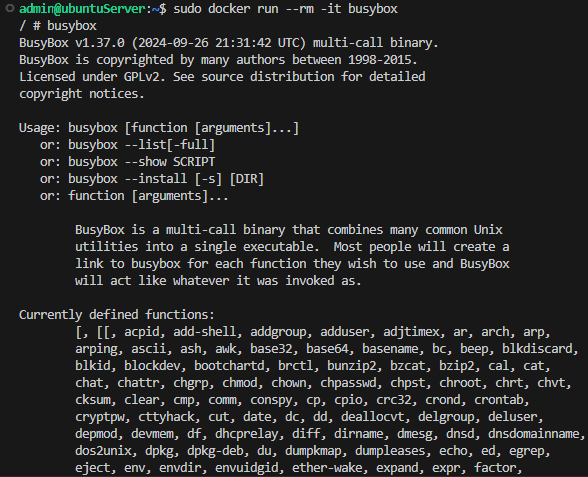

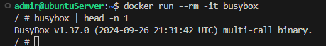

Uruchomiono obraz ubuntu w celu analizy izolacji procesów.
Wewnatrz kontenera po wpisaniu komendy ps -ef widac ze proces posiada ID 1.
Na hoscie komenda ps -ef pokazala ze ten sam proces posiada ID 17620.

.png)

.png)

Utworzono wlasny plik dockerfile kierujac sie dobrymi praktykami oraz pobranu na niego repozytorium przedmiotu.

ENV DEBIAN_FRONTEND=noninteractive
Ustawia zmienną środowiskową, która informuje menedżer pakietów (apt), że podczas instalacji nie ma operatora. Dzięki temu proces budowy nie zawiesi się, czekając na reakcję użytkownika.

apt-get update: Pobiera aktualne listy pakietów.

apt-get install -y git: Instaluje narzędzie Git (flaga -y automatycznie potwierdza instalację).

apt-get clean oraz rm -rf /var/lib/apt/lists/*: Usuwa pliki tymczasowe pobrane przez update. Ponieważ wszystko jest w jednej linii (połączone &&), te śmieci nie trafią do finalnego obrazu, co znacząco go zmniejsza.

WORKDIR /app
Ustawia katalog roboczy. To odpowiednik komendy cd /app. Od tego momentu wszystkie kolejne komendy (jak git clone) oraz moment wejścia do kontenera będą zaczynać się właśnie w tym folderze.

<pre>FROM ubuntu:latest     

ENV DEBIAN_FRONTEND=noninteractive 

RUN apt-get update && apt-get install -y \
    git \ 
    && apt-get clean \
    && rm -rf /var/lib/apt/lists/*

WORKDIR /app

RUN git clone https://github.com/InzynieriaOprogramowaniaAGH/MDO2026s_ITE

CMD ["bash"]</pre>

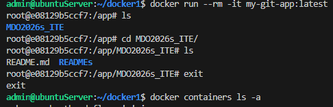

Za pomoca polecenia docker image prune usunieto obrazy z lokalnego magazynu.

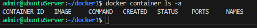

## **
Lab3
**

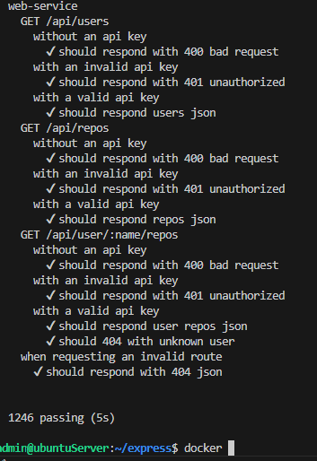

## **
Lab4
**

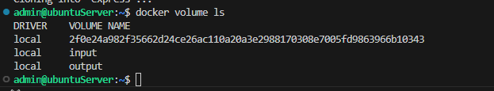

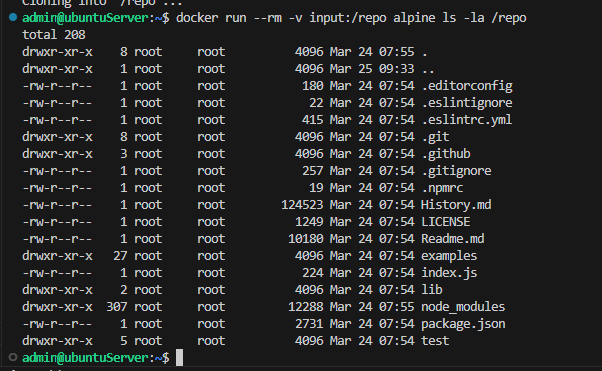

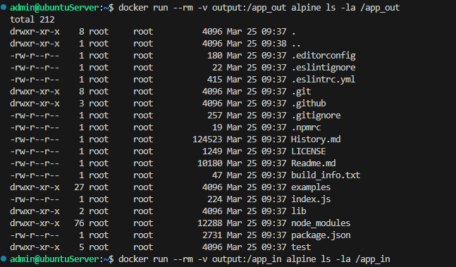

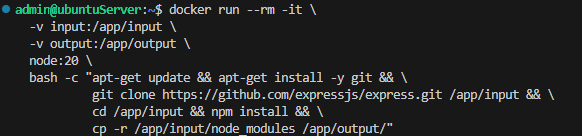

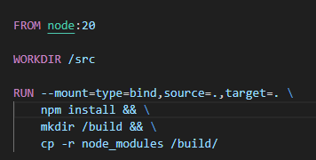

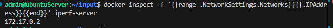

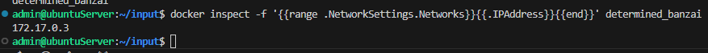

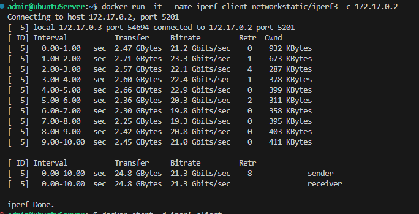

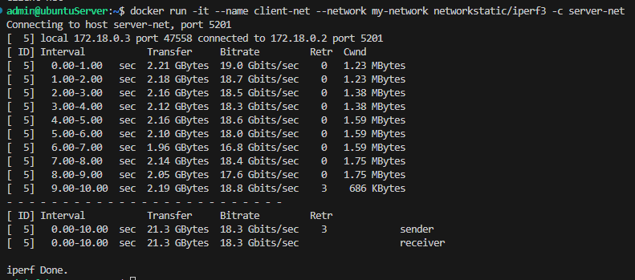

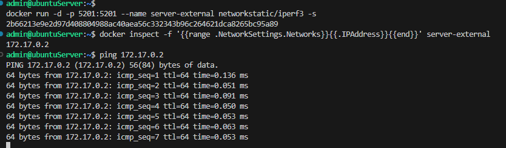

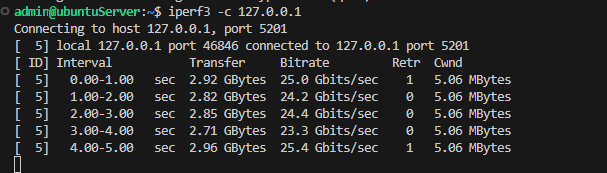

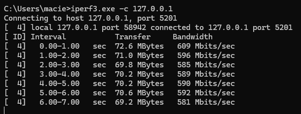

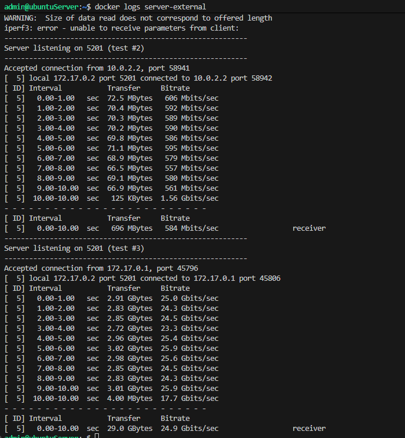

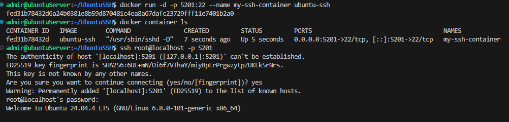

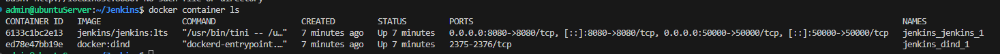

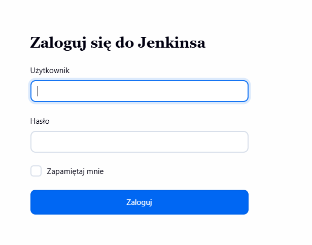