# Sprawozdanie Lab 5-7

## Łukasz Maciejny

## Środowisko

Wszystkie ćwiczenia zostały przeprowadzone w systemie operacyjnym Ubuntu Server 24.04.4 LTS, pracującym jako maszyna wirtualna w środowisku Oracle VM VirtualBox. Interakcja z serwerem oraz edycja plików odbywały się zdalnie z wykorzystaniem rozszerzenia Remote - SSH w edytorze Visual Studio Code.

## 1. Przygotowanie i testowanie środowiska Jenkins

W pierwszym etapie uruchomiono środowisko Jenkins w architekturze kontenerowej z użyciem Docker-in-Docker (DinD). Główny kontener Jenkins miał połączenie z kontenerem DinD, co umożliwiało wykonywanie poleceń Docker bezpośrednio z potoku build.

### 1.1 Uruchomienie kontenerów

- Uruchomiono kontener DinD, który ma obsługiwać polecenia Docker z kontenera Jenkins.
- Uruchomiono kontener Jenkins na bazie obrazu z wtyczką BlueOcean.
- Z logów kontenera Jenkins skopiowano hasło wymagane do pierwszego logowania.
- Sprawdzono informacje o systemie za pomocą polecenia `uname` i potwierdzono, że nazwa hosta odpowiada identyfikatorowi kontenera Jenkins.

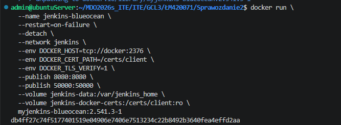

### 1.2 Testy skryptów pomocniczych

- Utworzono i uruchomiono prosty skrypt, który zwraca błąd, gdy bieżąca godzina jest nieparzysta.
- Utworzono i uruchomiono prosty skrypt sprawdzający wersję Dockera oraz pobierający obraz Ubuntu.

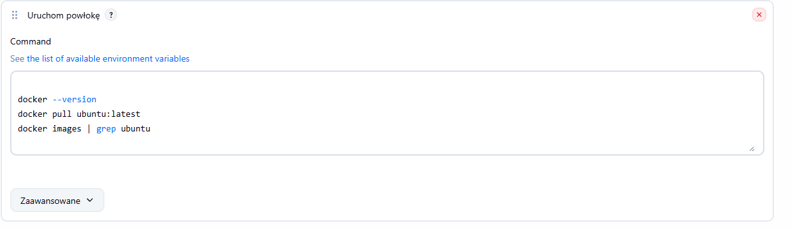

## 2. Tworzenie własnego pipeline

Jako projekt, dla którego zaprojektowano pipeline, wybrano Express.js: https://github.com/expressjs/express.

### 2.1 Wymagania wstępne środowiska

- Zasoby sprzętowe: minimum 2 CPU i 4 GB RAM.
- Oprogramowanie:
  - Jenkins 2.x lub nowszy z wtyczkami: Pipeline, Git, Credentials Binding, Docker Pipeline.
  - Docker Engine 

### 2.2 Struktura pipeline

Pipeline podzielono na następujące etapy. Schemat działania przedstawiono na diagramie aktywności.

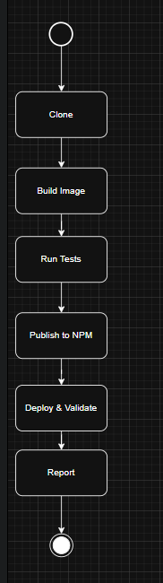

#### Stage 1: Clone / Prepare

W tym etapie Jenkins pobiera kod z repozytorium i przygotowuje środowisko. Choć w kodzie samego scenariusza widać jedynie komendę `echo`, w deklaratywnych pipeline Jenkins wykonuje domyślnie checkout na początku, dzięki czemu kod trafia do zmiennej `${PROJECT_DIR}`.

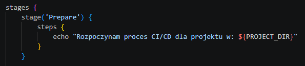

#### Stage 2: Build Image

Wykonuje się komenda `docker build` z użyciem pliku `Dockerfile.build`, co pozwala stworzyć obraz bazowy aplikacji.

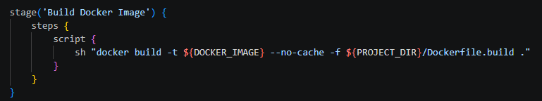

#### Stage 3: Run Tests

Jenkins buduje drugi, tymczasowy obraz na podstawie `Dockerfile.test` i uruchamia go przy pomocy `docker run --rm`. Jeśli testy wewnątrz kontenera zakończą się niepowodzeniem, proces pipeline zostaje przerwany.

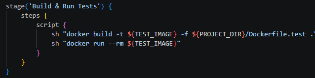

#### Stage 4: Publish to NPM

Najbardziej złożony krok. Jenkins:

- pobiera token dostępu za pomocą `withCredentials`,
- uruchamia kontener `express-base`,
- dynamicznie zmienia nazwę paczki, aby nie kolidowała z oficjalną paczką `express`,
- podbija wersję do numeru bieżącego buildu (`BUILD_NUMBER`),
- wysyła gotową paczkę do zewnętrznego rejestru NPM.

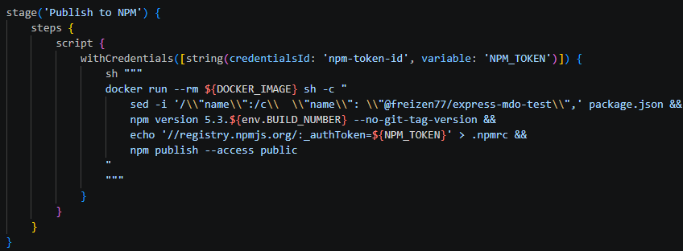

#### Stage 5: Deploy & Validate

Skrypt pobiera świeżo opublikowaną paczkę z rejestru NPM i uruchamia ją w izolowanej sieci Dockerowej `test-net`. Następnie wykonuje się żądanie `curl`, aby sprawdzić, czy aplikacja odpowiada poprawnym komunikatem `OK`.

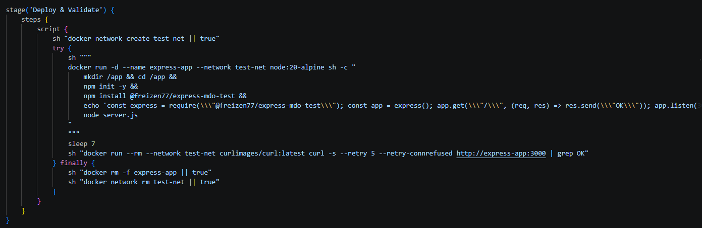

#### Stage 6: Report / Create Shrinkwrap Artifact

Generowany jest plik `npm-shrinkwrap.json`, który następnie archiwizowany jest przez Jenkins w `archiveArtifacts`. Umożliwia to odtworzenie dokładnych wersji zależności wykorzystanych w tej konkretnej, udanej kompilacji.

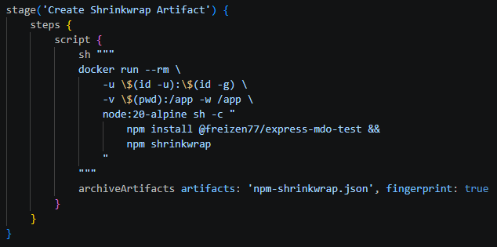

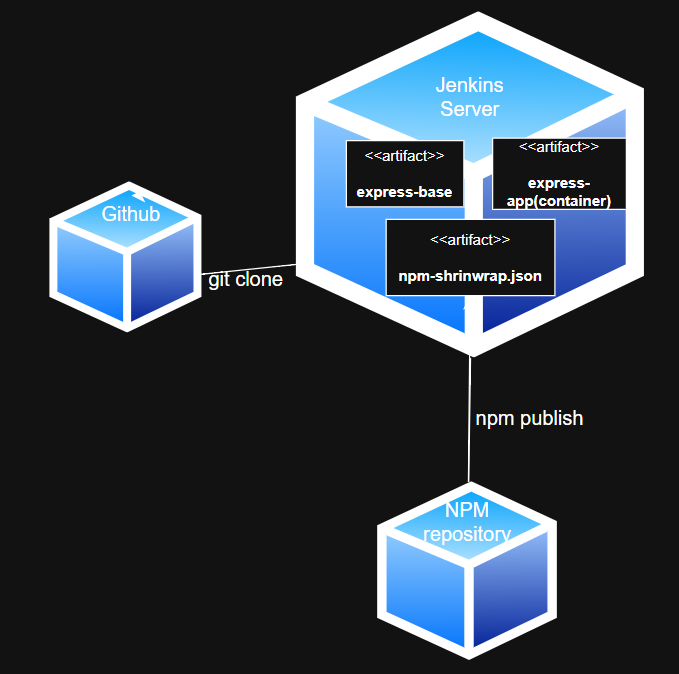

## 2.3 Architektura wdrożenia

Prezentowany diagram wdrożeniowy ilustruje fizyczną i logiczną strukturę środowiska CI/CD opartego na kontenerach. Centralnym elementem jest serwer Jenkins działający w trybie Docker-in-Docker (DinD), co pozwala na izolację procesów budowania od systemu hosta.

W ramach przepływu pracy wyróżniono trzy kluczowe węzły:

- System kontroli wersji (GitHub): zewnętrzne źródło kodu, inicjujące proces budowania.
- Środowisko budowania i walidacji (Jenkins): miejsce tworzenia artefaktów, takich jak obraz `express-base` i instancja testowa `express-app`.
- Rejestr artefaktów (NPM Repository): zewnętrzne repozytorium, do którego trafia gotowy i przetestowany produkt.

Po uruchomieniu pipeline uzyskano gotowy artefakt. Pełne wyjście konsoli z przebiegu pipeline zapisano w pliku `jenkins.log`.

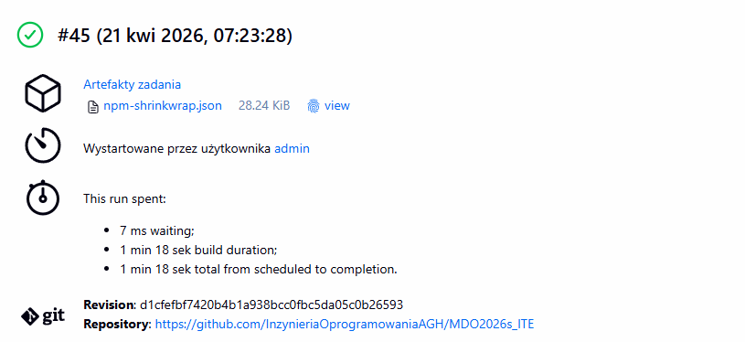

## 3. Podsumowanie

- Automatyzacja cyklu życia: Jenkinsfile umożliwiła pełną automatyzację procesu – od pobrania kodu z GitHub, przez budowę obrazów, aż po testy integracyjne i publikację.
- Bezpieczeństwo i izolacja: architektura kontenerowa oddzieliła procesy budowania od systemu hosta. Mechanizm `withCredentials` zapewnił bezpieczne przekazywanie wrażliwych danych (token NPM) bez ich ujawniania w logach.
- Weryfikacja end-to-end: publikacja artefaktu przed testowym wdrożeniem umożliwiła symulację ścieżki użytkownika końcowego i potwierdzenie poprawności procesu dystrybucji w rejestrze NPM.

