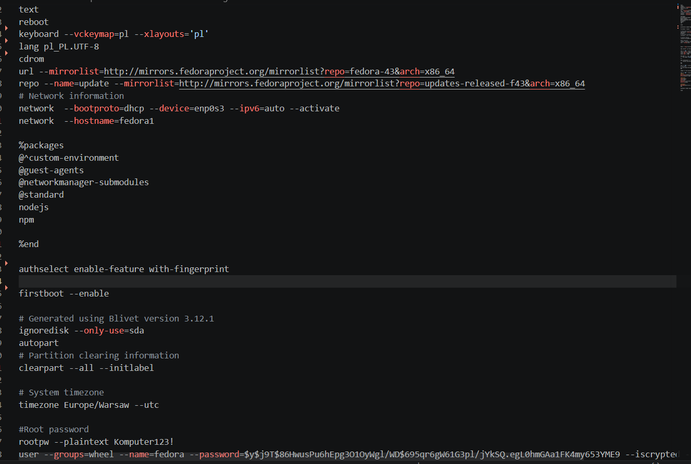

# Sprawozdanie Lab 5-7

## Łukasz Maciejny

## Środowisko

Wszystkie ćwiczenia zostały przeprowadzone w systemie operacyjnym Ubuntu Server 24.04.4 LTS, pracującym jako maszyna wirtualna w środowisku Oracle VM VirtualBox. Interakcja z serwerem oraz edycja plików odbywały się zdalnie z wykorzystaniem rozszerzenia Remote - SSH w edytorze Visual Studio Code.

Do wykonania zadan z lab 8 i 9 uzyto maszyny z zainstalowanym systemrm Fedora.

## 1.Ansible

Ansible to otwartoźródłowe narzędzie do automatyzacji IT, które służy do zarządzania konfiguracją, wdrażania aplikacji oraz orkiestracji systemów. W przeciwieństwie do wielu innych narzędzi, Ansible jest agentless – nie wymaga instalowania dodatkowego oprogramowania (agentów) na zarządzanych maszynach. Komunikuje się z nimi poprzez protokół SSH

Przygotowano maszyne wirtualna o minimalnym zestawie oprogramowania, po czym 
rozeslano klucz ssh do maszyny z fedora
<pre>ssh-copy-id user@192.168.1.11</pre>

Dopiszano maszyne z fedora jako ansible target do listy hostow


Utworzono strukturę pliku inwentaryzacji(inventory.ini) podzieloną na sekcje:


Wykonano testowe wywołanie ping przy użyciu modułu Ansible:


Przygotowano playbook, który realizuje zadania:

Aktualizacja pakietów (apt update && apt upgrade).

Restart usług sshd oraz rngd.

Playbook zapobiega błędom w momencie gdy ssh zostanie zrestartowane, co chwilowo powoduje zerwanie polaczenia.

<pre>---
- name: Task 1
  hosts: all
  become: yes
  tasks:
    - name: "1. Ping"
      ping:
    - name: "2. Kopiowanie pliku inwentory.ini"
      copy:
        src: ./inventory.ini
        dest: /home/ansible/inventory.ini
        owner: ansible
        group: ansible
        mode: '0644' 
      when: "'Endpoints' in group_names"
    - name: "3. Aktualizacja pakietow"
      command: dnf update -y
      when: ansible_distribution == "Fedora"
      register: update_result
      changed_when: "'Nothing to do' not in update_result.stdout"
    - name: "4. Restart uslug sshd i rngd"
      systemd:
        name: "{{ item }}"
        state: restarted
      loop:
        - sshd
        - rngd
      ignore_errors: yes
      when: "'Endpoints' in group_names"</pre>


Zastosowano standardowe szkieletowanie Ansible, które gwarantuje czytelność i zgodność ze standardami społeczności:

```bash 
ansible-galaxy role init deploy_app 
```

W pliku meta/main.yml zdefiniowano metadane roli, co pozwala na jej łatwą identyfikację oraz określenie wymagań systemowych:

Opis procesu wdrożeniowego (Playbook)
Wdrożenie aplikacji zostało zaimplementowane w oparciu o następujące etapy:

Sanity Check (Wstępna weryfikacja): Przed przystąpieniem do prac, playbook sprawdza dostępność zasobów dyskowych oraz status portów. Dzięki zastosowaniu ignore_errors: yes oraz rejestracji wyników (register), proces jest odporny na błędy, które nie uniemożliwiają kontynuacji wdrożenia.

Zapewnienie środowiska: Rola automatycznie instaluje wymagane zależności oraz weryfikuje status usługi docker.

Transfer i przygotowanie: Artefakty aplikacji (kod źródłowy Express.js) są przesyłane na maszynę docelową, a struktura katalogów jest automatycznie tworzona z odpowiednimi uprawnieniami.

Orkiestracja kontenera: Wdrożenie jest w pełni idempotentne – każdorazowe uruchomienie playbooka usuwa poprzednią instancję kontenera przed uruchomieniem nowej, co eliminuje ryzyko konfliktów nazw (docker rm -f).

Weryfikacja (Post-deployment): Kluczowym elementem jest pętla sprawdzająca (until, retries, delay), która weryfikuje poprawne działanie aplikacji poprzez zapytanie HTTP GET. Playbook oczekuje na pełną gotowość aplikacji (status 200), co zapewnia, że wdrożenie kończy się sukcesem tylko wtedy, gdy usługa jest faktycznie osiągalna.

Cleanup (Oczyszczanie): Ostatni etap roli realizuje czyszczenie środowiska – usuwany jest kontener oraz tymczasowe pliki aplikacji, co zapewnia, że maszyna pozostaje w czystym stanie po zakończeniu testów.

Ponizej glowny plik tasks/main.yml:

<pre>---
- name: "Sanity Check: Zasoby i Porty"
  block:
    - name: "Sprawdzenie miejsca na dysku"
      command: df -h /opt
      register: disk_res
      changed_when: false

    - name: "Sprawdzenie czy port {{ app_port }} jest wolny"
      shell: "ss -tuln | grep :{{ app_port }}"
      register: port_res
      failed_when: false
      changed_when: false
  ignore_errors: yes

- name: "Zapewnienie działania Dockera"
  block:
    - name: "Instalacja Dockera (dnf)"
      command: dnf install -y docker python3-docker
      register: dnf_out
      changed_when: "'Nothing to do' not in dnf_out.stdout"

    - name: "Start i Enable usługi Docker"
      systemd:
        name: docker
        state: started
        enabled: yes

- name: "Transfer artefaktów i ustawienie uprawnień"
  block:
    - name: "Tworzenie katalogu"
      file:
        path: "{{ remote_app_path }}"
        state: directory
        mode: '0777'

    - name: "Kopiowanie plików aplikacji (Zestaw plików)"
      copy:
        src: "build_artifact/"
        dest: "{{ remote_app_path }}/"
        mode: '0777'

- name: "Uruchomienie kontenera z aplikacją"
  shell: |
    docker rm -f {{ app_name }} || true
    docker run -d \
      --name {{ app_name }} \
      -p {{ app_port }}:{{ app_port }} \
      -v {{ remote_app_path }}:/usr/src/app:z \
      -w /usr/src/app \
      {{ container_image }} \
      sh -c "npm install && node app.js"
  register: docker_run

- name: "Weryfikacja: Sanity Check działania aplikacji"
  uri:
    url: "http://localhost:{{ app_port }}"
    status_code: 200
  register: web_check
  until: web_check.status == 200
  retries: 20
  delay: 5

- name: "Procedura czyszczenia (Cleanup)"
  block:
    - name: "Usunięcie kontenera"
      shell: "docker rm -f {{ app_name }}"
    - name: "Usunięcie plików aplikacji"
      file:
        path: "{{ remote_app_path }}"
        state: absent</pre>


## 2.Instalacja nienadzorowana

Przygotowano bazowy plik anaconda.


Utworzono VM, podczas startu z ISO, w menu wyboru, zedytowano opcje bootowania (klawisz e), dopisując skad pobrac plik konfiguracyjny.


Zmodyfikowano plik odpowiedzi anaconda-ks.cfg.

Wymóg przeprowadzenia instalacji bez żadnych pytań został osiągnięty przez usunięcie wszelkich interaktywnych opcji i zdefiniowanie jasnej ścieżki partycjonowania.

clearpart --all --initlabel usuwa wszystkie istniejące dane, a autopart automatycznie tworzy strukturę partycji. Dzięki temu instalator nie oczekuje akceptacji użytkownika.

npm install -g ...: pobiera  artefakt 

Jako ze aplikacja którą uruchamiam to express.js(aplikacja po uruchomieniu odrazu sie wylacza), automatycznie tworzony jest prosty plik startowy ktory umozliwia uruchomienie jej.

Utworzenie pliku .service w katalogu /etc/systemd/system/. sprawia ze aplikacja uruchamia sie po starcie systemu 




Aplikacja działa po uruchomieniu systemu.


## 3.Kubernetes

Kubernetes to otwartoźródłowa platforma do orkiestracji kontenerów, która automatyzuje wdrażanie, skalowanie i zarządzanie aplikacjami skonteneryzowanymi.

Minikube to narzędzie pozwalające uruchomić lokalny klaster Kubernetes wewnątrz maszyny wirtualnej lub kontenera.
Po przeprowadzeniu instalacji sprawdzono poprawnosc dzialania:


Przygotowano obraz Docker z aplikacją Express.js. Obraz został tak zaprojektowany, aby proces główny (Node.js) działał w trybie ciągłym (nie kończył pracy).

Uruchomienie:
```bash 
minikubctl -- run express-app --image=express-app:v1 --port=8070
```


Wdrożenia manualne przeniesiono do pliku deployment.yaml.

Skalowanie: Plik został skonfigurowany na 4 repliki (replicas: 4).

Wdrożenie: kubectl apply -f deployment.yaml.

Sprawdzenie statusu: kubectl rollout status deployment/express-deployment.

<pre>apiVersion: apps/v1
kind: Deployment
metadata:
  name: express-deployment
  labels:
    app: express-app
spec:
  replicas: 4
  selector:
    matchLabels:
      app: express-app
  template:
    metadata:
      labels:
        app: express-app
    spec:
      containers:
      - name: express-container
        image: express-app:v2
        imagePullPolicy: Never 
        ports:
        - containerPort: 3000 </pre>


Wyeksponowano wdrozenie jako serwis, wyeksponowano rowniez port serwisu


Potwierdzenie dzialania z czterema replikami:


Uzyto polecenia scale w celu zmienienia liczby replik


Wykonano aktualizację obrazu 


Po załadowaniu obrazu generującego błąd sprawodzono historie a następnie cofnięto obraz do poprzedniej działającej wersji


Napisano i przetestowano skrypt testujacy poprawność wdrożenia

```bash
#!/bin/bash

if minikube kubectl -- rollout status deployment/express-deployment --timeout=60s; then
    exit 0
else
    exit 1
fi
```


Porownanie strategii wdrożenia:

Recreate: Wszystkie stare Pody są zabijane przed stworzeniem nowych (przerwa w dostępności).
<pre>apiVersion: apps/v1
kind: Deployment
metadata:
  name: express-recreate
spec:
  replicas: 4
  strategy:
    type: Recreate 
  selector:
    matchLabels:
      app: express-recreate
  template:
    metadata:
      labels:
        app: express-recreate
    spec:
      containers:
      - name: express-container
        image: express-app:v2
        imagePullPolicy: Never
        ports:
        - containerPort: 3000</pre>

Rolling Update: Nowe Pody są tworzone, a stare usuwane stopniowo. 
<pre>
apiVersion: apps/v1
kind: Deployment
metadata:
  name: express-rolling
spec:
  replicas: 4
  strategy:
    type: RollingUpdate
    rollingUpdate:
      maxUnavailable: 2   
      maxSurge: 25%       
  selector:
    matchLabels:
      app: express-rolling
  template:
    metadata:
      labels:
        app: express-rolling
    spec:
      containers:
      - name: express-container
        image: express-app:v2
        imagePullPolicy: Never
        ports:
        - containerPort: 3000</pre>

Canary Deployment: Wdrożono jedną replikę nowej wersji, aby przetestować ją przed pełnym przełączeniem.

<pre>
apiVersion: apps/v1
kind: Deployment
metadata:
  name: express-prod
spec:
  replicas: 3 
  selector:
    matchLabels:
      app: express-canary-service
  template:
    metadata:
      labels:
        app: express-canary-service
        track: stable
    spec:
      containers:
      - name: express-container
        image: express-app:v2
        imagePullPolicy: Never
        ports:
        - containerPort: 3000
---
apiVersion: apps/v1
kind: Deployment
metadata:
  name: express-canary
spec:
  replicas: 1 
  selector:
    matchLabels:
      app: express-canary-service
  template:
    metadata:
      labels:
        app: express-canary-service
        track: canary
    spec:
      containers:
      - name: express-container
        image: express-app:v3
        imagePullPolicy: Never
        ports:
        - containerPort: 3000
---

apiVersion: v1
kind: Service
metadata:
  name: express-canary-balancer
spec:
  selector:
    app: express-canary-service 
  ports:
    - protocol: TCP
      port: 80
      targetPort: 3000</pre>

Przeprowadzono bezpośrednie przekierowanie portu do konkretnej instancji poda.


Zastosowano mechanizm przekierowania bezpośrednio na obiekt typu Deployment. W tym przypadku Kubernetes automatycznie kieruje ruch do jednego z dostępnych podów zarządzanych przez dany deployment:


Utworzono serwis typu ClusterIP, który trwale przypisuje usługę do portu 80 wewnątrz klastra:

Wyeksponowano utworzony serwis na zewnątrz klastra poprzez port 8081:


Zmieniono liczbe replik dwoma sposobami(polecenie scale oraz zaaplikowanie nowego pliku YAML)


