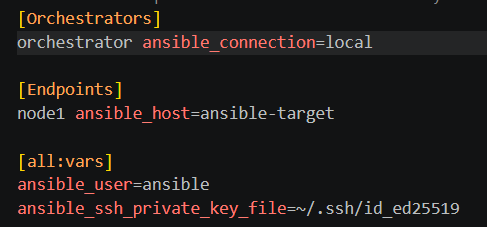
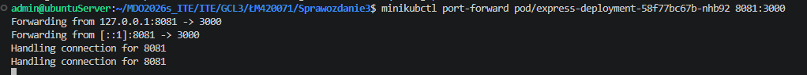
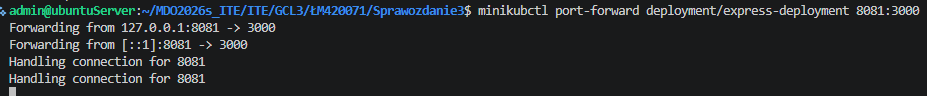
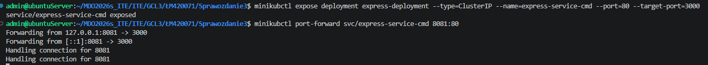
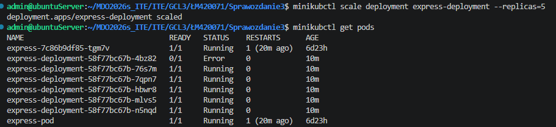
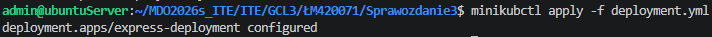

# Sprawozdanie Lab 8–11

## Łukasz Maciejny

## Środowisko

Wszystkie ćwiczenia zostały przeprowadzone na systemie Ubuntu Server 24.04.4 LTS uruchomionym jako maszyna wirtualna w Oracle VM VirtualBox. Praca z serwerem i edycja plików odbywały się zdalnie za pomocą rozszerzenia Remote - SSH w Visual Studio Code.

Do wykonania zadań z laboratoriów 8 i 9 użyto również maszyny z systemem Fedora.

---

## 1. Ansible

Ansible to otwartoźródłowe narzędzie do automatyzacji IT służące do zarządzania konfiguracją, wdrażania aplikacji oraz orkiestracji. Ansible jest agentless — komunikuje się ze zdalnymi hostami za pomocą SSH, bez konieczności instalacji dodatkowych agentów.

Przygotowano maszynę wirtualną z minimalnym zestawem oprogramowania, a następnie przesłano klucz SSH do tej maszyny:

```bash
ssh-copy-id user@192.168.1.11
```

Maszyna z Fedory została dodana do listy hostów Ansible (inventory).


Utworzono strukturę pliku inwentaryzacji (inventory.ini) podzieloną na sekcje:




Przeprowadzono testowe wywołanie modułu `ping`:


Przygotowano playbook realizujący zadane operacje, m.in.:
- aktualizację pakietów (np. `dnf update -y` dla Fedory),
- restart usług `sshd` i `rngd`,
- skopiowanie pliku `inventory.ini` na hosty z grupy `Endpoints`.


```yaml
---
- name: Task 1
  hosts: all
  become: yes
  tasks:
    - name: "1. Ping"
      ping:

    - name: "2. Kopiowanie pliku inventory.ini"
      copy:
        src: ./inventory.ini
        dest: /home/ansible/inventory.ini
        owner: ansible
        group: ansible
        mode: '0644'
      when: "'Endpoints' in group_names"

    - name: "3. Aktualizacja pakietów (Fedora)"
      command: dnf update -y
      when: ansible_distribution == "Fedora"
      register: update_result
      changed_when: "'Nothing to do' not in update_result.stdout"

    - name: "4. Restart usług sshd i rngd"
      systemd:
        name: "{{ item }}"
        state: restarted
      loop:
        - sshd
        - rngd
      ignore_errors: yes
      when: "'Endpoints' in group_names"
```


Szkielet roli został utworzony poleceniem:

```bash
ansible-galaxy role init deploy_app
```

W pliku `meta/main.yml` zdefiniowano metadane roli, co ułatwia jej identyfikację i określenie zależności.

Opis procesu wdrożeniowego:

- Sanity check: weryfikacja dostępności zasobów dyskowych i portów.
- Zapewnienie środowiska: instalacja zależności oraz weryfikacja działania Dockera.
- Transfer artefaktów: przesłanie kodu aplikacji (Express.js) i ustawienie uprawnień.
- Orkiestracja kontenera: idempotentne uruchomienie kontenera (usunięcie poprzedniej instancji przed uruchomieniem nowej).
- Weryfikacja: zapytania HTTP z pętlą `until/retries/delay` oczekujące statusu 200.
- Cleanup: usunięcie kontenera i plików tymczasowych.

Poniżej główny plik `tasks/main.yml`:

```yaml
---
- name: "Sanity Check: zasoby i porty"
  block:
    - name: "Sprawdzenie miejsca na dysku"
      command: df -h /opt
      register: disk_res
      changed_when: false

    - name: "Sprawdzenie czy port {{ app_port }} jest wolny"
      shell: "ss -tuln | grep :{{ app_port }}"
      register: port_res
      failed_when: false
      changed_when: false
  ignore_errors: yes

- name: "Zapewnienie działania Dockera"
  block:
    - name: "Instalacja Dockera (dnf)"
      command: dnf install -y docker python3-docker
      register: dnf_out
      changed_when: "'Nothing to do' not in dnf_out.stdout"

    - name: "Start i enable usługi Docker"
      systemd:
        name: docker
        state: started
        enabled: yes

- name: "Transfer artefaktów i ustawienie uprawnień"
  block:
    - name: "Tworzenie katalogu"
      file:
        path: "{{ remote_app_path }}"
        state: directory
        mode: '0777'

    - name: "Kopiowanie plików aplikacji"
      copy:
        src: "build_artifact/"
        dest: "{{ remote_app_path }}/"
        mode: '0777'

- name: "Uruchomienie kontenera z aplikacją"
  shell: |
    docker rm -f {{ app_name }} || true
    docker run -d \
      --name {{ app_name }} \
      -p {{ app_port }}:{{ app_port }} \
      -v {{ remote_app_path }}:/usr/src/app:z \
      -w /usr/src/app \
      {{ container_image }} \
      sh -c "npm install && node app.js"
  register: docker_run

- name: "Weryfikacja: sanity check działania aplikacji"
  uri:
    url: "http://localhost:{{ app_port }}"
    status_code: 200
  register: web_check
  until: web_check.status == 200
  retries: 20
  delay: 5

- name: "Cleanup: usunięcie zasobów"
  block:
    - name: "Usunięcie kontenera"
      shell: "docker rm -f {{ app_name }}"

    - name: "Usunięcie plików aplikacji"
      file:
        path: "{{ remote_app_path }}"
        state: absent
```


---

## 2. Instalacja nienadzorowana (Anaconda)

Przygotowano plik odpowiedzi Anaconda (`anaconda-ks.cfg`) oraz zmodyfikowano opcje bootowania przy uruchamianiu instalatora (klawisz `e` w menu GRUB), aby wskazać lokalizację pliku konfiguracyjnego.


W pliku odpowiedzi wyeliminowano opcje interaktywne i zdefiniowano automatyczne partycjonowanie:

`clearpart --all --initlabel` usuwa wszystkie istniejące dane, a `autopart` tworzy strukturę partycji automatycznie.

Polecenia instalacyjne (przykład):

W przypadku aplikacji Express.js przygotowano prosty skrypt startowy, który zapobiega natychmiastowemu zamknięciu procesu po uruchomieniu. Dodatkowo utworzono plik jednostki systemd w `/etc/systemd/system/` aby aplikacja uruchamiała się przy starcie systemu.


Po restarcie systemu aplikacja uruchamia się automatycznie.


---

## 3. Kubernetes

Kubernetes to platforma do orkiestracji kontenerów automatyzująca wdrażanie, skalowanie i zarządzanie aplikacjami konteneryzowanymi. Do testów lokalnych użyto Minikube.

Po instalacji sprawdzono status klastra i gotowość węzłów:


Przygotowano obraz Dockera z aplikacją Express.js tak, aby proces Node.js działał jako proces główny (nie kończył się natychmiast).

Przykładowe uruchomienie:

```bash
minikubctl -- run express-app --image=express-app:v1 --port=8070
```


Wdrożenia przeniesiono do pliku `deployment.yaml`. Plik skonfigurowano na 4 repliki (`replicas: 4`). Przykład deploymentu:

```yaml
apiVersion: apps/v1
kind: Deployment
metadata:
  name: express-deployment
  labels:
    app: express-app
spec:
  replicas: 4
  selector:
    matchLabels:
      app: express-app
  template:
    metadata:
      labels:
        app: express-app
    spec:
      containers:
      - name: express-container
        image: express-app:v2
        imagePullPolicy: Never
        ports:
        - containerPort: 3000
```

Wdrożenie i jego weryfikacja:


Skalowanie replik wykonano zarówno poleceniem `scale`, jak i przez zastosowanie zmodyfikowanego pliku YAML:


Przeprowadzono aktualizację obrazu a następnie przywrócono poprzednią, działającą wersję.


Skrypt weryfikujący wdrożenie:

```bash
#!/bin/bash

if minikube kubectl -- rollout status deployment/express-deployment --timeout=60s; then
    exit 0
else
    exit 1
fi
```


Strategie wdrożeniowe — porównanie:

- Recreate: wszystkie stare pody są usuwane przed utworzeniem nowych (możliwa przerwa w dostępności).

```yaml
apiVersion: apps/v1
kind: Deployment
metadata:
  name: express-recreate
spec:
  replicas: 4
  strategy:
    type: Recreate
  selector:
    matchLabels:
      app: express-recreate
  template:
    metadata:
      labels:
        app: express-recreate
    spec:
      containers:
      - name: express-container
        image: express-app:v2
        imagePullPolicy: Never
        ports:
        - containerPort: 3000
```

- RollingUpdate: nowe pody są tworzone stopniowo, a stare usuwane bez jednoczesnego dużego przestoju.

```yaml
apiVersion: apps/v1
kind: Deployment
metadata:
  name: express-rolling
spec:
  replicas: 4
  strategy:
    type: RollingUpdate
    rollingUpdate:
      maxUnavailable: 2
      maxSurge: 25%
  selector:
    matchLabels:
      app: express-rolling
  template:
    metadata:
      labels:
        app: express-rolling
    spec:
      containers:
      - name: express-container
        image: express-app:v2
        imagePullPolicy: Never
        ports:
        - containerPort: 3000
```

- Canary: wdrożenie częściowe (np. 1 replika nowej wersji) w celu przetestowania przed pełnym przełączeniem.

```yaml

apiVersion: apps/v1
kind: Deployment
metadata:
  name: express-prod
spec:
  replicas: 3 
  selector:
    matchLabels:
      app: express-canary-service
  template:
    metadata:
      labels:
        app: express-canary-service
        track: stable
    spec:
      containers:
      - name: express-container
        image: express-app:v2
        imagePullPolicy: Never
        ports:
        - containerPort: 3000
---
apiVersion: apps/v1
kind: Deployment
metadata:
  name: express-canary
spec:
  replicas: 1 
  selector:
    matchLabels:
      app: express-canary-service
  template:
    metadata:
      labels:
        app: express-canary-service
        track: canary
    spec:
      containers:
      - name: express-container
        image: express-app:v3
        imagePullPolicy: Never
        ports:
        - containerPort: 3000
---

apiVersion: v1
kind: Service
metadata:
  name: express-canary-balancer
spec:
  selector:
    app: express-canary-service 
  ports:
    - protocol: TCP
      port: 80
      targetPort: 3000
```

Przeprowadzono przekierowanie portu do konkretnego poda oraz do obiektu Deployment. Utworzono serwis typu `ClusterIP`, a następnie wyeksponowano usługę na zewnątrz (np. NodePort/port forwarding) na porcie 8081.







