1. Zainstaluj Docker w systemie linuksowym
 - 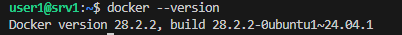
2. Rozmiary obrazów
 - 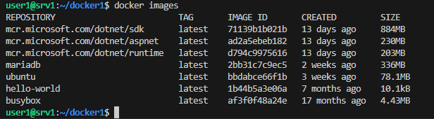
3. uruchomienie obrazów:
    # hello-world
    - 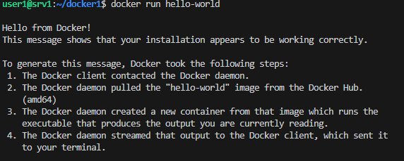
    - 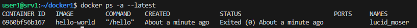
    # busybox
    - 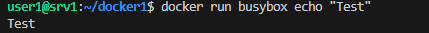
    - 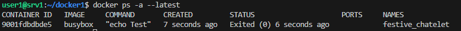
    # ubuntu
    - 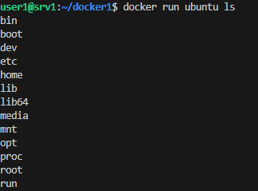
    - 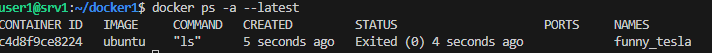
    # mariadb
    - 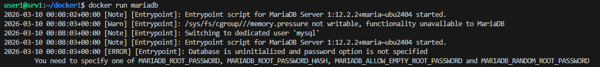
    - 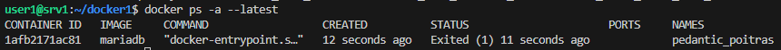
    # runtime
    - 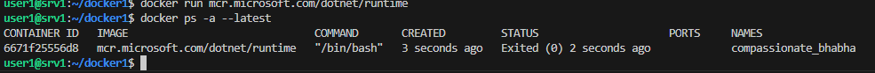
    # aspnet
    - 
    # sdk 
    - 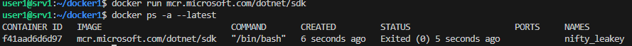
4. buisybox
    # uruchomienie
    - 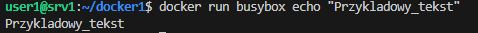
    # tryb interaktywny
    - 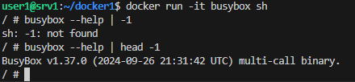
 5. ubuntu
    # PID1
    - 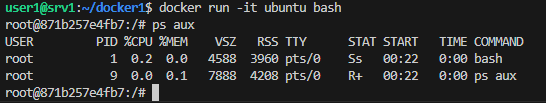
    # procesy na hoscie
    - 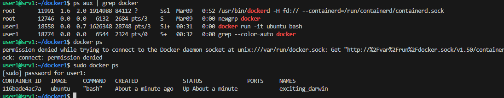
    # aktualizacja pakietow
    - 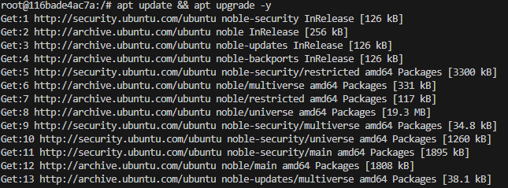
 6. własny dockerfile:

FROM ubuntu:latest

RUN apt-get update && apt-get install -y git &&\
    apt-get clean &&\
    rm -rf /var/lib/apt/lists/*

WORKDIR /app

RUN git clone https://github.com/InzynieriaOprogramowaniaAGH/MDO2026_ITE.git

CMD ["/bin/bash"]
- 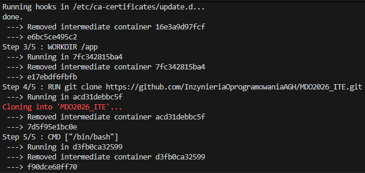
- 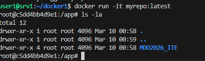
- 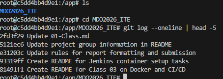

# uruchamiane kontenery
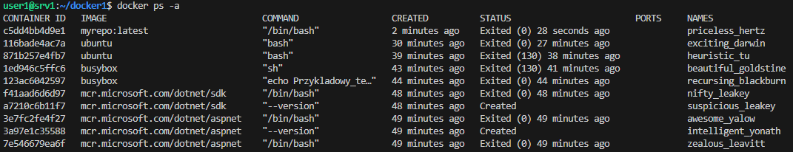

# czyszczenie
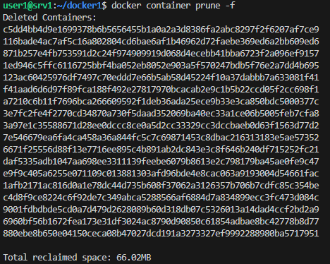
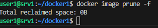