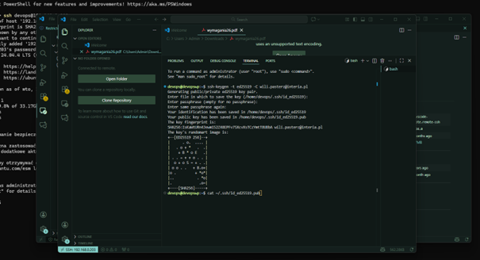
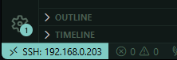

# Sprawozdanie 1 - Automatyzacja pracy z Git (Hooks)

**Student:** Wilhelm Pasterz
**Indeks:** 416619
**Kierunek:** ITE
**Grupa: 5** 

## 1. Konfiguracja środowiska i SSH
Zadanie rozpoczęto od przygotowania stanowiska pracy na maszynie wirtualnej z systemem Ubuntu.

* **Klucze SSH:** Wygenerowano klucze SSH typu `ed25519`. 



Jeden z nich został zabezpieczony hasłem. 


Publiczny klucz został dodany do profilu GitHub, co umożliwiło bezpieczną komunikację przez protokół SSH.



* **2FA:** Na koncie GitHub skonfigurowano uwierzytelnianie dwuskładnikowe.
* **IDE:** Skonfigurowano dostęp do repozytorium przedmiotowego w edytorze **Visual Studio Code** przy użyciu rozszerzenia Remote-SSH, co zapewnia natychmiastową wymianę plików ze środowiskiem pracy.

## 2. Praca z gałęziami (Branching)
Zgodnie ze scenariuszem zajęć, zarządzanie gałęziami przebiegło następująco:
1. Przełączenie na gałąź `main`, a następnie na gałąź grupową `grupa5`.
2. Utworzenie gałęzi roboczej o nazwie `WP416619` (odgałęzienie od brancha grupy).
3. Rozpoczęcie pracy na nowej gałęzi i utworzenie katalogu: `ITE/grupa5/WP416619/Sprawozdanie1/`.

## 3. Implementacja Git Hooka
W katalogu roboczym utworzono skrypt `commit-msg`, który automatycznie weryfikuje poprawność wiadomości commitów.

### Treść githooka:
```bash
#!/bin/bash
COMMIT_MSG_FILE=$1
COMMIT_MSG=$(cat "$COMMIT_MSG_FILE")

if [[ ! $COMMIT_MSG =~ ^WP416619 ]]; then
    echo "--------------------------------------------------------"
    echo "BŁĄD: Wiadomość commita musi zaczynać się od WP416619!"
    echo "--------------------------------------------------------"
    exit 1
fi