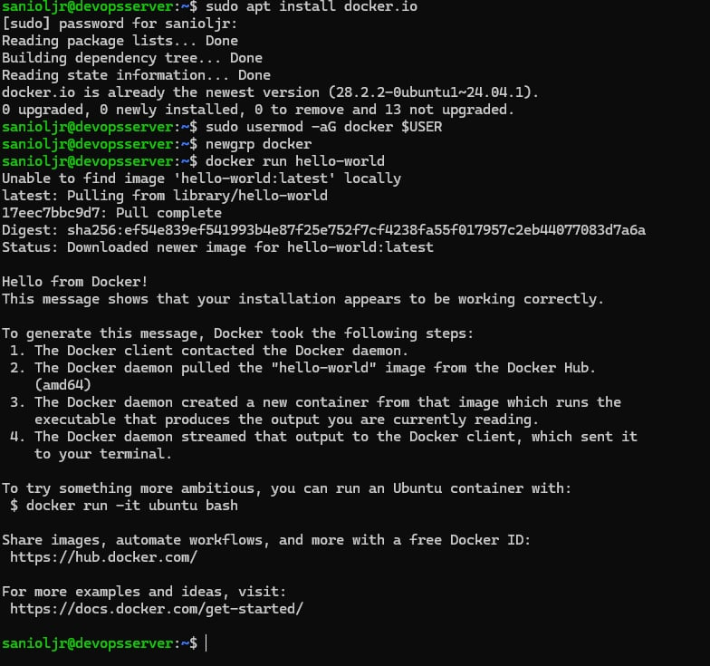
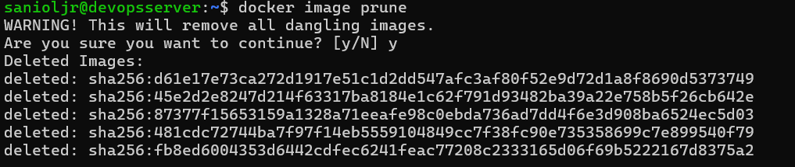
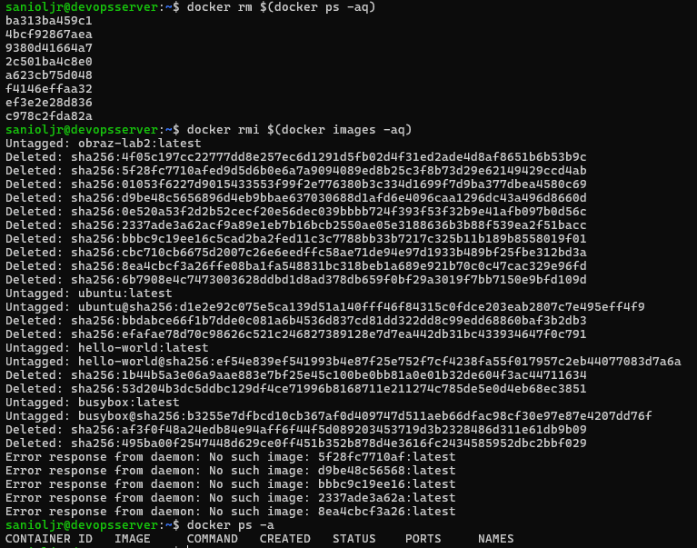

# Mateusz Sadowski - Laboratorium 2

### Środowisko wykonania

#### Serwera:

Maszyna wirtualna Oracle Virtual Box 7.2.6a z obrazem ISO Ubuntu 24.04.4 LTS. Maszyna posiada dostęp do 40 GB dostępnego obszaru na dysku, 2 rdzenie CPU oraz 4 GB pamięci ram.
Zastosowano przekierowanie portów (port forwarding), gdzie port 2222 na maszynie fizycznej (host) przekierowuje ruch na port 22 maszyny wirtualnej (guest), na którym pracuje serwer SSH.

#### Klienta:

Komputer z systemem Windows 11, podłączony do tej samiej sieci co serwer. Aby zrealizować połączenie, w ustawieniach maszyny wirtualnej zmieniono **NAT** na **Mostkowaną kartę sieciową**, następnie prze pomocy polecenia

        ip addr

sprawdzono adres ip serwera i dokonano połączenia z tym adresem. Połączenie to potem źle wpłyneło na pobieranie obrazów i repozyrotium, co wpłyneło na nieukończenie sprawozdania na czas i opóźnienia.

### Instalacja i uruchamianie obrazów

przy instalacji użyto

        sudo apt install docker.io

        sudo apt install docker-compose

potem dodano klienda to grupy docker:

        sudo usermod -aG docker @USER

i zastosowano zmiany

        newgrp docker

#### Wyniki sprawdzania obrazów

Aby sprawdzić pobrać i uruchoić obraz hello-world używano komendy

        docker run <nazwa obrazu>

komenda ta najpierw pobiera obrz (pull) a następnie go uruchamia (run)

W dodatku sprawdzono obraz busybox, przedstawia to poniższy zrzut ekranu:

#### Obraz busybox

Poniższy zrzut ekranu pokazuje połączenie się interaktywne i sprawdzenie wersji bustbox, zostało to wykonane przy pomocy

        docker run -it <nazwa obrazu>

gdzie flaga **i** utrzymuje STDIN otwarty, nawet jeśli nie jest podłączony terminal,co pozwala na wpisywanie danych do kontenera, a **t** powoduje symulacje pseudo terminala.

#### System w kontenerze

Sprawdzenie procesów wewnątrz kontenera wykonano przy pomocy

        ps aux

W tym przypadku PID 1 to proces matka od którego zależy życie kontenera. Po jego zamknięciu kontener przestaje działać.
Aby wyświetlić procesy dockera w goście wywołano

        ps aux | grep ubuntu

Efekt pokazuje poniższy zrzut ekranu

#### Stworzenie Dockerfile i uruchomienie

Stworzono poniższy dockerfile

oraz .dockerignore

ZDJECIE

następnie został on uruchomiony i zbudowany przy pomocy komendy:

        docker build --build-arg TOKEN=<personal access token> -t obraz-lab2

Ze względu na poufność Personal access token ta komenda została pominięta w poniższym zrzucie ekranu. Użyto **--build-arg** aby umożliwić podawanie tokenu do GitHub z zewnątrz, co gwarantuje bezpieczeństwo.

Następnie uruchomiono zbudowany obraz w trybie interaktywnym:

        docker run -it <nazwa obrazu>

oraz sprawdzono jego zawartość w celu sprawdzenia czy repozytorium zostało pobrane:

Jak widać po folderze READMEs, .git oraz pliku README.md, obraz zawiera repozytorium.

#### Czyszczenie pamięci

Przy pomocy polecenia

        docker ps -a

sprawdzono wszyskie (flaga -a) uruchomione obrazy. Natomiast przy pomocy

        docker system df

sprawdzono ile one zajmują przestrzenii dyskowej. Efekty widać poniżej:

Przy pomocy polecenia

        docker image prune

usunięto wszystkie nie działające (dangling - wiszące) obrazy:

Jak widać polecenie to od razu zwraca ile miejsca na dysku zostało zwolnione.
Usunięcie wszyskich obrazów z lokalnego magazynu zostałow wywołane poleceniem rmi (remove images)

        docker rmi <obraz dockera>

gdzie w miejsce obrazu dockera wstawiono **docker images -aq**,
gdzie część **"docker images"** wskazuje na obrazy dockera, a flaga **-a** oznacza all - wszystkie, flaga **q** organicza output tylko do ID obrazów.
Aby jednak usunąć sprawnie obrazy z lokalnego magazynu należało najpierw usunąć też wszyskie kontenery w tym te martwe.

        docker rm $(docker ps -aq)

### Historia

Niestety z powodu nagłego wyłączenia komputera historia do momentu docker builda została utracona.
Wszystkie istotne i użyte komendy dostały udokumentowane na powyższych zrzutach ektanu.

190 docker build --build-arg TOKEN=**klucz** -t obraz-lab2 .

191 ls

192 docker run -it obraz-lab2

193 ls

194 history

195 ls

196 docker run -it obraz-lab2

197 exit

198 exit

199 clear

200 ls

201 docker ps -a

202 docker system df

203 docker run -it obraz-lab2

204 docker ps -a

205 docker system df -a

206 docker ps -a

207 docker system df

208 docker image prune

209 docker ps -a

210 docker system df

211 docker image prune -a

212 docker rmi $(docker images -a)

213 docker ps -a

214 docker rmi $(docker images -aq)

215 docker rm $(docker images -aq)

216 docker rmi $(docker images -aq)

217 docker ps -a

218 docker rm $(docker ps -aq)

219 docker rmi $(docker images -aq)

220 docker ps -a

221 ls -la

222 history

223 exit

224 ip addr

225 exit

226 history

### Prompty do AI:

- Jak uruchomić kontener obrazu busybox oraz podłączyć się do niego interaktywnie i wywołując numer serii. Wytłumacz na czym polega połączenie interaktywne i co to numer serii

- Jak uruchomić system w kontenerze, jak sprawdzić procesy w tym kontenerze i wyswietlić procesy dockera w hoscie

- W jaki sposób wyświetlić uruchomione (nie tylko działające) kontenery oraz wyczyścić zakończone kontenery i obrazy - obrazy przechowywane w lokalnym magazynie?
  Gdzie jest to wszystko przechowywane?
